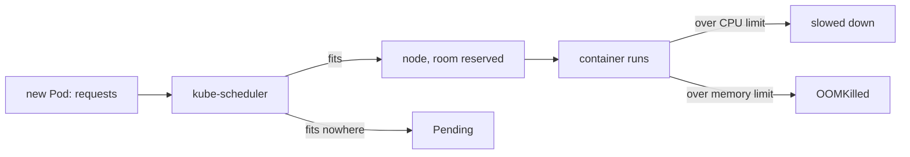

## Before you start

- [[k8s.l1.readiness-probes]] — you know the api's two Pods are ready and the Service spreads requests across them.
- [[k8s.l1.control-plane-components]] — you know kube-scheduler assigns each new Pod to a node and starts nothing itself.
- [[foundation.l1.memory-stack-heap]] — you know the api process keeps its objects on the heap, in memory it asks the system for as it runs.

## The situation

kube-scheduler has placed every Đơn Hàng Pod on a node. So far it knew nothing about how much CPU or memory any of them needs: to the scheduler, the api and Mailpit weigh the same. Two api Pods could land on a node that is already almost full. And one api Pod with a bug that keeps allocating memory could take more and more of its node, until the other Pods there have none left. How does the scheduler know how much room a Pod needs, and what stops one container from using everything on its node?

## Core concepts

- **resource request** — the CPU and memory a container asks for; kube-scheduler places a Pod only on a node with enough unreserved capacity for the requests of all its containers.
- **resource limit** — the most CPU or memory a container may use; above its CPU limit it is slowed down, above its memory limit a process in it can be killed.
- `m` and `Mi` — the units: CPU in thousandths of a core, so `250m` is a quarter of a core; memory in mebibytes, so `256Mi` is 256 × 1024 × 1024 bytes.

## How it works



In the situation above, each api container now states its needs. Its requests say how much CPU and memory to reserve for it. For every new Pod, kube-scheduler adds up the requests of the Pod's containers and looks for a node whose capacity, minus what is already reserved there, covers them. It puts the Pod on such a node and counts that amount as reserved. If no node has that much room, the Pod is not placed anywhere: it stays `Pending`, and an event, a short record Kubernetes keeps of what happened to an object, says why.

A request is a reservation, not a measurement. The scheduler never looks at what containers actually use. A container may use less than its request, leaving the reserved room idle, or more, as long as it stays under its limit.

The limit is the ceiling, and CPU and memory hit it differently. CPU time can be handed out in smaller slices, so a container that wants more CPU than its limit is slowed down; it keeps running. Memory limits work differently: the operating system does not slow a container down to keep it under its memory limit. When a container's memory use goes over its limit, a process in it can be killed by the operating system's out-of-memory (OOM) killer, and Kubernetes reports the container as `OOMKilled`. The kubelet then restarts it, like any container that stopped.

For the api, the requests make the scheduler keep room for each Pod, and the memory limit means a runaway api is stopped long before it can take all of a node's memory.

## In the Đơn Hàng system

The api container's resources in `deploy/k8s/api.yaml`:

```yaml file=deploy/k8s/api.yaml tag=stage-2 lines=53-63
          # lesson: k8s.l1.requests-and-limits
          # The scheduler places each api Pod only on a node with a quarter of
          # a core and 256 MiB not yet reserved. Above half a core the api is
          # slowed down; above 512 MiB of memory it can be killed (OOMKilled).
          resources:
            requests:
              cpu: 250m
              memory: 256Mi
            limits:
              cpu: 500m
              memory: 512Mi
```

Each api Pod reserves a quarter of a core and 256 MiB, and may use up to half a core and 512 MiB. `db`, `redis`, `keycloak` and `mailpit` set no resources. `deploy/k8s/lessons/oversized-pod.yaml` is a Pod named `oversized`, from the Caddy web server image the lesson Pods use, that requests `"100"` CPU, 100 cores, more than any node of the cluster has. `scripts/k8s/resources.sh` shows both:

```bash file=scripts/k8s/resources.sh tag=stage-2 lines=11-27
# lesson: k8s.l1.requests-and-limits
if kubectl get deployment api -n donhang >/dev/null 2>&1; then
  echo "\$ kubectl get deployment api -n donhang -o jsonpath='{.spec.template.spec.containers[0].resources}'"
  kubectl get deployment api -n donhang -o jsonpath='{.spec.template.spec.containers[0].resources}'
  echo
  echo
fi

show kubectl apply -f deploy/k8s/lessons/oversized-pod.yaml
kubectl wait --for=jsonpath='{.status.conditions[0].reason}'=Unschedulable pod/oversized -n donhang --timeout=120s >/dev/null
# No node, no IP address: kube-scheduler has not assigned it anywhere.
show kubectl get pod oversized -n donhang -o wide
echo
echo "== why kube-scheduler placed it nowhere (its FailedScheduling event)"
kubectl get events -n donhang --field-selector involvedObject.name=oversized,reason=FailedScheduling \
  -o jsonpath='{.items[0].message}{"\n"}'
kubectl delete -f deploy/k8s/lessons/oversized-pod.yaml >/dev/null
```

`show` prints a command before running it. The script waits until the Pod is marked `Unschedulable`, then reads the event kube-scheduler wrote about it, and deletes the Pod. Its output:

```text output=true
$ kubectl get deployment api -n donhang -o jsonpath='{.spec.template.spec.containers[0].resources}'
{"limits":{"cpu":"500m","memory":"512Mi"},"requests":{"cpu":"250m","memory":"256Mi"}}

$ kubectl apply -f deploy/k8s/lessons/oversized-pod.yaml
pod/oversized created
$ kubectl get pod oversized -n donhang -o wide
NAME        READY   STATUS    RESTARTS   AGE   IP       NODE     NOMINATED NODE   READINESS GATES
oversized   0/1     Pending   0          ...   <none>   <none>   <none>           <none>

== why kube-scheduler placed it nowhere (its FailedScheduling event)
0/3 nodes are available: 1 node(s) had untolerated taint(s), 2 Insufficient cpu. no new claims to deallocate, preemption: 0/3 nodes are available: 3 Preemption is not helpful for scheduling.
```

`oversized` is `Pending` with no node and no IP address: nothing was pulled or started. The event names each node's reason. `1 node(s) had untolerated taint(s)` is the control-plane node, which does not take ordinary Pods here; `2 Insufficient cpu` says the two workers lack the CPU it asks for. The rest of the message can be ignored here.

## Beginners often think…

- **"The request is the most a container is allowed to use."** → Actually the request is what the scheduler reserves; the limit is the ceiling, and a container may use more than its request up to that limit. You notice this in `api.yaml`, where the limits are twice the requests.
- **"A container that uses more CPU than its limit gets killed."** → Actually it is slowed down and keeps running; only going over the memory limit can get a process killed. You notice this when a busy container answers more slowly while its `RESTARTS` stays the same.
- **"A Pod stuck in `Pending` means its image could not be pulled."** → Actually a Pod that no node can fit stays `Pending` before any image is pulled, with no node assigned. You notice this when `oversized` shows `<none>` under `NODE`, and its event says `Insufficient cpu`.

## Try it (3 minutes)

With the backend running in `donhang`, run `kubectl describe nodes | grep " api-"`; `grep` keeps only the lines that contain ` api-`.

Expected result: two lines, one per api Pod, each showing `250m`, `500m`, `256Mi` and `512Mi` under the node's CPU and memory requests and limits, each followed by a percentage in brackets. The percentages depend on your machine; the four amounts come from `api.yaml`.

## Connections

- [[k8s.l1.control-plane-components]] — kube-scheduler's job, now with numbers to compare: requests against free capacity.
- [[k8s.l1.liveness-probes]] — the same kubelet restart that follows a crash also follows an `OOMKilled`.
- [[k8s.l1.deploying-don-hang]] — the backend whose api now reserves room on its nodes; the other services still set none.

## Five-line summary

1. Requests are what kube-scheduler reserves on a node; limits are the most a container may use.
2. CPU is counted in cores, `250m` is a quarter of one; memory in bytes, `256Mi` is 256 mebibytes.
3. A Pod whose requests fit no node stays `Pending`, and its event says why, such as `Insufficient cpu`.
4. A container may use less than its request, or more up to its limit; over the CPU limit it slows, over memory it can die.
5. `api.yaml` requests `250m`/`256Mi` and limits `500m`/`512Mi`, so each api Pod has room and cannot take a whole node's memory.
