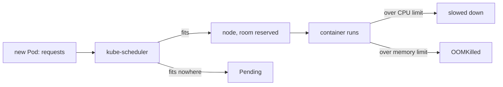

## Bạn cần biết trước

- [[k8s.l1.readiness-probes]] — bạn biết hai Pod api đã sẵn sàng và Service chia request cho cả hai.
- [[k8s.l1.control-plane-components]] — bạn biết kube-scheduler gán mỗi Pod mới cho một node và tự nó không khởi động gì.
- [[foundation.l1.memory-stack-heap]] — bạn biết process api giữ các object của nó trên heap, trong phần bộ nhớ nó xin hệ thống khi chạy.

## Tình huống

kube-scheduler đã đặt mọi Pod của Đơn Hàng lên các node. Tới giờ nó chẳng biết Pod nào cần bao nhiêu CPU hay bộ nhớ: với scheduler, api và Mailpit nặng như nhau. Hai Pod api có thể rơi vào một node vốn đã gần đầy. Và một Pod api dính lỗi cứ cấp phát bộ nhớ mãi có thể chiếm ngày càng nhiều bộ nhớ của node, tới khi các Pod khác ở đó không còn gì. Làm sao scheduler biết một Pod cần bao nhiêu chỗ, và cái gì ngăn một container dùng hết mọi thứ trên node của nó?

## Khái niệm cốt lõi

- **resource request** (Lượng CPU và bộ nhớ container xin; scheduler chỉ đặt Pod lên node còn đủ chỗ cho request) — lượng CPU và bộ nhớ một container xin; kube-scheduler chỉ đặt Pod lên node còn đủ phần chưa giữ chỗ cho request của mọi container trong Pod.
- **resource limit** (Mức CPU hoặc bộ nhớ tối đa container được dùng; vượt CPU thì bị chậm lại, vượt bộ nhớ có thể bị giết) — mức CPU hoặc bộ nhớ tối đa một container được dùng; vượt CPU limit thì nó bị làm chậm, vượt memory limit thì một process bên trong có thể bị giết.
- `m` và `Mi` — các đơn vị: CPU tính bằng phần nghìn của một core, nên `250m` là một phần tư core; bộ nhớ tính bằng mebibyte, nên `256Mi` là 256 × 1024 × 1024 byte.

## Cơ chế hoạt động



Trong tình huống trên, mỗi container api giờ nói rõ nhu cầu của mình. Request của nó cho biết cần giữ chỗ bao nhiêu CPU và bộ nhớ. Với mỗi Pod mới, kube-scheduler cộng request của các container trong Pod và tìm một node mà dung lượng, trừ đi phần đã giữ chỗ ở đó, đủ cho chúng. Nó đặt Pod lên node đó và tính lượng ấy là đã giữ chỗ. Nếu không node nào đủ chỗ, Pod không được đặt ở đâu cả: nó nằm ở `Pending`, và một event, bản ghi ngắn Kubernetes giữ về những gì đã xảy ra với một object, cho biết lý do.

Request là giữ chỗ, không phải số đo. Scheduler không bao giờ nhìn mức container thật sự dùng. Container có thể dùng ít hơn request, để phần đã giữ chỗ nằm không, hoặc nhiều hơn, miễn là vẫn dưới limit.

Limit là mức trần, và CPU với bộ nhớ chạm trần theo hai cách khác nhau. Thời gian CPU chia được thành từng phần nhỏ hơn, nên container muốn dùng CPU quá limit sẽ bị làm chậm; nó vẫn tiếp tục chạy. Memory limit thì khác: hệ điều hành không làm chậm container để giữ nó dưới memory limit. Khi lượng bộ nhớ container dùng vượt limit, một process bên trong có thể bị bộ giết khi hết bộ nhớ (out-of-memory, OOM killer) của hệ điều hành giết, và Kubernetes báo container là `OOMKilled`. Sau đó kubelet khởi động lại nó, như mọi container đã dừng.

Với api, request khiến scheduler giữ chỗ cho từng Pod, còn memory limit nghĩa là một api mất kiểm soát sẽ bị dừng từ lâu trước khi kịp chiếm hết bộ nhớ của node.

## Trong hệ thống Đơn Hàng

Resources của container api trong `deploy/k8s/api.yaml`:

```yaml file=deploy/k8s/api.yaml tag=stage-2 lines=53-63
          # lesson: k8s.l1.requests-and-limits
          # The scheduler places each api Pod only on a node with a quarter of
          # a core and 256 MiB not yet reserved. Above half a core the api is
          # slowed down; above 512 MiB of memory it can be killed (OOMKilled).
          resources:
            requests:
              cpu: 250m
              memory: 256Mi
            limits:
              cpu: 500m
              memory: 512Mi
```

Mỗi Pod api giữ chỗ một phần tư core và 256 MiB, và được dùng tới nửa core và 512 MiB. `db`, `redis`, `keycloak` và `mailpit` không đặt resources. `deploy/k8s/lessons/oversized-pod.yaml` là một Pod tên `oversized`, từ image web server Caddy mà các Pod bài học vẫn dùng, xin `"100"` CPU, tức 100 core, nhiều hơn bất kỳ node nào của cluster có. `scripts/k8s/resources.sh` cho thấy cả hai:

```bash file=scripts/k8s/resources.sh tag=stage-2 lines=11-27
# lesson: k8s.l1.requests-and-limits
if kubectl get deployment api -n donhang >/dev/null 2>&1; then
  echo "\$ kubectl get deployment api -n donhang -o jsonpath='{.spec.template.spec.containers[0].resources}'"
  kubectl get deployment api -n donhang -o jsonpath='{.spec.template.spec.containers[0].resources}'
  echo
  echo
fi

show kubectl apply -f deploy/k8s/lessons/oversized-pod.yaml
kubectl wait --for=jsonpath='{.status.conditions[0].reason}'=Unschedulable pod/oversized -n donhang --timeout=120s >/dev/null
# No node, no IP address: kube-scheduler has not assigned it anywhere.
show kubectl get pod oversized -n donhang -o wide
echo
echo "== why kube-scheduler placed it nowhere (its FailedScheduling event)"
kubectl get events -n donhang --field-selector involvedObject.name=oversized,reason=FailedScheduling \
  -o jsonpath='{.items[0].message}{"\n"}'
kubectl delete -f deploy/k8s/lessons/oversized-pod.yaml >/dev/null
```

`show` in lệnh ra trước khi chạy. Script chờ tới khi Pod bị đánh dấu `Unschedulable`, rồi đọc event mà kube-scheduler ghi về nó, và xóa Pod. Output:

```text output=true
$ kubectl get deployment api -n donhang -o jsonpath='{.spec.template.spec.containers[0].resources}'
{"limits":{"cpu":"500m","memory":"512Mi"},"requests":{"cpu":"250m","memory":"256Mi"}}

$ kubectl apply -f deploy/k8s/lessons/oversized-pod.yaml
pod/oversized created
$ kubectl get pod oversized -n donhang -o wide
NAME        READY   STATUS    RESTARTS   AGE   IP       NODE     NOMINATED NODE   READINESS GATES
oversized   0/1     Pending   0          ...   <none>   <none>   <none>           <none>

== why kube-scheduler placed it nowhere (its FailedScheduling event)
0/3 nodes are available: 1 node(s) had untolerated taint(s), 2 Insufficient cpu. no new claims to deallocate, preemption: 0/3 nodes are available: 3 Preemption is not helpful for scheduling.
```

`oversized` đang `Pending`, không có node và không có địa chỉ IP: chưa có gì được kéo về hay khởi động. Event nêu lý do cho từng node. `1 node(s) had untolerated taint(s)` là node control-plane, nơi ở đây không nhận Pod thông thường; `2 Insufficient cpu` nói hai worker thiếu lượng CPU mà Pod xin. Phần còn lại của thông báo có thể bỏ qua ở đây.

## Người mới hay nghĩ rằng…

- **"Request là mức tối đa container được phép dùng."** → Thực ra request là thứ scheduler giữ chỗ; limit mới là mức trần, và container được dùng hơn request cho tới limit. Bạn sẽ nhận ra trong `api.yaml`, nơi limit gấp đôi request.
- **"Container dùng CPU quá limit sẽ bị giết."** → Thực ra nó bị làm chậm và vẫn chạy; chỉ vượt memory limit mới có thể khiến một process bị giết. Bạn sẽ nhận ra khi một container đang bận trả lời chậm hơn trong khi `RESTARTS` của nó không đổi.
- **"Pod kẹt ở `Pending` nghĩa là image của nó không kéo về được."** → Thực ra Pod không vừa node nào sẽ nằm ở `Pending` trước khi có image nào được kéo, và không được gán node. Bạn sẽ nhận ra khi `oversized` hiện `<none>` ở cột `NODE`, và event của nó ghi `Insufficient cpu`.

## Thử ngay (3 phút)

Với backend đang chạy trong `donhang`, chạy `kubectl describe nodes | grep " api-"`; `grep` chỉ giữ các dòng có chứa ` api-`.

Kết quả mong đợi: hai dòng, mỗi dòng một Pod api, mỗi dòng hiện `250m`, `500m`, `256Mi` và `512Mi` ở các cột request và limit CPU, bộ nhớ của node, mỗi giá trị kèm một tỉ lệ phần trăm trong ngoặc. Tỉ lệ phần trăm tùy máy của bạn; bốn con số kia lấy từ `api.yaml`.

## Liên hệ

- [[k8s.l1.control-plane-components]] — công việc của kube-scheduler, giờ có con số để so: request với dung lượng còn trống.
- [[k8s.l1.liveness-probes]] — cũng chính lần khởi động lại của kubelet sau một lần crash sẽ diễn ra sau `OOMKilled`.
- [[k8s.l1.deploying-don-hang]] — backend mà giờ api đã giữ chỗ trên node; các dịch vụ khác vẫn chưa đặt gì.

## Tóm tắt 5 dòng

1. Request là thứ kube-scheduler giữ chỗ trên node; limit là mức tối đa container được dùng.
2. CPU tính bằng core, `250m` là một phần tư core; bộ nhớ tính bằng byte, `256Mi` là 256 mebibyte.
3. Pod có request không vừa node nào sẽ nằm ở `Pending`, và event của nó cho biết lý do, như `Insufficient cpu`.
4. Container có thể dùng ít hơn request, hoặc nhiều hơn tới limit; vượt CPU limit thì chậm lại, vượt bộ nhớ thì có thể bị giết.
5. `api.yaml` request `250m`/`256Mi` và limit `500m`/`512Mi`, nên mỗi Pod api có chỗ và không chiếm được hết bộ nhớ của node.
