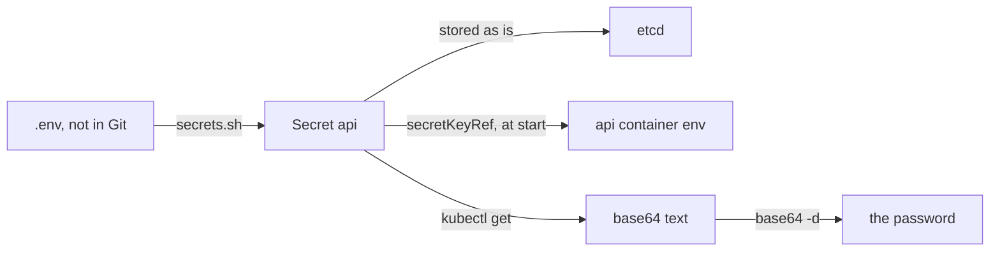

## Before you start

- [[k8s.l1.configmaps]] — you know the ConfigMap `api` gives the api its settings that are not secret, and that it leaves the connection string out.
- [[devops.l1.secrets-vs-config]] — you know `.env` holds the lab's passwords, `.gitignore` keeps it out of Git, and `scripts/dev-secrets.sh` creates it.
- [[k8s.l1.control-plane-components]] — you know the API server keeps every object of the cluster in etcd.

## The situation

The api on the cluster still lacks one setting: `ConnectionStrings__Default`, the connection string to PostgreSQL, which holds the database password. The last lesson showed that anyone allowed to read the ConfigMap `api` can print it, so the password cannot go there. In Compose, the password comes from `.env`, a file that never enters Git. The cluster cannot read a file on your laptop, and a manifest in Git is the one thing the password must never be in. Where does the cluster keep the password, and how well is it protected there?

## Core concepts

- **Kubernetes Secret** — an object like a ConfigMap, meant for secret values such as passwords, that keeps each value base64-encoded under `data`.
- `secretKeyRef` — in a container's `env`, takes the value of one environment variable from one key of a Secret.
- base64 — an encoding that writes any bytes as letters, digits and a few symbols; `base64 -d` turns it back into the original bytes, with no key, unlike encryption, which cannot be turned back without a secret key.

## How it works



In the situation above, the password goes into a Secret named `api`. A script on your machine reads `.env` and sends the Secret to the API server, so no manifest with the password ever exists in Git. The API server keeps the Secret in etcd, like every other object.

The api container gets the value the same way it gets the ConfigMap's: as an environment variable, set when the container starts. Its `env` names the Secret and the key with `secretKeyRef`, and the kubelet fills in the value.

What a Secret adds is separation: the password sits in an object of its own, apart from the ConfigMap and from Git. Permission to read can be granted per kind of object, so a cluster can let someone read the ConfigMap `api` but not the Secret `api`. The value itself is not scrambled. Its values are base64-encoded, which only makes any bytes printable as text. Anyone who has the text gets the password back with `base64 -d`, and no key is involved: an encoding, not encryption.

By default, the API server also writes Secrets to etcd without encrypting them. Encrypting them there is something a cluster administrator has to configure.

So what protects it is who can reach it: anyone allowed to read the Secret through the API server, anyone who can read etcd, and anyone allowed to create Pods in its namespace, since a Pod can take any Secret there as an environment variable. `kubectl describe secret` is careful and shows only each value's size. But anyone allowed to read the Secret through the API server can ask for its `data` and decode it in one line.

## In the Đơn Hàng system

The api container in `deploy/k8s/api.yaml`, after its ports:

```yaml file=deploy/k8s/api.yaml tag=stage-2 lines=25-38
          # lesson: k8s.l1.configmaps
          # lesson: k8s.l1.secrets
          # Every key of the ConfigMap api becomes an environment variable;
          # the connection string, which holds the password, comes from one
          # key of the Secret api.
          envFrom:
            - configMapRef:
                name: api
          env:
            - name: ConnectionStrings__Default
              valueFrom:
                secretKeyRef:
                  name: api
                  key: ConnectionStrings__Default
```

`envFrom` brings in the ConfigMap's keys, as before. Under `env`, the variable `ConnectionStrings__Default` takes its value from the key of the same name in the Secret `api`. The ConfigMap and the Secret may share the name `api` because they are different kinds of object.

No file in the repository describes a Secret. `scripts/k8s/secrets.sh` builds them from `.env`, after loading its values into the shell without printing them:

```bash file=scripts/k8s/secrets.sh tag=stage-2 lines=22-45
secret() {
  local name=$1
  shift
  kubectl create secret generic "$name" -n donhang "$@" --dry-run=client -o yaml \
    | kubectl apply -f - -o name
}
echo "== Secrets from .env"
secret db --from-literal=POSTGRES_PASSWORD="$POSTGRES_PASSWORD"
secret api --from-literal=ConnectionStrings__Default="Host=db;Database=donhang;Username=donhang;Password=$POSTGRES_PASSWORD"
secret keycloak --from-literal=KC_BOOTSTRAP_ADMIN_PASSWORD="$KEYCLOAK_ADMIN_PASSWORD"
echo

# describe prints only the size of each value...
show kubectl describe secret db -n donhang
echo
# ...but whoever may read the Secret gets its value, base64-encoded. That is
# an encoding, not encryption: base64 -d reverses it with no key. (The value
# here is the fake password scripts/dev-secrets.sh writes to every .env.)
echo "\$ kubectl get secret db -n donhang -o jsonpath='{.data.POSTGRES_PASSWORD}'"
kubectl get secret db -n donhang -o jsonpath='{.data.POSTGRES_PASSWORD}'
echo
echo "\$ kubectl get secret db -n donhang -o jsonpath='{.data.POSTGRES_PASSWORD}' | base64 -d"
kubectl get secret db -n donhang -o jsonpath='{.data.POSTGRES_PASSWORD}' | base64 -d
echo
```

`kubectl create secret generic` with `--dry-run=client -o yaml` only writes the Secret out as YAML, and `kubectl apply` sends it, creating the Secret or updating it when `.env` changed. `generic` makes a Secret of any keys you choose, and each `--from-literal=KEY=value` adds one key. Three Secrets come out: `db` for PostgreSQL, `api` for the connection string, `keycloak` for Keycloak's admin password. `show` prints a command before running it, and `-o jsonpath='{.data.KEY}'` prints only that key's value from the Secret's `data`. Its output:

```text output=true
== Secrets from .env
secret/db
secret/api
secret/keycloak

$ kubectl describe secret db -n donhang
Name:          db
Namespace:     donhang
Labels:        <none>
Annotations:   <none>

Type:   Opaque

Data
====
POSTGRES_PASSWORD:   20 bytes

$ kubectl get secret db -n donhang -o jsonpath='{.data.POSTGRES_PASSWORD}'
ZG9uaGFuZy1kZXYtcGFzc3dvcmQ=
$ kubectl get secret db -n donhang -o jsonpath='{.data.POSTGRES_PASSWORD}' | base64 -d
donhang-dev-password
```

`describe` shows `20 bytes` and nothing more; `Type: Opaque` only marks a Secret of any keys, the kind `generic` creates, and does not mean the value is hidden. One `kubectl get` and one `base64 -d` later, the password is on screen. The script prints the database password only because `scripts/dev-secrets.sh` writes the same fake `donhang-dev-password` into every `.env`; it never prints Keycloak's admin password, which `dev-secrets.sh` generates at random for each lab.

## Beginners often think…

- **"Secret values are encrypted, since they look like random text in the YAML."** → Actually they are base64-encoded, and `base64 -d` reverses that with no key. You notice this when `ZG9uaGFuZy1kZXYtcGFzc3dvcmQ=` turns into `donhang-dev-password` in one command.
- **"A Secret manifest is safe to commit to Git because its values are encoded."** → Actually anyone who can read the repository can decode it, and the password stays in the history. You notice this in Đơn Hàng's repository: there is no Secret manifest at all, only a script that builds the Secrets from `.env`.
- **"Once a value is in a Secret, nobody with kubectl access can see it."** → Actually `describe` hides the values, but anyone allowed to read the Secret can print and decode them. You notice this when the script prints the database password with an ordinary `kubectl get`.

## Try it (3 minutes)

With the backend running in `donhang`, so that `secrets.sh` has created the Secrets, in the shell you use for `kubectl`:

1. Run `kubectl get secret api -n donhang -o jsonpath='{.data.ConnectionStrings__Default}' | base64 -d; echo`.
2. Run `kubectl exec deployment/api -n donhang -- printenv ConnectionStrings__Default`.

Expected result: both steps print the same line, `Host=db;Database=donhang;Username=donhang;Password=donhang-dev-password`: the value decoded from the Secret is exactly what the api container received.

## Connections

- [[k8s.l1.configmaps]] — the same idea for settings that are not secret; a Secret differs in its purpose and its base64 values, not in being hidden.
- [[devops.l1.secrets-vs-config]] — the rule from Compose, kept on the cluster: the password lives in `.env`, never in Git.
- [[k8s.l1.configmap-files]] — next: a ConfigMap whose values reach a container as files instead of environment variables.

## Five-line summary

1. A Kubernetes Secret keeps a password apart from ConfigMaps and Git, but base64 is an encoding, not encryption.
2. The api reads `ConnectionStrings__Default` from the Secret `api` with `secretKeyRef`, set when its container starts.
3. `base64 -d` turns a Secret's value back into the password, with no key.
4. By default, Secrets sit unencrypted in etcd; encrypting them there is up to a cluster administrator.
5. `describe` shows only sizes, but anyone allowed to read a Secret can decode it; Đơn Hàng builds its Secrets from `.env`.
