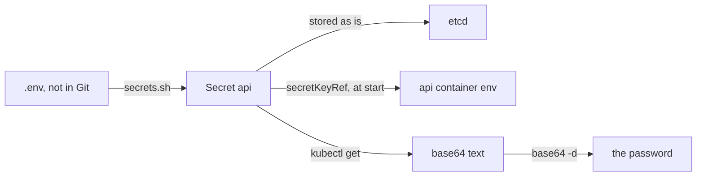

## Bạn cần biết trước

- [[k8s.l1.configmaps]] — bạn biết ConfigMap `api` cho api các setting không bí mật, và nó bỏ connection string ra ngoài.
- [[devops.l1.secrets-vs-config]] — bạn biết `.env` giữ mật khẩu của lab, `.gitignore` giữ nó khỏi Git, và `scripts/dev-secrets.sh` tạo ra nó.
- [[k8s.l1.control-plane-components]] — bạn biết API server giữ mọi object của cluster trong etcd.

## Tình huống

api trên cluster vẫn thiếu một setting: `ConnectionStrings__Default`, connection string tới PostgreSQL, trong đó có mật khẩu database. Bài trước cho thấy ai được phép đọc ConfigMap `api` cũng in được nó, nên mật khẩu không thể nằm ở đó. Trong Compose, mật khẩu lấy từ `.env`, một file không bao giờ vào Git. Cluster không đọc được file trên laptop của bạn, còn manifest trong Git lại chính là chỗ mật khẩu tuyệt đối không được nằm. Cluster giữ mật khẩu ở đâu, và ở đó nó được bảo vệ tới mức nào?

## Khái niệm cốt lõi

- **Kubernetes Secret** (Object Kubernetes cho giá trị bí mật như mật khẩu; lưu dạng base64, mặc định không được mật mã hóa) — một object giống ConfigMap, dành cho giá trị bí mật như mật khẩu, giữ mỗi giá trị dưới `data` ở dạng base64.
- `secretKeyRef` — trong `env` của container, lấy giá trị của một biến môi trường từ một key của Secret.
- base64 — một encoding viết mọi byte thành chữ cái, chữ số và vài ký hiệu; `base64 -d` chuyển nó về đúng các byte ban đầu, không cần khóa, khác với mật mã hóa, thứ không thể đảo ngược nếu thiếu khóa bí mật.

## Cơ chế hoạt động



Trong tình huống trên, mật khẩu được đưa vào một Secret tên `api`. Một script trên máy bạn đọc `.env` và gửi Secret tới API server, nên không có manifest nào chứa mật khẩu nằm trong Git. API server giữ Secret trong etcd, như mọi object khác.

Container api nhận giá trị theo cùng cách nó nhận giá trị của ConfigMap: thành biến môi trường, đặt lúc container khởi động. `env` của nó nêu tên Secret và key bằng `secretKeyRef`, và kubelet điền giá trị vào.

Điều Secret mang lại là sự tách biệt: mật khẩu nằm trong một object riêng, tách khỏi ConfigMap và khỏi Git. Quyền đọc có thể cấp theo từng loại object, nên một cluster có thể cho ai đó đọc ConfigMap `api` mà không cho đọc Secret `api`. Bản thân giá trị thì không bị xáo trộn. Giá trị của nó ở dạng base64, thứ chỉ giúp mọi byte in ra được thành chữ. Ai có đoạn chữ đó đều lấy lại mật khẩu bằng `base64 -d`, chẳng cần khóa nào: đây là encoding, không phải mật mã hóa.

Mặc định, API server cũng ghi Secret vào etcd mà không mật mã hóa. Mật mã hóa chúng ở đó là việc quản trị viên cluster phải tự cấu hình.

Vậy thứ bảo vệ nó là ai với tới được nó: người được phép đọc Secret qua API server, người đọc được etcd, và người được phép tạo Pod trong namespace của nó, vì một Pod có thể lấy bất kỳ Secret nào ở đó làm biến môi trường. `kubectl describe secret` thì cẩn thận, chỉ hiện kích thước của từng giá trị. Nhưng ai được phép đọc Secret qua API server đều có thể xin phần `data` của nó và giải ra chỉ bằng một dòng lệnh.

## Trong hệ thống Đơn Hàng

Container api trong `deploy/k8s/api.yaml`, sau phần port:

```yaml file=deploy/k8s/api.yaml tag=stage-2 lines=25-38
          # lesson: k8s.l1.configmaps
          # lesson: k8s.l1.secrets
          # Every key of the ConfigMap api becomes an environment variable;
          # the connection string, which holds the password, comes from one
          # key of the Secret api.
          envFrom:
            - configMapRef:
                name: api
          env:
            - name: ConnectionStrings__Default
              valueFrom:
                secretKeyRef:
                  name: api
                  key: ConnectionStrings__Default
```

`envFrom` đưa vào các key của ConfigMap, như trước. Dưới `env`, biến `ConnectionStrings__Default` lấy giá trị từ key cùng tên trong Secret `api`. ConfigMap và Secret dùng chung tên `api` được vì chúng là hai loại object khác nhau.

Không file nào trong repository mô tả một Secret. `scripts/k8s/secrets.sh` dựng chúng từ `.env`, sau khi nạp các giá trị vào shell mà không in ra:

```bash file=scripts/k8s/secrets.sh tag=stage-2 lines=22-45
secret() {
  local name=$1
  shift
  kubectl create secret generic "$name" -n donhang "$@" --dry-run=client -o yaml \
    | kubectl apply -f - -o name
}
echo "== Secrets from .env"
secret db --from-literal=POSTGRES_PASSWORD="$POSTGRES_PASSWORD"
secret api --from-literal=ConnectionStrings__Default="Host=db;Database=donhang;Username=donhang;Password=$POSTGRES_PASSWORD"
secret keycloak --from-literal=KC_BOOTSTRAP_ADMIN_PASSWORD="$KEYCLOAK_ADMIN_PASSWORD"
echo

# describe prints only the size of each value...
show kubectl describe secret db -n donhang
echo
# ...but whoever may read the Secret gets its value, base64-encoded. That is
# an encoding, not encryption: base64 -d reverses it with no key. (The value
# here is the fake password scripts/dev-secrets.sh writes to every .env.)
echo "\$ kubectl get secret db -n donhang -o jsonpath='{.data.POSTGRES_PASSWORD}'"
kubectl get secret db -n donhang -o jsonpath='{.data.POSTGRES_PASSWORD}'
echo
echo "\$ kubectl get secret db -n donhang -o jsonpath='{.data.POSTGRES_PASSWORD}' | base64 -d"
kubectl get secret db -n donhang -o jsonpath='{.data.POSTGRES_PASSWORD}' | base64 -d
echo
```

`kubectl create secret generic` với `--dry-run=client -o yaml` chỉ viết Secret ra dạng YAML, rồi `kubectl apply` gửi nó đi, tạo Secret hoặc cập nhật nó khi `.env` đã đổi. `generic` tạo một Secret với các key tùy bạn chọn, và mỗi `--from-literal=KEY=value` thêm một key. Kết quả là ba Secret: `db` cho PostgreSQL, `api` cho connection string, `keycloak` cho mật khẩu admin của Keycloak. `show` in lệnh ra trước khi chạy, còn `-o jsonpath='{.data.KEY}'` chỉ in giá trị của key đó trong `data` của Secret. Output:

```text output=true
== Secrets from .env
secret/db
secret/api
secret/keycloak

$ kubectl describe secret db -n donhang
Name:          db
Namespace:     donhang
Labels:        <none>
Annotations:   <none>

Type:   Opaque

Data
====
POSTGRES_PASSWORD:   20 bytes

$ kubectl get secret db -n donhang -o jsonpath='{.data.POSTGRES_PASSWORD}'
ZG9uaGFuZy1kZXYtcGFzc3dvcmQ=
$ kubectl get secret db -n donhang -o jsonpath='{.data.POSTGRES_PASSWORD}' | base64 -d
donhang-dev-password
```

`describe` hiện `20 bytes` và không gì hơn; `Type: Opaque` chỉ đánh dấu một Secret có key tùy ý, loại mà `generic` tạo ra, chứ không có nghĩa giá trị bị giấu. Thêm một lệnh `kubectl get` và một `base64 -d`, mật khẩu đã hiện trên màn hình. Script in mật khẩu database ra chỉ vì `scripts/dev-secrets.sh` ghi cùng một mật khẩu giả `donhang-dev-password` vào mọi `.env`; nó không bao giờ in mật khẩu admin của Keycloak, thứ `dev-secrets.sh` sinh ngẫu nhiên cho từng lab.

## Người mới hay nghĩ rằng…

- **"Giá trị của Secret đã được mật mã hóa, vì trong YAML chúng trông như chữ ngẫu nhiên."** → Thực ra chúng chỉ ở dạng base64, và `base64 -d` đảo ngược được mà không cần khóa. Bạn sẽ nhận ra khi `ZG9uaGFuZy1kZXYtcGFzc3dvcmQ=` biến thành `donhang-dev-password` chỉ sau một lệnh.
- **"Commit manifest Secret vào Git là an toàn vì giá trị đã được encode."** → Thực ra ai đọc được repository đều giải ra được, và mật khẩu còn mãi trong history. Bạn sẽ nhận ra điều này ngay trong repository của Đơn Hàng: không hề có manifest Secret nào, chỉ có một script dựng Secret từ `.env`.
- **"Giá trị đã vào Secret thì không ai có quyền kubectl nhìn thấy được."** → Thực ra `describe` giấu giá trị, nhưng ai được phép đọc Secret đều in ra và giải được. Bạn sẽ nhận ra khi script in mật khẩu database chỉ bằng một lệnh `kubectl get` bình thường.

## Thử ngay (3 phút)

Với backend đang chạy trong `donhang`, tức là `secrets.sh` đã tạo các Secret, trong shell bạn dùng cho `kubectl`:

1. Chạy `kubectl get secret api -n donhang -o jsonpath='{.data.ConnectionStrings__Default}' | base64 -d; echo`.
2. Chạy `kubectl exec deployment/api -n donhang -- printenv ConnectionStrings__Default`.

Kết quả mong đợi: cả hai bước in cùng một dòng, `Host=db;Database=donhang;Username=donhang;Password=donhang-dev-password`: giá trị giải ra từ Secret đúng bằng thứ container api đã nhận.

## Liên hệ

- [[k8s.l1.configmaps]] — cùng ý tưởng cho setting không bí mật; Secret khác ở mục đích và ở giá trị base64, không khác ở chỗ được giấu kín.
- [[devops.l1.secrets-vs-config]] — quy tắc từ Compose được giữ nguyên trên cluster: mật khẩu sống trong `.env`, không bao giờ trong Git.
- [[k8s.l1.configmap-files]] — bài tiếp: một ConfigMap mà giá trị tới container dưới dạng file thay vì biến môi trường.

## Tóm tắt 5 dòng

1. Kubernetes Secret giữ mật khẩu tách khỏi ConfigMap và Git, nhưng base64 là encoding, không phải mật mã hóa.
2. api đọc `ConnectionStrings__Default` từ Secret `api` bằng `secretKeyRef`, đặt lúc container của nó khởi động.
3. `base64 -d` chuyển giá trị của Secret về lại mật khẩu, không cần khóa.
4. Mặc định Secret nằm trong etcd ở dạng không mật mã hóa; mật mã hóa ở đó là việc của quản trị viên cluster.
5. `describe` chỉ hiện kích thước, nhưng ai được đọc Secret đều giải được nó; Đơn Hàng dựng Secret từ `.env`.
