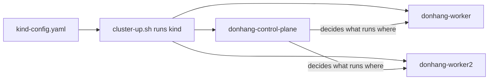

## Before you start

- [[k8s.l1.why-an-orchestrator]] — you know a container orchestrator runs containers across a group of machines, and Kubernetes is the one this track uses.
- [[devops.l1.image-vs-container]] — you know a container is a running copy of an image, and `docker ps` lists the containers running on your machine.

## The situation

You want to try Kubernetes, but you have one laptop, not a group of machines. At stage-2 the repository has `scripts/k8s/cluster-up.sh`, so you run it. It prints lines such as "Preparing nodes", "Starting control-plane" and "Joining worker nodes", then stops. Out of curiosity you run `docker ps`, and three new containers are there: `donhang-control-plane`, `donhang-worker` and `donhang-worker2`, all from the same image, `kindest/node:v1.34.11`. None of them is Đơn Hàng's API or its database. What are these three, and how does a group of machines fit on one laptop?

## Core concepts

- **cluster** — a group of nodes plus a control plane, run together as one Kubernetes system.
- **Kubernetes node** — one machine in a cluster, where containers run: a physical machine, a virtual one simulated in software on a bigger machine, or, with kind, a Docker container.
- **control plane** — the parts of Kubernetes that store the cluster's state and decide which node runs what.
- Worker node — a node that runs the applications' containers; Đơn Hàng's cluster has two.
- kind — the tool Đơn Hàng's lab uses to run a whole cluster on one machine, by starting each node as a Docker container.

## How it works



In the situation above, the three containers are the three nodes of a cluster named `donhang`. `cluster-up.sh` ran kind with `kind-config.yaml`, the file that lists the nodes to create. A cluster always has these two roles: nodes, where containers run, and a control plane, which keeps the record of what should exist and decides which node runs each part of it.

`donhang-control-plane` is the node that runs the control plane. The control plane is software, not a place for your app: it stores the cluster's state and makes decisions. In Đơn Hàng's cluster, the control-plane node is marked so that applications' containers are not placed on it.

`donhang-worker` and `donhang-worker2` are worker nodes. When Đơn Hàng's containers run on this cluster later in the track, they run on these two. Adding a third worker would add room for more containers. The control plane's job would stay the same; it would simply have one more node to choose from.

The surprise is that each node is itself a container. kind, the tool behind `cluster-up.sh`, starts each node as a Docker container from the node image `kindest/node`. Inside each one runs the same Kubernetes software a real machine would run. The containers Kubernetes starts for an application run inside a node container, so `docker ps` on your laptop shows the three node containers but none of the containers inside them.

In a real cluster, each node is its own machine. kind trades that for convenience: a cluster with three nodes fits on one laptop, at the cost of one laptop's memory and CPU shared by all of them.

## In the Đơn Hàng system

The file that declares the cluster:

```yaml file=deploy/k8s/kind-config.yaml tag=stage-2 lines=1-14
# lesson: k8s.l1.cluster-nodes-and-control-plane
# The kind cluster scripts/k8s/cluster-up.sh creates: one control-plane node
# and two worker nodes. kind runs each node as a Docker container on this
# machine; every node runs the same node image, pinned by its digest to
# Kubernetes 1.34 (v1.34.11), the version this course teaches.
kind: Cluster
apiVersion: kind.x-k8s.io/v1alpha4
nodes:
  - role: control-plane
    image: kindest/node:v1.34.11@sha256:44e222ee2132dab25ff87301682f89eb82c7880ea3a1bf543bfe9708fd08d67d
  - role: worker
    image: kindest/node:v1.34.11@sha256:44e222ee2132dab25ff87301682f89eb82c7880ea3a1bf543bfe9708fd08d67d
  - role: worker
    image: kindest/node:v1.34.11@sha256:44e222ee2132dab25ff87301682f89eb82c7880ea3a1bf543bfe9708fd08d67d
```

The first two lines tell kind that the file describes a cluster, in version `v1alpha4` of kind's config format. `role: control-plane` appears once and `role: worker` twice: one control-plane node and two worker nodes, as `docker ps` showed. Every node runs the same node image, and the tag `v1.34.11` names the Kubernetes version this course teaches. The long `sha256:` part after `@` is a digest: it fixes the exact image, so every learner gets identical nodes.

The script that creates the cluster from that file:

```bash file=scripts/k8s/cluster-up.sh tag=stage-2 lines=7-19
# lesson: k8s.l1.cluster-nodes-and-control-plane
# Nothing to do when the cluster already exists; scripts/k8s/cluster-down.sh
# deletes it. --wait: return only once the control plane is ready.
if kind get clusters 2>/dev/null | grep -qx donhang; then
  echo "The cluster donhang already exists."
  kubectl config use-context kind-donhang
else
  # kind ends with a greeting it picks at random; awk stops printing before it.
  kind create cluster --name donhang --config deploy/k8s/kind-config.yaml --wait 180s 2>&1 \
    | awk '!done { print } /^kubectl cluster-info/ { done = 1 }'
fi
# kind waited for the control plane only; wait for the workers to be Ready too.
kubectl wait --for=condition=Ready nodes --all --timeout=180s >/dev/null
```

If a cluster named `donhang` already exists, the script creates nothing: it says so and points `kubectl` at that cluster. `kubectl`, the command-line tool for talking to a cluster, is the next lesson's subject. Otherwise it runs `kind create cluster` with the name `donhang` and the config file; `--wait 180s` makes kind wait up to 180 seconds for the control plane to be ready, and `awk` only cuts off a greeting kind prints at the end. The last line waits, again up to 180 seconds, until all three nodes, workers included, report `Ready`.

The script runs on your own machine, beside Docker, not inside the lab box. kind needs Docker to start the node containers, and the lab box has no Docker of its own: none is installed in it, and it cannot reach your machine's Docker.

Its output on a new machine:

```text output=true
Creating cluster "donhang" ...
 • Ensuring node image (kindest/node:v1.34.11) 🖼️   ...
 ✓ Ensuring node image (kindest/node:v1.34.11) 🖼️
 • Preparing nodes 📦 📦 📦   ...
 ✓ Preparing nodes 📦 📦 📦 
 • Writing configuration 📜   ...
 ✓ Writing configuration 📜
 • Starting control-plane 🕹️   ...
 ✓ Starting control-plane 🕹️
 • Installing CNI 🔌   ...
 ✓ Installing CNI 🔌
 • Installing StorageClass 💾   ...
 ✓ Installing StorageClass 💾
 • Joining worker nodes 🚜   ...
 ✓ Joining worker nodes 🚜
 • Waiting ≤ 3m0s for control-plane = Ready ⏳   ...
 ✓ Waiting ≤ 3m0s for control-plane = Ready ⏳
 • Ready after ... 💚
Set kubectl context to "kind-donhang"
You can now use your cluster with:

kubectl cluster-info --context kind-donhang
```

The control plane starts first, and only then do the worker nodes join it. "Installing CNI" and "Installing StorageClass" set up parts of the cluster that later lessons cover; ignore them for now. The last lines point at `kubectl`, which comes next. The `...` hides how long the start took, which differs on every machine.

## Beginners often think…

- **"The control plane is where my application's containers run."** → Actually the control plane stores the cluster's state and decides placement; in Đơn Hàng's cluster, applications run on the worker nodes. You notice this when you look for an app's container later in the track and find it on `donhang-worker` or `donhang-worker2`, never on `donhang-control-plane`.
- **"A node is one container of my app."** → Actually a node is a machine that can run many containers of many applications; with kind that machine happens to be a container. You notice this when `docker ps` still lists exactly three node containers, however many application containers the cluster runs.
- **"Because kind's nodes are Docker containers, what runs inside is not really Kubernetes."** → Actually each node container runs the same Kubernetes software a real machine runs, at the version pinned in `kind-config.yaml`; only the machine is simulated. You notice this when `docker ps` shows each node's image as `kindest/node:v1.34.11`: the node image carries Kubernetes `v1.34.11` itself.

## Try it (3 minutes)

You need kind and `kubectl` installed on your own machine, as the repository's `STAGE.md` lists. With Docker running, in the `don-hang` repository folder, on your own machine (not in the lab box):

1. Run `scripts/k8s/cluster-up.sh`. If the cluster already exists, it says so. The very first run downloads the node image and can take several minutes.
2. Run `docker ps --format "{{.Names}}  {{.Image}}" | grep kindest`. `--format` prints only each container's name and image; `grep kindest` keeps only the lines that contain `kindest`.

Expected result: three lines, `donhang-control-plane`, `donhang-worker` and `donhang-worker2`, each with the image `kindest/node:v1.34.11`. Those three containers are the whole cluster: one control-plane node and two workers.

## Connections

- [[k8s.l1.why-an-orchestrator]] — the group of machines an orchestrator needs; here it gets its Kubernetes name, a cluster.
- [[devops.l1.image-vs-container]] — the same image-and-container split, one level down: each node is a container from the image `kindest/node`.
- [[k8s.l1.kubectl-and-the-api-server]] — next: how you talk to the control plane of this cluster.
- [[k8s.l1.control-plane-components]] — later: the parts inside the control plane, one by one.

## Five-line summary

1. A Kubernetes cluster is a group of nodes, where containers run, plus a control plane that stores state and decides placement.
2. Worker nodes run the applications' containers; adding a worker adds room without changing the control plane's job.
3. kind runs each node as a Docker container, so a three-node cluster fits on one laptop.
4. `deploy/k8s/kind-config.yaml` declares one control-plane node and two workers, all pinned to Kubernetes `v1.34.11`.
5. `scripts/k8s/cluster-up.sh` creates the cluster `donhang` on your own machine, beside Docker, not in the lab box.
