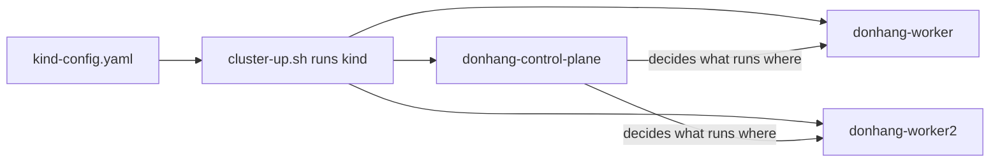

## Bạn cần biết trước

- [[k8s.l1.why-an-orchestrator]] — bạn biết bộ điều phối container chạy container trên một nhóm máy, và Kubernetes là bộ điều phối mà track này dùng.
- [[devops.l1.image-vs-container]] — bạn biết container là một bản đang chạy của image, và `docker ps` liệt kê các container đang chạy trên máy bạn.

## Tình huống

Bạn muốn thử Kubernetes, nhưng bạn chỉ có một laptop, không có cả nhóm máy. Ở stage-2, repository có `scripts/k8s/cluster-up.sh`, nên bạn chạy nó. Nó in ra những dòng như "Preparing nodes", "Starting control-plane" và "Joining worker nodes", rồi dừng. Tò mò, bạn chạy `docker ps` và thấy ba container mới: `donhang-control-plane`, `donhang-worker` và `donhang-worker2`, đều từ cùng một image, `kindest/node:v1.34.11`. Không cái nào là API hay database của Đơn Hàng. Ba container này là gì, và làm sao cả một nhóm máy lại vừa trên một laptop?

## Khái niệm cốt lõi

- **cluster** (một nhóm node cùng một control plane, được quản lý như một hệ Kubernetes) — một nhóm node cộng một control plane, cùng chạy như một hệ Kubernetes.
- **Kubernetes node** (một máy, thật hoặc ảo, trong cluster Kubernetes, nơi container chạy) — một máy trong cluster, nơi container chạy: máy vật lý, máy ảo được phần mềm giả lập trên một máy lớn hơn, hoặc, với kind, một container Docker.
- **control plane** (các thành phần Kubernetes lưu trạng thái cluster và quyết định cái gì chạy trên node nào) — phần của Kubernetes lưu trạng thái cluster và quyết định node nào chạy cái gì.
- Worker node — node chạy container của các ứng dụng; cluster của Đơn Hàng có hai worker.
- kind — công cụ mà lab của Đơn Hàng dùng để chạy cả một cluster trên một máy, bằng cách khởi động mỗi node thành một container Docker.

## Cơ chế hoạt động



Trong tình huống trên, ba container là ba node của một cluster tên `donhang`. `cluster-up.sh` đã chạy kind với `kind-config.yaml`, file liệt kê các node cần tạo. Cluster nào cũng có hai vai trò này: node, nơi container chạy, và control plane, nơi giữ bản ghi về những gì phải tồn tại và quyết định node nào chạy từng phần trong đó.

`donhang-control-plane` là node chạy control plane. Control plane là phần mềm, không phải chỗ để app của bạn chạy: nó lưu trạng thái cluster và ra quyết định. Trong cluster của Đơn Hàng, node control plane được đánh dấu để container của ứng dụng không bị đặt lên đó.

`donhang-worker` và `donhang-worker2` là các worker node. Khi container của Đơn Hàng chạy trên cluster này ở phần sau của track, chúng chạy trên hai node này. Thêm worker thứ ba là thêm chỗ cho nhiều container hơn. Việc của control plane vẫn giữ nguyên; nó chỉ có thêm một node để chọn.

Điều bất ngờ là mỗi node lại chính là một container. kind, công cụ đứng sau `cluster-up.sh`, khởi động mỗi node thành một container Docker từ node image `kindest/node`. Bên trong mỗi container đó chạy cùng phần mềm Kubernetes mà một máy thật sẽ chạy. Container mà Kubernetes khởi động cho ứng dụng chạy bên trong một container node, nên `docker ps` trên laptop cho thấy ba container node nhưng không thấy container nào bên trong chúng.

Trong một cluster thật, mỗi node là một máy riêng. kind đổi điều đó lấy sự tiện lợi: một cluster ba node vừa trên một laptop, đổi lại cả ba dùng chung bộ nhớ và CPU của một laptop.

## Trong hệ thống Đơn Hàng

File khai báo cluster:

```yaml file=deploy/k8s/kind-config.yaml tag=stage-2 lines=1-14
# lesson: k8s.l1.cluster-nodes-and-control-plane
# The kind cluster scripts/k8s/cluster-up.sh creates: one control-plane node
# and two worker nodes. kind runs each node as a Docker container on this
# machine; every node runs the same node image, pinned by its digest to
# Kubernetes 1.34 (v1.34.11), the version this course teaches.
kind: Cluster
apiVersion: kind.x-k8s.io/v1alpha4
nodes:
  - role: control-plane
    image: kindest/node:v1.34.11@sha256:44e222ee2132dab25ff87301682f89eb82c7880ea3a1bf543bfe9708fd08d67d
  - role: worker
    image: kindest/node:v1.34.11@sha256:44e222ee2132dab25ff87301682f89eb82c7880ea3a1bf543bfe9708fd08d67d
  - role: worker
    image: kindest/node:v1.34.11@sha256:44e222ee2132dab25ff87301682f89eb82c7880ea3a1bf543bfe9708fd08d67d
```

Hai dòng đầu cho kind biết file này mô tả một cluster, theo phiên bản `v1alpha4` của định dạng cấu hình kind. `role: control-plane` xuất hiện một lần và `role: worker` hai lần: một node control plane và hai worker node, đúng như `docker ps` cho thấy. Mọi node chạy cùng một node image, và tag `v1.34.11` là tên phiên bản Kubernetes mà khóa học dạy. Phần `sha256:` dài sau `@` là digest: nó cố định đúng image đó, nên mọi người học đều có các node giống hệt nhau.

Script tạo cluster từ file đó:

```bash file=scripts/k8s/cluster-up.sh tag=stage-2 lines=7-19
# lesson: k8s.l1.cluster-nodes-and-control-plane
# Nothing to do when the cluster already exists; scripts/k8s/cluster-down.sh
# deletes it. --wait: return only once the control plane is ready.
if kind get clusters 2>/dev/null | grep -qx donhang; then
  echo "The cluster donhang already exists."
  kubectl config use-context kind-donhang
else
  # kind ends with a greeting it picks at random; awk stops printing before it.
  kind create cluster --name donhang --config deploy/k8s/kind-config.yaml --wait 180s 2>&1 \
    | awk '!done { print } /^kubectl cluster-info/ { done = 1 }'
fi
# kind waited for the control plane only; wait for the workers to be Ready too.
kubectl wait --for=condition=Ready nodes --all --timeout=180s >/dev/null
```

Nếu cluster tên `donhang` đã tồn tại, script không tạo gì: nó báo vậy và trỏ `kubectl` vào cluster đó. `kubectl`, công cụ dòng lệnh để làm việc với cluster, là chủ đề của bài sau. Nếu chưa có, nó chạy `kind create cluster` với tên `donhang` và file cấu hình; `--wait 180s` khiến kind chờ tối đa 180 giây cho control plane sẵn sàng, còn `awk` chỉ cắt bỏ lời chào mà kind in ở cuối. Dòng cuối chờ, cũng tối đa 180 giây, tới khi cả ba node, kể cả các worker, báo `Ready`.

Script chạy trên máy của bạn, bên cạnh Docker, không chạy trong lab box. kind cần Docker để khởi động các container node, mà lab box không có Docker riêng: bên trong không cài Docker, và nó cũng không với tới Docker của máy bạn.

Output của nó trên một máy mới:

```text output=true
Creating cluster "donhang" ...
 • Ensuring node image (kindest/node:v1.34.11) 🖼️   ...
 ✓ Ensuring node image (kindest/node:v1.34.11) 🖼️
 • Preparing nodes 📦 📦 📦   ...
 ✓ Preparing nodes 📦 📦 📦 
 • Writing configuration 📜   ...
 ✓ Writing configuration 📜
 • Starting control-plane 🕹️   ...
 ✓ Starting control-plane 🕹️
 • Installing CNI 🔌   ...
 ✓ Installing CNI 🔌
 • Installing StorageClass 💾   ...
 ✓ Installing StorageClass 💾
 • Joining worker nodes 🚜   ...
 ✓ Joining worker nodes 🚜
 • Waiting ≤ 3m0s for control-plane = Ready ⏳   ...
 ✓ Waiting ≤ 3m0s for control-plane = Ready ⏳
 • Ready after ... 💚
Set kubectl context to "kind-donhang"
You can now use your cluster with:

kubectl cluster-info --context kind-donhang
```

Control plane khởi động trước, rồi các worker node mới tham gia vào. "Installing CNI" và "Installing StorageClass" dựng những phần của cluster mà các bài sau mới nói tới; giờ cứ bỏ qua. Mấy dòng cuối nhắc tới `kubectl`, chủ đề tiếp theo. Dấu `...` che thời gian khởi động, thứ khác nhau trên mỗi máy.

## Người mới hay nghĩ rằng…

- **"Control plane là nơi container của ứng dụng chạy."** → Thực ra control plane lưu trạng thái cluster và quyết định nơi đặt; trong cluster của Đơn Hàng, ứng dụng chạy trên các worker node. Bạn sẽ nhận ra khi ở phần sau của track tìm container của một app và thấy nó trên `donhang-worker` hoặc `donhang-worker2`, không bao giờ trên `donhang-control-plane`.
- **"Một node là một container của app."** → Thực ra node là một máy có thể chạy nhiều container của nhiều ứng dụng; với kind, cái máy đó tình cờ là một container. Bạn sẽ nhận ra khi `docker ps` vẫn chỉ liệt kê đúng ba container node, dù cluster chạy bao nhiêu container ứng dụng.
- **"Vì node của kind là container Docker, thứ chạy bên trong không phải Kubernetes thật."** → Thực ra mỗi container node chạy cùng phần mềm Kubernetes mà một máy thật chạy, đúng phiên bản ghim trong `kind-config.yaml`; chỉ có cái máy là giả lập. Bạn sẽ nhận ra khi `docker ps` hiện image của mỗi node là `kindest/node:v1.34.11`: chính node image mang Kubernetes `v1.34.11`.

## Thử ngay (3 phút)

Bạn cần cài kind và `kubectl` trên máy mình, như `STAGE.md` của repository liệt kê. Khi Docker đang chạy, ở thư mục repository `don-hang`, trên máy của bạn (không phải trong lab box):

1. Chạy `scripts/k8s/cluster-up.sh`. Nếu cluster đã tồn tại, nó sẽ báo vậy. Lần chạy đầu tiên phải tải node image về và có thể mất vài phút.
2. Chạy `docker ps --format "{{.Names}}  {{.Image}}" | grep kindest`. `--format` chỉ in tên và image của mỗi container; `grep kindest` chỉ giữ những dòng có chữ `kindest`.

Kết quả mong đợi: ba dòng, `donhang-control-plane`, `donhang-worker` và `donhang-worker2`, mỗi dòng có image `kindest/node:v1.34.11`. Ba container đó là toàn bộ cluster: một node control plane và hai worker.

## Liên hệ

- [[k8s.l1.why-an-orchestrator]] — nhóm máy mà bộ điều phối cần; ở đây nó có tên gọi trong Kubernetes là cluster.
- [[devops.l1.image-vs-container]] — cùng cách tách image và container, ở tầng thấp hơn: mỗi node là một container từ image `kindest/node`.
- [[k8s.l1.kubectl-and-the-api-server]] — bài tiếp theo: cách bạn nói chuyện với control plane của cluster này.
- [[k8s.l1.control-plane-components]] — về sau: từng thành phần bên trong control plane.

## Tóm tắt 5 dòng

1. Một cluster Kubernetes là một nhóm node, nơi container chạy, cộng một control plane lưu trạng thái và quyết định nơi đặt.
2. Worker node chạy container của ứng dụng; thêm worker là thêm chỗ mà không đổi việc của control plane.
3. kind chạy mỗi node thành một container Docker, nên một cluster ba node vừa trên một laptop.
4. `deploy/k8s/kind-config.yaml` khai báo một node control plane và hai worker, tất cả ghim ở Kubernetes `v1.34.11`.
5. `scripts/k8s/cluster-up.sh` tạo cluster `donhang` trên máy của bạn, bên cạnh Docker, không phải trong lab box.
