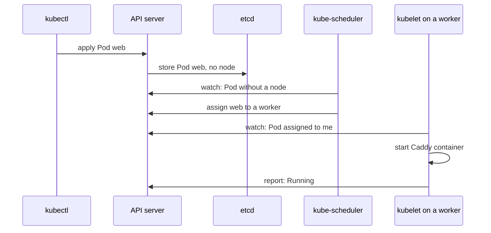

## Before you start

- [[k8s.l1.namespaces]] — you know the control plane's own Pods live in the namespace `kube-system`, and `web` lives in `default`.
- [[backend.l2.redis-key-value-store]] — you know a key-value store keeps values under keys, and that Redis is one Đơn Hàng already uses.

## The situation

`kubectl apply` returned `pod/web created`, and a few seconds later `web` was `Running`. Between those two moments, something chose one of the two workers, the nodes that run your Pods, and something on that worker started Caddy, the web server inside `web`. kubectl had already finished; it never talked to a node. In `kube-system` you saw Pods with names like `etcd-donhang-control-plane` and `kube-scheduler-donhang-control-plane`, plus `kube-apiserver`, which you know as the API server. Who stores the Pod, who picks the node, who starts the container, and how does each one know it is its turn?

## Core concepts

- **etcd** — the key-value store holding the cluster's state; only the API server reads and writes it directly.
- **kube-scheduler** — the control plane component that picks a node for each Pod that has none yet; it starts nothing itself.
- **kubelet** — the agent on each node that gets the containers of Pods assigned to that node running and reports their status.
- **control loop** — a loop that compares the desired state with what exists, acts to close the gap, and repeats.

## How it works



In the situation above, the API server stored `web` in etcd, a key-value store like Redis but holding the cluster's state. That state includes the cluster's objects, such as the Pod `web`, with the desired state from its manifest and, at first, no node. Of the cluster's components, only the API server reads and writes etcd directly; kube-scheduler, the kubelets and kubectl go through the API server.

kube-scheduler watches the API server for Pods that have no node. It found `web`, chose one of the two workers and wrote that choice back through the API server. That is all it did: it decides where a Pod runs, and starts nothing.

The kubelet on each worker watches for Pods assigned to its own node. The kubelet on the chosen worker saw `web`, got the Caddy container running, and reported the Pod's status back to the API server. That report is what `kubectl get pod web` later read as `Running`.

No component told another what to do. Each one runs a control loop: compare the desired state stored through the API server with what actually exists, act to close the gap, and repeat. For kube-scheduler the gap is "a Pod has no node"; for a kubelet it is "a Pod assigned here has no running container". Because each loop keeps repeating, the cluster keeps moving towards what you declared. Other control loops, inside a component called kube-controller-manager, work the same way on other kinds of objects.

## In the Đơn Hàng system

The script for this lesson:

```bash file=scripts/k8s/control-plane.sh tag=stage-2 lines=11-17
# lesson: k8s.l1.control-plane-components
# The API server, etcd, kube-scheduler and kube-controller-manager run as
# Pods themselves. Only the ones on the control-plane node are listed here.
show kubectl get pods -n kube-system --field-selector spec.nodeName=donhang-control-plane
echo
# NODE: the worker kube-scheduler assigned web to; the kubelet there started it.
show kubectl get pod web -o wide
```

`show` prints each command, then runs it. The first command lists the Pods in `kube-system` that run on `donhang-control-plane`; `--field-selector` keeps only Pods whose node is that one. The second shows `web` with extra columns, including its node. Its output:

```text output=true
$ kubectl get pods -n kube-system --field-selector spec.nodeName=donhang-control-plane
NAME                                            READY   STATUS    RESTARTS   AGE
coredns-...-...                                 1/1     Running   0          ...
coredns-...-...                                 1/1     Running   0          ...
etcd-donhang-control-plane                      1/1     Running   0          ...
kindnet-...                                     1/1     Running   0          ...
kube-apiserver-donhang-control-plane            1/1     Running   0          ...
kube-controller-manager-donhang-control-plane   1/1     Running   0          ...
kube-proxy-...                                  1/1     Running   0          ...
kube-scheduler-donhang-control-plane            1/1     Running   0          ...

$ kubectl get pod web -o wide
NAME   READY   STATUS    RESTARTS   AGE   IP    NODE                NOMINATED NODE   READINESS GATES
web    1/1     Running   0          ...   ...   donhang-worker...   <none>           <none>
```

`kube-apiserver`, `etcd` and `kube-scheduler` each run as a Pod on the control-plane node, named after it, and so does `kube-controller-manager`, which runs Kubernetes' built-in control loops. The other Pods, for the cluster's DNS and network, belong to later stages. The kubelet is not in the list: it runs directly on every node, outside any Pod. In the second table, `NODE` names the worker kube-scheduler chose for `web`; the `...` hides which one, since it can differ between runs, and the Pod's IP address.

## Beginners often think…

- **"`kubectl apply` tells a node to start the container directly."** → Actually `kubectl apply` only reaches the API server, which stores the Pod in etcd; the kubelet on the chosen node notices the Pod and starts it. You notice this when `apply` returns before the container runs, and the Pod's node is decided only afterwards.
- **"The scheduler starts the containers on the node it picks."** → Actually kube-scheduler only records which node a Pod should run on; the kubelet on that node starts the containers. You notice this when a Pod already has a `NODE` in `kubectl get pod -o wide` while its status is still `ContainerCreating`.
- **"etcd is where Kubernetes keeps my application's data."** → Actually etcd holds the cluster's objects and their status; Đơn Hàng's orders stay in PostgreSQL. You notice this when `kubectl get pod web -o yaml` shows the object the cluster stores for `web`: its name, its desired state and its status, and nothing a customer ever typed.

## Try it (3 minutes)

With the `donhang` cluster running, in the `don-hang` folder, in the shell you use for `kubectl`:

1. Run `scripts/k8s/control-plane.sh`.
2. Run `kubectl get pod web -o wide` again and note the `NODE` column.

Expected result: step 1 lists the same Pods as the output above (`AGE` and `RESTARTS` may differ), with the API server, etcd and kube-scheduler each running as a Pod on `donhang-control-plane`. In step 2, `NODE` is `donhang-worker` or `donhang-worker2`, never `donhang-control-plane`: kube-scheduler placed `web` on a worker, and that worker's kubelet started it.

## Connections

- [[k8s.l1.cluster-nodes-and-control-plane]] — the control plane from that lesson, now opened up into its parts.
- [[k8s.l1.manifests-and-kubectl-apply]] — the desired state you declared there is what every control loop here works towards.
- [[backend.l2.redis-key-value-store]] — the same idea of values under keys, used for the cluster's own state in etcd.
- [[k8s.l1.replicasets]] — next module: a control loop that keeps a number of Pods running.

## Five-line summary

1. kube-scheduler and each kubelet run a control loop around the state the API server keeps in etcd.
2. The API server stores the cluster's objects in etcd; every other component reads and changes state only through the API server.
3. kube-scheduler assigns each Pod without a node to a node, and starts nothing itself.
4. The kubelet on each node starts the containers of Pods assigned to it and reports their status back.
5. In Đơn Hàng's cluster, the API server, etcd and kube-scheduler run as Pods on `donhang-control-plane`; `web` runs on a worker.
