## Bạn cần biết trước

- [[k8s.l1.namespaces]] — bạn biết các Pod của chính control plane nằm trong namespace `kube-system`, còn `web` nằm trong `default`.
- [[backend.l2.redis-key-value-store]] — bạn biết key-value store giữ giá trị dưới các key, và Redis là một key-value store Đơn Hàng đang dùng.

## Tình huống

`kubectl apply` trả về `pod/web created`, và vài giây sau `web` đã `Running`. Giữa hai thời điểm đó, có thứ gì đó đã chọn một trong hai worker, tức các node chạy Pod của bạn, và có thứ gì đó trên worker ấy đã khởi động Caddy, web server bên trong `web`. Lúc đó kubectl đã xong việc; nó chưa từng nói chuyện với node nào. Trong `kube-system` bạn đã thấy các Pod tên như `etcd-donhang-control-plane` và `kube-scheduler-donhang-control-plane`, cùng `kube-apiserver`, thứ bạn đã biết là API server. Ai lưu Pod, ai chọn node, ai khởi động container, và làm sao mỗi bên biết đến lượt mình?

## Khái niệm cốt lõi

- **etcd** (kho key-value của control plane, giữ toàn bộ trạng thái cluster; chỉ API server đọc ghi trực tiếp) — key-value store giữ trạng thái của cluster; chỉ API server đọc và ghi nó trực tiếp.
- **kube-scheduler** (thành phần control plane chọn node cho từng Pod chưa có node; nó không tự khởi động gì) — thành phần control plane chọn node cho mỗi Pod chưa có node; bản thân nó không khởi động gì.
- **kubelet** (tác tử trên mỗi node: cho chạy container của các Pod được gán vào node đó và báo trạng thái) — tác tử trên mỗi node, cho container của các Pod được gán vào node đó chạy lên và báo trạng thái của chúng.
- **vòng điều khiển** (control loop) — vòng lặp so trạng thái mong muốn với thứ đang tồn tại, hành động để thu hẹp khác biệt, rồi lặp lại.

## Cơ chế hoạt động

```mermaid
sequenceDiagram
  participant K as kubectl
  participant A as API server
  participant E as etcd
  participant S as kube-scheduler
  participant L as kubelet on a worker
  K->>A: apply Pod web
  A->>E: store Pod web, no node
  S->>A: watch: Pod without a node
  S->>A: assign web to a worker
  L->>A: watch: Pod assigned to me
  L->>L: start Caddy container
  L->>A: report: Running
```



Trong tình huống trên, API server đã lưu `web` vào etcd, một key-value store giống Redis nhưng giữ trạng thái của cluster. Trạng thái đó gồm các object của cluster, như Pod `web`, với trạng thái mong muốn lấy từ manifest và, lúc đầu, chưa có node. Trong các thành phần của cluster, chỉ API server đọc và ghi etcd trực tiếp; kube-scheduler, các kubelet và kubectl đều đi qua API server.

kube-scheduler theo dõi API server để tìm các Pod chưa có node. Nó thấy `web`, chọn một trong hai worker và ghi lựa chọn đó ngược lại qua API server. Nó chỉ làm có vậy: nó quyết định Pod chạy ở đâu, và không khởi động gì cả.

kubelet trên mỗi worker theo dõi các Pod được gán cho chính node của nó. kubelet trên worker được chọn thấy `web`, cho container Caddy chạy lên, rồi báo trạng thái của Pod về API server. Bản báo cáo đó chính là thứ `kubectl get pod web` về sau đọc ra thành `Running`.

Không thành phần nào ra lệnh cho thành phần nào. Mỗi bên chạy một vòng điều khiển: so trạng thái mong muốn được lưu qua API server với thứ thực sự tồn tại, hành động để thu hẹp khác biệt, rồi lặp lại. Với kube-scheduler, khác biệt là "có Pod chưa có node"; với một kubelet, đó là "có Pod gán vào đây mà chưa có container đang chạy". Vì mỗi vòng cứ lặp mãi, cluster cứ tiến dần tới điều bạn đã khai báo. Các vòng điều khiển khác, nằm trong một thành phần tên kube-controller-manager, làm việc theo cùng cách với những loại object khác.

## Trong hệ thống Đơn Hàng

Script của bài này:

```bash file=scripts/k8s/control-plane.sh tag=stage-2 lines=11-17
# lesson: k8s.l1.control-plane-components
# The API server, etcd, kube-scheduler and kube-controller-manager run as
# Pods themselves. Only the ones on the control-plane node are listed here.
show kubectl get pods -n kube-system --field-selector spec.nodeName=donhang-control-plane
echo
# NODE: the worker kube-scheduler assigned web to; the kubelet there started it.
show kubectl get pod web -o wide
```

`show` in mỗi lệnh rồi mới chạy. Lệnh đầu liệt kê các Pod trong `kube-system` chạy trên `donhang-control-plane`; `--field-selector` chỉ giữ các Pod có node là node đó. Lệnh thứ hai hiện `web` với thêm vài cột, trong đó có node của nó. Output của nó:

```text output=true
$ kubectl get pods -n kube-system --field-selector spec.nodeName=donhang-control-plane
NAME                                            READY   STATUS    RESTARTS   AGE
coredns-...-...                                 1/1     Running   0          ...
coredns-...-...                                 1/1     Running   0          ...
etcd-donhang-control-plane                      1/1     Running   0          ...
kindnet-...                                     1/1     Running   0          ...
kube-apiserver-donhang-control-plane            1/1     Running   0          ...
kube-controller-manager-donhang-control-plane   1/1     Running   0          ...
kube-proxy-...                                  1/1     Running   0          ...
kube-scheduler-donhang-control-plane            1/1     Running   0          ...

$ kubectl get pod web -o wide
NAME   READY   STATUS    RESTARTS   AGE   IP    NODE                NOMINATED NODE   READINESS GATES
web    1/1     Running   0          ...   ...   donhang-worker...   <none>           <none>
```

`kube-apiserver`, `etcd` và `kube-scheduler` đều chạy dưới dạng Pod trên node control plane, mang tên node đó, và `kube-controller-manager` cũng vậy, thành phần chạy các vòng điều khiển có sẵn của Kubernetes. Các Pod còn lại, phục vụ DNS và mạng của cluster, thuộc về các giai đoạn sau. kubelet không có trong danh sách: nó chạy trực tiếp trên mọi node, bên ngoài mọi Pod. Ở bảng thứ hai, `NODE` là worker mà kube-scheduler đã chọn cho `web`; dấu `...` che tên worker đó, vì nó có thể khác giữa các lần chạy, và che cả địa chỉ IP của Pod.

## Người mới hay nghĩ rằng…

- **"`kubectl apply` bảo một node khởi động container trực tiếp."** → Thực ra `kubectl apply` chỉ tới API server, nơi lưu Pod vào etcd; kubelet trên node được chọn nhận ra Pod rồi khởi động nó. Bạn sẽ nhận ra khi `apply` trả về trước lúc container chạy, và node của Pod chỉ được quyết định sau đó.
- **"Scheduler khởi động container trên node nó chọn."** → Thực ra kube-scheduler chỉ ghi lại Pod phải chạy trên node nào; kubelet trên node đó mới khởi động container. Bạn sẽ nhận ra khi một Pod đã có `NODE` trong `kubectl get pod -o wide` mà trạng thái vẫn là `ContainerCreating`.
- **"etcd là nơi Kubernetes giữ dữ liệu của ứng dụng."** → Thực ra etcd giữ các object của cluster và trạng thái của chúng; đơn hàng của Đơn Hàng vẫn nằm trong PostgreSQL. Bạn sẽ nhận ra khi `kubectl get pod web -o yaml` hiện object mà cluster lưu cho `web`: tên, trạng thái mong muốn và trạng thái hiện tại, không có gì do khách hàng gõ vào.

## Thử ngay (3 phút)

Khi cluster `donhang` đang chạy, ở thư mục `don-hang`, trong shell bạn dùng cho `kubectl`:

1. Chạy `scripts/k8s/control-plane.sh`.
2. Chạy lại `kubectl get pod web -o wide` và để ý cột `NODE`.

Kết quả mong đợi: bước 1 liệt kê cùng các Pod như output ở trên (`AGE` và `RESTARTS` có thể khác), với API server, etcd và kube-scheduler đều chạy dưới dạng Pod trên `donhang-control-plane`. Ở bước 2, `NODE` là `donhang-worker` hoặc `donhang-worker2`, không bao giờ là `donhang-control-plane`: kube-scheduler đã đặt `web` lên một worker, và kubelet của worker đó đã khởi động nó.

## Liên hệ

- [[k8s.l1.cluster-nodes-and-control-plane]] — control plane ở bài đó, giờ được mở ra thành từng phần.
- [[k8s.l1.manifests-and-kubectl-apply]] — trạng thái mong muốn bạn khai báo ở đó là đích mà mọi vòng điều khiển ở đây hướng tới.
- [[backend.l2.redis-key-value-store]] — cùng ý tưởng giá trị dưới key, được dùng cho trạng thái của chính cluster trong etcd.
- [[k8s.l1.replicasets]] — module tiếp theo: một vòng điều khiển giữ cho đủ số Pod chạy.

## Tóm tắt 5 dòng

1. kube-scheduler và từng kubelet chạy một vòng điều khiển quanh trạng thái mà API server giữ trong etcd.
2. API server lưu các object của cluster vào etcd; mọi thành phần khác đọc và đổi trạng thái chỉ qua API server.
3. kube-scheduler gán node cho mỗi Pod chưa có node, và bản thân không khởi động gì.
4. kubelet trên mỗi node khởi động container của các Pod được gán cho nó và báo trạng thái về.
5. Trong cluster của Đơn Hàng, API server, etcd và kube-scheduler chạy dưới dạng Pod trên `donhang-control-plane`; `web` chạy trên một worker.
