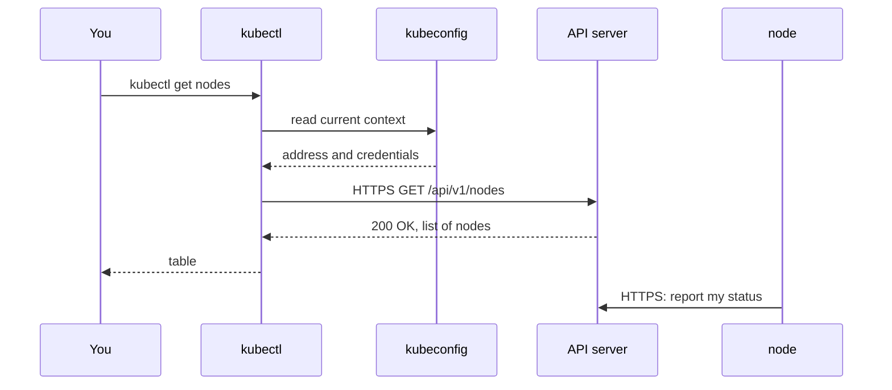

## Before you start

- [[k8s.l1.cluster-nodes-and-control-plane]] — you know the `donhang` cluster has a control plane and two workers, each node a Docker container that kind started.
- [[foundation.l1.http-request-response]] — you know a request carries a method and a path, and a response comes back with a status code and a body.

## The situation

The `donhang` cluster is running on your laptop. You type `kubectl get nodes`, and within a second a table appears: three nodes, each `Ready`, each with a version. You never ran `docker` and never named a container, yet the answer is about the three node containers kind started. You did not log in anywhere or type an address either. Where did the command send its question, and how did it know where the cluster is and that you are allowed to ask?

## Core concepts

- **API server** — the control plane's front door: every read or change to the cluster is an HTTPS request to it.
- **kubectl** — the command-line client of the API server; each command that reads or changes the cluster becomes one or more requests to it.
- **kubeconfig** — the file that tells kubectl the API server's address, the credentials to use and the current context.
- Context — a named entry in the kubeconfig that pairs one cluster's address with the credentials for it; kubectl uses the one marked current.

## How it works



In the situation above, the API server is the part of the control plane that answered. kubectl did not look at Docker or at the nodes. It sent its request over HTTPS to the API server, and turned the reply into a table.

First, kubectl reads its kubeconfig. On your machine that is the file `.kube/config` in your home folder, unless the `KUBECONFIG` environment variable points elsewhere. When `cluster-up.sh` created the cluster, kind added a context named `kind-donhang` to that file and made it current. The context holds the API server's address, `https://127.0.0.1` with a port kind picked, and a certificate and key as credentials: kubectl sends them when it connects, and the API server uses them to recognise who is asking, the way a password would.

Next, kubectl sends `GET /api/v1/nodes` to that address. The API server checks the credentials, looks up the nodes it has on record and answers `200 OK` with a list in the body; credentials it did not accept would get an error status code instead. kubectl picks a few fields from each entry and prints them as columns.

The bottom arrow matters as much, and it happens all the time, not only after your command. The cluster's own parts talk to the API server the same way: the software on each node keeps reporting the node's status to it over HTTPS. That is why `STATUS` says `Ready`: a node reported it, and kubectl only read the record.

So kubectl is just a client. Any machine whose kubeconfig has a reachable address and valid credentials can run it. For kind, the address is `127.0.0.1`, so only your own laptop reaches it.

## In the Đơn Hàng system

The script behind this lesson:

```bash file=scripts/k8s/get-nodes.sh tag=stage-2 lines=5-12
show() { echo "\$ $*"; "$@"; }

# lesson: k8s.l1.kubectl-and-the-api-server
# kind added the context kind-donhang to the kubeconfig and made it current:
# the API server's address and the credentials kubectl uses to reach it.
show kubectl config current-context
echo
show kubectl get nodes
```

`show` prints a command after a `$` sign, then runs it. Two commands follow. `kubectl config current-context` reads the kubeconfig only and sends no request; it prints the name of the context kubectl will use. `kubectl get nodes` is the request from the diagram.

Its output:

```text output=true
$ kubectl config current-context
kind-donhang

$ kubectl get nodes
NAME                    STATUS   ROLES           AGE   VERSION
donhang-control-plane   Ready    control-plane   ...   v1.34.11
donhang-worker          Ready    <none>          ...   v1.34.11
donhang-worker2         Ready    <none>          ...   v1.34.11
```

The first line confirms kubectl talks to the cluster kind created, `kind-donhang`. The table lists the three nodes that `kind-config.yaml` declares. `ROLES` shows `control-plane` for the first node and `<none>` for the workers: only the control-plane node is marked with a role, so only it shows one in `ROLES`. `VERSION` is the Kubernetes version each node reports, `v1.34.11`. The `...` in the `AGE` column hides how long ago each node joined, which differs on every run.

## Beginners often think…

- **"kubectl logs in to each node and runs commands there."** → Actually kubectl sends HTTPS requests to one address, the API server, and never contacts a node directly. You notice this when `kubectl get nodes -v=6`, as in Try it, shows requests only to `127.0.0.1`, the API server's address, and none to the three nodes.
- **"kubectl only works on the machine where the cluster runs."** → Actually kubectl works from any machine whose kubeconfig holds a reachable API server address and valid credentials. You notice this when a cluster on real machines is managed from a laptop that runs none of its nodes; with kind, the address `127.0.0.1` is what limits it to your laptop.
- **"The kubeconfig file holds a copy of the cluster's data."** → Actually it holds addresses, credentials and context names; every answer comes from the API server at the moment you ask. You notice this when `kubectl config view --minify` lists a server and the credentials but no nodes, and when the cluster is stopped, `kubectl get nodes` fails to connect even though the file has not changed.

## Try it (3 minutes)

With the `donhang` cluster running, in the same shell you used to run `cluster-up.sh`:

1. Run `kubectl config view --minify`, which shows only the current context's entries, and find the `server:` line.
2. Run `kubectl get nodes -v=6 2>&1 | grep nodes`. The `-v=6` flag makes kubectl also log each request it sends; `2>&1` sends those log lines into the pipe too, and `grep nodes` keeps the line about the request for the nodes.

Expected result: step 1 shows `server: https://127.0.0.1:` followed by a port, and the credentials as `DATA+OMITTED`. Step 2 prints one line containing `verb="GET"`, a URL with that same address ending in `/api/v1/nodes?limit=500`, and `status="200 OK"`. kubectl adds the query parameter `limit=500` itself; the path is the one from the diagram. The port differs between machines.

## Connections

- [[k8s.l1.cluster-nodes-and-control-plane]] — the control plane from that lesson; the API server is how anything reaches it.
- [[foundation.l1.http-request-response]] — the same request and response, now carrying a cluster's state: `GET`, a path, `200 OK`, a body.
- [[k8s.l1.pods]] — next: the first thing you ask the API server to run.
- [[k8s.l1.control-plane-components]] — later: what sits behind the API server and how the other parts use it.

## Five-line summary

1. Every kubectl command that reads or changes the cluster becomes an HTTPS request to the API server, the control plane's front door.
2. The cluster's own parts use the same API: each node reports its status to the API server.
3. kubectl reads the API server's address and credentials from the current context in its kubeconfig.
4. Creating `donhang` with kind added the context `kind-donhang` to the kubeconfig and made it current.
5. `kubectl get nodes` sends `GET /api/v1/nodes` and prints Đơn Hàng's three nodes with their role and version.
