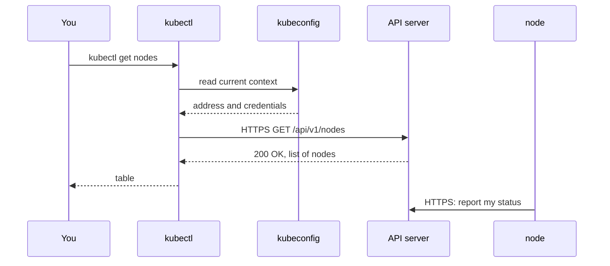

## Bạn cần biết trước

- [[k8s.l1.cluster-nodes-and-control-plane]] — bạn biết cluster `donhang` có một control plane và hai worker, mỗi node là một container Docker do kind khởi động.
- [[foundation.l1.http-request-response]] — bạn biết request mang một method và một path, còn response trả về kèm status code và body.

## Tình huống

Cluster `donhang` đang chạy trên laptop của bạn. Bạn gõ `kubectl get nodes`, và chưa tới một giây sau một bảng hiện ra: ba node, node nào cũng `Ready`, node nào cũng có phiên bản. Bạn chưa hề chạy `docker` hay gọi tên container nào, vậy mà câu trả lời lại nói về ba container node mà kind đã khởi động. Bạn cũng không đăng nhập ở đâu, không gõ địa chỉ nào. Lệnh đó đã gửi câu hỏi tới đâu, và làm sao nó biết cluster nằm ở đâu và bạn được phép hỏi?

## Khái niệm cốt lõi

- **API server** (cửa vào của control plane: mọi thao tác đọc/ghi cluster đều là request HTTPS tới nó) — cửa vào của control plane: mọi thao tác đọc hay thay đổi cluster đều là một request HTTPS tới nó.
- **kubectl** (công cụ dòng lệnh gửi request tới API server của cluster Kubernetes) — client dòng lệnh của API server; mỗi lệnh đọc hay thay đổi cluster trở thành một hoặc vài request tới nó.
- **kubeconfig** (file cho kubectl biết địa chỉ API server, thông tin đăng nhập và context đang dùng) — file cho kubectl biết địa chỉ API server, thông tin đăng nhập cần dùng và context hiện tại.
- Context — một mục có tên trong kubeconfig, ghép địa chỉ của một cluster với thông tin đăng nhập vào cluster đó; kubectl dùng mục được đánh dấu là hiện tại.

## Cơ chế hoạt động



Trong tình huống trên, API server là phần của control plane đã trả lời. kubectl không nhìn vào Docker, cũng không nhìn vào các node. Nó gửi request qua HTTPS tới API server, rồi biến câu trả lời thành bảng.

Trước hết, kubectl đọc kubeconfig. Trên máy bạn, đó là file `.kube/config` trong thư mục home, trừ khi biến môi trường `KUBECONFIG` trỏ sang chỗ khác. Khi `cluster-up.sh` tạo cluster, kind đã thêm vào file đó một context tên `kind-donhang` và đặt nó làm context hiện tại. Context này chứa địa chỉ API server, `https://127.0.0.1` với một cổng do kind chọn, cùng một certificate và key làm thông tin đăng nhập: kubectl gửi chúng khi kết nối, và API server dùng chúng để nhận ra ai đang hỏi, giống như mật khẩu.

Tiếp theo, kubectl gửi `GET /api/v1/nodes` tới địa chỉ đó. API server kiểm tra thông tin đăng nhập, tra các node nó đang ghi nhận và trả lời `200 OK` kèm danh sách trong body; nếu không chấp nhận thông tin đăng nhập, nó sẽ trả về một status code lỗi. kubectl lấy vài trường của mỗi mục và in thành các cột.

Mũi tên dưới cùng cũng quan trọng không kém, và nó diễn ra liên tục, không chỉ sau lệnh của bạn. Các thành phần của chính cluster nói chuyện với API server theo cùng cách đó: phần mềm trên mỗi node liên tục báo trạng thái của node cho nó qua HTTPS. Vì vậy `STATUS` mới ghi `Ready`: node đã báo điều đó, còn kubectl chỉ đọc bản ghi.

Nên kubectl chỉ là một client. Máy nào có kubeconfig chứa địa chỉ truy cập được và thông tin đăng nhập hợp lệ thì đều chạy được nó. Với kind, địa chỉ là `127.0.0.1`, nên chỉ chính laptop của bạn tới được.

## Trong hệ thống Đơn Hàng

Script đứng sau bài này:

```bash file=scripts/k8s/get-nodes.sh tag=stage-2 lines=5-12
show() { echo "\$ $*"; "$@"; }

# lesson: k8s.l1.kubectl-and-the-api-server
# kind added the context kind-donhang to the kubeconfig and made it current:
# the API server's address and the credentials kubectl uses to reach it.
show kubectl config current-context
echo
show kubectl get nodes
```

`show` in lệnh sau dấu `$`, rồi chạy lệnh đó. Tiếp theo là hai lệnh. `kubectl config current-context` chỉ đọc kubeconfig và không gửi request nào; nó in tên context mà kubectl sẽ dùng. `kubectl get nodes` là request trong sơ đồ.

Output của nó:

```text output=true
$ kubectl config current-context
kind-donhang

$ kubectl get nodes
NAME                    STATUS   ROLES           AGE   VERSION
donhang-control-plane   Ready    control-plane   ...   v1.34.11
donhang-worker          Ready    <none>          ...   v1.34.11
donhang-worker2         Ready    <none>          ...   v1.34.11
```

Dòng đầu xác nhận kubectl đang làm việc với cluster kind đã tạo, `kind-donhang`. Bảng liệt kê ba node mà `kind-config.yaml` khai báo. `ROLES` ghi `control-plane` cho node đầu và `<none>` cho các worker: chỉ node control plane được đánh dấu vai trò, nên chỉ nó có giá trị trong `ROLES`. `VERSION` là phiên bản Kubernetes mà mỗi node báo lên, `v1.34.11`. Dấu `...` ở cột `AGE` che thời gian kể từ lúc mỗi node tham gia, thứ khác nhau ở mỗi lần chạy.

## Người mới hay nghĩ rằng…

- **"kubectl đăng nhập vào từng node và chạy lệnh ở đó."** → Thực ra kubectl gửi request HTTPS tới một địa chỉ duy nhất, API server, và không bao giờ liên lạc trực tiếp với node. Bạn sẽ nhận ra khi `kubectl get nodes -v=6`, như trong phần Thử ngay, chỉ cho thấy request tới `127.0.0.1`, địa chỉ của API server, và không request nào tới ba node.
- **"kubectl chỉ chạy được trên máy đang chạy cluster."** → Thực ra kubectl chạy được từ bất kỳ máy nào có kubeconfig chứa địa chỉ API server truy cập được và thông tin đăng nhập hợp lệ. Bạn sẽ nhận ra khi một cluster trên máy thật được quản lý từ một laptop không chạy node nào của nó; với kind, chính địa chỉ `127.0.0.1` giới hạn việc dùng trong laptop của bạn.
- **"File kubeconfig giữ một bản sao dữ liệu của cluster."** → Thực ra nó chứa địa chỉ, thông tin đăng nhập và tên context; mọi câu trả lời đều đến từ API server ngay lúc bạn hỏi. Bạn sẽ nhận ra khi `kubectl config view --minify` liệt kê một server và thông tin đăng nhập nhưng không có node nào, và khi cluster dừng, `kubectl get nodes` không kết nối được dù file không hề đổi.

## Thử ngay (3 phút)

Khi cluster `donhang` đang chạy, trong chính shell bạn đã dùng để chạy `cluster-up.sh`:

1. Chạy `kubectl config view --minify`, lệnh chỉ hiện các mục của context hiện tại, rồi tìm dòng `server:`.
2. Chạy `kubectl get nodes -v=6 2>&1 | grep nodes`. Cờ `-v=6` khiến kubectl ghi thêm log cho mỗi request nó gửi; `2>&1` đưa cả các dòng log đó vào pipe, và `grep nodes` giữ lại dòng về request lấy danh sách node.

Kết quả mong đợi: bước 1 hiện `server: https://127.0.0.1:` theo sau là một cổng, và thông tin đăng nhập hiện thành `DATA+OMITTED`. Bước 2 in một dòng có `verb="GET"`, một URL cùng địa chỉ đó kết thúc bằng `/api/v1/nodes?limit=500`, và `status="200 OK"`. kubectl tự thêm query parameter `limit=500`; path vẫn là path trong sơ đồ. Cổng mỗi máy một khác.

## Liên hệ

- [[k8s.l1.cluster-nodes-and-control-plane]] — control plane ở bài đó; API server là lối để mọi thứ tới được nó.
- [[foundation.l1.http-request-response]] — vẫn là request và response ấy, giờ mang trạng thái của cluster: `GET`, một path, `200 OK`, một body.
- [[k8s.l1.pods]] — bài tiếp theo: thứ đầu tiên bạn nhờ API server chạy.
- [[k8s.l1.control-plane-components]] — về sau: những gì nằm sau API server và cách các thành phần khác dùng nó.

## Tóm tắt 5 dòng

1. Mọi lệnh kubectl đọc hay thay đổi cluster đều trở thành một request HTTPS tới API server, cửa vào của control plane.
2. Các thành phần của chính cluster dùng cùng API đó: mỗi node báo trạng thái của mình cho API server.
3. kubectl đọc địa chỉ và thông tin đăng nhập của API server từ context hiện tại trong kubeconfig.
4. Tạo `donhang` bằng kind đã thêm context `kind-donhang` vào kubeconfig và đặt nó làm context hiện tại.
5. `kubectl get nodes` gửi `GET /api/v1/nodes` và in ba node của Đơn Hàng cùng vai trò và phiên bản của chúng.
