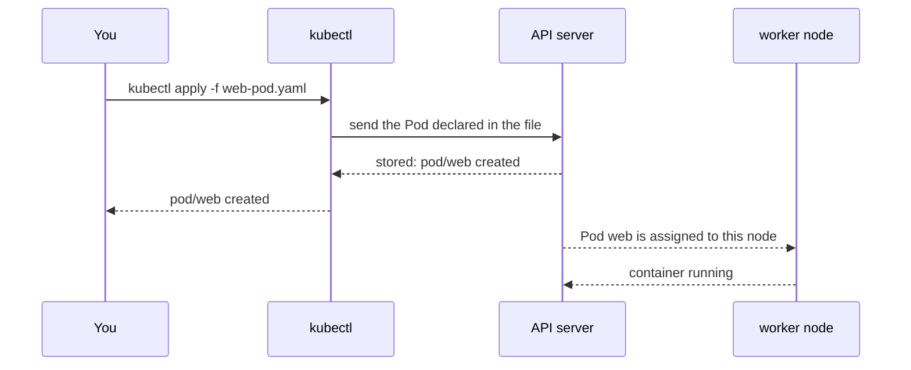

## Before you start

- [[k8s.l1.pods]] — you know `web-pod.yaml` describes a Pod named `web` with one Caddy container.
- [[devops.l1.compose-for-the-api]] — you know `docker-compose.yml` describes services in a file, and Compose starts what the file says.

## The situation

You run `kubectl apply -f deploy/k8s/lessons/web-pod.yaml` and it answers `pod/web created` almost at once. Caddy's image may not even be on a node yet, so how can the Pod be "created"? Unsure whether it worked, a teammate runs the very same command a minute later, and this time it prints `pod/web unchanged`. Nobody wrote a script that checks whether `web` already exists. What did `kubectl apply` actually send, what does "created" promise, and why did the second run not make a second Pod?

## Core concepts

- **manifest** — a YAML file, the indented `key: value` format `docker-compose.yml` also uses, declaring Kubernetes objects: what type each one is, its name, and the state you want it in.
- **desired state** — what you declare should exist; Kubernetes keeps working to make what actually runs match it.
- `kubectl apply -f <file>` — the command that sends a manifest to the API server, to create the objects it declares or update them to match.
- Actual state — what really runs at a given moment, such as whether the Pod's container has started yet.

## How it works



In the situation above, `web-pod.yaml` is a manifest. Its top lines say what type of object it declares: `apiVersion: v1` and `kind: Pod`. `metadata` gives the name, `web`. `spec` is the desired state: one container from `caddy:2.10.0`, listening on port `80`.

`kubectl apply -f` read the file and sent the Pod to the API server. The API server checked it and stored it, and that is the moment it answered `created`. The arrows after that happen without kubectl: the cluster assigns the stored Pod to a worker node, which learns of it from the API server, pulls the image if it does not have it yet and starts the container. That can take seconds or more. So `created` means "the cluster has recorded what you want", not "it runs".

On the teammate's run, kubectl compared the file with what the API server already had. Nothing differed, so it changed nothing and printed `unchanged`. That is the point of declaring a desired state instead of listing steps: you say what should exist, and applying the same file twice gives the same result as applying it once. The file, not a history of typed commands, records what should run.

To change what runs, you edit the manifest and apply it again. Kubernetes works out the steps to get from the actual state to the new desired state. Some fields of a Pod cannot change once the Pod exists, though; for those, the API server rejects the apply with an error, and the Pod has to be replaced instead: deleted, then applied again from the edited file.

## In the Đơn Hàng system

The manifest, from its first non-comment line:

```yaml file=deploy/k8s/lessons/web-pod.yaml tag=stage-2 lines=6-15
apiVersion: v1
kind: Pod
metadata:
  name: web
spec:
  containers:
    - name: web
      image: caddy:2.10.0
      ports:
        - containerPort: 80
```

Four top-level keys, as in every Pod manifest: `apiVersion` and `kind` for the type, `metadata` for the name, `spec` for the desired state. Nothing in the file says how to create a Pod or in what order; it only says what should exist.

The script that applies it:

```bash file=scripts/k8s/apply-web-pod.sh tag=stage-2 lines=8-20
# Start from a cluster with no Pod named web, so the first apply creates it.
kubectl delete pod web --ignore-not-found >/dev/null

# lesson: k8s.l1.manifests-and-kubectl-apply
# apply returns as soon as the API server has stored the Pod; the container
# may not run yet. kubectl wait blocks until the Pod reports Ready.
show kubectl apply -f deploy/k8s/lessons/web-pod.yaml
show kubectl wait --for=condition=Ready pod/web --timeout=120s
show kubectl get pod web
echo

# The same file, unchanged: nothing new is created.
show kubectl apply -f deploy/k8s/lessons/web-pod.yaml
```

`show` is a helper defined earlier in the script that prints each command after a `$`, then runs it. The script first deletes any Pod named `web`, so the first apply really creates one. `kubectl wait` blocks until the Pod reports `Ready`, exactly because `apply` does not wait. `Ready` means the Pod's container has started and can serve; for this one-container Pod it shows up as `1/1` and `Running` in `kubectl get pod`. Its output:

```text output=true
$ kubectl apply -f deploy/k8s/lessons/web-pod.yaml
pod/web created
$ kubectl wait --for=condition=Ready pod/web --timeout=120s
pod/web condition met
$ kubectl get pod web
NAME   READY   STATUS    RESTARTS   AGE
web    1/1     Running   0          ...

$ kubectl apply -f deploy/k8s/lessons/web-pod.yaml
pod/web unchanged
```

`created`, then a separate wait, then `Running`, then `unchanged` for the identical second apply. The `...` hides the Pod's age.

Đơn Hàng keeps its manifests in Git under `deploy/k8s/`, beside the code. A change to what runs in the cluster is then a commit to a manifest, reviewed in a pull request like any code change, and the file in Git says what the cluster should be running.

## Beginners often think…

- **"When `kubectl apply` returns without an error, the app is already up and running."** → Actually `apply` returns once the API server has stored the objects; the container starts later, on a node. You notice this when `kubectl get pod web` right after `apply` shows `Pending` or `ContainerCreating` instead of `Running`, which is why the script calls `kubectl wait`.
- **"Running `kubectl apply` twice on the same file creates two Pods."** → Actually `apply` makes the cluster match the file; when it already matches, nothing changes. You notice this when the second run prints `pod/web unchanged` and `kubectl get pods` still lists one `web`.
- **"A manifest is a script that Kubernetes runs from top to bottom."** → Actually a manifest has no steps; it declares objects and their desired state, and Kubernetes decides how to reach it. You notice this when you look for an instruction like "pull" or "start" in `web-pod.yaml` and find only names and values.

## Try it (3 minutes)

With the `donhang` cluster running, in the `don-hang` repository folder, in the shell you use for `kubectl`:

1. Run `scripts/k8s/apply-web-pod.sh`.
2. Run `kubectl apply -f deploy/k8s/lessons/web-pod.yaml` once more.
3. Run `kubectl get pods`.

Expected result: step 1 prints what the output above shows, `pod/web created` first and `pod/web unchanged` last. Step 2 prints `pod/web unchanged` again. Step 3 lists exactly one Pod, `web`, `Running`, however many times you applied the file.

## Connections

- [[k8s.l1.pods]] — the Pod from that lesson, now sent to the cluster.
- [[devops.l1.compose-for-the-api]] — the same idea of a file that says what should run; Compose starts it on one machine, `kubectl apply` hands it to a cluster.
- [[k8s.l1.namespaces]] — next: which part of the cluster the `web` Pod landed in, since its manifest does not say.
- [[k8s.l1.control-plane-components]] — later: who picks up the stored Pod and starts its container.

## Five-line summary

1. A manifest is a YAML file declaring objects: `apiVersion` and `kind` give the type, `metadata` the name, `spec` the desired state.
2. `kubectl apply -f` returns once the API server has stored the objects, before the container is necessarily running.
3. Applying the same unchanged manifest again prints `unchanged` and creates nothing new.
4. To change what runs, edit the manifest and apply it again; some Pod fields cannot change once the Pod exists.
5. Đơn Hàng keeps manifests in Git under `deploy/k8s/`, so a change made by editing a manifest is reviewed like code.
