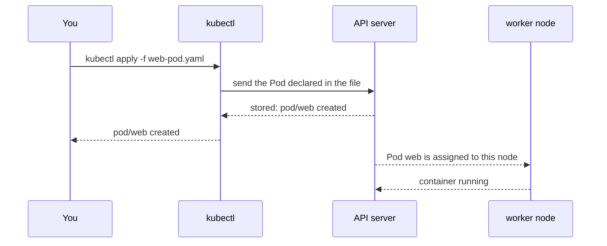

## Bạn cần biết trước

- [[k8s.l1.pods]] — bạn biết `web-pod.yaml` mô tả một Pod tên `web` với một container Caddy.
- [[devops.l1.compose-for-the-api]] — bạn biết `docker-compose.yml` mô tả các service trong một file, và Compose khởi động đúng thứ file đó nói.

## Tình huống

Bạn chạy `kubectl apply -f deploy/k8s/lessons/web-pod.yaml` và gần như ngay lập tức nó trả lời `pod/web created`. Image của Caddy có khi còn chưa có trên node nào, vậy sao Pod đã "created"? Không chắc lệnh đã chạy được chưa, một đồng nghiệp chạy đúng lệnh đó một phút sau, và lần này nó in `pod/web unchanged`. Không ai viết script nào kiểm tra `web` đã tồn tại hay chưa. `kubectl apply` thực sự đã gửi đi cái gì, "created" hứa hẹn điều gì, và vì sao lần chạy thứ hai không tạo thêm Pod thứ hai?

## Khái niệm cốt lõi

- **manifest** (file YAML khai báo object Kubernetes: loại gì, tên gì, và trạng thái mong muốn) — một file YAML, định dạng `key: value` thụt lề mà `docker-compose.yml` cũng dùng, khai báo các object Kubernetes: mỗi object thuộc loại gì, tên gì, và bạn muốn nó ở trạng thái nào.
- **trạng thái mong muốn** (desired state) — điều bạn khai báo là phải tồn tại; Kubernetes liên tục làm việc để thứ đang chạy khớp với nó.
- `kubectl apply -f <file>` — lệnh gửi một manifest tới API server, để tạo các object nó khai báo hoặc cập nhật chúng cho khớp.
- Trạng thái thực tế — thứ thật sự đang chạy tại một thời điểm, chẳng hạn container của Pod đã khởi động hay chưa.

## Cơ chế hoạt động



Trong tình huống trên, `web-pod.yaml` là một manifest. Các dòng đầu cho biết nó khai báo loại object nào: `apiVersion: v1` và `kind: Pod`. `metadata` đặt tên, `web`. `spec` là trạng thái mong muốn: một container từ `caddy:2.10.0`, lắng nghe ở cổng `80`.

`kubectl apply -f` đọc file rồi gửi Pod tới API server. API server kiểm tra rồi lưu nó, và đó là lúc nó trả lời `created`. Các mũi tên phía sau diễn ra mà không cần kubectl: cluster gán Pod đã lưu cho một worker node, node đó biết điều này từ API server, pull image nếu chưa có rồi khởi động container. Việc đó có thể mất vài giây hoặc lâu hơn. Vậy `created` nghĩa là "cluster đã ghi nhận điều bạn muốn", chứ không phải "nó đang chạy".

Ở lần chạy của đồng nghiệp, kubectl so file với thứ API server đã có. Không có gì khác, nên nó không đổi gì và in `unchanged`. Đó chính là ý nghĩa của việc khai báo trạng thái mong muốn thay vì liệt kê các bước: bạn nói thứ gì phải tồn tại, và apply cùng một file hai lần cho kết quả như apply một lần. Chính file, chứ không phải lịch sử các lệnh đã gõ, ghi lại thứ phải chạy.

Muốn đổi thứ đang chạy, bạn sửa manifest rồi apply lại. Kubernetes tự tính các bước để đi từ trạng thái thực tế tới trạng thái mong muốn mới. Tuy vậy, có những field của Pod không đổi được khi Pod đã tồn tại; với chúng, API server từ chối lần apply bằng một lỗi, và Pod phải được thay: xóa đi, rồi apply lại từ file đã sửa.

## Trong hệ thống Đơn Hàng

Manifest, từ dòng đầu tiên không phải comment:

```yaml file=deploy/k8s/lessons/web-pod.yaml tag=stage-2 lines=6-15
apiVersion: v1
kind: Pod
metadata:
  name: web
spec:
  containers:
    - name: web
      image: caddy:2.10.0
      ports:
        - containerPort: 80
```

Bốn key cấp cao nhất, như mọi manifest của Pod: `apiVersion` và `kind` cho loại, `metadata` cho tên, `spec` cho trạng thái mong muốn. Không chỗ nào trong file nói cách tạo Pod hay theo thứ tự nào; nó chỉ nói thứ gì phải tồn tại.

Script apply nó:

```bash file=scripts/k8s/apply-web-pod.sh tag=stage-2 lines=8-20
# Start from a cluster with no Pod named web, so the first apply creates it.
kubectl delete pod web --ignore-not-found >/dev/null

# lesson: k8s.l1.manifests-and-kubectl-apply
# apply returns as soon as the API server has stored the Pod; the container
# may not run yet. kubectl wait blocks until the Pod reports Ready.
show kubectl apply -f deploy/k8s/lessons/web-pod.yaml
show kubectl wait --for=condition=Ready pod/web --timeout=120s
show kubectl get pod web
echo

# The same file, unchanged: nothing new is created.
show kubectl apply -f deploy/k8s/lessons/web-pod.yaml
```

`show` là hàm phụ được định nghĩa ở đầu script, in mỗi lệnh sau dấu `$` rồi mới chạy. Script xóa trước mọi Pod tên `web`, để lần apply đầu thật sự tạo Pod. `kubectl wait` chờ tới khi Pod báo `Ready`, chính vì `apply` không chờ. `Ready` nghĩa là container của Pod đã khởi động và phục vụ được; với Pod một container này, nó hiện thành `1/1` và `Running` trong `kubectl get pod`. Output của nó:

```text output=true
$ kubectl apply -f deploy/k8s/lessons/web-pod.yaml
pod/web created
$ kubectl wait --for=condition=Ready pod/web --timeout=120s
pod/web condition met
$ kubectl get pod web
NAME   READY   STATUS    RESTARTS   AGE
web    1/1     Running   0          ...

$ kubectl apply -f deploy/k8s/lessons/web-pod.yaml
pod/web unchanged
```

`created`, rồi một lần chờ riêng, rồi `Running`, rồi `unchanged` cho lần apply thứ hai giống hệt. Dấu `...` che tuổi của Pod.

Đơn Hàng giữ manifest trong Git, dưới `deploy/k8s/`, cạnh code. Khi đó, một thay đổi về thứ chạy trong cluster là một commit vào manifest, được review qua pull request như mọi thay đổi code, và file trong Git cho biết cluster phải chạy gì.

## Người mới hay nghĩ rằng…

- **"Khi `kubectl apply` trả về mà không báo lỗi, app đã chạy rồi."** → Thực ra `apply` trả về khi API server đã lưu các object; container khởi động sau, trên một node. Bạn sẽ nhận ra khi `kubectl get pod web` ngay sau `apply` hiện `Pending` hoặc `ContainerCreating` thay vì `Running`, và đó là lý do script gọi `kubectl wait`.
- **"Chạy `kubectl apply` hai lần trên cùng một file sẽ tạo hai Pod."** → Thực ra `apply` làm cho cluster khớp với file; khi đã khớp rồi thì không đổi gì. Bạn sẽ nhận ra khi lần chạy thứ hai in `pod/web unchanged` và `kubectl get pods` vẫn chỉ có một `web`.
- **"Manifest là một script mà Kubernetes chạy từ trên xuống dưới."** → Thực ra manifest không có bước nào; nó khai báo các object và trạng thái mong muốn của chúng, còn Kubernetes tự quyết định cách đạt tới đó. Bạn sẽ nhận ra khi tìm một chỉ thị như "pull" hay "start" trong `web-pod.yaml` mà chỉ thấy tên và giá trị.

## Thử ngay (3 phút)

Khi cluster `donhang` đang chạy, ở thư mục repository `don-hang`, trong shell bạn dùng cho `kubectl`:

1. Chạy `scripts/k8s/apply-web-pod.sh`.
2. Chạy `kubectl apply -f deploy/k8s/lessons/web-pod.yaml` thêm một lần.
3. Chạy `kubectl get pods`.

Kết quả mong đợi: bước 1 in đúng như output ở trên, đầu tiên là `pod/web created` và cuối cùng là `pod/web unchanged`. Bước 2 lại in `pod/web unchanged`. Bước 3 liệt kê đúng một Pod, `web`, `Running`, dù bạn đã apply file bao nhiêu lần.

## Liên hệ

- [[k8s.l1.pods]] — Pod của bài đó, giờ được gửi lên cluster.
- [[devops.l1.compose-for-the-api]] — cùng ý tưởng một file nói thứ gì phải chạy; Compose khởi động nó trên một máy, `kubectl apply` giao nó cho cả cluster.
- [[k8s.l1.namespaces]] — bài tiếp theo: Pod `web` đã rơi vào phần nào của cluster, khi manifest của nó không nói.
- [[k8s.l1.control-plane-components]] — về sau: ai nhận Pod đã lưu và khởi động container của nó.

## Tóm tắt 5 dòng

1. Manifest là file YAML khai báo object: `apiVersion` và `kind` cho loại, `metadata` cho tên, `spec` cho trạng thái mong muốn.
2. `kubectl apply -f` trả về khi API server đã lưu các object, trước khi container chắc chắn đang chạy.
3. Apply lại cùng một manifest không đổi sẽ in `unchanged` và không tạo gì mới.
4. Muốn đổi thứ đang chạy, hãy sửa manifest rồi apply lại; vài field của Pod không đổi được khi Pod đã tồn tại.
5. Đơn Hàng giữ manifest trong Git dưới `deploy/k8s/`, nên thay đổi bằng cách sửa manifest được review như code.
