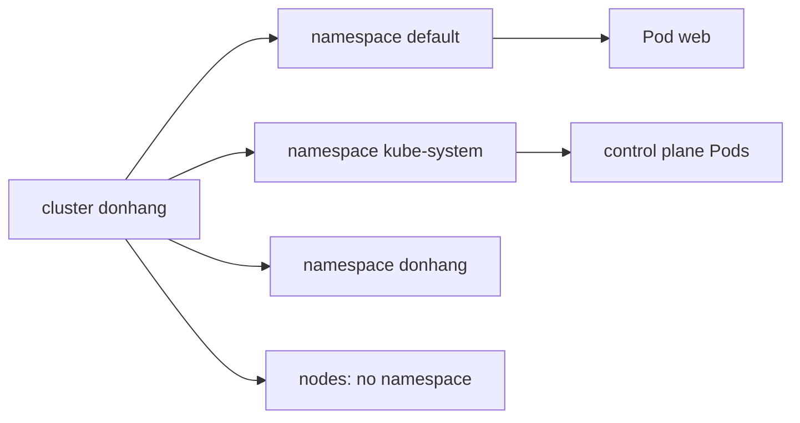

## Before you start

- [[k8s.l1.manifests-and-kubectl-apply]] — you know `kubectl apply -f deploy/k8s/lessons/web-pod.yaml` created a Pod named `web`, and that its manifest has no line saying where in the cluster it goes.

## The situation

The `web` Pod runs, and `kubectl get pods` lists it. But the cluster's control plane also runs as Pods on `donhang-control-plane`, and they appear nowhere in that list. Later in the track, Đơn Hàng's own `api` and `db` will run here too, and a teammate's experiment might also want a Pod called `web`. One cluster, many owners, one flat list of names would clash quickly. Where did `web` actually land, why can't you see the cluster's own Pods, and how can two things share a name?

## Core concepts

- **Kubernetes namespace** — a named area inside one cluster that groups objects; two objects of the same kind may share a name only when they are in different namespaces.
- `default` — the namespace a new kind cluster's kubectl context uses, so commands without `-n` work there.
- `kube-system` — the namespace where Kubernetes keeps its own components.
- Cluster-wide object — an object that belongs to no namespace, such as a node or a namespace itself.

## How it works



In the situation above, `web` landed in the namespace `default`. Its manifest names no namespace, so kubectl used the current context's namespace; `kind-donhang` sets none, and then kubectl falls back to `default`. Every kubectl command without `-n` works the same way: `kubectl get pods` lists the Pods of `default` only. That is why the control plane's Pods are missing. They live in `kube-system`, and `kubectl get pods -n kube-system` shows them.

A namespace is a set of names. Inside one namespace, two Pods cannot both be called `web`. In two different namespaces they can, and they are two unrelated objects. Đơn Hàng gets a namespace of its own, also called `donhang` like the cluster, which the script below creates. So `kubectl get pod web -n donhang` asks for a different object than `kubectl get pod web`, and fails if `donhang` has no `web`.

Not every object lives in a namespace. Nodes belong to the whole cluster, and so do namespaces themselves; a namespace cannot sit inside another. For such objects, `-n` changes nothing.

A namespace groups names. It is not a smaller cluster: it has no nodes of its own, and Pods from every namespace share the same worker nodes. On its own, it also does not wall off traffic or permissions. A Pod in one namespace can still reach a Pod in another over the network, and by itself a namespace does not limit who may change the objects inside it. Both of those need separate rules, which later stages cover.

## In the Đơn Hàng system

Đơn Hàng's own namespace:

```yaml file=deploy/k8s/namespace.yaml tag=stage-2 lines=1-7
# lesson: k8s.l1.namespaces
# Every object of Đơn Hàng's own lives in this namespace; each manifest under
# deploy/k8s/ says so in its metadata.
apiVersion: v1
kind: Namespace
metadata:
  name: donhang
```

A Namespace is an object like a Pod, declared in a manifest. It has a name, `donhang`, and nothing else. Đơn Hàng's own manifests under `deploy/k8s/` each put their objects there with `namespace: donhang` in their metadata; `lessons/web-pod.yaml` names none, which is why `web` is in `default`.

The script for this lesson:

```bash file=scripts/k8s/namespaces.sh tag=stage-2 lines=8-21
# The web Pod from scripts/k8s/apply-web-pod.sh must be there; and the
# namespace must not, so the apply below creates it.
kubectl apply -f deploy/k8s/lessons/web-pod.yaml >/dev/null
kubectl delete namespace donhang --ignore-not-found >/dev/null

# lesson: k8s.l1.namespaces
# Without -n, kubectl works in the current context's namespace: default.
show kubectl get pods
echo
show kubectl apply -f deploy/k8s/namespace.yaml
show kubectl get namespaces
echo
# The same name, looked up in another namespace, is another object.
show kubectl get pod web -n donhang || true
```

`show` prints each command before running it, and `|| true` lets the script finish without an error when the last command fails with `NotFound`. The script re-applies `web-pod.yaml` and deletes the `donhang` namespace first, so that the apply below really creates it. Deleting a namespace deletes everything inside it, which is why this script is for a cluster where nothing else lives in `donhang` yet. Its output:

```text output=true
$ kubectl get pods
NAME   READY   STATUS    RESTARTS   AGE
web    1/1     Running   0          ...

$ kubectl apply -f deploy/k8s/namespace.yaml
namespace/donhang created
$ kubectl get namespaces
NAME                 STATUS   AGE
default              Active   ...
donhang              Active   ...
kube-node-lease      Active   ...
kube-public          Active   ...
kube-system          Active   ...
local-path-storage   Active   ...

$ kubectl get pod web -n donhang
Error from server (NotFound): pods "web" not found
```

Without `-n`, `web` appears. The namespace list shows `donhang`, `kube-system` and the others a kind cluster starts with. The last command looks for `web` in `donhang` and gets `NotFound`: same name, different namespace, no such object. The `...` hides ages.

## Beginners often think…

- **"A namespace is a smaller cluster with its own nodes."** → Actually a namespace only groups object names; Pods from all namespaces run on the same nodes. You notice this when `kubectl get nodes -n donhang` lists the same three nodes as `kubectl get nodes`.
- **"Putting the app in its own namespace isolates it from everything else in the cluster."** → Actually a namespace alone neither blocks network traffic between Pods nor limits who can change what; both need separate rules. You notice this when a Pod in `default` can still reach a Pod in `donhang` by its IP address.
- **"`kubectl get pods` shows every Pod in the cluster."** → Actually it shows the Pods of one namespace, the current context's, which is `default` here. You notice this when it shows only `web`, while `kubectl get pods -n kube-system` lists more than ten Pods, the control plane's among them.

## Try it (3 minutes)

With the `donhang` cluster running and the `web` Pod applied, in the `don-hang` folder, in the shell you use for `kubectl`. Run `namespaces.sh` only now, while `donhang` holds nothing else, because it deletes that namespace first.

1. Run `scripts/k8s/namespaces.sh`.
2. Run `kubectl get pods -n kube-system`.
3. Run `kubectl get pods -A`. `-A` means all namespaces at once.

Expected result: step 1 matches the output above. Step 2 lists Pods such as `etcd-donhang-control-plane` and `kube-apiserver-donhang-control-plane`, control-plane Pods the next lesson explains, none of which `kubectl get pods` showed. Step 3 adds a `NAMESPACE` column, with `web` in `default` and the control plane's Pods in `kube-system`.

## Connections

- [[k8s.l1.manifests-and-kubectl-apply]] — the manifest from that lesson named no namespace; this lesson says where its Pod went.
- [[k8s.l1.kubectl-and-the-api-server]] — the kubeconfig context that picked the cluster can also pick a namespace; `kind-donhang` does not.
- [[k8s.l1.control-plane-components]] — next: the Pods in `kube-system`, one by one.
- [[k8s.l1.labels]] — another way to group objects, inside a namespace, used by everything in the workloads module.

## Five-line summary

1. A Kubernetes namespace groups objects in one cluster; objects of one kind share a name only across different namespaces.
2. Without `-n`, kubectl works in the current context's namespace, `default` here, which is where the `web` Pod went.
3. Đơn Hàng's objects live in `donhang`, declared by `deploy/k8s/namespace.yaml`; Kubernetes keeps its components in `kube-system`.
4. Nodes and namespaces belong to no namespace.
5. A namespace alone neither blocks traffic between Pods nor limits who changes what; that needs separate rules.
