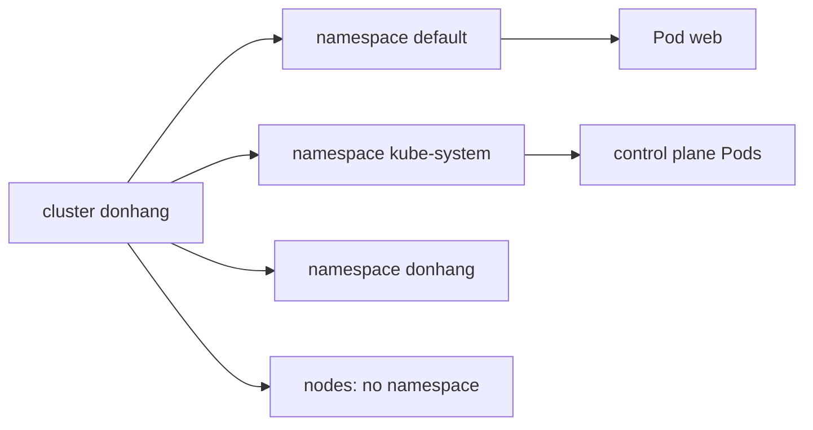

## Bạn cần biết trước

- [[k8s.l1.manifests-and-kubectl-apply]] — bạn biết `kubectl apply -f deploy/k8s/lessons/web-pod.yaml` đã tạo một Pod tên `web`, và manifest của nó không có dòng nào nói nó được đặt vào đâu trong cluster.

## Tình huống

Pod `web` đang chạy, và `kubectl get pods` liệt kê nó. Nhưng control plane của cluster cũng chạy dưới dạng Pod trên `donhang-control-plane`, vậy mà chúng không hề có trong danh sách đó. Về sau trong track, `api` và `db` của Đơn Hàng cũng sẽ chạy ở đây, và thử nghiệm của một đồng nghiệp có thể cũng muốn một Pod tên `web`. Một cluster, nhiều chủ, một danh sách tên phẳng thì sẽ sớm trùng nhau. Thực ra `web` đã nằm ở đâu, vì sao bạn không thấy các Pod của chính cluster, và làm sao hai thứ có thể trùng tên?

## Khái niệm cốt lõi

- **Kubernetes namespace** (vùng tên bên trong một cluster; object cùng loại chỉ trùng tên được khi khác namespace) — một vùng có tên bên trong một cluster, dùng để gom các object; hai object cùng loại chỉ được trùng tên khi chúng ở hai namespace khác nhau.
- `default` — namespace mà context kubectl của một cluster kind mới dùng, nên lệnh không có `-n` làm việc ở đó.
- `kube-system` — namespace nơi Kubernetes giữ các thành phần của chính nó.
- Object toàn cluster — object không thuộc namespace nào, như node hay chính các namespace.

## Cơ chế hoạt động



Trong tình huống trên, `web` đã nằm trong namespace `default`. Manifest của nó không ghi namespace nào, nên kubectl dùng namespace của context hiện tại; `kind-donhang` không đặt namespace nào, và khi đó kubectl lùi về `default`. Mọi lệnh kubectl không có `-n` đều chạy như vậy: `kubectl get pods` chỉ liệt kê Pod của `default`. Đó là lý do các Pod của control plane vắng mặt. Chúng nằm trong `kube-system`, và `kubectl get pods -n kube-system` sẽ hiện ra chúng.

Namespace là một tập tên. Trong một namespace, hai Pod không thể cùng tên `web`. Ở hai namespace khác nhau thì được, và đó là hai object không liên quan gì nhau. Đơn Hàng có namespace riêng, cũng tên `donhang` giống cluster, do script bên dưới tạo ra. Vì vậy `kubectl get pod web -n donhang` hỏi một object khác với `kubectl get pod web`, và báo lỗi nếu `donhang` không có `web`.

Không phải object nào cũng nằm trong namespace. Node thuộc về cả cluster, và chính các namespace cũng vậy; một namespace không thể nằm trong namespace khác. Với những object này, `-n` không thay đổi gì.

Namespace gom tên. Nó không phải một cluster nhỏ hơn: nó không có node riêng, và Pod của mọi namespace dùng chung các worker node. Tự nó cũng không ngăn lưu lượng hay quyền. Pod ở namespace này vẫn tới được Pod ở namespace khác qua mạng, và tự namespace không giới hạn ai được thay đổi các object bên trong nó. Cả hai việc đó cần những quy tắc riêng, các giai đoạn sau sẽ học.

## Trong hệ thống Đơn Hàng

Namespace riêng của Đơn Hàng:

```yaml file=deploy/k8s/namespace.yaml tag=stage-2 lines=1-7
# lesson: k8s.l1.namespaces
# Every object of Đơn Hàng's own lives in this namespace; each manifest under
# deploy/k8s/ says so in its metadata.
apiVersion: v1
kind: Namespace
metadata:
  name: donhang
```

Namespace là một object giống như Pod, được khai báo trong một manifest. Nó có một cái tên, `donhang`, và không gì khác. Các manifest riêng của Đơn Hàng dưới `deploy/k8s/` đều đặt object của mình vào đó bằng `namespace: donhang` trong metadata; `lessons/web-pod.yaml` thì không ghi namespace nào, nên `web` mới nằm trong `default`.

Script của bài này:

```bash file=scripts/k8s/namespaces.sh tag=stage-2 lines=8-21
# The web Pod from scripts/k8s/apply-web-pod.sh must be there; and the
# namespace must not, so the apply below creates it.
kubectl apply -f deploy/k8s/lessons/web-pod.yaml >/dev/null
kubectl delete namespace donhang --ignore-not-found >/dev/null

# lesson: k8s.l1.namespaces
# Without -n, kubectl works in the current context's namespace: default.
show kubectl get pods
echo
show kubectl apply -f deploy/k8s/namespace.yaml
show kubectl get namespaces
echo
# The same name, looked up in another namespace, is another object.
show kubectl get pod web -n donhang || true
```

`show` in mỗi lệnh trước khi chạy, còn `|| true` cho script kết thúc mà không báo lỗi khi lệnh cuối thất bại với `NotFound`. Script apply lại `web-pod.yaml` và xóa namespace `donhang` trước, để lần apply bên dưới thật sự tạo ra nó. Xóa một namespace là xóa mọi thứ bên trong, nên script này dành cho cluster mà trong `donhang` chưa có gì khác. Output của nó:

```text output=true
$ kubectl get pods
NAME   READY   STATUS    RESTARTS   AGE
web    1/1     Running   0          ...

$ kubectl apply -f deploy/k8s/namespace.yaml
namespace/donhang created
$ kubectl get namespaces
NAME                 STATUS   AGE
default              Active   ...
donhang              Active   ...
kube-node-lease      Active   ...
kube-public          Active   ...
kube-system          Active   ...
local-path-storage   Active   ...

$ kubectl get pod web -n donhang
Error from server (NotFound): pods "web" not found
```

Không có `-n`, `web` hiện ra. Danh sách namespace có `donhang`, `kube-system` và các namespace khác mà một cluster kind có sẵn khi khởi tạo. Lệnh cuối tìm `web` trong `donhang` và nhận `NotFound`: cùng tên, khác namespace, không có object đó. Dấu `...` che tuổi.

## Người mới hay nghĩ rằng…

- **"Namespace là một cluster nhỏ hơn với node riêng."** → Thực ra namespace chỉ gom tên object; Pod của mọi namespace chạy trên cùng các node. Bạn sẽ nhận ra khi `kubectl get nodes -n donhang` liệt kê đúng ba node như `kubectl get nodes`.
- **"Đặt app vào namespace riêng là cách ly nó khỏi mọi thứ khác trong cluster."** → Thực ra namespace một mình không chặn lưu lượng mạng giữa các Pod, cũng không giới hạn ai được thay đổi gì; cả hai cần quy tắc riêng. Bạn sẽ nhận ra khi một Pod trong `default` vẫn tới được Pod trong `donhang` bằng địa chỉ IP.
- **"`kubectl get pods` hiện mọi Pod trong cluster."** → Thực ra nó chỉ hiện Pod của một namespace, namespace của context hiện tại, ở đây là `default`. Bạn sẽ nhận ra khi nó chỉ hiện `web`, trong khi `kubectl get pods -n kube-system` liệt kê hơn mười Pod, trong đó có các Pod của control plane.

## Thử ngay (3 phút)

Khi cluster `donhang` đang chạy và Pod `web` đã được apply, ở thư mục `don-hang`, trong shell bạn dùng cho `kubectl`. Chỉ chạy `namespaces.sh` vào lúc này, khi `donhang` chưa chứa gì khác, vì nó xóa namespace đó trước.

1. Chạy `scripts/k8s/namespaces.sh`.
2. Chạy `kubectl get pods -n kube-system`.
3. Chạy `kubectl get pods -A`. `-A` nghĩa là mọi namespace cùng lúc.

Kết quả mong đợi: bước 1 khớp với output ở trên. Bước 2 liệt kê các Pod như `etcd-donhang-control-plane` và `kube-apiserver-donhang-control-plane`, các Pod control plane mà bài sau sẽ giải thích, không cái nào xuất hiện trong `kubectl get pods`. Bước 3 thêm cột `NAMESPACE`, với `web` trong `default` và các Pod của control plane trong `kube-system`.

## Liên hệ

- [[k8s.l1.manifests-and-kubectl-apply]] — manifest ở bài đó không ghi namespace; bài này cho biết Pod của nó đã đi đâu.
- [[k8s.l1.kubectl-and-the-api-server]] — context trong kubeconfig đã chọn cluster thì cũng chọn được namespace; `kind-donhang` thì không chọn.
- [[k8s.l1.control-plane-components]] — bài tiếp theo: từng Pod trong `kube-system`.
- [[k8s.l1.labels]] — kiểu gom object khác, bên trong một namespace, được mọi thứ trong module workloads dùng tới.

## Tóm tắt 5 dòng

1. Kubernetes namespace gom các object trong một cluster; object cùng loại chỉ trùng tên được khi ở các namespace khác nhau.
2. Không có `-n`, kubectl làm việc trong namespace của context hiện tại, ở đây là `default`, nơi Pod `web` đã vào.
3. Object của Đơn Hàng nằm trong `donhang`, do `deploy/k8s/namespace.yaml` khai báo; Kubernetes giữ thành phần của nó trong `kube-system`.
4. Node và namespace không thuộc namespace nào.
5. Namespace một mình không chặn lưu lượng giữa các Pod, cũng không giới hạn ai thay đổi gì; việc đó cần quy tắc riêng.
