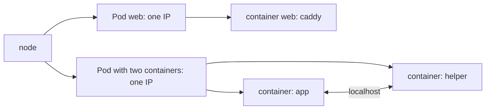

## Before you start

- [[k8s.l1.kubectl-and-the-api-server]] — you know kubectl sends your requests to the API server of the `donhang` cluster.
- [[devops.l1.docker-networks]] — you know each Compose service got its own address on the `donhang` network, such as `db` at `172.28.0.11`.

## The situation

You want Đơn Hàng's first thing to run on the cluster to be simple: the `web` service, Caddy from `caddy:2.10.0`, the same image Compose runs. In Compose you would write a service with an `image:` line. You open `deploy/k8s/lessons/web-pod.yaml` expecting a "container" or a "service", and find `kind: Pod` instead, with the container listed one level down, under `containers:`. The word is plural, although there is only one. Why does Kubernetes wrap even a single container in something else, and what does that wrapper decide?

## Core concepts

- **Pod** — the smallest unit Kubernetes runs: one or more containers that always run together, on the same node, sharing one network address.
- Pod IP — the address a Pod gets inside the cluster; every container in the Pod uses it, and each Pod you create gets its own, while a few of Kubernetes' own Pods use their node's address instead.
- `localhost` inside a Pod — the Pod's own network, shared by all its containers, so one container reaches another on `localhost` and a port.

## How it works



In the situation above, the wrapper is a Pod. Kubernetes never places a container on a node by itself. It places a Pod, and every container listed in that Pod starts on the same node, together. A Pod is also replaced as a whole, for example when a new version is deployed, and running more copies of a service means running more Pods, each with all its containers.

The Pod also decides the network. All containers in one Pod share one network address and one set of ports, so they must agree on who uses which port. In the diagram, the app and the helper in the second Pod talk over `localhost`, as two programs on one machine would. Each Pod you create in this track gets its own IP address inside the cluster.

Compose gave out addresses per service: `db` got `172.28.0.11` and `api` `172.28.0.13`. So a Compose service maps to a Pod: the address belongs to the Pod, not to each container in it. One Compose setting already behaves like a Pod: `web` has `network_mode: "service:lab"`, which puts it on the address of `lab`, the lab box's service, so `localhost` means the same in both.

So most Pods hold one container, like `web`. Containers in one Pod can also share a folder, a volume as in Compose, so one reads what the other writes. A second container belongs in the Pod only when it must share the network or files like that. An app and its database do not qualify: they talk over the network anyway, and each must be copied and replaced on its own.

## In the Đơn Hàng system

The Pod for Caddy:

```yaml file=deploy/k8s/lessons/web-pod.yaml tag=stage-2 lines=1-15
# lesson: k8s.l1.pods
# lesson: k8s.l1.manifests-and-kubectl-apply
# One Pod, one container: Caddy, the image the web service in
# docker-compose.yml uses, serving its built-in welcome page on port 80.
# There is no namespace field, so it goes to the current context's namespace.
apiVersion: v1
kind: Pod
metadata:
  name: web
spec:
  containers:
    - name: web
      image: caddy:2.10.0
      ports:
        - containerPort: 80
```

`apiVersion: v1` names the version of the Kubernetes API this object belongs to, and `kind: Pod` says what type of object it is. `metadata.name` gives it the name `web`, and `spec` holds what you want the Pod to be. Under `spec`, `containers:` is a list; this Pod has one entry, also named `web`, running `caddy:2.10.0`, the image of the `web` service in `docker-compose.yml`. `containerPort: 80` records the port Caddy listens on inside the Pod, where it serves Caddy's built-in welcome page.

There is no address in the file. The Pod's IP is assigned when the Pod is set up, from the cluster's own range of Pod addresses. In the `donhang` cluster, programs on your laptop cannot use it directly, and a Pod that replaces this one should not be expected to get the same address. Two comment lines point ahead: `# lesson: k8s.l1.manifests-and-kubectl-apply`, the next lesson, sends this file to the cluster, and the namespace line can be ignored until the lesson on namespaces.

## Beginners often think…

- **"A Pod is just Kubernetes' name for a container."** → Actually a Pod is a wrapper around one or more containers that share a node and one network address; Kubernetes stores and places Pods, not containers. You notice this when `kubectl explain pod.spec.containers`, a command that describes a field (see Try it), describes `containers` as a list, and the Pod, not a container, has the IP address.
- **"The api and its database should share one Pod so they can talk over localhost."** → Actually containers in one Pod start, stop and are replaced together, so a second copy of `api` would bring a second, empty database with it. You notice this when you need two copies of `api`: each Pod copy would carry its own database, with its own data.
- **"Each container in a Pod gets its own IP address, like each service in Compose."** → Actually all containers in a Pod share one address, and each Pod gets its own; one Compose service corresponds to one Pod. You notice this when `kubectl explain pod.status.podIP` describes one address for the whole Pod, and the fields of a container include no address of their own.

## Try it (3 minutes)

With the `donhang` cluster running, in the same shell you used for `kubectl` before:

1. Run `kubectl explain pod.spec.containers | head -10`.
2. Run `kubectl explain pod.status.podIP`.

Expected result: step 1 shows `FIELD: containers <[]Container>`, where `[]` marks a list, and the description says "There must be at least one container in a Pod". Step 2 describes `podIP` as the "address allocated to the pod", with no address per container. `kubectl explain` asks the API server to describe a field; it creates nothing.

## Connections

- [[k8s.l1.kubectl-and-the-api-server]] — the API server stores Pods; this lesson says what one holds.
- [[devops.l1.docker-networks]] — the Compose network gave each service an address; in Kubernetes each Pod gets one.
- [[k8s.l1.manifests-and-kubectl-apply]] — next: sending `web-pod.yaml` to the cluster.
- [[k8s.l1.service-and-dns]] — the fix for a Pod's address changing: a stable name in front of Pods.

## Five-line summary

1. A Pod is the smallest unit Kubernetes runs: one or more containers that always run together on the same node.
2. Containers in one Pod share one IP address and reach each other on `localhost`.
3. Each Pod you create gets its own IP address inside the cluster, as `db` and `api` each had their own address in Compose.
4. `web-pod.yaml` describes a Pod named `web` with one container from `caddy:2.10.0`, Compose's `web` image.
5. Most Pods hold one container; add a second only when it must share the Pod's network or files.
