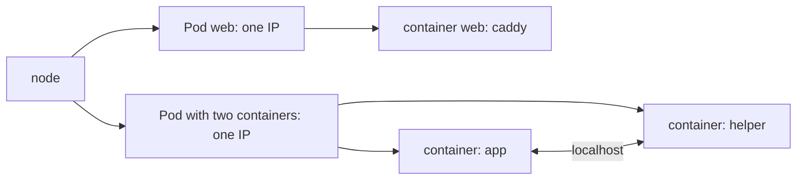

## Bạn cần biết trước

- [[k8s.l1.kubectl-and-the-api-server]] — bạn biết kubectl gửi request của bạn tới API server của cluster `donhang`.
- [[devops.l1.docker-networks]] — bạn biết mỗi service Compose có địa chỉ riêng trên network `donhang`, như `db` ở `172.28.0.11`.

## Tình huống

Bạn muốn thứ đầu tiên của Đơn Hàng chạy trên cluster thật đơn giản: service `web`, tức Caddy từ `caddy:2.10.0`, đúng image mà Compose đang chạy. Với Compose, bạn sẽ viết một service có dòng `image:`. Bạn mở `deploy/k8s/lessons/web-pod.yaml`, chờ đợi chữ "container" hay "service", nhưng lại thấy `kind: Pod`, còn container nằm thấp hơn một cấp, dưới `containers:`. Chữ đó ở số nhiều, dù chỉ có một container. Vì sao Kubernetes bọc cả một container đơn lẻ vào một thứ khác, và lớp bọc đó quyết định điều gì?

## Khái niệm cốt lõi

- **Pod** (đơn vị nhỏ nhất Kubernetes chạy: một hoặc vài container luôn chạy cùng nhau trên một node) — đơn vị nhỏ nhất Kubernetes chạy: một hoặc vài container luôn chạy cùng nhau, trên cùng một node, dùng chung một địa chỉ mạng.
- Pod IP — địa chỉ mà một Pod nhận được bên trong cluster; mọi container trong Pod dùng nó, và mỗi Pod bạn tạo có địa chỉ riêng, trong khi vài Pod của chính Kubernetes dùng địa chỉ của node.
- `localhost` bên trong Pod — mạng riêng của Pod, mọi container trong đó dùng chung, nên container này tới container kia bằng `localhost` và một cổng.

## Cơ chế hoạt động



Trong tình huống trên, lớp bọc đó là Pod. Kubernetes không bao giờ đặt riêng một container lên node. Nó đặt một Pod, và mọi container liệt kê trong Pod đó khởi động cùng nhau trên cùng một node. Pod cũng bị thay nguyên khối, chẳng hạn khi deploy phiên bản mới, và chạy thêm bản của một service nghĩa là chạy thêm Pod, mỗi Pod mang đủ các container của nó.

Pod cũng quyết định chuyện mạng. Mọi container trong một Pod dùng chung một địa chỉ mạng và một bộ cổng, nên chúng phải thống nhất ai dùng cổng nào. Trong sơ đồ, app và helper trong Pod thứ hai nói chuyện qua `localhost`, như hai chương trình trên cùng một máy. Mỗi Pod bạn tạo trong track này có IP riêng bên trong cluster.

Compose cấp địa chỉ theo từng service: `db` nhận `172.28.0.11`, còn `api` nhận `172.28.0.13`. Vậy một service Compose tương ứng với một Pod: địa chỉ thuộc về Pod, không thuộc về từng container bên trong. Có một thiết lập Compose vốn đã hoạt động giống Pod: `web` có `network_mode: "service:lab"`, đặt nó lên địa chỉ của `lab`, service của lab box, nên `localhost` ở hai bên mang cùng một nghĩa.

Phần lớn Pod chỉ chứa một container, như `web`. Các container trong một Pod còn có thể dùng chung một thư mục, một volume như trong Compose, để container này đọc thứ container kia ghi. Container thứ hai chỉ nên vào Pod khi nó phải dùng chung mạng hoặc file như vậy. Một app và database của nó không thuộc trường hợp này: chúng vốn nói chuyện qua mạng, và mỗi bên phải được nhân bản, được thay thế theo nhịp riêng.

## Trong hệ thống Đơn Hàng

Pod cho Caddy:

```yaml file=deploy/k8s/lessons/web-pod.yaml tag=stage-2 lines=1-15
# lesson: k8s.l1.pods
# lesson: k8s.l1.manifests-and-kubectl-apply
# One Pod, one container: Caddy, the image the web service in
# docker-compose.yml uses, serving its built-in welcome page on port 80.
# There is no namespace field, so it goes to the current context's namespace.
apiVersion: v1
kind: Pod
metadata:
  name: web
spec:
  containers:
    - name: web
      image: caddy:2.10.0
      ports:
        - containerPort: 80
```

`apiVersion: v1` cho biết phiên bản Kubernetes API mà object này thuộc về, còn `kind: Pod` cho biết đây là loại object nào. `metadata.name` đặt tên nó là `web`, và `spec` chứa điều bạn muốn Pod trở thành. Dưới `spec`, `containers:` là một danh sách; Pod này có một phần tử, cũng tên `web`, chạy `caddy:2.10.0`, image của service `web` trong `docker-compose.yml`. `containerPort: 80` ghi lại cổng Caddy lắng nghe bên trong Pod, nơi nó phục vụ trang chào mừng có sẵn của Caddy.

Trong file không có địa chỉ nào. IP của Pod được cấp khi Pod được dựng, từ dải địa chỉ Pod riêng của cluster. Trong cluster `donhang`, chương trình trên laptop của bạn không dùng trực tiếp được địa chỉ đó, và đừng trông đợi một Pod thay thế cho Pod này sẽ nhận lại đúng địa chỉ cũ. Hai dòng comment trỏ tới các bài sau: `# lesson: k8s.l1.manifests-and-kubectl-apply` là bài tiếp theo, nơi file này được gửi lên cluster, còn dòng về namespace thì cứ bỏ qua cho tới bài namespace.

## Người mới hay nghĩ rằng…

- **"Pod chỉ là cách Kubernetes gọi một container."** → Thực ra Pod là lớp bọc quanh một hoặc vài container dùng chung một node và một địa chỉ mạng; Kubernetes lưu và đặt Pod, không đặt container. Bạn sẽ nhận ra khi `kubectl explain pod.spec.containers`, lệnh mô tả một field (xem phần Thử ngay), mô tả `containers` là một danh sách, và chính Pod, không phải container, mới có địa chỉ IP.
- **"api và database nên chung một Pod để nói chuyện qua localhost."** → Thực ra các container trong một Pod cùng khởi động, cùng dừng, cùng bị thay, nên bản `api` thứ hai sẽ kéo theo một database thứ hai, trống trơn. Bạn sẽ nhận ra khi cần hai bản `api`: mỗi bản Pod lại mang database riêng, với dữ liệu riêng.
- **"Mỗi container trong Pod có IP riêng, như mỗi service trong Compose."** → Thực ra mọi container trong một Pod dùng chung một địa chỉ, và mỗi Pod có địa chỉ riêng; một service Compose tương ứng với một Pod. Bạn sẽ nhận ra khi `kubectl explain pod.status.podIP` mô tả một địa chỉ cho cả Pod, còn các field của container không có địa chỉ nào của riêng nó.

## Thử ngay (3 phút)

Khi cluster `donhang` đang chạy, trong shell bạn đã dùng cho `kubectl` trước đó:

1. Chạy `kubectl explain pod.spec.containers | head -10`.
2. Chạy `kubectl explain pod.status.podIP`.

Kết quả mong đợi: bước 1 hiện `FIELD: containers <[]Container>`, trong đó `[]` đánh dấu một danh sách, và phần mô tả ghi "There must be at least one container in a Pod". Bước 2 mô tả `podIP` là "address allocated to the pod", không có địa chỉ cho từng container. `kubectl explain` nhờ API server mô tả một field; lệnh này không tạo ra gì.

## Liên hệ

- [[k8s.l1.kubectl-and-the-api-server]] — API server lưu các Pod; bài này nói một Pod chứa những gì.
- [[devops.l1.docker-networks]] — network của Compose cấp cho mỗi service một địa chỉ; trong Kubernetes, mỗi Pod nhận một địa chỉ.
- [[k8s.l1.manifests-and-kubectl-apply]] — bài tiếp theo: gửi `web-pod.yaml` lên cluster.
- [[k8s.l1.service-and-dns]] — lời giải cho việc địa chỉ Pod thay đổi: một cái tên ổn định đứng trước các Pod.

## Tóm tắt 5 dòng

1. Pod là đơn vị nhỏ nhất Kubernetes chạy: một hoặc vài container luôn chạy cùng nhau trên cùng một node.
2. Các container trong một Pod dùng chung một địa chỉ IP và tới nhau qua `localhost`.
3. Mỗi Pod bạn tạo có địa chỉ IP riêng trong cluster, như `db` và `api` từng có địa chỉ riêng trong Compose.
4. `web-pod.yaml` mô tả một Pod tên `web` với một container từ `caddy:2.10.0`, image `web` của Compose.
5. Phần lớn Pod chỉ chứa một container; chỉ thêm container thứ hai khi nó phải dùng chung mạng hoặc file của Pod.
