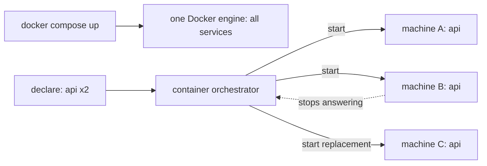

## Before you start

- [[devops.l1.compose-for-the-api]] — you know `docker-compose.yml` declares Đơn Hàng's services and `docker compose up` starts them.
- [[devops.l2.deployment-environments]] — you know a deploy puts a checked build somewhere real, beyond your own laptop.
- [[devops.l2.container-registry]] — you know a machine runs an image it did not build only after pulling it from a registry.

## The situation

Your team runs the stage-1 lab on a spare office server for a week of user tests, started once with `scripts/up.sh`, the script that runs `docker compose up` for every Đơn Hàng service. On Wednesday night the server reboots for an update. By morning `web`, `db` and `api` are all stopped, and orders stop until someone starts the lab again. A teammate suggests a second server, so that one machine going away no longer stops `api`. You open `docker-compose.yml` to add it, and find no line that names a machine. What kind of tool keeps containers running across several machines, and why is Compose not that tool?

## Core concepts

- **container orchestrator** — a system that runs containers across a group of machines: you declare what should run, and it picks the machines and keeps it running.
- **Kubernetes** — the open-source container orchestrator this track uses; it runs the same images that Docker builds.
- Docker engine — the program on one machine that runs that machine's containers; `docker compose up` sends all its work to exactly one engine.
- Restart policy — a per-container setting, the `restart:` key in a Compose file, that tells the engine on that same machine to start a stopped container again.

## How it works



The top line is what you have. In the situation above, `docker compose up` read `docker-compose.yml` and handed every service to the Docker engine of the office server. All of Đơn Hàng's containers lived on that one machine, so the reboot stopped them together.

Nothing in `docker-compose.yml` chooses a machine, and `docker compose up` cannot spread copies of `api` over several engines. A second server would need its own copy of the files and its own `scripts/up.sh`, started and watched by a person. Nothing would notice that one of them had gone quiet.

Even on one machine, Compose restarts nothing by default. The default restart policy is `no`, and `docker-compose.yml` sets none. With `restart: always`, the engine would start `api` again after a crash, and after a reboot once the engine itself runs again, but only on that same machine. When the machine itself is gone, there is nowhere left to restart it.

The bottom of the diagram is a container orchestrator. You do not tell it which machine runs `api`; you declare that two copies of `api` should run. It chooses machines A and B. When machine B stops answering, it notices the gap between what you declared and what runs, and starts a replacement on machine C. The work of watching and restarting moves from a person into the system.

Kubernetes is the orchestrator this track uses. It does not replace your images. It pulls the same images Docker builds from a registry and runs them. What it adds is the group of machines and the watching.

## In the Đơn Hàng system

The `api` service at stage-1:

```yaml file=docker-compose.yml tag=stage-1 lines=81-99
  # lesson: devops.l1.compose-for-the-api
  api:
    build:
      context: .
      dockerfile: DonHang.Api/Dockerfile
    image: donhang-api:stage-1
    container_name: donhang-api
    hostname: api
    environment:
      # lesson: devops.l1.config-and-env
      ConnectionStrings__Default: "Host=db;Database=donhang;Username=donhang;Password=${POSTGRES_PASSWORD}"
      Jwt__SigningKey: "${JWT_SIGNING_KEY}"
      ASPNETCORE_ENVIRONMENT: "Development"
    depends_on:
      db:
        condition: service_healthy
    networks:
      donhang:
        ipv4_address: 172.28.0.13
```

Look for what is missing. No line says which machine runs `api`, and there is no `restart:` key. Two lines tie `api` to one copy on one engine. `container_name: donhang-api` gives the container a fixed name, and Compose refuses to run more than one container of a service when that key is set. `ipv4_address` fixes its address on the `donhang` network, which exists on one engine only. Every other service in the file also has a `container_name`.

The `image:` line is what carries over to Kubernetes. The `web` service's `caddy:2.10.0` and `db`'s `postgres:17.6-alpine` already come from Docker Hub. `donhang-api:stage-1` would first have to be pushed to a registry that every machine can reach, as in the registry lesson; the image itself would not change.

Whether to move at all depends on the situation. Kubernetes adds parts you have to learn and run. When one small system on one machine is enough, and a few minutes of downtime during a reboot is acceptable, Compose can stay. The orchestrator pays off once several machines, or several copies of a service, must be kept running without a person watching.

## Beginners often think…

- **"Compose already restarts crashed containers, so it does the same job as Kubernetes."** → Actually Compose restarts nothing unless a service sets a restart policy, and even then the engine restarts the container on the same machine only. You notice this when a server reboot or power cut takes every `donhang-` container down at once and nothing starts them elsewhere.
- **"Kubernetes replaces Docker, so images have to be built differently to run on it."** → Actually Kubernetes runs the images Docker builds, pulled from a registry; your `Dockerfile` stays as it is. You notice this when you see that `docker-compose.yml` pulls `caddy:2.10.0` from Docker Hub, the same registry any machine can pull it from, with or without Compose.
- **"Any app that runs in containers should run on Kubernetes."** → Actually an orchestrator usually pays for its extra parts when several machines or copies must be kept running. You notice this when a small internal tool on one server ends up with more setup to maintain than code.

## Try it (3 minutes)

In a terminal, in the `don-hang` repository folder, read the file as it is at stage-1:

1. Run `git show stage-1:docker-compose.yml | grep -n "container_name:"`.
2. Run `git show stage-1:docker-compose.yml | grep -c "restart:"`.
3. Now imagine the machine running the lab shuts down. Which of those containers keep running, and what would someone do by hand to run `api` on a second machine?

Expected result: step 1 prints five lines, one fixed name per service: `donhang-lab`, `donhang-web`, `donhang-db`, `donhang-api` and `donhang-app-web`. Step 2 prints `0`: no service has a restart policy.

<details><summary>Suggested answer</summary>

None keep running: every container lives on the one engine of that machine. To run `api` elsewhere, someone would copy the repository and the secrets to the second machine, make the image reachable there, run `scripts/up.sh`, and then watch both machines. A container orchestrator does that choosing and watching itself.

</details>

## Connections

- [[devops.l1.compose-for-the-api]] — the one-machine starting point: this lesson names what Compose cannot do.
- [[devops.l2.container-registry]] — prerequisite for any orchestrator: every machine pulls the same images from a registry.
- [[devops.l2.deployment-environments]] — the deploy target there was one throwaway runner; an orchestrator deploys to a group of machines.
- [[k8s.l1.cluster-nodes-and-control-plane]] — next: what that group of machines is made of in Kubernetes.

## Five-line summary

1. Compose runs every service on one Docker engine; a container orchestrator runs containers across a group of machines and keeps them running.
2. When the one machine running `docker compose up` stops, every Đơn Hàng container stops with it.
3. A restart policy restarts a container on the same machine only, and `docker-compose.yml` sets none.
4. Kubernetes is the orchestrator this track uses; it runs the same images Docker builds, pulled from a registry.
5. The orchestrator pays off when several machines or copies must keep running; one small service on one machine can stay on Compose.
