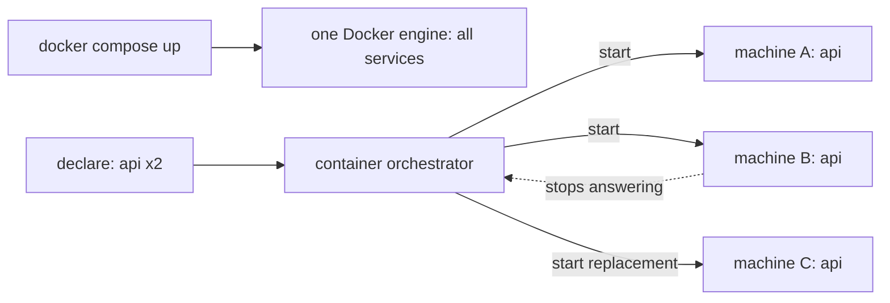

## Bạn cần biết trước

- [[devops.l1.compose-for-the-api]] — bạn biết `docker-compose.yml` khai báo các service của Đơn Hàng và `docker compose up` khởi động chúng.
- [[devops.l2.deployment-environments]] — bạn biết một lần deploy đưa bản build đã kiểm tới một nơi thật, ngoài laptop của bạn.
- [[devops.l2.container-registry]] — bạn biết một máy chỉ chạy được image nó không tự build sau khi pull image đó từ registry.

## Tình huống

Nhóm bạn chạy lab stage-1 trên một server dự phòng ở văn phòng trong một tuần thử nghiệm với người dùng, khởi động một lần bằng `scripts/up.sh`, script chạy `docker compose up` cho mọi service của Đơn Hàng. Đêm thứ Tư, server khởi động lại để cập nhật. Sáng ra, `web`, `db` và `api` đều đã dừng, và đơn hàng ngừng nhận cho tới khi có người khởi động lại lab. Một đồng nghiệp đề xuất thêm server thứ hai, để một máy mất đi không còn kéo `api` dừng theo. Bạn mở `docker-compose.yml` để thêm vào, và không thấy dòng nào chỉ định máy. Loại công cụ nào giữ container chạy trên nhiều máy, và vì sao Compose không phải là công cụ đó?

## Khái niệm cốt lõi

- **bộ điều phối container** (container orchestrator) — hệ thống chạy container trên một nhóm máy: bạn khai báo thứ phải chạy, nó chọn máy và giữ cho thứ đó luôn chạy.
- **Kubernetes** (container orchestrator mã nguồn mở: cluster chạy những container mà manifest khai báo) — bộ điều phối container mã nguồn mở mà track này dùng; nó chạy chính những image do Docker build.
- Docker engine — chương trình trên một máy, chạy các container của máy đó; `docker compose up` giao toàn bộ việc cho đúng một engine.
- Restart policy — thiết lập riêng cho từng container, là key `restart:` trong file Compose, bảo engine trên chính máy đó khởi động lại container đã dừng.

## Cơ chế hoạt động



Dòng trên cùng là thứ bạn đang có. Trong tình huống trên, `docker compose up` đọc `docker-compose.yml` và giao mọi service cho Docker engine của server văn phòng. Mọi container của Đơn Hàng nằm trên đúng máy đó, nên lần khởi động lại làm chúng dừng cùng lúc.

Không gì trong `docker-compose.yml` chọn máy, và `docker compose up` không thể rải các bản `api` ra nhiều engine. Server thứ hai sẽ cần bản sao riêng của các file và lần chạy `scripts/up.sh` riêng, do một người khởi động và theo dõi. Không gì nhận ra khi một trong hai máy im lặng.

Ngay trên một máy, mặc định Compose cũng không khởi động lại gì. Restart policy mặc định là `no`, và `docker-compose.yml` không đặt policy nào. Với `restart: always`, engine sẽ khởi động lại `api` sau khi crash, và sau khi reboot, lúc chính engine đã chạy lại, nhưng chỉ trên đúng máy đó. Khi chính cái máy mất đi, không còn nơi nào để khởi động lại.

Phần dưới của sơ đồ là một bộ điều phối container. Bạn không nói cho nó máy nào chạy `api`; bạn khai báo rằng phải có hai bản `api` chạy. Nó chọn máy A và B. Khi máy B ngừng trả lời, nó nhận ra khoảng chênh giữa điều bạn khai báo và thứ đang chạy, rồi khởi động bản thay thế trên máy C. Phần theo dõi và khởi động lại chuyển từ con người sang hệ thống.

Kubernetes là bộ điều phối mà track này dùng. Nó không thay image của bạn. Nó pull chính những image Docker build từ registry và chạy chúng. Thứ nó thêm vào là nhóm máy và phần theo dõi.

## Trong hệ thống Đơn Hàng

Service `api` ở stage-1:

```yaml file=docker-compose.yml tag=stage-1 lines=81-99
  # lesson: devops.l1.compose-for-the-api
  api:
    build:
      context: .
      dockerfile: DonHang.Api/Dockerfile
    image: donhang-api:stage-1
    container_name: donhang-api
    hostname: api
    environment:
      # lesson: devops.l1.config-and-env
      ConnectionStrings__Default: "Host=db;Database=donhang;Username=donhang;Password=${POSTGRES_PASSWORD}"
      Jwt__SigningKey: "${JWT_SIGNING_KEY}"
      ASPNETCORE_ENVIRONMENT: "Development"
    depends_on:
      db:
        condition: service_healthy
    networks:
      donhang:
        ipv4_address: 172.28.0.13
```

Hãy tìm thứ còn thiếu. Không dòng nào nói máy nào chạy `api`, và không có key `restart:`. Hai dòng buộc `api` vào một bản trên một engine. `container_name: donhang-api` đặt cho container một tên cố định, và Compose từ chối chạy quá một container cho service khi key này có mặt. `ipv4_address` cố định địa chỉ của nó trên network `donhang`, network chỉ tồn tại trên một engine. Mọi service khác trong file cũng có `container_name`.

Dòng `image:` là phần mang được sang Kubernetes. `caddy:2.10.0` của service `web` và `postgres:17.6-alpine` của `db` vốn đã đến từ Docker Hub. Còn `donhang-api:stage-1` trước hết phải được push lên một registry mà mọi máy truy cập được, như trong bài về registry; bản thân image không đổi.

Có nên chuyển hay không còn tùy tình huống. Kubernetes thêm những thành phần bạn phải học và vận hành. Khi một hệ nhỏ trên một máy là đủ, và vài phút gián đoạn lúc reboot là chấp nhận được, Compose có thể ở lại. Bộ điều phối đáng giá khi nhiều máy, hoặc nhiều bản của một service, phải được giữ chạy mà không cần người canh.

## Người mới hay nghĩ rằng…

- **"Compose vốn đã khởi động lại container bị crash, nên nó làm cùng việc với Kubernetes."** → Thực ra Compose không khởi động lại gì trừ khi service đặt restart policy, và kể cả khi đó, engine cũng chỉ khởi động lại container trên chính máy đó. Bạn sẽ nhận ra khi một lần reboot hay mất điện làm mọi container `donhang-` dừng cùng lúc và không gì khởi động chúng ở nơi khác.
- **"Kubernetes thay thế Docker, nên image phải build theo cách khác mới chạy được trên nó."** → Thực ra Kubernetes chạy chính những image Docker build, pull từ registry; `Dockerfile` của bạn giữ nguyên. Bạn sẽ nhận ra khi thấy `docker-compose.yml` pull `caddy:2.10.0` từ Docker Hub, cũng là registry mà máy nào cũng pull được, dù có Compose hay không.
- **"App nào chạy trong container cũng nên chạy trên Kubernetes."** → Thực ra bộ điều phối thường chỉ đáng với những thành phần nó thêm vào khi nhiều máy hoặc nhiều bản phải được giữ chạy. Bạn sẽ nhận ra khi một công cụ nội bộ nhỏ trên một server rốt cuộc có phần cài đặt phải bảo trì nhiều hơn cả code.

## Thử ngay (3 phút)

Trong terminal, ở thư mục repository `don-hang`, đọc file như nó ở stage-1:

1. Chạy `git show stage-1:docker-compose.yml | grep -n "container_name:"`.
2. Chạy `git show stage-1:docker-compose.yml | grep -c "restart:"`.
3. Giờ hãy hình dung máy đang chạy lab tắt đi. Container nào trong số đó còn chạy, và ai đó phải làm tay những gì để chạy `api` trên máy thứ hai?

Kết quả mong đợi: bước 1 in năm dòng, mỗi service một tên cố định: `donhang-lab`, `donhang-web`, `donhang-db`, `donhang-api` và `donhang-app-web`. Bước 2 in `0`: không service nào có restart policy.

<details><summary>Gợi ý đáp án</summary>

Không container nào còn chạy: mọi container đều nằm trên engine duy nhất của máy đó. Để chạy `api` ở nơi khác, ai đó phải chép repository và các secret sang máy thứ hai, làm cho máy đó lấy được image, chạy `scripts/up.sh`, rồi theo dõi cả hai máy. Bộ điều phối container tự làm phần chọn máy và theo dõi đó.

</details>

## Liên hệ

- [[devops.l1.compose-for-the-api]] — điểm xuất phát trên một máy: bài này gọi tên những gì Compose không làm được.
- [[devops.l2.container-registry]] — điều kiện tiên quyết cho mọi bộ điều phối: mọi máy pull cùng một image từ registry.
- [[devops.l2.deployment-environments]] — đích deploy ở bài đó là một runner dùng xong bỏ; bộ điều phối deploy lên cả một nhóm máy.
- [[k8s.l1.cluster-nodes-and-control-plane]] — bài tiếp theo: nhóm máy đó trong Kubernetes gồm những gì.

## Tóm tắt 5 dòng

1. Compose chạy mọi service trên một Docker engine; bộ điều phối container chạy container trên một nhóm máy và giữ chúng luôn chạy.
2. Khi máy duy nhất chạy `docker compose up` dừng, mọi container của Đơn Hàng dừng theo.
3. Restart policy chỉ khởi động lại container trên chính máy đó, và `docker-compose.yml` không đặt policy nào.
4. Kubernetes là bộ điều phối mà track này dùng; nó chạy chính những image Docker build, pull từ registry.
5. Bộ điều phối đáng giá khi nhiều máy hoặc nhiều bản phải luôn chạy; một service nhỏ trên một máy có thể ở lại với Compose.
