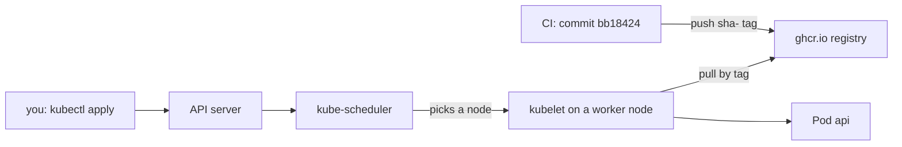

## Before you start

- [[k8s.l1.deployments]] — you know a Deployment runs a number of Pods from one Pod template, through a ReplicaSet.
- [[devops.l2.tagging-images-by-commit]] — you know CI pushes each api image as `sha-` plus the full commit id, so a running image leads back to its code.
- [[devops.l2.image-tags-and-digests]] — you know a tag is a movable label in a registry, and `latest` only means "last pushed there".

## The situation

So far the cluster has only run Caddy from Docker Hub, a public container registry. Now it is the api's turn. When you ran Đơn Hàng with Docker on your machine, `scripts/up.sh` built the api image there from `DonHang.Api/Dockerfile`. The cluster's nodes have no copy of the repository and no Dockerfile. What they can reach is GitHub Container Registry, where CI already pushed `ghcr.io/duyan11110/donhang-api` under a `sha-` tag for every push to `master` whose tests and image build passed. Where does a node get the api image from, and how can you be sure which build of the api is running?

## Core concepts

- **image pull policy** — the rule a node follows to decide whether to pull an image again from the registry or use the copy it already has, set per container as `imagePullPolicy`.
- `IfNotPresent` — pull only if the node has no image under that name and tag yet.
- `Always` — ask the registry every time a container starts which image the tag names now, and pull it if the node does not have it.

## How it works



In the situation above, nothing is built on the cluster. CI built the image once, from commit `bb18424`, and pushed it to the registry. The manifest names that image by registry, repository and tag. You send the manifest to the API server with `kubectl apply`, and kube-scheduler picks a worker node for each Pod. The kubelet on that node then pulls the image itself, straight from the registry. Đơn Hàng's image repository on GitHub Container Registry, which GitHub calls a package, is public, so anyone may pull it without signing in.

Whether the kubelet pulls at all depends on the image pull policy. Đơn Hàng's manifest sets no `imagePullPolicy`, so Kubernetes fills in a default when the Deployment is created, and the default depends on the tag. For a tag that is not `latest`, such as `sha-bb18…`, it is `IfNotPresent`: a node that already has an image under that tag starts it without asking the registry again.

For the tag `latest`, or for an image with no tag at all, the default becomes `Always`. The manifest then no longer says which build runs: the answer depends on what was pushed last, and when each Pod started. That is why Đơn Hàng's manifests never use `latest`. A `sha-` tag names one commit, so reading the manifest tells you which code runs, and going back means naming the previous tag.

A tag is read only when a container starts. So pushing again under the same tag does not update what already runs: running containers keep the image they started with, and a node that has the tag cached keeps using its copy. Only a node without it pulls the new image, so Pods can end up on different builds.

## In the Đơn Hàng system

The top of the api's Deployment:

```yaml file=deploy/k8s/lessons/api-deployment.yaml tag=stage-2 lines=3-27
# Two replicas of the api image CI pushed for commit bb18424 (the sha- tag
# names that commit). The node pulls it from GitHub Container Registry;
# nothing is built here. No imagePullPolicy: with a tag that is not latest
# it defaults to IfNotPresent.
apiVersion: apps/v1
kind: Deployment
metadata:
  name: api
  namespace: donhang
spec:
  replicas: 2
  selector:
    matchLabels:
      app: api
  template:
    metadata:
      labels:
        app: api
    spec:
      containers:
        - name: api
          image: ghcr.io/duyan11110/donhang-api:sha-bb184243e4cafed6ae833ca61710608366214aa5
          ports:
            - containerPort: 8080
          # Only settings that are not secret, enough for the api to start.
```

The `image` line carries the whole commit id. There is no `imagePullPolicy` line. The file continues with `env`, which sets four environment variables that are not secret. They hold a connection string for `db`, the text that tells the api which database to reach and how to log in, here without a password; the address of `redis`; and two Keycloak addresses, one of them through the Service name `keycloak`. That is enough for the api to start. Every request that needs PostgreSQL fails until the next module supplies the rest.

The script for this lesson:

```bash file=scripts/k8s/deploy-api.sh tag=stage-2 lines=16-37
# lesson: k8s.l1.deploying-an-image-tag
# The nodes the two Pods land on pull ghcr.io/duyan11110/donhang-api at the
# tag in the manifest; the package is public, so no credentials are needed.
show kubectl apply -f deploy/k8s/lessons/api-deployment.yaml
show kubectl wait --for=condition=Available deployment/api -n donhang --timeout=300s
show kubectl get deployment api -n donhang -o wide
show kubectl get pods -n donhang -l app=api
echo
# Not in the manifest, so Kubernetes filled in the default for a tag that is not latest.
echo "\$ kubectl get deployment api -n donhang -o jsonpath='{.spec.template.spec.containers[0].imagePullPolicy}'"
kubectl get deployment api -n donhang -o jsonpath='{.spec.template.spec.containers[0].imagePullPolicy}'
echo
echo

# The api started: its log says where it listens. (kubectl logs reads one
# of the Deployment's Pods and says which on stderr, left out here.)
for _ in $(seq 60); do
  kubectl logs deployment/api -n donhang 2>/dev/null | grep -q 'Now listening' && break
  sleep 1
done
echo "\$ kubectl logs deployment/api -n donhang | grep 'Now listening'"
kubectl logs deployment/api -n donhang 2>/dev/null | grep 'Now listening'
```

`show` prints a command before running it, and `kubectl wait` blocks until the Deployment reports its Pods available, or 300 seconds pass. The `-o jsonpath` query reads one field of the stored Deployment, the policy Kubernetes filled in. The loop waits up to a minute for the api's log line. After the lines shown, the script asks one api Pod directly for `/api/v1/products` with `wget`, a command-line HTTP client, from a temporary Pod, since the api has no Service yet. Its output:

```text output=true
$ kubectl apply -f deploy/k8s/lessons/api-deployment.yaml
deployment.apps/api created
$ kubectl wait --for=condition=Available deployment/api -n donhang --timeout=300s
deployment.apps/api condition met
$ kubectl get deployment api -n donhang -o wide
NAME   READY   UP-TO-DATE   AVAILABLE   AGE   CONTAINERS   IMAGES                                                                        SELECTOR
api    2/2     2            2           ...   api          ghcr.io/duyan11110/donhang-api:sha-bb184243e4cafed6ae833ca61710608366214aa5   app=api
$ kubectl get pods -n donhang -l app=api
NAME          READY   STATUS    RESTARTS   AGE
api-...-...   1/1     Running   0          ...
api-...-...   1/1     Running   0          ...

$ kubectl get deployment api -n donhang -o jsonpath='{.spec.template.spec.containers[0].imagePullPolicy}'
IfNotPresent

$ kubectl logs deployment/api -n donhang | grep 'Now listening'
      Now listening on: http://[::]:8080

== GET http://<IP of an api Pod>:8080/api/v1/products, from a Pod inside the cluster
wget: server returned error: HTTP/1.1 500 Internal Server Error
```

Both Pods run, and `IMAGES` shows exactly the tag from the manifest. `IfNotPresent` appears although the manifest never wrote it. The api's log says it listens on port 8080, so the api started. The request for products returns `500`, because the api has no working database connection: the cluster runs the right build, with only part of its configuration.

## Beginners often think…

- **"The cluster builds the image from the Dockerfile in the repository."** → Actually the nodes only pull images that CI already built and pushed; they never see the repository. You notice this when `IMAGES` shows a `ghcr.io/...:sha-` name, and nothing in the output mentions a build.
- **"Using `latest` is fine because it always gives the newest build."** → Actually `latest` means whatever was pushed under that tag last, and the manifest stops saying which build runs. You notice this when two Pods started at different times run different code under the same `latest`.
- **"Pushing a new image under the same tag updates the Pods that already run that tag."** → Actually running containers keep their image, and with `IfNotPresent` a node that has the tag keeps its copy. You notice this when the Pods keep the old behaviour after the push.

## Try it (3 minutes)

With the `donhang` cluster running and no Deployment `api` in `donhang` yet, in the `don-hang` folder, in the shell you use for `kubectl`. The script leaves the Deployment `api` running; the next lesson builds on it.

1. Run `scripts/k8s/deploy-api.sh`.
2. Replace the api Pods: `kubectl delete pods -n donhang -l app=api`.
3. Run `kubectl get events -n donhang --field-selector reason=Pulled`. Kubernetes records what happens to each Pod as events; the kubelet writes one with reason `Pulled` when it has the image ready, and `--field-selector` keeps only those.

Expected result: step 1 matches the output above. In step 3 every line for an `api-…` Pod names the `sha-` image of the manifest; other lines, such as the one for the temporary Pod of step 1, name their own image. For the new Pods, a line reads `Container image "ghcr.io/duyan11110/donhang-api:sha-…" already present on machine` when the node had pulled that tag before; a node that had not yet shows `Successfully pulled image` instead.

## Connections

- [[devops.l2.tagging-images-by-commit]] — that lesson made the `sha-` tags; this one is where a cluster consumes them.
- [[devops.l2.cutting-a-release]] — the release turns a `sha-` image into `1.0.0`, the tag the next lesson moves the api to.
- [[k8s.l1.rolling-updates]] — next: changing this Deployment's tag and watching the Pods being replaced.

## Five-line summary

1. A cluster runs the api by pulling an image CI already pushed, named by a `sha-` tag in the manifest.
2. The kubelet on the Pod's node pulls from GitHub Container Registry; Đơn Hàng's package is public, so no credentials are needed.
3. With no `imagePullPolicy` and a tag that is not `latest`, the default is `IfNotPresent`.
4. With `latest` or no tag, the default is `Always`, and the manifest no longer says which build runs.
5. This Deployment sets only settings that are not secret, so requests needing the database fail for now.
