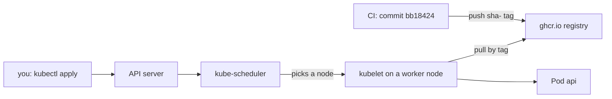

## Bạn cần biết trước

- [[k8s.l1.deployments]] — bạn biết Deployment chạy một số Pod từ một Pod template, thông qua một ReplicaSet.
- [[devops.l2.tagging-images-by-commit]] — bạn biết CI push mỗi image api với tag `sha-` cộng mã commit đầy đủ, nên từ image đang chạy lần ra được code của nó.
- [[devops.l2.image-tags-and-digests]] — bạn biết tag là một nhãn di động trong registry, và `latest` chỉ có nghĩa là "được push lên đó gần nhất".

## Tình huống

Tới giờ cluster chỉ chạy Caddy lấy từ Docker Hub, một container registry công khai. Giờ tới lượt api. Khi bạn chạy Đơn Hàng bằng Docker trên máy mình, `scripts/up.sh` build image api ngay tại đó từ `DonHang.Api/Dockerfile`. Các node của cluster không có bản sao repository nào, cũng không có Dockerfile. Thứ chúng tới được là GitHub Container Registry, nơi CI đã push `ghcr.io/duyan11110/donhang-api` dưới một tag `sha-` cho mỗi lần push lên `master` mà test và build image đều qua. Node lấy image api từ đâu, và làm sao bạn chắc được bản build nào của api đang chạy?

## Khái niệm cốt lõi

- **image pull policy** (quy tắc node dùng để quyết định có kéo lại image từ registry hay dùng bản đã có, như Always, IfNotPresent) — quy tắc node làm theo để quyết định kéo lại image từ registry hay dùng bản nó đã có, đặt cho từng container bằng `imagePullPolicy`.
- `IfNotPresent` — chỉ kéo khi node chưa có image nào dưới tên và tag đó.
- `Always` — mỗi lần container khởi động thì hỏi registry xem tag lúc này chỉ tới image nào, và kéo về nếu node chưa có.

## Cơ chế hoạt động



Trong tình huống trên, không có gì được build trên cluster. CI đã build image một lần, từ commit `bb18424`, rồi push lên registry. Manifest gọi tên image đó bằng registry, repository và tag. Bạn gửi manifest tới API server bằng `kubectl apply`, và kube-scheduler chọn một worker node cho mỗi Pod. Sau đó kubelet trên node ấy tự kéo image, thẳng từ registry. Repository image của Đơn Hàng trên GitHub Container Registry, thứ GitHub gọi là package, là công khai, nên ai cũng kéo được mà không cần đăng nhập.

kubelet có kéo hay không phụ thuộc vào image pull policy. Manifest của Đơn Hàng không đặt `imagePullPolicy`, nên Kubernetes điền một giá trị mặc định lúc Deployment được tạo, và giá trị đó phụ thuộc vào tag. Với tag không phải `latest`, như `sha-bb18…`, mặc định là `IfNotPresent`: node nào đã có image dưới tag đó thì khởi động luôn, không hỏi lại registry.

Với tag `latest`, hoặc image không có tag nào, mặc định thành `Always`. Khi đó manifest không còn cho biết bản build nào đang chạy: câu trả lời phụ thuộc vào thứ được push gần nhất, và vào lúc mỗi Pod khởi động. Đó là lý do manifest của Đơn Hàng không bao giờ dùng `latest`. Tag `sha-` gọi tên một commit, nên đọc manifest là biết code nào đang chạy, và quay lại nghĩa là ghi tag trước đó.

Tag chỉ được đọc khi container khởi động. Vì vậy push lại dưới cùng một tag không cập nhật thứ đang chạy: container đang chạy giữ image mà nó đã khởi động, và node đã lưu sẵn tag đó tiếp tục dùng bản của mình. Chỉ node chưa có mới kéo image mới, nên các Pod có thể chạy những bản build khác nhau.

## Trong hệ thống Đơn Hàng

Phần đầu Deployment của api:

```yaml file=deploy/k8s/lessons/api-deployment.yaml tag=stage-2 lines=3-27
# Two replicas of the api image CI pushed for commit bb18424 (the sha- tag
# names that commit). The node pulls it from GitHub Container Registry;
# nothing is built here. No imagePullPolicy: with a tag that is not latest
# it defaults to IfNotPresent.
apiVersion: apps/v1
kind: Deployment
metadata:
  name: api
  namespace: donhang
spec:
  replicas: 2
  selector:
    matchLabels:
      app: api
  template:
    metadata:
      labels:
        app: api
    spec:
      containers:
        - name: api
          image: ghcr.io/duyan11110/donhang-api:sha-bb184243e4cafed6ae833ca61710608366214aa5
          ports:
            - containerPort: 8080
          # Only settings that are not secret, enough for the api to start.
```

Dòng `image` mang nguyên mã commit. Không có dòng `imagePullPolicy` nào. File tiếp tục với `env`, đặt bốn biến môi trường không bí mật. Chúng chứa một connection string cho `db`, đoạn văn bản cho api biết phải tới database nào và đăng nhập ra sao, ở đây không có mật khẩu; địa chỉ của `redis`; và hai địa chỉ Keycloak, một trong số đó đi qua tên Service `keycloak`. Như vậy đủ để api khởi động. Mọi request cần PostgreSQL sẽ lỗi cho tới khi module sau bổ sung phần còn lại.

Script của bài này:

```bash file=scripts/k8s/deploy-api.sh tag=stage-2 lines=16-37
# lesson: k8s.l1.deploying-an-image-tag
# The nodes the two Pods land on pull ghcr.io/duyan11110/donhang-api at the
# tag in the manifest; the package is public, so no credentials are needed.
show kubectl apply -f deploy/k8s/lessons/api-deployment.yaml
show kubectl wait --for=condition=Available deployment/api -n donhang --timeout=300s
show kubectl get deployment api -n donhang -o wide
show kubectl get pods -n donhang -l app=api
echo
# Not in the manifest, so Kubernetes filled in the default for a tag that is not latest.
echo "\$ kubectl get deployment api -n donhang -o jsonpath='{.spec.template.spec.containers[0].imagePullPolicy}'"
kubectl get deployment api -n donhang -o jsonpath='{.spec.template.spec.containers[0].imagePullPolicy}'
echo
echo

# The api started: its log says where it listens. (kubectl logs reads one
# of the Deployment's Pods and says which on stderr, left out here.)
for _ in $(seq 60); do
  kubectl logs deployment/api -n donhang 2>/dev/null | grep -q 'Now listening' && break
  sleep 1
done
echo "\$ kubectl logs deployment/api -n donhang | grep 'Now listening'"
kubectl logs deployment/api -n donhang 2>/dev/null | grep 'Now listening'
```

`show` in lệnh ra trước khi chạy, còn `kubectl wait` chờ tới khi Deployment báo các Pod của nó available, hoặc hết 300 giây. Truy vấn `-o jsonpath` đọc một trường của Deployment đã lưu, chính là policy mà Kubernetes đã điền vào. Vòng lặp chờ tối đa một phút để có dòng log của api. Sau những dòng ở trên, script hỏi thẳng một Pod api đường dẫn `/api/v1/products` bằng `wget`, một HTTP client dòng lệnh, từ một Pod tạm, vì api chưa có Service. Output của nó:

```text output=true
$ kubectl apply -f deploy/k8s/lessons/api-deployment.yaml
deployment.apps/api created
$ kubectl wait --for=condition=Available deployment/api -n donhang --timeout=300s
deployment.apps/api condition met
$ kubectl get deployment api -n donhang -o wide
NAME   READY   UP-TO-DATE   AVAILABLE   AGE   CONTAINERS   IMAGES                                                                        SELECTOR
api    2/2     2            2           ...   api          ghcr.io/duyan11110/donhang-api:sha-bb184243e4cafed6ae833ca61710608366214aa5   app=api
$ kubectl get pods -n donhang -l app=api
NAME          READY   STATUS    RESTARTS   AGE
api-...-...   1/1     Running   0          ...
api-...-...   1/1     Running   0          ...

$ kubectl get deployment api -n donhang -o jsonpath='{.spec.template.spec.containers[0].imagePullPolicy}'
IfNotPresent

$ kubectl logs deployment/api -n donhang | grep 'Now listening'
      Now listening on: http://[::]:8080

== GET http://<IP of an api Pod>:8080/api/v1/products, from a Pod inside the cluster
wget: server returned error: HTTP/1.1 500 Internal Server Error
```

Cả hai Pod đều chạy, và `IMAGES` hiện đúng tag trong manifest. `IfNotPresent` xuất hiện dù manifest chưa từng ghi nó. Log của api báo nó lắng nghe ở cổng 8080, nên api đã khởi động. Request lấy sản phẩm trả về `500`, vì api chưa có kết nối database dùng được: cluster chạy đúng bản build, nhưng mới có một phần cấu hình.

## Người mới hay nghĩ rằng…

- **"Cluster build image từ Dockerfile trong repository."** → Thực ra các node chỉ kéo image mà CI đã build và push; chúng không bao giờ thấy repository. Bạn sẽ nhận ra khi `IMAGES` hiện một tên `ghcr.io/...:sha-`, và không chỗ nào trong output nhắc tới việc build.
- **"Dùng `latest` cũng được vì nó luôn cho bản build mới nhất."** → Thực ra `latest` là thứ được push lên tag đó gần nhất, và manifest không còn cho biết bản build nào đang chạy. Bạn sẽ nhận ra khi hai Pod khởi động vào hai lúc khác nhau chạy hai bản code khác nhau dưới cùng một `latest`.
- **"Push image mới dưới cùng một tag sẽ cập nhật các Pod đang chạy tag đó."** → Thực ra container đang chạy giữ image của nó, và với `IfNotPresent`, node đã có tag đó giữ bản của mình. Bạn sẽ nhận ra khi các Pod vẫn chạy như cũ sau lần push.

## Thử ngay (3 phút)

Khi cluster `donhang` đang chạy và trong `donhang` chưa có Deployment `api`, trong thư mục `don-hang`, ở shell bạn dùng cho `kubectl`. Script để Deployment `api` tiếp tục chạy; bài sau dùng tiếp nó.

1. Chạy `scripts/k8s/deploy-api.sh`.
2. Thay các Pod api: `kubectl delete pods -n donhang -l app=api`.
3. Chạy `kubectl get events -n donhang --field-selector reason=Pulled`. Kubernetes ghi lại những gì xảy ra với mỗi Pod dưới dạng event; kubelet ghi một event có reason `Pulled` khi image đã sẵn sàng, và `--field-selector` chỉ giữ lại những event đó.

Kết quả mong đợi: bước 1 khớp với output ở trên. Ở bước 3, mọi dòng của một Pod `api-…` đều ghi image `sha-` của manifest; các dòng khác, như dòng của Pod tạm ở bước 1, ghi image của riêng chúng. Với các Pod mới, một dòng ghi `Container image "ghcr.io/duyan11110/donhang-api:sha-…" already present on machine` khi node đã kéo tag đó từ trước; node chưa kéo thì hiện `Successfully pulled image`.

## Liên hệ

- [[devops.l2.tagging-images-by-commit]] — bài đó tạo ra tag `sha-`; bài này là nơi cluster dùng chúng.
- [[devops.l2.cutting-a-release]] — bản release biến một image `sha-` thành `1.0.0`, tag mà bài sau chuyển api sang.
- [[k8s.l1.rolling-updates]] — bài tiếp theo: đổi tag của Deployment này và xem các Pod được thay.

## Tóm tắt 5 dòng

1. Cluster chạy api bằng cách kéo một image CI đã push, được gọi tên bằng tag `sha-` trong manifest.
2. kubelet trên node của Pod kéo từ GitHub Container Registry; package của Đơn Hàng là công khai, nên không cần thông tin đăng nhập.
3. Không có `imagePullPolicy` và tag không phải `latest` thì mặc định là `IfNotPresent`.
4. Với `latest` hoặc không có tag, mặc định là `Always`, và manifest không còn cho biết bản build nào đang chạy.
5. Deployment này chỉ đặt các cấu hình không bí mật, nên request cần database tạm thời sẽ lỗi.
