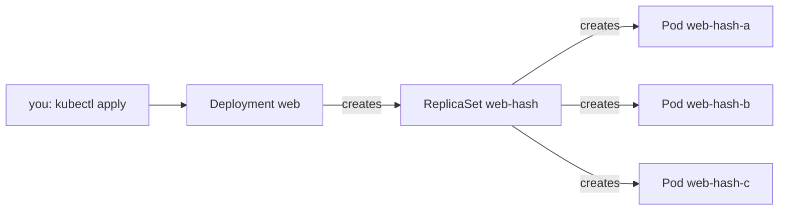

## Before you start

- [[k8s.l1.replicasets]] — you know a ReplicaSet keeps `replicas` Pods matching its selector running, creating them from its Pod template.

## The situation

You have just seen a ReplicaSet keep three `web` Pods alive. Now you look for the ReplicaSets of Đơn Hàng's real system and find none. `deploy/k8s/api.yaml`, `db.yaml`, `redis.yaml`, `keycloak.yaml` and `mailpit.yaml` each say `kind: Deployment`; the only ReplicaSet manifest in the repository is the lesson file you just used. Yet the manifests still have `replicas`, a selector and a Pod template, exactly like a ReplicaSet. Who keeps the Pods running in Đơn Hàng's own manifests, and where did the ReplicaSet go?

## Core concepts

- **Kubernetes Deployment** — a Kubernetes object that declares how many copies of which Pod template should run, and creates and manages a ReplicaSet to run them.
- Owner — the object responsible for another one, usually the one that created it: the Deployment owns its ReplicaSet, the ReplicaSet owns its Pods.
- Template hash — a short string the Deployment computes from its Pod template and puts in the name of the ReplicaSet it creates.

## How it works



In the situation above, the ReplicaSet did not go anywhere; nobody writes it by hand. A Deployment's manifest has the same three parts as a ReplicaSet's: `replicas`, a selector and a Pod template. When you apply it, the Deployment's own control loop creates a ReplicaSet with those three parts, and that ReplicaSet's loop creates the Pods, as in the previous lesson. You write one object and get three levels.

The names show who owns what. The ReplicaSet is named after the Deployment plus a hash of the Pod template, such as `web-` followed by a string of letters and digits. Each Pod is named after its ReplicaSet plus a random ending. Reading a Pod name from right to left gives you its ReplicaSet and then its Deployment.

Changing only `replicas` and applying again scales the ReplicaSet that already exists. The Pod template is unchanged, so its hash is unchanged, and the Deployment simply asks the same ReplicaSet for more or fewer Pods. Going from 3 to 5 adds two Pods; the three that ran keep running.

Each level keeps doing its own job. When a Pod of the Deployment is deleted, its ReplicaSet notices one too few and creates a replacement, exactly as before. When you delete the Deployment, its ReplicaSet is deleted with it, and the ReplicaSet's Pods with that. Nothing is left behind for you to clean up.

The reason for the extra level shows up when the Pod template changes, which a later lesson in this module covers.

## In the Đơn Hàng system

The Deployment for the web server, in the namespace `donhang`:

```yaml file=deploy/k8s/lessons/web-deployment.yaml tag=stage-2 lines=1-23
# lesson: k8s.l1.deployments
# The same three Caddy Pods as web-replicaset.yaml, declared as a Deployment:
# it creates the ReplicaSet, and the ReplicaSet creates the Pods.
apiVersion: apps/v1
kind: Deployment
metadata:
  name: web
  namespace: donhang
spec:
  replicas: 3
  selector:
    matchLabels:
      app: web
  template:
    metadata:
      labels:
        app: web
    spec:
      containers:
        - name: web
          image: caddy:2.10.0
          ports:
            - containerPort: 80
```

Compare it with `web-replicaset.yaml`: apart from the comments, only `kind: Deployment` differs. It runs three replicas of `caddy:2.10.0`, the Caddy web server image that Compose runs as `web`, labelled `app: web`, in `donhang`.

The script for this lesson:

```bash file=scripts/k8s/deployment.sh tag=stage-2 lines=14-35
# lesson: k8s.l1.deployments
# You apply the Deployment only; it creates a ReplicaSet named web-<hash of
# the Pod template>, which creates the Pods, named after it plus a suffix.
show kubectl apply -f deploy/k8s/lessons/web-deployment.yaml
show kubectl wait --for=condition=Available deployment/web -n donhang --timeout=120s
show kubectl get deployment,replicaset,pods -n donhang
echo

# Only replicas changes, 3 to 5: the same ReplicaSet gets 2 more Pods and
# the 3 that were running keep running.
before=$(web_pod_names)
echo "\$ kubectl apply -f - (web-deployment.yaml with replicas: 5)"
sed 's/replicas: 3/replicas: 5/' deploy/k8s/lessons/web-deployment.yaml | kubectl apply -f -
kubectl wait --for=jsonpath='{.status.availableReplicas}'=5 deployment/web -n donhang --timeout=120s >/dev/null
show kubectl get replicaset -n donhang -l app=web
echo "Pods from before the change still running: $(comm -12 <(echo "$before") <(web_pod_names) | wc -l) of 3"
echo

# Deleting the Deployment deletes its ReplicaSet, which deletes its Pods.
show kubectl delete deployment web -n donhang
kubectl wait --for=delete pod -l app=web -n donhang --timeout=120s >/dev/null 2>&1 || true
show kubectl get replicaset,pods -n donhang -l app=web
```

`show` prints a command before running it, and `web_pod_names`, defined earlier in the script, lists the names of the `app=web` Pods. `kubectl wait --for=condition=Available` waits until the Deployment reports enough Pods available. As in the previous lesson, `sed` changes the manifest on its way to `kubectl apply -f -`, so the file itself stays at three. The `echo` line counts how many Pod names from before the change are still there. The two `kubectl wait` lines that print nothing wait for five available Pods and, after the delete, for the Pods to be gone. Its output:

```text output=true
$ kubectl apply -f deploy/k8s/lessons/web-deployment.yaml
deployment.apps/web created
$ kubectl wait --for=condition=Available deployment/web -n donhang --timeout=120s
deployment.apps/web condition met
$ kubectl get deployment,replicaset,pods -n donhang
NAME                  READY   UP-TO-DATE   AVAILABLE   AGE
deployment.apps/web   3/3     3            3           ...

NAME                      DESIRED   CURRENT   READY   AGE
replicaset.apps/web-...   3         3         3       ...

NAME              READY   STATUS    RESTARTS   AGE
pod/web-...-...   1/1     Running   0          ...
pod/web-...-...   1/1     Running   0          ...
pod/web-...-...   1/1     Running   0          ...

$ kubectl apply -f - (web-deployment.yaml with replicas: 5)
deployment.apps/web configured
$ kubectl get replicaset -n donhang -l app=web
NAME      DESIRED   CURRENT   READY   AGE
web-...   5         5         5       ...
Pods from before the change still running: 3 of 3

$ kubectl delete deployment web -n donhang
deployment.apps "web" deleted from donhang namespace
$ kubectl get replicaset,pods -n donhang -l app=web
No resources found in donhang namespace.
```

One apply produced three kinds of object: the Deployment `web`, a ReplicaSet `web-...` and three Pods `web-...-...`. The first `...` in each name hides the template hash, the second the random ending. In the Deployment's row, `READY 3/3` means three of the three wanted Pods are ready; `UP-TO-DATE` matters once the template changes. After the scale there is still one ReplicaSet, now at 5, and all three earlier Pods still run. After the delete, no ReplicaSet and no Pod with `app=web` remains.

## Beginners often think…

- **"A Deployment runs the Pods itself, so no ReplicaSet is involved."** → Actually the Deployment creates a ReplicaSet, and the ReplicaSet creates the Pods. You notice this when `kubectl get replicaset -n donhang` lists `web-...` although you never applied a ReplicaSet.
- **"For each app I should write both a ReplicaSet and a Deployment."** → Actually you write only the Deployment; it creates its ReplicaSet. A ReplicaSet of your own with an overlapping selector could conflict with it over the same Pods. You notice this when Đơn Hàng's own app manifests in `deploy/k8s/`, such as `api.yaml` and `db.yaml`, are Deployments, with no ReplicaSet manifest among them.
- **"Scaling from 3 to 5 replicas restarts the three Pods that already run."** → Actually only `replicas` changed, so the same ReplicaSet adds two Pods and leaves the others alone. You notice this when the script prints `3 of 3` for the Pods from before the change.

## Try it (3 minutes)

With the `donhang` cluster running, in the `don-hang` folder, in the shell you use for `kubectl`. Run this while `donhang` holds nothing else, as at this point of the track; otherwise step 1 also lists those objects.

1. Run `scripts/k8s/deployment.sh`. It deletes its Deployment at the end.
2. Run `kubectl apply -f deploy/k8s/lessons/web-deployment.yaml`, then `kubectl get pods -n donhang -l app=web` and copy one Pod name.
3. Delete that Pod with `kubectl delete pod <name> -n donhang`, then run `kubectl get replicaset,pods -n donhang -l app=web`.
4. Clean up with `kubectl delete -f deploy/k8s/lessons/web-deployment.yaml`.

Expected result: step 1 matches the output above. In step 3 there are three Pods again, one of them possibly still starting, with a new name that starts with the same `web-...-` prefix, and still exactly one ReplicaSet at 3.

## Connections

- [[k8s.l1.replicasets]] — the level below: a Deployment adds an owner above the ReplicaSet you met there.
- [[k8s.l1.services]] — next: one stable address in front of the Pods this Deployment keeps replacing.
- [[k8s.l1.rolling-updates]] — later in this module: what a Deployment does when its Pod template changes, the reason it exists.

## Five-line summary

1. You write a Deployment; it creates and manages a ReplicaSet, which creates the Pods.
2. `web-deployment.yaml` runs three replicas of `caddy:2.10.0`, labelled `app: web`, in `donhang`.
3. The ReplicaSet is named after the Deployment plus a template hash, each Pod after its ReplicaSet plus a random ending.
4. Changing only `replicas` scales the same ReplicaSet; running Pods keep running.
5. A deleted Pod is replaced by its ReplicaSet; deleting the Deployment deletes its ReplicaSet and Pods too.
