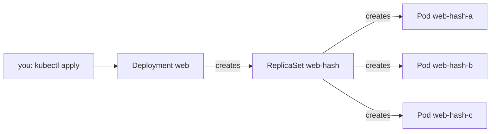

## Bạn cần biết trước

- [[k8s.l1.replicasets]] — bạn biết ReplicaSet giữ cho `replicas` Pod khớp selector của nó luôn chạy, tạo chúng từ Pod template.

## Tình huống

Bạn vừa thấy một ReplicaSet giữ ba Pod `web` sống. Giờ bạn đi tìm các ReplicaSet của hệ thống Đơn Hàng thật và không thấy cái nào. `deploy/k8s/api.yaml`, `db.yaml`, `redis.yaml`, `keycloak.yaml` và `mailpit.yaml` đều ghi `kind: Deployment`; manifest ReplicaSet duy nhất trong repository là file bài học bạn vừa dùng. Vậy mà các manifest đó vẫn có `replicas`, một selector và một Pod template, y như ReplicaSet. Ai giữ cho Pod chạy trong các manifest của chính Đơn Hàng, và ReplicaSet đã đi đâu?

## Khái niệm cốt lõi

- **Kubernetes Deployment** (object Kubernetes khai báo app chạy bao nhiêu bản từ Pod template nào; nó quản lý ReplicaSet) — một object Kubernetes khai báo cần chạy bao nhiêu bản của Pod template nào, rồi tạo và quản lý một ReplicaSet để chạy chúng.
- Chủ sở hữu (owner) — object chịu trách nhiệm cho một object khác, thường là object đã tạo ra nó: Deployment sở hữu ReplicaSet của nó, ReplicaSet sở hữu các Pod của nó.
- Template hash — một chuỗi ngắn mà Deployment tính từ Pod template của nó và gắn vào tên của ReplicaSet nó tạo ra.

## Cơ chế hoạt động



Trong tình huống trên, ReplicaSet chẳng đi đâu cả; chỉ là không ai viết nó bằng tay. Manifest của Deployment có đúng ba phần như của ReplicaSet: `replicas`, một selector và một Pod template. Khi bạn apply nó, control loop riêng của Deployment tạo một ReplicaSet với ba phần đó, và loop của ReplicaSet tạo các Pod, như ở bài trước. Bạn viết một object và có ba tầng.

Tên cho thấy ai sở hữu ai. ReplicaSet mang tên Deployment cộng một hash của Pod template, chẳng hạn `web-` theo sau là một chuỗi chữ và số. Mỗi Pod mang tên ReplicaSet của nó cộng một đuôi ngẫu nhiên. Đọc tên Pod từ phải sang trái, bạn có ReplicaSet của nó rồi tới Deployment.

Chỉ đổi `replicas` rồi apply lại sẽ scale chính ReplicaSet đang có. Pod template không đổi, nên hash của nó không đổi, và Deployment chỉ việc yêu cầu cùng ReplicaSet đó thêm hoặc bớt Pod. Từ 3 lên 5 thì thêm hai Pod; ba Pod đang chạy vẫn tiếp tục chạy.

Mỗi tầng vẫn làm đúng việc của mình. Khi một Pod của Deployment bị xóa, ReplicaSet của nó thấy thiếu một và tạo Pod thay thế, đúng như trước. Khi bạn xóa Deployment, ReplicaSet của nó bị xóa theo, và các Pod của ReplicaSet cũng vậy. Không có gì bị bỏ lại để bạn phải dọn.

Lý do cần thêm một tầng chỉ lộ ra khi Pod template thay đổi, điều mà một bài sau trong module này sẽ nói tới.

## Trong hệ thống Đơn Hàng

Deployment cho web server, trong namespace `donhang`:

```yaml file=deploy/k8s/lessons/web-deployment.yaml tag=stage-2 lines=1-23
# lesson: k8s.l1.deployments
# The same three Caddy Pods as web-replicaset.yaml, declared as a Deployment:
# it creates the ReplicaSet, and the ReplicaSet creates the Pods.
apiVersion: apps/v1
kind: Deployment
metadata:
  name: web
  namespace: donhang
spec:
  replicas: 3
  selector:
    matchLabels:
      app: web
  template:
    metadata:
      labels:
        app: web
    spec:
      containers:
        - name: web
          image: caddy:2.10.0
          ports:
            - containerPort: 80
```

So với `web-replicaset.yaml`: ngoài phần comment, chỉ có `kind: Deployment` là khác. Nó chạy ba bản của `caddy:2.10.0`, image web server Caddy mà Compose chạy làm `web`, gắn label `app: web`, trong `donhang`.

Script của bài này:

```bash file=scripts/k8s/deployment.sh tag=stage-2 lines=14-35
# lesson: k8s.l1.deployments
# You apply the Deployment only; it creates a ReplicaSet named web-<hash of
# the Pod template>, which creates the Pods, named after it plus a suffix.
show kubectl apply -f deploy/k8s/lessons/web-deployment.yaml
show kubectl wait --for=condition=Available deployment/web -n donhang --timeout=120s
show kubectl get deployment,replicaset,pods -n donhang
echo

# Only replicas changes, 3 to 5: the same ReplicaSet gets 2 more Pods and
# the 3 that were running keep running.
before=$(web_pod_names)
echo "\$ kubectl apply -f - (web-deployment.yaml with replicas: 5)"
sed 's/replicas: 3/replicas: 5/' deploy/k8s/lessons/web-deployment.yaml | kubectl apply -f -
kubectl wait --for=jsonpath='{.status.availableReplicas}'=5 deployment/web -n donhang --timeout=120s >/dev/null
show kubectl get replicaset -n donhang -l app=web
echo "Pods from before the change still running: $(comm -12 <(echo "$before") <(web_pod_names) | wc -l) of 3"
echo

# Deleting the Deployment deletes its ReplicaSet, which deletes its Pods.
show kubectl delete deployment web -n donhang
kubectl wait --for=delete pod -l app=web -n donhang --timeout=120s >/dev/null 2>&1 || true
show kubectl get replicaset,pods -n donhang -l app=web
```

`show` in lệnh ra trước khi chạy, còn `web_pod_names`, định nghĩa ở đầu script, liệt kê tên các Pod `app=web`. `kubectl wait --for=condition=Available` chờ tới khi Deployment báo đủ Pod available. Như bài trước, `sed` sửa manifest trên đường tới `kubectl apply -f -`, nên bản thân file vẫn để 3. Dòng `echo` đếm xem bao nhiêu tên Pod từ trước khi đổi vẫn còn. Hai dòng `kubectl wait` không in gì thì chờ đủ năm Pod available và, sau lệnh xóa, chờ các Pod biến mất. Output của nó:

```text output=true
$ kubectl apply -f deploy/k8s/lessons/web-deployment.yaml
deployment.apps/web created
$ kubectl wait --for=condition=Available deployment/web -n donhang --timeout=120s
deployment.apps/web condition met
$ kubectl get deployment,replicaset,pods -n donhang
NAME                  READY   UP-TO-DATE   AVAILABLE   AGE
deployment.apps/web   3/3     3            3           ...

NAME                      DESIRED   CURRENT   READY   AGE
replicaset.apps/web-...   3         3         3       ...

NAME              READY   STATUS    RESTARTS   AGE
pod/web-...-...   1/1     Running   0          ...
pod/web-...-...   1/1     Running   0          ...
pod/web-...-...   1/1     Running   0          ...

$ kubectl apply -f - (web-deployment.yaml with replicas: 5)
deployment.apps/web configured
$ kubectl get replicaset -n donhang -l app=web
NAME      DESIRED   CURRENT   READY   AGE
web-...   5         5         5       ...
Pods from before the change still running: 3 of 3

$ kubectl delete deployment web -n donhang
deployment.apps "web" deleted from donhang namespace
$ kubectl get replicaset,pods -n donhang -l app=web
No resources found in donhang namespace.
```

Một lần apply tạo ra ba loại object: Deployment `web`, một ReplicaSet `web-...` và ba Pod `web-...-...`. Dấu `...` thứ nhất trong mỗi tên che hash của template, dấu thứ hai che đuôi ngẫu nhiên. Ở dòng của Deployment, `READY 3/3` nghĩa là ba trên ba Pod mong muốn đã ready; `UP-TO-DATE` chỉ có ý nghĩa khi template đổi. Sau khi scale vẫn chỉ có một ReplicaSet, giờ ở mức 5, và cả ba Pod cũ vẫn chạy. Sau khi xóa, không còn ReplicaSet hay Pod nào mang `app=web`.

## Người mới hay nghĩ rằng…

- **"Deployment tự chạy các Pod, nên không có ReplicaSet nào dính vào."** → Thực ra Deployment tạo một ReplicaSet, và ReplicaSet tạo các Pod. Bạn sẽ nhận ra khi `kubectl get replicaset -n donhang` liệt kê `web-...` dù bạn chưa từng apply ReplicaSet nào.
- **"Với mỗi app tôi phải viết cả ReplicaSet lẫn Deployment."** → Thực ra bạn chỉ viết Deployment; nó tự tạo ReplicaSet của mình. Một ReplicaSet do bạn tự viết với selector chồng lên có thể xung đột với nó trên cùng các Pod. Bạn sẽ nhận ra khi các manifest app của chính Đơn Hàng trong `deploy/k8s/`, như `api.yaml` và `db.yaml`, đều là Deployment, không có manifest ReplicaSet nào.
- **"Scale từ 3 lên 5 bản sẽ khởi động lại ba Pod đang chạy."** → Thực ra chỉ `replicas` thay đổi, nên chính ReplicaSet đó thêm hai Pod và để yên các Pod còn lại. Bạn sẽ nhận ra khi script in `3 of 3` cho các Pod từ trước khi đổi.

## Thử ngay (3 phút)

Khi cluster `donhang` đang chạy, trong thư mục `don-hang`, ở shell bạn dùng cho `kubectl`. Chạy khi `donhang` chưa có gì khác, đúng như ở điểm này của track; nếu không, bước 1 sẽ liệt kê cả những object đó.

1. Chạy `scripts/k8s/deployment.sh`. Cuối cùng nó xóa Deployment của mình.
2. Chạy `kubectl apply -f deploy/k8s/lessons/web-deployment.yaml`, rồi `kubectl get pods -n donhang -l app=web` và chép lại một tên Pod.
3. Xóa Pod đó bằng `kubectl delete pod <name> -n donhang`, rồi chạy `kubectl get replicaset,pods -n donhang -l app=web`.
4. Dọn dẹp bằng `kubectl delete -f deploy/k8s/lessons/web-deployment.yaml`.

Kết quả mong đợi: bước 1 khớp với output ở trên. Ở bước 3 lại có ba Pod, một Pod có thể vẫn đang khởi động, mang tên mới nhưng cùng tiền tố `web-...-`, và vẫn đúng một ReplicaSet ở mức 3.

## Liên hệ

- [[k8s.l1.replicasets]] — tầng bên dưới: Deployment thêm một chủ sở hữu phía trên ReplicaSet bạn đã gặp ở đó.
- [[k8s.l1.services]] — bài tiếp theo: một địa chỉ cố định đứng trước các Pod mà Deployment này liên tục thay.
- [[k8s.l1.rolling-updates]] — ở phần sau của module: Deployment làm gì khi Pod template của nó đổi, lý do nó tồn tại.

## Tóm tắt 5 dòng

1. Bạn viết Deployment; nó tạo và quản lý một ReplicaSet, ReplicaSet đó tạo các Pod.
2. `web-deployment.yaml` chạy ba bản của `caddy:2.10.0`, gắn label `app: web`, trong `donhang`.
3. ReplicaSet mang tên Deployment cộng hash của template, mỗi Pod mang tên ReplicaSet của nó cộng một đuôi ngẫu nhiên.
4. Chỉ đổi `replicas` thì cùng ReplicaSet đó được scale; Pod đang chạy vẫn chạy.
5. Pod bị xóa được ReplicaSet của nó thay; xóa Deployment thì ReplicaSet và các Pod cũng bị xóa theo.
