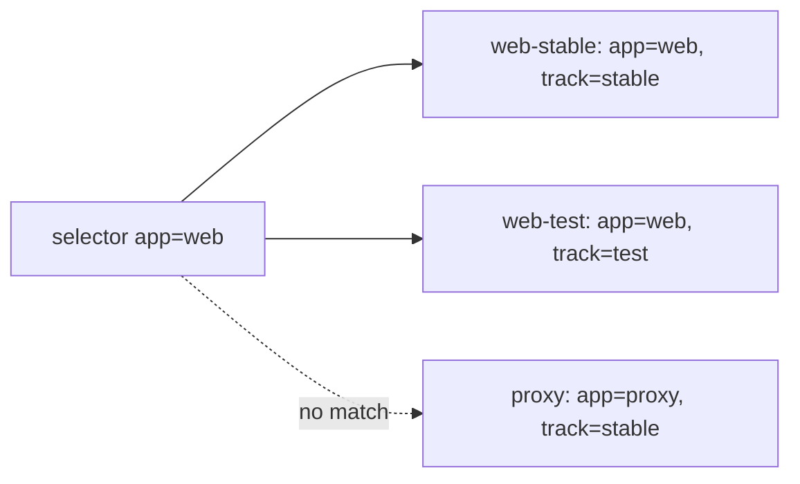

## Before you start

- [[k8s.l1.namespaces]] — you know Đơn Hàng's objects live in the namespace `donhang`, and that `-n donhang` makes kubectl look there.

## The situation

The namespace `donhang` now holds three Pods, all running `caddy:2.10.0`: `web-stable`, `web-test` and `proxy`. The first two belong to the same web app; `web-test` is a copy you are trying out, and `proxy` is something else. Soon the cluster will have to keep "the web Pods" running and send traffic to them, while Pods come and go with new names. Picking them by name already feels fragile: a name says what one Pod is called, not which group it belongs to. How does Kubernetes find "every Pod of the web app" without relying on names?

## Core concepts

- **Kubernetes label** — a key–value pair, such as `app: web`, written under an object's `metadata.labels`; many objects may carry the same label.
- **label selector** — a condition on labels, such as `app=web`, that picks out the objects whose labels match it.
- `--show-labels` — a kubectl flag that adds each object's labels as a last column of the list.

## How it works



In the situation above, each Pod gets two labels in its manifest: `app`, which names the app it belongs to, and `track`, which says whether it is the stable copy or a test. A Pod's name is unique among the Pods of its namespace; a label is not. `web-stable` and `web-test` both carry `app: web`, and that is the point: the label names a group, the name names one object.

A label selector reads those labels, not the names. `kubectl get pods -n donhang -l app=web` asks the API server for the Pods in `donhang` whose `app` label equals `web`. It returns `web-stable` and `web-test`. `proxy` is left out because its `app` label is `proxy`, not because of its name. A Pod named `web-proxy` with `app: proxy` would still be left out.

A selector can hold several conditions separated by commas. `-l app=web,track=stable` matches only the Pods that satisfy both, so it returns `web-stable` alone. `-l track=stable` returns `web-stable` and `proxy`: two different apps that share one label.

The keys are yours to choose. Kubernetes gives `app` and `track` no meaning; it only stores them and compares them when asked. They start to matter when an object uses a selector to decide which Pods it works with. The next lessons of this module show two such objects: one that keeps a number of Pods running, and one that gives a group of Pods a single address. Both find their Pods with a selector like `app=web`.

## In the Đơn Hàng system

The first of the three Pods in the lesson's manifest:

```yaml file=deploy/k8s/lessons/labelled-pods.yaml tag=stage-2 lines=1-15
# lesson: k8s.l1.labels
# Three Pods running the same image. Each has its own name; the labels under
# metadata.labels are what a selector looks at. Two Pods share app: web.
apiVersion: v1
kind: Pod
metadata:
  name: web-stable
  namespace: donhang
  labels:
    app: web
    track: stable
spec:
  containers:
    - name: web
      image: caddy:2.10.0
```

Look at `metadata`: `name` says what this one Pod is called, and `labels` holds two key–value pairs next to it. The same file, after each `---`, declares `web-test` with `app: web` and `track: test`, and `proxy` with `app: proxy` and `track: stable`. All three run the same image, so nothing but the labels tells the groups apart.

The script for this lesson:

```bash file=scripts/k8s/labels.sh tag=stage-2 lines=8-25
kubectl apply -f deploy/k8s/namespace.yaml >/dev/null
kubectl delete -f deploy/k8s/lessons/labelled-pods.yaml --ignore-not-found >/dev/null

show kubectl apply -f deploy/k8s/lessons/labelled-pods.yaml
kubectl wait --for=condition=Ready pod --all -n donhang --timeout=120s >/dev/null
echo

# lesson: k8s.l1.labels
# --show-labels adds each Pod's labels as a last column. -l takes a label
# selector: only Pods whose labels match it are listed; with a comma, a Pod
# must match every condition.
show kubectl get pods -n donhang --show-labels
echo
show kubectl get pods -n donhang -l app=web
echo
show kubectl get pods -n donhang -l app=web,track=stable
echo
show kubectl get pods -n donhang -l track=stable
```

`show` prints each command before running it. The script makes sure the namespace exists, starts from a clean state, applies the three Pods and waits until they run. Then it lists them four times with different selectors. After the lines shown, it deletes the three Pods again, so that the objects of the next lessons, which also select `app=web`, do not pick them up. Its output:

```text output=true
$ kubectl apply -f deploy/k8s/lessons/labelled-pods.yaml
pod/web-stable created
pod/web-test created
pod/proxy created

$ kubectl get pods -n donhang --show-labels
NAME         READY   STATUS    RESTARTS   AGE   LABELS
proxy        1/1     Running   0          ...   app=proxy,track=stable
web-stable   1/1     Running   0          ...   app=web,track=stable
web-test     1/1     Running   0          ...   app=web,track=test

$ kubectl get pods -n donhang -l app=web
NAME         READY   STATUS    RESTARTS   AGE
web-stable   1/1     Running   0          ...
web-test     1/1     Running   0          ...

$ kubectl get pods -n donhang -l app=web,track=stable
NAME         READY   STATUS    RESTARTS   AGE
web-stable   1/1     Running   0          ...

$ kubectl get pods -n donhang -l track=stable
NAME         READY   STATUS    RESTARTS   AGE
proxy        1/1     Running   0          ...
web-stable   1/1     Running   0          ...
```

The `LABELS` column shows the labels as `key=value` pairs joined by commas. Each `-l` list is a subset of the first one: two Pods for `app=web`, one when `track=stable` is added, and two again, from different apps, for `track=stable` alone. The `...` hides ages.

## Beginners often think…

- **"A label is just another name, so two Pods cannot carry the same one."** → Actually a Pod's name must be unique among the Pods of its namespace, but any number of objects may share a label, because a label marks a group. You notice this when `-l app=web` returns two Pods with different names.
- **"Kubernetes knows what `app: web` means and treats those Pods specially."** → Actually the keys and values are yours; Kubernetes stores them and compares them when a selector asks. You notice this when `track: test` changes nothing about how `web-test` runs, only which lists it appears in.
- **"`-l app=web` searches the Pods' names for the text `web`."** → Actually a selector compares labels and never reads names. You notice this when `-l track=stable` lists `proxy`, whose name has no `stable` in it.

## Try it (3 minutes)

With the `donhang` cluster running, in the `don-hang` folder, in the shell you use for `kubectl`. Run this while `donhang` holds nothing else, as at this point of the track: `kubectl get pods -n donhang` should print `No resources found in donhang namespace.`

1. Run `scripts/k8s/labels.sh`.
2. Run `kubectl apply -f deploy/k8s/lessons/labelled-pods.yaml`, then `kubectl get pods -n donhang -l track=test`.
3. Run `kubectl get pods -n donhang -l app=proxy,track=test`.
4. Clean up with `kubectl delete -f deploy/k8s/lessons/labelled-pods.yaml`.

Expected result: step 1 matches the output above. Step 2 lists only `web-test`. Step 3 prints `No resources found in donhang namespace.`, because no Pod has both labels, even though one has `app=proxy` and another has `track=test`.

## Connections

- [[k8s.l1.namespaces]] — a namespace groups objects by where they live; labels group them across names, inside a namespace.
- [[k8s.l1.replicasets]] — next: the first object that uses a selector, to count and replace the Pods it owns.
- [[k8s.l1.services]] — later in this module: a selector decides which Pods receive the traffic sent to one stable address.

## Five-line summary

1. Labels mark which group an object belongs to, and label selectors find a group by its labels, never by names.
2. A label is a key–value pair under `metadata.labels`; unlike a name, many objects may carry the same one.
3. `kubectl get pods -n donhang -l app=web` lists only Pods whose `app` label equals `web`.
4. With commas, a selector matches only objects that satisfy every condition.
5. Kubernetes gives your keys no meaning; they matter once an object uses a selector to choose its Pods.
