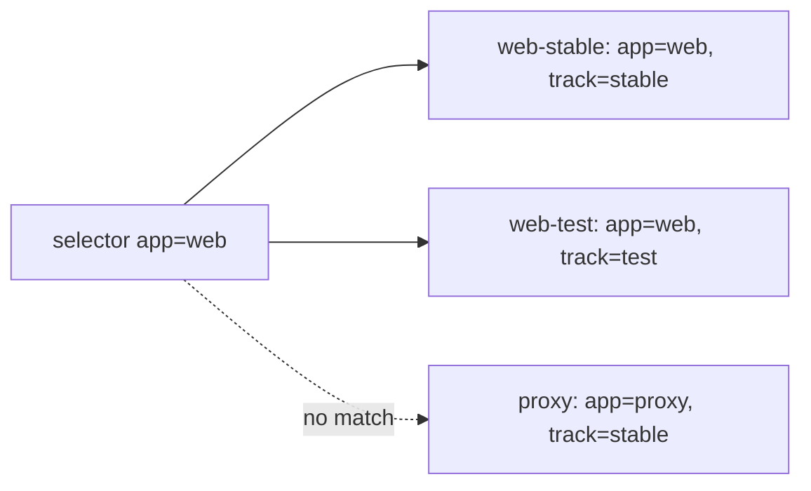

## Bạn cần biết trước

- [[k8s.l1.namespaces]] — bạn biết các object của Đơn Hàng nằm trong namespace `donhang`, và `-n donhang` khiến kubectl tìm ở đó.

## Tình huống

Namespace `donhang` giờ có ba Pod, cả ba đều chạy `caddy:2.10.0`: `web-stable`, `web-test` và `proxy`. Hai Pod đầu thuộc cùng một app web; `web-test` là một bản bạn đang thử, còn `proxy` là thứ khác hẳn. Chẳng bao lâu nữa cluster sẽ phải giữ cho "các Pod web" luôn chạy và gửi lưu lượng tới chúng, trong khi Pod đến rồi đi với những cái tên mới. Chọn chúng theo tên đã thấy mong manh: tên cho biết một Pod được gọi là gì, không cho biết nó thuộc nhóm nào. Vậy Kubernetes tìm "mọi Pod của app web" bằng cách nào mà không dựa vào tên?

## Khái niệm cốt lõi

- **Kubernetes label** (cặp key–value trong metadata của object Kubernetes, vd app: web, để selector tìm ra object) — một cặp key–value, như `app: web`, ghi dưới `metadata.labels` của object; nhiều object có thể mang cùng một label.
- **label selector** (điều kiện trên label, vd app=web, chọn ra những object mang label khớp) — một điều kiện trên label, như `app=web`, chọn ra những object có label khớp với nó.
- `--show-labels` — một flag của kubectl, thêm label của từng object thành cột cuối của danh sách.

## Cơ chế hoạt động



Trong tình huống trên, mỗi Pod có hai label trong manifest: `app` gọi tên app mà nó thuộc về, còn `track` cho biết nó là bản ổn định hay bản thử. Tên của một Pod là duy nhất giữa các Pod trong namespace của nó, còn label thì không. `web-stable` và `web-test` cùng mang `app: web`, và đó chính là mục đích: label gọi tên một nhóm, còn tên gọi một object.

Label selector đọc các label đó, không đọc tên. `kubectl get pods -n donhang -l app=web` hỏi API server các Pod trong `donhang` có label `app` bằng `web`. Kết quả là `web-stable` và `web-test`. `proxy` bị loại vì label `app` của nó là `proxy`, không phải vì tên của nó. Một Pod tên `web-proxy` mang `app: proxy` cũng vẫn bị loại.

Một selector có thể chứa nhiều điều kiện, ngăn cách bằng dấu phẩy. `-l app=web,track=stable` chỉ khớp những Pod thỏa cả hai, nên chỉ trả về `web-stable`. `-l track=stable` trả về `web-stable` và `proxy`: hai app khác nhau cùng chung một label.

Key do bạn tự chọn. Kubernetes không gán ý nghĩa nào cho `app` hay `track`; nó chỉ lưu và so sánh chúng khi được hỏi. Chúng bắt đầu có tác dụng khi một object dùng selector để quyết định nó làm việc với những Pod nào. Các bài tiếp theo của module này giới thiệu hai object như vậy: một cái giữ cho một số Pod luôn chạy, một cái cho một nhóm Pod chung một địa chỉ. Cả hai đều tìm Pod của mình bằng một selector như `app=web`.

## Trong hệ thống Đơn Hàng

Pod đầu tiên trong ba Pod của manifest dùng cho bài:

```yaml file=deploy/k8s/lessons/labelled-pods.yaml tag=stage-2 lines=1-15
# lesson: k8s.l1.labels
# Three Pods running the same image. Each has its own name; the labels under
# metadata.labels are what a selector looks at. Two Pods share app: web.
apiVersion: v1
kind: Pod
metadata:
  name: web-stable
  namespace: donhang
  labels:
    app: web
    track: stable
spec:
  containers:
    - name: web
      image: caddy:2.10.0
```

Hãy nhìn vào `metadata`: `name` cho biết Pod này tên là gì, còn `labels` chứa hai cặp key–value ngay cạnh đó. Cũng file này, sau mỗi dòng `---`, khai báo `web-test` với `app: web` và `track: test`, rồi `proxy` với `app: proxy` và `track: stable`. Cả ba chạy cùng một image, nên ngoài label ra không có gì phân biệt các nhóm.

Script của bài này:

```bash file=scripts/k8s/labels.sh tag=stage-2 lines=8-25
kubectl apply -f deploy/k8s/namespace.yaml >/dev/null
kubectl delete -f deploy/k8s/lessons/labelled-pods.yaml --ignore-not-found >/dev/null

show kubectl apply -f deploy/k8s/lessons/labelled-pods.yaml
kubectl wait --for=condition=Ready pod --all -n donhang --timeout=120s >/dev/null
echo

# lesson: k8s.l1.labels
# --show-labels adds each Pod's labels as a last column. -l takes a label
# selector: only Pods whose labels match it are listed; with a comma, a Pod
# must match every condition.
show kubectl get pods -n donhang --show-labels
echo
show kubectl get pods -n donhang -l app=web
echo
show kubectl get pods -n donhang -l app=web,track=stable
echo
show kubectl get pods -n donhang -l track=stable
```

`show` in từng lệnh ra trước khi chạy nó. Script đảm bảo namespace đã có, dọn sạch từ đầu, apply ba Pod rồi chờ tới khi chúng chạy. Sau đó nó liệt kê chúng bốn lần với các selector khác nhau. Sau những dòng ở trên, script xóa lại ba Pod, để các object của những bài sau, vốn cũng chọn `app=web`, không nhận nhầm chúng. Output của nó:

```text output=true
$ kubectl apply -f deploy/k8s/lessons/labelled-pods.yaml
pod/web-stable created
pod/web-test created
pod/proxy created

$ kubectl get pods -n donhang --show-labels
NAME         READY   STATUS    RESTARTS   AGE   LABELS
proxy        1/1     Running   0          ...   app=proxy,track=stable
web-stable   1/1     Running   0          ...   app=web,track=stable
web-test     1/1     Running   0          ...   app=web,track=test

$ kubectl get pods -n donhang -l app=web
NAME         READY   STATUS    RESTARTS   AGE
web-stable   1/1     Running   0          ...
web-test     1/1     Running   0          ...

$ kubectl get pods -n donhang -l app=web,track=stable
NAME         READY   STATUS    RESTARTS   AGE
web-stable   1/1     Running   0          ...

$ kubectl get pods -n donhang -l track=stable
NAME         READY   STATUS    RESTARTS   AGE
proxy        1/1     Running   0          ...
web-stable   1/1     Running   0          ...
```

Cột `LABELS` hiện các label dưới dạng cặp `key=value`, nối với nhau bằng dấu phẩy. Mỗi danh sách `-l` là một phần của danh sách đầu tiên: hai Pod với `app=web`, còn một khi thêm `track=stable`, và lại hai, thuộc hai app khác nhau, với riêng `track=stable`. `...` che đi cột tuổi.

## Người mới hay nghĩ rằng…

- **"Label chỉ là một cái tên khác, nên hai Pod không thể mang cùng một label."** → Thực ra tên của Pod phải là duy nhất giữa các Pod trong namespace, nhưng bao nhiêu object cũng có thể dùng chung một label, vì label đánh dấu một nhóm. Bạn sẽ nhận ra khi `-l app=web` trả về hai Pod có tên khác nhau.
- **"Kubernetes hiểu `app: web` nghĩa là gì và đối xử đặc biệt với các Pod đó."** → Thực ra key và value là của bạn; Kubernetes lưu lại và so sánh chúng khi có selector hỏi. Bạn sẽ nhận ra khi `track: test` không thay đổi gì trong cách `web-test` chạy, chỉ đổi việc nó xuất hiện trong danh sách nào.
- **"`-l app=web` tìm chữ `web` trong tên các Pod."** → Thực ra selector so sánh label và không bao giờ đọc tên. Bạn sẽ nhận ra khi `-l track=stable` liệt kê `proxy`, dù tên của nó không có chữ `stable`.

## Thử ngay (3 phút)

Khi cluster `donhang` đang chạy, trong thư mục `don-hang`, ở shell bạn dùng cho `kubectl`. Chạy khi `donhang` chưa có gì khác, đúng như ở điểm này của track: `kubectl get pods -n donhang` phải in ra `No resources found in donhang namespace.`

1. Chạy `scripts/k8s/labels.sh`.
2. Chạy `kubectl apply -f deploy/k8s/lessons/labelled-pods.yaml`, rồi `kubectl get pods -n donhang -l track=test`.
3. Chạy `kubectl get pods -n donhang -l app=proxy,track=test`.
4. Dọn dẹp bằng `kubectl delete -f deploy/k8s/lessons/labelled-pods.yaml`.

Kết quả mong đợi: bước 1 khớp với output ở trên. Bước 2 chỉ liệt kê `web-test`. Bước 3 in ra `No resources found in donhang namespace.`, vì không Pod nào có cả hai label, dù một Pod có `app=proxy` và một Pod khác có `track=test`.

## Liên hệ

- [[k8s.l1.namespaces]] — namespace gom object theo nơi chúng nằm; label gom chúng xuyên qua các tên, bên trong một namespace.
- [[k8s.l1.replicasets]] — bài tiếp theo: object đầu tiên dùng selector, để đếm và thay các Pod nó sở hữu.
- [[k8s.l1.services]] — ở phần sau của module: selector quyết định Pod nào nhận lưu lượng gửi tới một địa chỉ cố định.

## Tóm tắt 5 dòng

1. Label đánh dấu object thuộc nhóm nào, và label selector tìm một nhóm theo label, không bao giờ theo tên.
2. Label là một cặp key–value dưới `metadata.labels`; khác với tên, nhiều object có thể mang cùng một label.
3. `kubectl get pods -n donhang -l app=web` chỉ liệt kê các Pod có label `app` bằng `web`.
4. Khi có dấu phẩy, selector chỉ khớp những object thỏa mọi điều kiện.
5. Kubernetes không gán ý nghĩa cho key của bạn; chúng có tác dụng khi một object dùng selector để chọn Pod.
