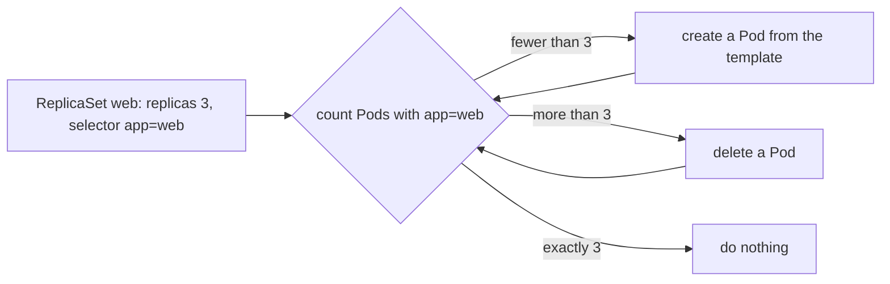

## Before you start

- [[k8s.l1.labels]] — you know a label selector such as `app=web` picks out every Pod whose labels match, whatever the Pods are called.
- [[k8s.l1.control-plane-components]] — you know Kubernetes components run control loops that compare desired state with what exists and act on the difference.

## The situation

The `web` Pod from the first lessons still runs in `default`. You delete it with `kubectl delete pod web`, the way a crashed machine or a careless command might remove it. Then you wait. Nothing comes back: `kubectl get pod web` answers `NotFound`, and it stays that way until someone applies `web-pod.yaml` again. That is not what you want for Đơn Hàng's web server, which should keep three copies running whatever happens to one of them. The cluster has control loops; why did none of them bring `web` back, and what would?

## Core concepts

- **ReplicaSet** — a Kubernetes object that keeps a set number of Pods matching its label selector running, creating new ones when there are too few and removing some when there are too many.
- **Pod template** — the Pod description inside a ReplicaSet, under `spec.template`, from which it creates every new Pod.
- `replicas` — the number of matching Pods the ReplicaSet wants.

## How it works



In the situation above, the `web` Pod had no owner: no other object wanted it to exist. A Pod created on its own like this is called a bare Pod. Nothing in the cluster had declared "there should be a Pod called `web`" except the Pod itself, so when it was deleted, no control loop had a desired state left to restore.

A ReplicaSet supplies that desired state. Its manifest says three things: `replicas`, how many Pods it wants; a label selector, which Pods count; and a Pod template, what a new Pod looks like. A control loop for ReplicaSets compares `replicas` with the number of Pods its selector matches, again and again. That loop runs in the control plane and, like kube-scheduler, reads and changes the cluster only through the API server. With `replicas: 3` and no matching Pods, it creates three Pods from the template. Each gets the template's labels, so each one counts.

The template's labels must match the selector; otherwise the Pods the ReplicaSet creates would not count as its own. The API server refuses such a manifest when you apply it.

Delete one of the three Pods and the loop sees two where it wants three. It creates a replacement from the template. The replacement is a new Pod: it gets a new name, the ReplicaSet's name plus a random ending, and is given its own IP address; nothing keeps the old Pod's address for it.

Changing `replicas` changes the target, so applying `replicas: 4` adds one Pod and `replicas: 2` removes one. Changing only the template is different: the Pods that already run match the selector, so the count is still right and nothing happens to them. Only Pods created afterwards use the new template.

## In the Đơn Hàng system

The ReplicaSet for Đơn Hàng's web server:

```yaml file=deploy/k8s/lessons/web-replicaset.yaml tag=stage-2 lines=1-24
# lesson: k8s.l1.replicasets
# Keep 3 Pods labelled app: web running. The selector says which Pods count;
# the template is what each new Pod is created from, and its labels must
# match the selector.
apiVersion: apps/v1
kind: ReplicaSet
metadata:
  name: web
  namespace: donhang
spec:
  replicas: 3
  selector:
    matchLabels:
      app: web
  template:
    metadata:
      labels:
        app: web
    spec:
      containers:
        - name: web
          image: caddy:2.10.0
          ports:
            - containerPort: 80
```

`selector.matchLabels` holds the selector `app=web`. Everything under `template` is a Pod manifest without its `apiVersion` and `kind`: the labels on line 18 match the selector, and the container is the same `caddy:2.10.0` the `web` Pod ran.

`scripts/k8s/replicaset.sh` first applies `web-pod.yaml` without printing anything, then deletes the bare `web` Pod, applies this ReplicaSet and waits for three Pods. Its second half:

```bash file=scripts/k8s/replicaset.sh tag=stage-2 lines=27-51
# Delete one of its Pods: the ReplicaSet sees 2 where it wants 3 and creates one.
before=$(web_pods)
victim=$(echo "$before" | head -n 1 | cut -d' ' -f1)
show kubectl delete pod "$victim" -n donhang
wait_for_3
after=$(web_pods)
show kubectl get pods -n donhang -l app=web
echo "Pods labelled app=web now: $(echo "$after" | wc -l)"
echo "The deleted Pod's name is still in use: $(echo "$after" | grep -q "^$victim " && echo yes || echo no)"
echo "Pods with a name and an IP address not seen before: $(comm -13 <(echo "$before") <(echo "$after") | wc -l)"
echo

# The template's labels must match the selector; here the template says
# app=website. --dry-run=server: the API server checks it and stores nothing.
echo "\$ kubectl apply --dry-run=server -f - (web-replicaset.yaml, template labelled app: website)"
sed 's/^        app: web$/        app: website/' deploy/k8s/lessons/web-replicaset.yaml \
  | kubectl apply --dry-run=server -f - 2>&1 || true
echo

# replicas: 4 adds a Pod. A new image in the template changes no running Pod.
echo "\$ kubectl apply -f - (web-replicaset.yaml with replicas: 4 and image caddy:2.10.2)"
sed -e 's/replicas: 3/replicas: 4/' -e 's/caddy:2.10.0/caddy:2.10.2/' deploy/k8s/lessons/web-replicaset.yaml \
  | kubectl apply -f -
kubectl wait --for=jsonpath='{.status.readyReplicas}'=4 replicaset/web -n donhang --timeout=120s >/dev/null
show kubectl get pods -n donhang -l app=web --sort-by=.spec.containers[0].image -o custom-columns=NAME:.metadata.name,IMAGE:.spec.containers[0].image
```

`show` prints a command before running it. `web_pods` lists each `app=web` Pod's name and IP address, and `wait_for_3` waits until three are ready; both are defined earlier in the script. `sed` edits the manifest on the way to `kubectl apply -f -`, which reads it from the pipe, so the file in Git never changes.

`victim` is the first Pod's name. The three `echo` lines count the Pods, check whether the deleted name is still listed, and count the name and address pairs that appear only after the delete. The `kubectl wait` line waits until four Pods are ready, and the last command lists each Pod's name and image, sorted by image. The whole output:

```text output=true
$ kubectl delete pod web
pod "web" deleted from default namespace
$ kubectl get pod web
Error from server (NotFound): pods "web" not found

$ kubectl apply -f deploy/k8s/lessons/web-replicaset.yaml
replicaset.apps/web created
$ kubectl get replicaset web -n donhang
NAME   DESIRED   CURRENT   READY   AGE
web    3         3         3       ...
$ kubectl get pods -n donhang -l app=web
NAME      READY   STATUS    RESTARTS   AGE
web-...   1/1     Running   0          ...
web-...   1/1     Running   0          ...
web-...   1/1     Running   0          ...

$ kubectl delete pod web-... -n donhang
pod "web-..." deleted from donhang namespace
$ kubectl get pods -n donhang -l app=web
NAME      READY   STATUS    RESTARTS   AGE
web-...   1/1     Running   0          ...
web-...   1/1     Running   0          ...
web-...   1/1     Running   0          ...
Pods labelled app=web now: 3
The deleted Pod's name is still in use: no
Pods with a name and an IP address not seen before: 1

$ kubectl apply --dry-run=server -f - (web-replicaset.yaml, template labelled app: website)
The ReplicaSet "web" is invalid: spec.template.metadata.labels: Invalid value: {"app":"website"}: `selector` does not match template `labels`

$ kubectl apply -f - (web-replicaset.yaml with replicas: 4 and image caddy:2.10.2)
replicaset.apps/web configured
$ kubectl get pods -n donhang -l app=web --sort-by=.spec.containers[0].image -o custom-columns=NAME:.metadata.name,IMAGE:.spec.containers[0].image
NAME      IMAGE
web-...   caddy:2.10.0
web-...   caddy:2.10.0
web-...   caddy:2.10.0
web-...   caddy:2.10.2
```

Read it in four parts. The bare `web` stays `NotFound`, while the ReplicaSet's `DESIRED`, `CURRENT` and `READY` all reach 3: `CURRENT` counts its Pods that exist and are not shutting down, `READY` those of them that are ready. After one Pod is deleted there are three again, the old name is gone, and exactly one name and IP address are new. The bad template is rejected by the API server. Last, `replicas: 4` with a new image gives three Pods still on `caddy:2.10.0` and one new Pod on `caddy:2.10.2`. The `...` hides random name endings and ages.

## Beginners often think…

- **"Kubernetes always brings back a deleted Pod, even one I created on its own."** → Actually only an owner with a desired count, such as a ReplicaSet, recreates Pods; a bare Pod has none. You notice this when `kubectl get pod web` keeps answering `NotFound` after the delete.
- **"The replacement is the same Pod started again, with the same name and IP address."** → Actually the ReplicaSet creates a new Pod from the template, with a new name and an IP address of its own. You notice this when the script reports the deleted name is no longer in use and one Pod is new.
- **"Changing the image in a ReplicaSet's Pod template updates the Pods it already runs."** → Actually the running Pods still match the selector, so the ReplicaSet leaves them alone; only new Pods use the new template. You notice this when three Pods still show `caddy:2.10.0` after you applied `caddy:2.10.2`.

## Try it (3 minutes)

With the `donhang` cluster running and nothing else labelled `app=web` in `donhang`, in the `don-hang` folder, in the shell you use for `kubectl`.

1. Run `scripts/k8s/replicaset.sh`. It first applies `web-pod.yaml`, creating the bare `web` Pod again if it is gone, so the output matches even if you already deleted `web`, and it removes its ReplicaSet at the end.
2. Run `kubectl apply -f deploy/k8s/lessons/web-replicaset.yaml`, then `kubectl get pods -n donhang -l app=web -o wide`. `-o wide` adds an `IP` column. Note the names and addresses.
3. Delete all three at once: `kubectl delete pods -n donhang -l app=web`.
4. Run `kubectl get pods -n donhang -l app=web -o wide` again, then clean up with `kubectl delete -f deploy/k8s/lessons/web-replicaset.yaml`.

Expected result: step 1 matches the output above, apart from the hidden parts. In step 4 there are three Pods again, possibly still starting, none of the names from step 2 is back, and the `IP` column shows the addresses the new Pods were given.

## Connections

- [[k8s.l1.control-plane-components]] — the ReplicaSet's loop is one more control loop: desired count against what exists.
- [[k8s.l1.labels]] — the selector from that lesson is how a ReplicaSet decides which Pods are its own.
- [[k8s.l1.deployments]] — next: the object you usually write instead, which creates and manages a ReplicaSet for you.

## Five-line summary

1. A ReplicaSet keeps a set number of Pods matching its selector running; a bare Pod, once deleted, stays gone.
2. Its manifest declares `replicas`, a label selector and a Pod template whose labels must match that selector.
3. A deleted Pod is replaced by a new one from the template, with a new name and its own IP address.
4. Changing `replicas` adds or removes Pods.
5. Changing only the template leaves running Pods untouched; only Pods created later use it.
