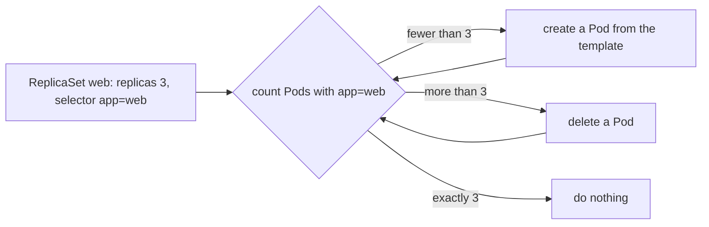

## Bạn cần biết trước

- [[k8s.l1.labels]] — bạn biết một label selector như `app=web` chọn ra mọi Pod có label khớp, bất kể Pod tên là gì.
- [[k8s.l1.control-plane-components]] — bạn biết các thành phần của Kubernetes chạy control loop, so trạng thái mong muốn với thực tế rồi hành động trên phần chênh lệch.

## Tình huống

Pod `web` từ những bài đầu vẫn đang chạy trong `default`. Bạn xóa nó bằng `kubectl delete pod web`, giống như một máy bị sập hay một lệnh gõ nhầm có thể xóa nó. Rồi bạn chờ. Không có gì quay lại: `kubectl get pod web` trả lời `NotFound`, và cứ thế cho tới khi có người apply lại `web-pod.yaml`. Đó không phải điều bạn muốn cho web server của Đơn Hàng, vốn phải luôn có ba bản chạy dù chuyện gì xảy ra với một bản. Cluster có control loop, vậy sao không loop nào đưa `web` trở lại, và cái gì sẽ làm được việc đó?

## Khái niệm cốt lõi

- **ReplicaSet** (object Kubernetes giữ đủ một số Pod giống nhau đang chạy, tạo Pod mới từ Pod template khi thiếu) — một object Kubernetes giữ cho đúng một số lượng Pod khớp label selector của nó luôn chạy, tạo Pod mới khi thiếu và bỏ bớt khi thừa.
- **Pod template** (phần mô tả Pod bên trong ReplicaSet hay Deployment, dùng làm khuôn cho mọi Pod nó tạo) — phần mô tả Pod bên trong ReplicaSet, nằm dưới `spec.template`, từ đó nó tạo ra mọi Pod mới.
- `replicas` — số Pod khớp selector mà ReplicaSet muốn có.

## Cơ chế hoạt động



Trong tình huống trên, Pod `web` không có chủ: không object nào khác muốn nó tồn tại. Một Pod được tạo riêng lẻ như vậy gọi là Pod đơn lẻ (bare Pod). Trong cluster không có gì khai báo "phải có một Pod tên `web`" ngoài chính Pod đó, nên khi nó bị xóa, không control loop nào còn trạng thái mong muốn để khôi phục.

ReplicaSet cung cấp trạng thái mong muốn đó. Manifest của nó nói ba điều: `replicas`, muốn bao nhiêu Pod; một label selector, Pod nào được tính; và một Pod template, Pod mới trông thế nào. Một control loop dành cho ReplicaSet so `replicas` với số Pod mà selector khớp, lặp đi lặp lại. Loop đó chạy trong control plane và, giống kube-scheduler, chỉ đọc và thay đổi cluster qua API server. Với `replicas: 3` và chưa có Pod nào khớp, nó tạo ba Pod từ template. Mỗi Pod mang label của template, nên Pod nào cũng được tính.

Label của template phải khớp selector, nếu không thì các Pod ReplicaSet tạo ra sẽ không được tính là của nó. API server từ chối manifest như vậy ngay khi bạn apply.

Xóa một trong ba Pod, loop thấy có hai trong khi muốn ba. Nó tạo một Pod thay thế từ template. Pod thay thế là một Pod mới: nó có tên mới, là tên ReplicaSet cộng một đuôi ngẫu nhiên, và được cấp địa chỉ IP riêng; không có gì giữ lại địa chỉ của Pod cũ cho nó.

Đổi `replicas` là đổi mục tiêu, nên apply `replicas: 4` thêm một Pod và `replicas: 2` bớt một Pod. Chỉ đổi template thì khác: các Pod đang chạy vẫn khớp selector, nên số lượng vẫn đúng và không có gì xảy ra với chúng. Chỉ các Pod được tạo sau đó mới dùng template mới.

## Trong hệ thống Đơn Hàng

ReplicaSet cho web server của Đơn Hàng:

```yaml file=deploy/k8s/lessons/web-replicaset.yaml tag=stage-2 lines=1-24
# lesson: k8s.l1.replicasets
# Keep 3 Pods labelled app: web running. The selector says which Pods count;
# the template is what each new Pod is created from, and its labels must
# match the selector.
apiVersion: apps/v1
kind: ReplicaSet
metadata:
  name: web
  namespace: donhang
spec:
  replicas: 3
  selector:
    matchLabels:
      app: web
  template:
    metadata:
      labels:
        app: web
    spec:
      containers:
        - name: web
          image: caddy:2.10.0
          ports:
            - containerPort: 80
```

`selector.matchLabels` chứa selector `app=web`. Mọi thứ dưới `template` là một manifest Pod không có `apiVersion` và `kind`: label ở dòng 18 khớp selector, còn container vẫn là `caddy:2.10.0` mà Pod `web` từng chạy.

`scripts/k8s/replicaset.sh` trước hết apply `web-pod.yaml` mà không in gì, rồi xóa Pod đơn lẻ `web`, apply ReplicaSet này và chờ đủ ba Pod. Nửa sau của script:

```bash file=scripts/k8s/replicaset.sh tag=stage-2 lines=27-51
# Delete one of its Pods: the ReplicaSet sees 2 where it wants 3 and creates one.
before=$(web_pods)
victim=$(echo "$before" | head -n 1 | cut -d' ' -f1)
show kubectl delete pod "$victim" -n donhang
wait_for_3
after=$(web_pods)
show kubectl get pods -n donhang -l app=web
echo "Pods labelled app=web now: $(echo "$after" | wc -l)"
echo "The deleted Pod's name is still in use: $(echo "$after" | grep -q "^$victim " && echo yes || echo no)"
echo "Pods with a name and an IP address not seen before: $(comm -13 <(echo "$before") <(echo "$after") | wc -l)"
echo

# The template's labels must match the selector; here the template says
# app=website. --dry-run=server: the API server checks it and stores nothing.
echo "\$ kubectl apply --dry-run=server -f - (web-replicaset.yaml, template labelled app: website)"
sed 's/^        app: web$/        app: website/' deploy/k8s/lessons/web-replicaset.yaml \
  | kubectl apply --dry-run=server -f - 2>&1 || true
echo

# replicas: 4 adds a Pod. A new image in the template changes no running Pod.
echo "\$ kubectl apply -f - (web-replicaset.yaml with replicas: 4 and image caddy:2.10.2)"
sed -e 's/replicas: 3/replicas: 4/' -e 's/caddy:2.10.0/caddy:2.10.2/' deploy/k8s/lessons/web-replicaset.yaml \
  | kubectl apply -f -
kubectl wait --for=jsonpath='{.status.readyReplicas}'=4 replicaset/web -n donhang --timeout=120s >/dev/null
show kubectl get pods -n donhang -l app=web --sort-by=.spec.containers[0].image -o custom-columns=NAME:.metadata.name,IMAGE:.spec.containers[0].image
```

`show` in lệnh ra trước khi chạy. `web_pods` liệt kê tên và địa chỉ IP của từng Pod `app=web`, còn `wait_for_3` chờ tới khi có ba Pod ready; cả hai được định nghĩa ở đầu script. `sed` sửa manifest trên đường tới `kubectl apply -f -`, lệnh này đọc manifest từ pipe, nên file trong Git không bao giờ đổi.

`victim` là tên của Pod đầu tiên. Ba dòng `echo` đếm số Pod, kiểm tra tên vừa xóa còn trong danh sách không, và đếm các cặp tên và địa chỉ chỉ xuất hiện sau khi xóa. Dòng `kubectl wait` chờ tới khi bốn Pod ready, còn lệnh cuối liệt kê tên và image của từng Pod, sắp theo image. Toàn bộ output:

```text output=true
$ kubectl delete pod web
pod "web" deleted from default namespace
$ kubectl get pod web
Error from server (NotFound): pods "web" not found

$ kubectl apply -f deploy/k8s/lessons/web-replicaset.yaml
replicaset.apps/web created
$ kubectl get replicaset web -n donhang
NAME   DESIRED   CURRENT   READY   AGE
web    3         3         3       ...
$ kubectl get pods -n donhang -l app=web
NAME      READY   STATUS    RESTARTS   AGE
web-...   1/1     Running   0          ...
web-...   1/1     Running   0          ...
web-...   1/1     Running   0          ...

$ kubectl delete pod web-... -n donhang
pod "web-..." deleted from donhang namespace
$ kubectl get pods -n donhang -l app=web
NAME      READY   STATUS    RESTARTS   AGE
web-...   1/1     Running   0          ...
web-...   1/1     Running   0          ...
web-...   1/1     Running   0          ...
Pods labelled app=web now: 3
The deleted Pod's name is still in use: no
Pods with a name and an IP address not seen before: 1

$ kubectl apply --dry-run=server -f - (web-replicaset.yaml, template labelled app: website)
The ReplicaSet "web" is invalid: spec.template.metadata.labels: Invalid value: {"app":"website"}: `selector` does not match template `labels`

$ kubectl apply -f - (web-replicaset.yaml with replicas: 4 and image caddy:2.10.2)
replicaset.apps/web configured
$ kubectl get pods -n donhang -l app=web --sort-by=.spec.containers[0].image -o custom-columns=NAME:.metadata.name,IMAGE:.spec.containers[0].image
NAME      IMAGE
web-...   caddy:2.10.0
web-...   caddy:2.10.0
web-...   caddy:2.10.0
web-...   caddy:2.10.2
```

Đọc output theo bốn phần. Pod đơn lẻ `web` vẫn `NotFound`, trong khi `DESIRED`, `CURRENT` và `READY` của ReplicaSet đều lên 3: `CURRENT` đếm các Pod của nó đang tồn tại và không trong lúc tắt, `READY` đếm những Pod trong số đó đã ready. Sau khi xóa một Pod lại có ba, tên cũ đã biến mất, và có đúng một cặp tên cùng địa chỉ IP mới. Template sai bị API server từ chối. Cuối cùng, `replicas: 4` với image mới cho ra ba Pod vẫn chạy `caddy:2.10.0` và một Pod mới chạy `caddy:2.10.2`. `...` che đuôi tên ngẫu nhiên và cột tuổi.

## Người mới hay nghĩ rằng…

- **"Kubernetes luôn đưa Pod bị xóa trở lại, kể cả Pod tôi tạo riêng lẻ."** → Thực ra chỉ một chủ sở hữu có số lượng mong muốn, như ReplicaSet, mới tạo lại Pod; Pod đơn lẻ thì không có chủ nào. Bạn sẽ nhận ra khi `kubectl get pod web` cứ trả lời `NotFound` sau khi xóa.
- **"Pod thay thế chính là Pod cũ được khởi động lại, cùng tên và cùng địa chỉ IP."** → Thực ra ReplicaSet tạo một Pod mới từ template, với tên mới và địa chỉ IP riêng của nó. Bạn sẽ nhận ra khi script báo tên vừa xóa không còn được dùng và có một Pod mới.
- **"Đổi image trong Pod template của ReplicaSet sẽ cập nhật các Pod nó đang chạy."** → Thực ra các Pod đang chạy vẫn khớp selector, nên ReplicaSet để yên chúng; chỉ Pod mới dùng template mới. Bạn sẽ nhận ra khi ba Pod vẫn hiện `caddy:2.10.0` sau khi bạn đã apply `caddy:2.10.2`.

## Thử ngay (3 phút)

Khi cluster `donhang` đang chạy và trong `donhang` không có gì khác mang label `app=web`, trong thư mục `don-hang`, ở shell bạn dùng cho `kubectl`.

1. Chạy `scripts/k8s/replicaset.sh`. Trước hết nó apply `web-pod.yaml`, tạo lại Pod đơn lẻ `web` nếu đã mất, nên output vẫn khớp dù bạn đã xóa `web`, và cuối cùng nó gỡ ReplicaSet của mình.
2. Chạy `kubectl apply -f deploy/k8s/lessons/web-replicaset.yaml`, rồi `kubectl get pods -n donhang -l app=web -o wide`. `-o wide` thêm cột `IP`. Ghi lại tên và địa chỉ.
3. Xóa cả ba cùng lúc: `kubectl delete pods -n donhang -l app=web`.
4. Chạy lại `kubectl get pods -n donhang -l app=web -o wide`, rồi dọn dẹp bằng `kubectl delete -f deploy/k8s/lessons/web-replicaset.yaml`.

Kết quả mong đợi: bước 1 khớp với output ở trên, trừ các phần bị che. Ở bước 4 lại có ba Pod, có thể vẫn đang khởi động, không tên nào từ bước 2 quay lại, và cột `IP` hiện địa chỉ mà các Pod mới được cấp.

## Liên hệ

- [[k8s.l1.control-plane-components]] — loop của ReplicaSet là thêm một control loop: số lượng mong muốn so với thực tế.
- [[k8s.l1.labels]] — selector từ bài đó là cách ReplicaSet quyết định Pod nào là của mình.
- [[k8s.l1.deployments]] — bài tiếp theo: object bạn thường viết thay vào đó, nó tạo và quản lý một ReplicaSet giúp bạn.

## Tóm tắt 5 dòng

1. ReplicaSet giữ cho một số lượng Pod khớp selector của nó luôn chạy; Pod đơn lẻ một khi bị xóa là mất hẳn.
2. Manifest của nó khai báo `replicas`, một label selector và một Pod template có label phải khớp selector đó.
3. Pod bị xóa được thay bằng một Pod mới từ template, với tên mới và địa chỉ IP riêng.
4. Đổi `replicas` sẽ thêm hoặc bớt Pod.
5. Chỉ đổi template thì Pod đang chạy không bị đụng tới; chỉ Pod tạo sau đó mới dùng nó.
