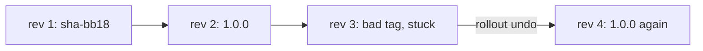

## Before you start

- [[k8s.l1.rolling-updates]] — you know a template change moves the api's Pods to a new ReplicaSet a few at a time, and the old ReplicaSet stays, scaled to 0.

## The situation

The api runs `1.0.0`. Someone edits the manifest to a new `sha-` tag, mistypes it, and applies it, although no image was ever pushed under that tag. A new Pod appears and never starts. The two `1.0.0` Pods still answer, but `kubectl rollout status` waits and waits. Will Kubernetes notice the broken version and go back on its own? If not, what is the fastest safe way back to the version that worked, and what does that leave in Git?

## Core concepts

- **rollout history** — the numbered revisions a Deployment keeps, one per Pod template it has run, each kept in a ReplicaSet; the old ones are scaled to 0, so it can go back to an earlier one.
- `ImagePullBackOff` — the status of a container whose image could not be pulled; the kubelet waits longer and longer before each new try.
- `kubectl rollout undo` — the command that makes the previous revision's Pod template the current one again.

## How it works



In the situation above, the Deployment already keeps a history. Each Pod template it has run is a numbered revision, kept in a ReplicaSet: here revision 1 is the `sha-bb18…` build and revision 2 is `1.0.0`. Old revisions sit at 0 Pods, up to `revisionHistoryLimit` of them, a field of the Deployment that defaults to 10. `kubectl rollout history` lists the numbers.

The bad tag starts a rolling update like any other. The kubelet cannot pull an image that does not exist, so the new Pod shows `ErrImagePull` right after a failed pull and `ImagePullBackOff` while it waits to retry. With two replicas, none may be missing, so neither old Pod is removed, and the api keeps working on `1.0.0`.

Kubernetes does not roll back on its own. It keeps retrying, and after a deadline, a Deployment setting unrelated to the script's 10-second timeout, it only reports the update as not progressing, under `Conditions` in `kubectl describe deployment api -n donhang`. The update stays stuck until someone acts.

`kubectl rollout undo` is that action. It makes the previous revision's template current again, so the `1.0.0` ReplicaSet becomes the current one. Here it still runs both Pods, so the Deployment only scales the bad one down to 0; had it been at 0, the Deployment would scale it back up. No image is built: that template names an image that already exists. The template moves to the end of the history under a new number, so 2 disappears and 4 appears.

The undo changes only the cluster. The file in Git still names the bad tag, so applying it again brings it back. Fix the manifest and apply it, or apply the last good one, so that Git and the cluster agree.

## In the Đơn Hàng system

The broken manifest, standing in for the api manifest after the mistyped edit:

```yaml file=deploy/k8s/lessons/api-deployment-bad-tag.yaml tag=stage-2 lines=1-21
# lesson: k8s.l1.rollbacks
# api-deployment-1.0.0.yaml with a tag that was never pushed: no commit has
# this id. A node cannot pull it, so the new Pod never starts.
apiVersion: apps/v1
kind: Deployment
metadata:
  name: api
  namespace: donhang
spec:
  replicas: 2
  selector:
    matchLabels:
      app: api
  template:
    metadata:
      labels:
        app: api
    spec:
      containers:
        - name: api
          image: ghcr.io/duyan11110/donhang-api:sha-0000000000000000000000000000000000000000
```

The tag is `sha-` followed by forty zeros. `scripts/k8s/rollback.sh` first applies two manifests, creating revision 1 (`sha-bb18…`) and revision 2 (`1.0.0`), and lists the history. Then:

```bash file=scripts/k8s/rollback.sh tag=stage-2 lines=19-43
show kubectl apply -f deploy/k8s/lessons/api-deployment-bad-tag.yaml
# Wait until the kubelet has failed to pull the image and is waiting to try again.
for _ in $(seq 360); do
  kubectl get pods -n donhang -l app=api \
    -o jsonpath='{.items[*].status.containerStatuses[0].state.waiting.reason}' | grep -q ImagePullBackOff && break
  sleep 0.5
done
# The new Pod cannot start; both 1.0.0 Pods keep running.
show kubectl get pods -n donhang -l app=api --sort-by=.status.phase
# Kubernetes only waits: the update is stuck, not undone.
show kubectl rollout status deployment/api -n donhang --timeout=10s || true
echo

show kubectl rollout history deployment/api -n donhang
# Revision 2 (1.0.0) becomes current again, as revision 4.
show kubectl rollout undo deployment/api -n donhang
kubectl rollout status deployment/api -n donhang --timeout=300s >/dev/null
show kubectl rollout history deployment/api -n donhang
show kubectl get deployment api -n donhang -o wide
echo

# Git still says the bad tag was the last change applied: apply the 1.0.0
# manifest again, so that the manifest last applied is the one that runs.
show kubectl apply -f deploy/k8s/lessons/api-deployment-1.0.0.yaml
kubectl rollout status deployment/api -n donhang --timeout=300s >/dev/null
```

`show` prints a command before running it. The loop reads each Pod's waiting reason twice a second, for up to three minutes, until one is `ImagePullBackOff`. `rollout status` gets ten seconds, and `|| true` keeps its timeout from stopping the script. Its output:

```text output=true
$ kubectl rollout history deployment/api -n donhang
deployment.apps/api 
REVISION   CHANGE-CAUSE
1          <none>
2          <none>

$ kubectl apply -f deploy/k8s/lessons/api-deployment-bad-tag.yaml
deployment.apps/api configured
$ kubectl get pods -n donhang -l app=api --sort-by=.status.phase
NAME          READY   STATUS             RESTARTS   AGE
api-...-...   0/1     ImagePullBackOff   0          ...
api-...-...   1/1     Running            0          ...
api-...-...   1/1     Running            0          ...
$ kubectl rollout status deployment/api -n donhang --timeout=10s
Waiting for deployment "api" rollout to finish: 1 out of 2 new replicas have been updated...
error: timed out waiting for the condition

$ kubectl rollout history deployment/api -n donhang
deployment.apps/api 
REVISION   CHANGE-CAUSE
1          <none>
2          <none>
3          <none>

$ kubectl rollout undo deployment/api -n donhang
deployment.apps/api rolled back
$ kubectl rollout history deployment/api -n donhang
deployment.apps/api 
REVISION   CHANGE-CAUSE
1          <none>
3          <none>
4          <none>

$ kubectl get deployment api -n donhang -o wide
NAME   READY   UP-TO-DATE   AVAILABLE   AGE   CONTAINERS   IMAGES                                 SELECTOR
api    2/2     2            2           ...   api          ghcr.io/duyan11110/donhang-api:1.0.0   app=api

$ kubectl apply -f deploy/k8s/lessons/api-deployment-1.0.0.yaml
deployment.apps/api configured
```

There are two revisions at first; the bad tag leaves one Pod in `ImagePullBackOff` while both `1.0.0` Pods run, and `rollout status` times out without anything being undone. The bad template is revision 3. After the undo, revision 2 is gone from the list and the same template appears as revision 4. The Deployment is back on `1.0.0` with two Pods. `CHANGE-CAUSE` would show a note on why each revision was made; Đơn Hàng sets none, so it stays `<none>`. The last apply changes no Pod and adds no revision, since its template is already current; it records `api-deployment-1.0.0.yaml` as the manifest last applied, so Git and the cluster agree on `1.0.0`.

## Beginners often think…

- **"Kubernetes rolls back by itself when the new Pods fail."** → Actually it keeps waiting and, after a deadline, only reports the update as not progressing. You notice this when `rollout status` times out and the Pod stays in `ImagePullBackOff` until you run `kubectl rollout undo`.
- **"Rolling back also reverts the manifest file in Git."** → Actually the undo changes only the Deployment in the cluster; the file still names the bad tag. You notice this when applying that file again brings the broken Pod back.
- **"A rollback has to rebuild the old image."** → Actually it reuses the old ReplicaSet, whose template names an image that already exists in the registry. You notice this when the undo finishes within seconds and `IMAGES` shows `1.0.0` again.

## Try it (3 minutes)

With the `donhang` cluster running, in the `don-hang` folder, in the shell you use for `kubectl`. The script re-creates the Deployment `api` itself.

1. Run `scripts/k8s/rollback.sh`.
2. Run `kubectl get replicasets -n donhang -l app=api -o wide`.
3. Run `kubectl rollout history deployment/api -n donhang`.

Expected result: step 1 matches the output above. Step 2 lists three ReplicaSets, one per image: `1.0.0` at 2, and the `sha-bb18…` and `sha-0000…` ones at 0. Step 3 still lists revisions 1, 3 and 4: the script's last apply named the template that was already current, so it added no revision.

## Connections

- [[k8s.l1.rolling-updates]] — the old ReplicaSets kept there are what an undo makes current again here.
- [[k8s.l1.deploying-an-image-tag]] — a tag names one build; going back means naming the previous one, in the cluster and in Git.
- [[k8s.l1.configmaps]] — next module: the api gets its real settings, and new changes to roll out and back.

## Five-line summary

1. `kubectl rollout undo` makes the previous revision current again; its old ReplicaSet becomes current and the bad one goes to 0.
2. A Deployment keeps old ReplicaSets at 0 as numbered revisions, up to `revisionHistoryLimit`, 10 by default.
3. A tag that does not exist leaves the new Pod in `ImagePullBackOff`; with two replicas, both old Pods keep running.
4. Kubernetes does not roll back on its own; a stuck update stays stuck until someone acts.
5. After an undo, Git still names the bad tag; fix and apply the manifest, or the next apply brings it back.
