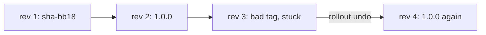

## Bạn cần biết trước

- [[k8s.l1.rolling-updates]] — bạn biết đổi template sẽ chuyển dần các Pod của api sang một ReplicaSet mới, và ReplicaSet cũ vẫn còn, ở mức 0.

## Tình huống

api đang chạy `1.0.0`. Ai đó sửa manifest sang một tag `sha-` mới, gõ nhầm, rồi apply, dù chưa từng có image nào được push dưới tag đó. Một Pod mới xuất hiện và không bao giờ khởi động được. Hai Pod `1.0.0` vẫn trả lời, nhưng `kubectl rollout status` cứ chờ mãi. Kubernetes có nhận ra bản lỗi và tự quay lại không? Nếu không, cách nhanh và an toàn nhất để về lại phiên bản từng chạy tốt là gì, và nó để lại gì trong Git?

## Khái niệm cốt lõi

- **rollout history** (các revision một Deployment giữ lại, ReplicaSet cũ ở 0 Pod, để quay lui về bản trước) — các revision có đánh số mà một Deployment giữ lại, mỗi revision ứng với một Pod template nó từng chạy và được giữ trong một ReplicaSet; các ReplicaSet cũ ở mức 0, để Deployment có thể quay về bản trước.
- `ImagePullBackOff` — trạng thái của container không kéo được image; kubelet chờ ngày càng lâu hơn trước mỗi lần thử lại.
- `kubectl rollout undo` — lệnh làm Pod template của revision trước trở lại thành template hiện hành.

## Cơ chế hoạt động



Trong tình huống trên, Deployment đã có sẵn một lịch sử. Mỗi Pod template nó từng chạy là một revision có số, được giữ trong một ReplicaSet: ở đây revision 1 là bản build `sha-bb18…` và revision 2 là `1.0.0`. Các revision cũ nằm ở 0 Pod, tối đa `revisionHistoryLimit` cái, một field của Deployment có mặc định là 10. `kubectl rollout history` liệt kê các số đó.

Tag lỗi khởi động một rolling update như mọi lần khác. kubelet không kéo được image không tồn tại, nên Pod mới hiện `ErrImagePull` ngay sau lần kéo thất bại và `ImagePullBackOff` trong lúc chờ thử lại. Với hai replica, không được thiếu Pod nào, nên không Pod cũ nào bị gỡ, và api vẫn chạy trên `1.0.0`.

Kubernetes không tự quay lui. Nó cứ thử lại, và sau một hạn chót, một thiết lập của Deployment không liên quan gì tới timeout 10 giây trong script, nó chỉ báo cập nhật không tiến triển, ở phần `Conditions` của `kubectl describe deployment api -n donhang`. Cập nhật cứ kẹt như vậy cho tới khi có người hành động.

`kubectl rollout undo` chính là hành động đó. Nó làm template của revision trước trở lại hiện hành, nên ReplicaSet `1.0.0` thành ReplicaSet hiện hành. Ở đây nó vẫn đang chạy cả hai Pod, nên Deployment chỉ scale ReplicaSet lỗi về 0; nếu nó đang ở 0, Deployment sẽ scale nó lên lại. Không image nào được build: template đó gọi tên một image đã có sẵn. Template chuyển xuống cuối lịch sử với một số mới, nên số 2 biến mất và số 4 xuất hiện.

Undo chỉ thay đổi cluster. File trong Git vẫn ghi tag lỗi, nên apply lại file đó sẽ đem tag lỗi quay về. Hãy sửa manifest rồi apply, hoặc apply bản tốt gần nhất, để Git và cluster khớp nhau.

## Trong hệ thống Đơn Hàng

Manifest bị lỗi, đóng vai manifest api sau lần sửa gõ nhầm:

```yaml file=deploy/k8s/lessons/api-deployment-bad-tag.yaml tag=stage-2 lines=1-21
# lesson: k8s.l1.rollbacks
# api-deployment-1.0.0.yaml with a tag that was never pushed: no commit has
# this id. A node cannot pull it, so the new Pod never starts.
apiVersion: apps/v1
kind: Deployment
metadata:
  name: api
  namespace: donhang
spec:
  replicas: 2
  selector:
    matchLabels:
      app: api
  template:
    metadata:
      labels:
        app: api
    spec:
      containers:
        - name: api
          image: ghcr.io/duyan11110/donhang-api:sha-0000000000000000000000000000000000000000
```

Tag là `sha-` theo sau bởi bốn mươi số 0. `scripts/k8s/rollback.sh` trước hết apply hai manifest, tạo revision 1 (`sha-bb18…`) và revision 2 (`1.0.0`), rồi liệt kê lịch sử. Sau đó:

```bash file=scripts/k8s/rollback.sh tag=stage-2 lines=19-43
show kubectl apply -f deploy/k8s/lessons/api-deployment-bad-tag.yaml
# Wait until the kubelet has failed to pull the image and is waiting to try again.
for _ in $(seq 360); do
  kubectl get pods -n donhang -l app=api \
    -o jsonpath='{.items[*].status.containerStatuses[0].state.waiting.reason}' | grep -q ImagePullBackOff && break
  sleep 0.5
done
# The new Pod cannot start; both 1.0.0 Pods keep running.
show kubectl get pods -n donhang -l app=api --sort-by=.status.phase
# Kubernetes only waits: the update is stuck, not undone.
show kubectl rollout status deployment/api -n donhang --timeout=10s || true
echo

show kubectl rollout history deployment/api -n donhang
# Revision 2 (1.0.0) becomes current again, as revision 4.
show kubectl rollout undo deployment/api -n donhang
kubectl rollout status deployment/api -n donhang --timeout=300s >/dev/null
show kubectl rollout history deployment/api -n donhang
show kubectl get deployment api -n donhang -o wide
echo

# Git still says the bad tag was the last change applied: apply the 1.0.0
# manifest again, so that the manifest last applied is the one that runs.
show kubectl apply -f deploy/k8s/lessons/api-deployment-1.0.0.yaml
kubectl rollout status deployment/api -n donhang --timeout=300s >/dev/null
```

`show` in lệnh ra trước khi chạy. Vòng lặp đọc lý do chờ của từng Pod hai lần mỗi giây, tối đa ba phút, tới khi có Pod ở `ImagePullBackOff`. `rollout status` được cho mười giây, và `|| true` giữ cho lần hết giờ của nó không làm script dừng. Output của nó:

```text output=true
$ kubectl rollout history deployment/api -n donhang
deployment.apps/api 
REVISION   CHANGE-CAUSE
1          <none>
2          <none>

$ kubectl apply -f deploy/k8s/lessons/api-deployment-bad-tag.yaml
deployment.apps/api configured
$ kubectl get pods -n donhang -l app=api --sort-by=.status.phase
NAME          READY   STATUS             RESTARTS   AGE
api-...-...   0/1     ImagePullBackOff   0          ...
api-...-...   1/1     Running            0          ...
api-...-...   1/1     Running            0          ...
$ kubectl rollout status deployment/api -n donhang --timeout=10s
Waiting for deployment "api" rollout to finish: 1 out of 2 new replicas have been updated...
error: timed out waiting for the condition

$ kubectl rollout history deployment/api -n donhang
deployment.apps/api 
REVISION   CHANGE-CAUSE
1          <none>
2          <none>
3          <none>

$ kubectl rollout undo deployment/api -n donhang
deployment.apps/api rolled back
$ kubectl rollout history deployment/api -n donhang
deployment.apps/api 
REVISION   CHANGE-CAUSE
1          <none>
3          <none>
4          <none>

$ kubectl get deployment api -n donhang -o wide
NAME   READY   UP-TO-DATE   AVAILABLE   AGE   CONTAINERS   IMAGES                                 SELECTOR
api    2/2     2            2           ...   api          ghcr.io/duyan11110/donhang-api:1.0.0   app=api

$ kubectl apply -f deploy/k8s/lessons/api-deployment-1.0.0.yaml
deployment.apps/api configured
```

Lúc đầu có hai revision; tag lỗi để lại một Pod ở `ImagePullBackOff` trong khi cả hai Pod `1.0.0` vẫn chạy, và `rollout status` hết giờ mà không có gì được hoàn tác. Template lỗi là revision 3. Sau undo, revision 2 biến khỏi danh sách và cùng template đó xuất hiện dưới số 4. Deployment trở lại `1.0.0` với hai Pod. `CHANGE-CAUSE` lẽ ra ghi lý do tạo từng revision; Đơn Hàng không đặt, nên nó là `<none>`. Lần apply cuối không đổi Pod nào và không thêm revision, vì template của nó đã là hiện hành; nó ghi nhận `api-deployment-1.0.0.yaml` là manifest được apply gần nhất, nên Git và cluster khớp nhau ở `1.0.0`.

## Người mới hay nghĩ rằng…

- **"Kubernetes tự quay lui khi Pod mới lỗi."** → Thực ra nó cứ chờ và, sau một hạn chót, chỉ báo cập nhật không tiến triển. Bạn sẽ nhận ra khi `rollout status` hết giờ và Pod vẫn ở `ImagePullBackOff` cho tới khi bạn chạy `kubectl rollout undo`.
- **"Quay lui cũng đưa file manifest trong Git về như cũ."** → Thực ra undo chỉ đổi Deployment trong cluster; file vẫn ghi tag lỗi. Bạn sẽ nhận ra khi apply lại file đó đem Pod lỗi quay về.
- **"Quay lui phải build lại image cũ."** → Thực ra nó dùng lại ReplicaSet cũ, với template gọi tên một image đã có sẵn trong registry. Bạn sẽ nhận ra khi undo xong trong vài giây và `IMAGES` lại hiện `1.0.0`.

## Thử ngay (3 phút)

Khi cluster `donhang` đang chạy, trong thư mục `don-hang`, ở shell bạn dùng cho `kubectl`. Script tự tạo lại Deployment `api`.

1. Chạy `scripts/k8s/rollback.sh`.
2. Chạy `kubectl get replicasets -n donhang -l app=api -o wide`.
3. Chạy `kubectl rollout history deployment/api -n donhang`.

Kết quả mong đợi: bước 1 khớp với output ở trên. Bước 2 liệt kê ba ReplicaSet, mỗi cái một image: `1.0.0` ở mức 2, còn `sha-bb18…` và `sha-0000…` ở mức 0. Bước 3 vẫn liệt kê revision 1, 3 và 4: lần apply cuối của script ghi template vốn đã là hiện hành, nên không thêm revision nào.

## Liên hệ

- [[k8s.l1.rolling-updates]] — các ReplicaSet cũ được giữ lại ở bài đó chính là thứ undo làm trở lại hiện hành ở đây.
- [[k8s.l1.deploying-an-image-tag]] — một tag chỉ một bản build; quay lại nghĩa là ghi tag trước đó, cả trong cluster lẫn trong Git.
- [[k8s.l1.configmaps]] — module tiếp theo: api nhận cấu hình thật, và có thêm những thay đổi mới để triển khai và quay lui.

## Tóm tắt 5 dòng

1. `kubectl rollout undo` làm revision trước trở lại hiện hành; ReplicaSet cũ của nó thành hiện hành và ReplicaSet lỗi về 0.
2. Deployment giữ các ReplicaSet cũ ở mức 0 thành các revision có số, tối đa `revisionHistoryLimit`, mặc định 10.
3. Tag không tồn tại để Pod mới kẹt ở `ImagePullBackOff`; với hai replica, cả hai Pod cũ vẫn chạy.
4. Kubernetes không tự quay lui; cập nhật bị kẹt sẽ kẹt mãi cho tới khi có người hành động.
5. Sau undo, Git vẫn ghi tag lỗi; hãy sửa và apply manifest, nếu không lần apply sau sẽ đem nó quay về.
