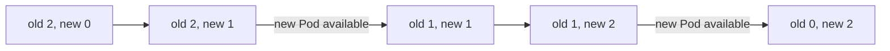

## Before you start

- [[k8s.l1.deploying-an-image-tag]] — you know the Deployment `api` runs two Pods of the image tagged `sha-bb18…`, pulled from GitHub Container Registry.

## The situation

Đơn Hàng's first release exists: the same api image now also carries the tag `1.0.0`. You are about to apply `api-deployment-1.0.0.yaml`, which, apart from comments, differs from the running manifest in a single line, the image tag. Two api Pods are serving right now. If Kubernetes stopped both and then started two new ones, the api would be gone for a while, and if the new version failed to start, it would stay gone. From the ReplicaSet lessons you also know that a changed template alone does not touch running Pods. So what does a Deployment do with its two running Pods when the tag changes?

## Core concepts

- **rolling update** — updating a Deployment by replacing its old Pods with new ones a few at a time, so the app keeps running while it changes.
- `maxSurge` — how many Pods above `replicas` may exist during the update; 25% by default.
- `maxUnavailable` — how many Pods below `replicas` may be unavailable during the update; 25% by default.

## How it works



In the situation above, the new tag changes the Pod template. Any change to the template, such as an image tag, makes the Deployment move its Pods to a ReplicaSet for that template: a new one, with its own template hash in the name, unless an old ReplicaSet already has exactly that template. Changing only `replicas` does not; it scales the existing ReplicaSet, as you saw with `web`.

The Deployment then moves the Pods across. Its default strategy, `RollingUpdate`, scales the new ReplicaSet up while it scales the old one down, so Pods of both versions run side by side for a while. Two numbers set the pace. `maxSurge` lets at most about a quarter more Pods than `replicas` exist, and `maxUnavailable` lets at most about a quarter fewer be available. For the two api Pods, the Deployment turns these limits into one extra Pod at a time and none missing: the diagram's five steps.

Applying the manifest returns at once; the update runs afterwards. `kubectl rollout status` waits until it has finished. Afterwards the old ReplicaSet is still there, scaled to 0 Pods: the Deployment keeps it.

One gap remains. Without a check of whether the api can actually serve, a new Pod counts as available as soon as its container is running. The update then moves on, and removes an old Pod, even if the new api is not ready to answer requests yet. The next module adds that check.

## In the Đơn Hàng system

The manifest for the release, `api-deployment-1.0.0.yaml`:

```yaml file=deploy/k8s/lessons/api-deployment-1.0.0.yaml tag=stage-2 lines=1-23
# lesson: k8s.l1.rolling-updates
# api-deployment.yaml with one change: the image tag, now the release 1.0.0.
# A new tag is a new Pod template, so applying this starts a rolling update.
apiVersion: apps/v1
kind: Deployment
metadata:
  name: api
  namespace: donhang
spec:
  replicas: 2
  selector:
    matchLabels:
      app: api
  template:
    metadata:
      labels:
        app: api
    spec:
      containers:
        - name: api
          image: ghcr.io/duyan11110/donhang-api:1.0.0
          ports:
            - containerPort: 8080
```

Compared with `api-deployment.yaml`, only the comments and the `image` line differ. The block stops before the `env` lines, which continue under the `api` container, inside the Pod template, and are the same in both files. There is no `strategy` section, so the defaults apply.

`scripts/k8s/rolling-update.sh` first re-creates the Deployment from `api-deployment.yaml` alone, and stores the name of its ReplicaSet as `old_rs`. Then:

```bash file=scripts/k8s/rolling-update.sh tag=stage-2 lines=20-44
show kubectl apply -f deploy/k8s/lessons/api-deployment-1.0.0.yaml

# Until the update is done, look at both ReplicaSets every moment: how many
# Pods each one wants and has ready.
both_ready=no
most_wanted=0
while :; do
  old_wanted=0 old_ready=0 new_wanted=0 new_ready=0
  while read -r name wanted ready; do
    if [ "$name" = "$old_rs" ]; then old_wanted=$wanted old_ready=${ready:-0}
    else new_wanted=$wanted new_ready=${ready:-0}; fi
  done < <(kubectl get replicaset -n donhang -l app=api \
             -o jsonpath='{range .items[*]}{.metadata.name} {.spec.replicas} {.status.readyReplicas}{"\n"}{end}')
  [ $((old_wanted + new_wanted)) -gt "$most_wanted" ] && most_wanted=$((old_wanted + new_wanted))
  [ "$old_ready" -ge 1 ] && [ "$new_ready" -ge 1 ] && both_ready=yes
  [ "$old_wanted" -eq 0 ] && [ "$new_ready" -eq 2 ] && break
  sleep 0.2
done
echo "While it ran: Pods of both versions were ready at the same time: $both_ready"
echo "While it ran: the most Pods both ReplicaSets wanted together: $most_wanted"
echo

show kubectl rollout status deployment/api -n donhang
# The old ReplicaSet stays, scaled to 0.
show kubectl get replicasets -n donhang -l app=api -o wide --sort-by=.spec.replicas
```

`show` prints a command before running it. The loop reads, again and again with a 0.2-second pause between reads, how many Pods each ReplicaSet wants and has ready. With no extra checks in this manifest, a Pod is available as soon as it is ready, so the script's `ready` and section 4's "available" mean the same here. It records whether both versions ever had a ready Pod at the same moment, and the largest total the two ReplicaSets wanted together. It stops once the old ReplicaSet wants none and the new one has two ready. Its output:

```text output=true
$ kubectl apply -f deploy/k8s/lessons/api-deployment-1.0.0.yaml
deployment.apps/api configured
While it ran: Pods of both versions were ready at the same time: yes
While it ran: the most Pods both ReplicaSets wanted together: 3

$ kubectl rollout status deployment/api -n donhang
deployment "api" successfully rolled out
$ kubectl get replicasets -n donhang -l app=api -o wide --sort-by=.spec.replicas
NAME      DESIRED   CURRENT   READY   AGE   CONTAINERS   IMAGES                                                                        SELECTOR
api-...   0         0         0       ...   api          ghcr.io/duyan11110/donhang-api:sha-bb184243e4cafed6ae833ca61710608366214aa5   app=api,pod-template-hash=...
api-...   2         2         2       ...   api          ghcr.io/duyan11110/donhang-api:1.0.0                                          app=api,pod-template-hash=...
```

`apply` answers `configured` at once. Pods of both versions were ready together, and the two ReplicaSets never wanted more than 3 Pods: `replicas` plus one. `rollout status` reports the update as finished. `-o wide` adds the `CONTAINERS`, `IMAGES` and `SELECTOR` columns, and `--sort-by=.spec.replicas` orders the rows by `replicas`. `SELECTOR` shows each ReplicaSet also selecting on a `pod-template-hash` label, which holds its template hash. At the end there are two ReplicaSets with different template hashes: the old one, on the `sha-` image, at 0, and the new one, on `1.0.0`, at 2.

## Beginners often think…

- **"Updating the image stops every old Pod first and then starts the new ones."** → Actually the default `RollingUpdate` adds new Pods before it removes old ones, within `maxSurge` and `maxUnavailable`. You notice this when the script reports Pods of both versions ready at the same time.
- **"The Deployment changes the image inside the Pods that already run."** → Actually it creates new Pods from a new ReplicaSet and deletes the old Pods. You notice this when `kubectl get replicasets` lists two ReplicaSets, one per image.
- **"When `kubectl apply` returns, the new version is already serving every request."** → Actually `apply` only stores the new template; the update runs afterwards. You notice this in Try it: right after `apply` in step 3 answers `configured`, the watch of step 2 still shows the ReplicaSet being replaced with `READY` above 0, for a few more seconds.

## Try it (3 minutes)

With the `donhang` cluster running, in the `don-hang` folder, in the shell you use for `kubectl`. Use two terminals.

1. Run `scripts/k8s/rolling-update.sh`.
2. In the second terminal, run `kubectl get replicasets -n donhang -l app=api -w`. `-w` keeps watching and prints a new line whenever a ReplicaSet changes.
3. In the first terminal, go back to the `sha-` tag: `kubectl apply -f deploy/k8s/lessons/api-deployment.yaml`, then `kubectl rollout status deployment/api -n donhang`.
4. Stop the watch with Ctrl+C, and apply `deploy/k8s/lessons/api-deployment-1.0.0.yaml` again so the cluster ends as the script left it.

Expected result: step 1 matches the output above, apart from the hidden names and ages. In step 2, while step 3 runs, the `DESIRED` of the two ReplicaSets changes one Pod at a time, the `sha-` one going up as the `1.0.0` one goes down. No third ReplicaSet appears: the template matches the old one again, so the Deployment scales that one back up.

## Connections

- [[k8s.l1.deployments]] — there, changing only `replicas` scaled one ReplicaSet; here a template change brings a second one.
- [[k8s.l1.deploying-an-image-tag]] — the tag that this update moves away from, and why it names one build.
- [[k8s.l1.rollbacks]] — next: the old ReplicaSet kept at 0 is what makes going back quick.

## Five-line summary

1. A rolling update replaces a Deployment's old Pods with new ones a few at a time, so the app keeps running.
2. A Pod template change moves the Pods to a ReplicaSet for that template, new unless an old one matches; changing only `replicas` does not.
3. By default `maxSurge` and `maxUnavailable` are 25%, so both versions run side by side for a while.
4. `kubectl rollout status` waits for the end; the old ReplicaSet stays, scaled to 0.
5. Without a check of whether the api can serve, a running container counts as available, and the update moves on.
