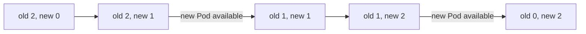

## Bạn cần biết trước

- [[k8s.l1.deploying-an-image-tag]] — bạn biết Deployment `api` chạy hai Pod của image mang tag `sha-bb18…`, được kéo từ GitHub Container Registry.

## Tình huống

Bản release đầu tiên của Đơn Hàng đã có: cùng image api đó giờ còn mang thêm tag `1.0.0`. Bạn sắp apply `api-deployment-1.0.0.yaml`, file mà ngoài phần comment chỉ khác manifest đang chạy đúng một dòng, tag của image. Lúc này hai Pod api đang phục vụ. Nếu Kubernetes dừng cả hai rồi mới khởi động hai Pod mới, api sẽ biến mất một lúc, và nếu bản mới không khởi động được thì nó mất luôn. Từ các bài ReplicaSet, bạn cũng biết chỉ đổi template thì không đụng tới Pod đang chạy. Vậy Deployment làm gì với hai Pod đang chạy khi tag thay đổi?

## Khái niệm cốt lõi

- **rolling update** (cập nhật bằng cách thay Pod cũ bằng Pod mới từng ít một, để app vẫn chạy trong lúc cập nhật) — cách cập nhật một Deployment bằng việc thay Pod cũ bằng Pod mới từng ít một, để app vẫn chạy trong lúc thay đổi.
- `maxSurge` — số Pod được phép có thêm so với `replicas` trong lúc cập nhật; mặc định 25%.
- `maxUnavailable` — số Pod được phép thiếu, không available, so với `replicas` trong lúc cập nhật; mặc định 25%.

## Cơ chế hoạt động



Trong tình huống trên, tag mới làm Pod template thay đổi. Mọi thay đổi trong template, như tag image, khiến Deployment chuyển các Pod sang một ReplicaSet dành cho template đó: một ReplicaSet mới, mang template hash riêng trong tên, trừ khi một ReplicaSet cũ đã có đúng template ấy. Chỉ đổi `replicas` thì không; nó scale ReplicaSet đang có, như bạn đã thấy với `web`.

Sau đó Deployment chuyển các Pod sang. Chiến lược mặc định của nó, `RollingUpdate`, scale ReplicaSet mới lên trong khi scale ReplicaSet cũ xuống, nên trong một lúc Pod của cả hai phiên bản chạy song song. Hai con số quyết định nhịp độ. `maxSurge` cho phép tối đa khoảng một phần tư Pod nhiều hơn `replicas`, còn `maxUnavailable` cho phép tối đa khoảng một phần tư Pod ít hơn ở trạng thái available. Với hai Pod api, Deployment quy các giới hạn này thành thừa một Pod mỗi lần và không thiếu Pod nào: năm bước trong sơ đồ.

Lệnh apply manifest trả về ngay; việc cập nhật chạy sau đó. `kubectl rollout status` chờ tới khi nó xong. Sau đó ReplicaSet cũ vẫn còn, ở mức 0 Pod: Deployment giữ nó lại.

Còn một khoảng trống. Khi chưa có bước kiểm tra api đã thật sự phục vụ được hay chưa, Pod mới được tính là available ngay khi container của nó chạy. Cập nhật khi đó đi tiếp, và gỡ một Pod cũ, dù api mới có thể chưa sẵn sàng trả lời request. Module sau sẽ thêm bước kiểm tra đó.

## Trong hệ thống Đơn Hàng

Manifest cho bản release, `api-deployment-1.0.0.yaml`:

```yaml file=deploy/k8s/lessons/api-deployment-1.0.0.yaml tag=stage-2 lines=1-23
# lesson: k8s.l1.rolling-updates
# api-deployment.yaml with one change: the image tag, now the release 1.0.0.
# A new tag is a new Pod template, so applying this starts a rolling update.
apiVersion: apps/v1
kind: Deployment
metadata:
  name: api
  namespace: donhang
spec:
  replicas: 2
  selector:
    matchLabels:
      app: api
  template:
    metadata:
      labels:
        app: api
    spec:
      containers:
        - name: api
          image: ghcr.io/duyan11110/donhang-api:1.0.0
          ports:
            - containerPort: 8080
```

So với `api-deployment.yaml`, chỉ có phần comment và dòng `image` là khác. Khối code dừng trước các dòng `env`, những dòng tiếp tục dưới container `api`, bên trong Pod template, và giống hệt nhau ở cả hai file. Không có mục `strategy` nào, nên giá trị mặc định được dùng.

`scripts/k8s/rolling-update.sh` trước hết tạo lại Deployment chỉ từ `api-deployment.yaml`, rồi lưu tên ReplicaSet của nó vào `old_rs`. Sau đó:

```bash file=scripts/k8s/rolling-update.sh tag=stage-2 lines=20-44
show kubectl apply -f deploy/k8s/lessons/api-deployment-1.0.0.yaml

# Until the update is done, look at both ReplicaSets every moment: how many
# Pods each one wants and has ready.
both_ready=no
most_wanted=0
while :; do
  old_wanted=0 old_ready=0 new_wanted=0 new_ready=0
  while read -r name wanted ready; do
    if [ "$name" = "$old_rs" ]; then old_wanted=$wanted old_ready=${ready:-0}
    else new_wanted=$wanted new_ready=${ready:-0}; fi
  done < <(kubectl get replicaset -n donhang -l app=api \
             -o jsonpath='{range .items[*]}{.metadata.name} {.spec.replicas} {.status.readyReplicas}{"\n"}{end}')
  [ $((old_wanted + new_wanted)) -gt "$most_wanted" ] && most_wanted=$((old_wanted + new_wanted))
  [ "$old_ready" -ge 1 ] && [ "$new_ready" -ge 1 ] && both_ready=yes
  [ "$old_wanted" -eq 0 ] && [ "$new_ready" -eq 2 ] && break
  sleep 0.2
done
echo "While it ran: Pods of both versions were ready at the same time: $both_ready"
echo "While it ran: the most Pods both ReplicaSets wanted together: $most_wanted"
echo

show kubectl rollout status deployment/api -n donhang
# The old ReplicaSet stays, scaled to 0.
show kubectl get replicasets -n donhang -l app=api -o wide --sort-by=.spec.replicas
```

`show` in lệnh ra trước khi chạy. Vòng lặp đọc đi đọc lại, nghỉ 0,2 giây giữa hai lần đọc, xem mỗi ReplicaSet muốn bao nhiêu Pod và có bao nhiêu Pod ready. Vì manifest này không có bước kiểm tra nào thêm, Pod available ngay khi nó ready, nên `ready` của script và "available" ở mục 4 ở đây là một. Script ghi lại liệu hai phiên bản có lúc nào cùng có Pod ready hay không, và tổng lớn nhất mà hai ReplicaSet cùng muốn. Nó dừng khi ReplicaSet cũ không muốn Pod nào và ReplicaSet mới có hai Pod ready. Output của nó:

```text output=true
$ kubectl apply -f deploy/k8s/lessons/api-deployment-1.0.0.yaml
deployment.apps/api configured
While it ran: Pods of both versions were ready at the same time: yes
While it ran: the most Pods both ReplicaSets wanted together: 3

$ kubectl rollout status deployment/api -n donhang
deployment "api" successfully rolled out
$ kubectl get replicasets -n donhang -l app=api -o wide --sort-by=.spec.replicas
NAME      DESIRED   CURRENT   READY   AGE   CONTAINERS   IMAGES                                                                        SELECTOR
api-...   0         0         0       ...   api          ghcr.io/duyan11110/donhang-api:sha-bb184243e4cafed6ae833ca61710608366214aa5   app=api,pod-template-hash=...
api-...   2         2         2       ...   api          ghcr.io/duyan11110/donhang-api:1.0.0                                          app=api,pod-template-hash=...
```

`apply` trả lời `configured` ngay. Pod của cả hai phiên bản đã có lúc cùng ready, và hai ReplicaSet chưa bao giờ muốn nhiều hơn 3 Pod: `replicas` cộng một. `rollout status` báo việc cập nhật đã xong. `-o wide` thêm các cột `CONTAINERS`, `IMAGES` và `SELECTOR`, còn `--sort-by=.spec.replicas` sắp các dòng theo `replicas`. `SELECTOR` cho thấy mỗi ReplicaSet còn chọn theo một label `pod-template-hash`, label chứa template hash của nó. Cuối cùng có hai ReplicaSet với template hash khác nhau: cái cũ, dùng image `sha-`, ở mức 0, và cái mới, dùng `1.0.0`, ở mức 2.

## Người mới hay nghĩ rằng…

- **"Cập nhật image sẽ dừng hết Pod cũ trước rồi mới khởi động Pod mới."** → Thực ra `RollingUpdate` mặc định thêm Pod mới trước khi gỡ Pod cũ, trong giới hạn của `maxSurge` và `maxUnavailable`. Bạn sẽ nhận ra khi script báo Pod của cả hai phiên bản cùng ready một lúc.
- **"Deployment đổi image bên trong các Pod đang chạy."** → Thực ra nó tạo Pod mới từ một ReplicaSet mới và xóa các Pod cũ. Bạn sẽ nhận ra khi `kubectl get replicasets` liệt kê hai ReplicaSet, mỗi cái một image.
- **"Khi `kubectl apply` trả về, phiên bản mới đã phục vụ mọi request."** → Thực ra `apply` chỉ lưu template mới; việc cập nhật chạy sau đó. Bạn sẽ nhận ra trong phần Thử ngay: ngay sau khi `apply` ở bước 3 trả lời `configured`, cửa sổ theo dõi ở bước 2 vẫn hiện ReplicaSet đang bị thay với `READY` lớn hơn 0, thêm vài giây nữa.

## Thử ngay (3 phút)

Khi cluster `donhang` đang chạy, trong thư mục `don-hang`, ở shell bạn dùng cho `kubectl`. Dùng hai cửa sổ terminal.

1. Chạy `scripts/k8s/rolling-update.sh`.
2. Ở terminal thứ hai, chạy `kubectl get replicasets -n donhang -l app=api -w`. `-w` tiếp tục theo dõi và in một dòng mới mỗi khi một ReplicaSet thay đổi.
3. Ở terminal thứ nhất, quay về tag `sha-`: `kubectl apply -f deploy/k8s/lessons/api-deployment.yaml`, rồi `kubectl rollout status deployment/api -n donhang`.
4. Dừng theo dõi bằng Ctrl+C, rồi apply lại `deploy/k8s/lessons/api-deployment-1.0.0.yaml` để cluster kết thúc đúng như script để lại.

Kết quả mong đợi: bước 1 khớp với output ở trên, trừ phần tên và cột tuổi bị che. Ở bước 2, trong lúc bước 3 chạy, `DESIRED` của hai ReplicaSet đổi từng Pod một, cái `sha-` tăng lên trong khi cái `1.0.0` giảm xuống. Không có ReplicaSet thứ ba nào xuất hiện: template lại khớp với cái cũ, nên Deployment scale chính cái đó lên lại.

## Liên hệ

- [[k8s.l1.deployments]] — ở đó, chỉ đổi `replicas` thì scale một ReplicaSet; ở đây đổi template thì có thêm ReplicaSet thứ hai.
- [[k8s.l1.deploying-an-image-tag]] — tag mà lần cập nhật này rời đi, và vì sao nó chỉ đúng một bản build.
- [[k8s.l1.rollbacks]] — bài tiếp theo: ReplicaSet cũ được giữ ở mức 0 là thứ giúp quay lại nhanh.

## Tóm tắt 5 dòng

1. Rolling update thay Pod cũ của Deployment bằng Pod mới từng ít một, nên app vẫn chạy.
2. Đổi Pod template sẽ chuyển Pod sang ReplicaSet của template đó, tạo mới trừ khi có cái cũ khớp; chỉ đổi `replicas` thì không.
3. Mặc định `maxSurge` và `maxUnavailable` là 25%, nên hai phiên bản chạy song song một lúc.
4. `kubectl rollout status` chờ tới khi xong; ReplicaSet cũ vẫn còn, ở mức 0.
5. Chưa có bước kiểm tra api phục vụ được chưa thì container đang chạy được tính là available, và cập nhật cứ thế đi tiếp.
