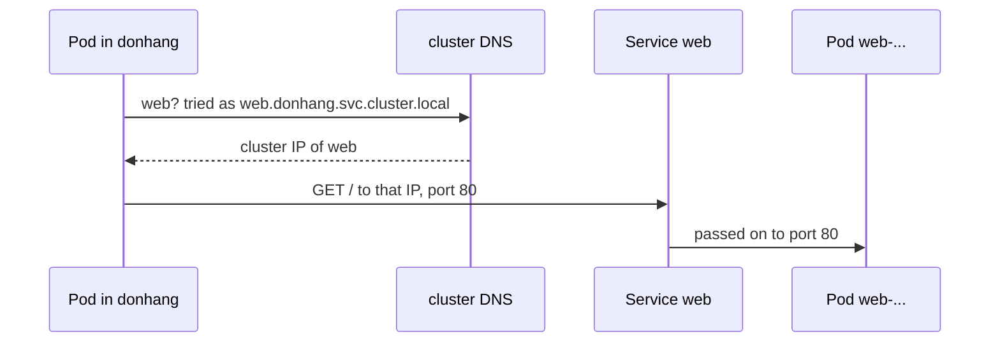

## Before you start

- [[k8s.l1.services]] — you know the Service `web` has a cluster IP that stays the same while the Pods behind it are replaced.
- [[foundation.l1.dns]] — you know a resolver turns a name into an IP address, and that a machine is told which resolver to ask.

## The situation

The Service `web` works, but to reach it the script first had to read its cluster IP with kubectl and pass the address on. A real client cannot do that. If you wrote `10.96.something` into the api's settings, a Service deleted and created again, or a fresh cluster, could get another address, and the settings would be wrong. In Compose, `api` never knew `db`'s address; it simply used the name `db`. Can a Pod inside the cluster also use a name like `web`, and who answers when it asks?

## Core concepts

- **cluster DNS** — the DNS server running inside the cluster, as Pods in `kube-system`, that answers Pods' lookups of Service names.
- `/etc/resolv.conf` — the file in each container that names the resolver to ask and the search domains to try.
- Search domain — a suffix the resolver adds to a short name and tries in turn, so `web` can become `web.donhang.svc.cluster.local`.

## How it works



In the situation above, the answer is yes, and the cluster itself answers. A cluster normally runs its own DNS server; in Đơn Hàng's cluster it runs as Pods in `kube-system`, reached through a Service called `kube-dns`. When the kubelet starts a Pod's containers, it writes their `/etc/resolv.conf` so that its `nameserver` line holds that Service's cluster IP. Every lookup in a Pod therefore goes to the cluster DNS first.

Each Service with a cluster IP, like `web`, gets the name `<service>.<namespace>.svc.cluster.local` in this cluster, which resolves to its cluster IP, not to a Pod. For Đơn Hàng's Service that is `web.donhang.svc.cluster.local`. The Pod then connects to that address on the Service's port 80, and the Service passes the connection on to `targetPort` 80 of one `web` Pod, as in the previous lesson.

Nobody types that every time, thanks to search domains. A Pod in `donhang` gets the search list `donhang.svc.cluster.local svc.cluster.local cluster.local`. Asked for the short name `web`, the resolver tries `web.donhang.svc.cluster.local` first and finds it. A Pod in `default` tries `web.default.svc.cluster.local` instead, which does not exist. The next tries, `web.svc.cluster.local` and `web.cluster.local`, do not exist either, because a Service's name always has its namespace between the Service and `svc`; so the short name fails there. Adding the namespace fixes it: `web.donhang` becomes `web.donhang.svc.cluster.local` through the second search domain.

The name stays valid while the Pods behind the Service come and go, because it points at the cluster IP, which does not move. A client configured with `web` never needs a Pod IP address, just as a Compose service name worked on a Docker network.

## In the Đơn Hàng system

`scripts/k8s/service-dns.sh` applies the Deployment and the Service `web`, then works from short-lived Pods. Its helper `in_pod`, defined earlier, runs one shell command in a temporary `caddy:2.10.0` Pod in the namespace given first, and `show` prints a command before running it. The image has `nslookup`, which asks the resolver for a name and prints the address it gets back, and `wget`, which sends an HTTP `GET` to a URL; `-O -` prints the page instead of saving it. The first part looks at the resolver settings:

```bash file=scripts/k8s/service-dns.sh tag=stage-2 lines=19-30
# lesson: k8s.l1.service-and-dns
# nameserver: the cluster's DNS server (the Service kube-dns in kube-system).
# search: tried in order after a short name. The host's own search domains,
# which kind passes on after these, are left out here.
echo "== /etc/resolv.conf of a Pod in donhang"
in_pod donhang 'cat /etc/resolv.conf' | awk '
  /^search/ { line = "search"; for (i = 2; i <= NF; i++) if ($i ~ /cluster\.local$/) line = line " " $i; print line; next }
  /^(nameserver|options)/ { print }'
echo
echo "== the cluster DNS server is the Service kube-dns"
show kubectl get service kube-dns -n kube-system
echo
```

`awk`, a text-filtering tool, prints the `nameserver` and `options` lines as they are and, on the `search` line, keeps only the domains ending in `cluster.local`; if your machine has search domains of its own, they can be passed on through kind, the tool that created the cluster, and appear after these in the real file. The second part looks names up and uses them:

```bash file=scripts/k8s/service-dns.sh tag=stage-2 lines=32-45
# The full name, with a final dot so no search domain is added, resolves to
# the Service's cluster IP, not to a Pod.
echo "== nslookup web.donhang.svc.cluster.local. (from a Pod in donhang)"
answer=$(in_pod donhang 'nslookup -type=a web.donhang.svc.cluster.local.' | awk '/^Name:/ { name = $2 } /^Address: / && name { print name, $2 }')
echo "$answer"
echo "That is the cluster IP of the Service web: $([ "${answer##* }" = "$(kubectl get service web -n donhang -o jsonpath='{.spec.clusterIP}')" ] && echo yes || echo no)"
echo

echo "== wget http://web/ from a Pod in donhang"
in_pod donhang "wget -q -O - http://web/ | grep -o '<title>.*</title>'"
echo "== wget http://web.donhang/ from a Pod in default"
in_pod default "wget -q -O - http://web.donhang/ | grep -o '<title>.*</title>'"
echo "== wget http://web/ from a Pod in default"
in_pod default 'wget -q -T 5 -O - http://web/ 2>&1; true'
```

The script compares the address in the DNS answer with the Service's cluster IP and prints `yes` when they match. The last call gives up if the server sends nothing for 5 seconds and keeps the error message, so the failure is printed instead of stopping the script. After the lines shown, it deletes the Deployment and the Service `web`. Its output:

```text output=true
== /etc/resolv.conf of a Pod in donhang
search donhang.svc.cluster.local svc.cluster.local cluster.local
nameserver 10.96.0.10
options ndots:5

== the cluster DNS server is the Service kube-dns
$ kubectl get service kube-dns -n kube-system
NAME       TYPE        CLUSTER-IP   EXTERNAL-IP   PORT(S)                  AGE
kube-dns   ClusterIP   10.96.0.10   <none>        53/UDP,53/TCP,9153/TCP   ...

== nslookup web.donhang.svc.cluster.local. (from a Pod in donhang)
web.donhang.svc.cluster.local ...
That is the cluster IP of the Service web: yes

== wget http://web/ from a Pod in donhang
<title>Caddy works!</title>
== wget http://web.donhang/ from a Pod in default
<title>Caddy works!</title>
== wget http://web/ from a Pod in default
wget: bad address 'web'
```

The `nameserver` is `10.96.0.10`, the cluster IP of `kube-dns`, which answers on port 53, the DNS port; the other entries under `PORT(S)` do not matter here. The search list starts with the Pod's own namespace. The full name resolves to the Service's cluster IP, hidden by `...`. The short name `web` works from `donhang`, `web.donhang` works from `default`, and `web` alone fails in `default` with `bad address`. The `options` line belongs to a later stage.

## Beginners often think…

- **"A Pod can find a Service by name only when both are in the same namespace."** → Actually the short name only works in the same namespace; from elsewhere, add the namespace. You notice this when `web.donhang` returns Caddy's page from `default`, where `web` alone gives `bad address`.
- **"A Service's DNS name resolves to the IP address of one of its Pods."** → Actually it resolves to the Service's cluster IP, and the Service passes the connection on. You notice this when the script prints `yes`: the DNS answer equals the cluster IP.
- **"Service names like `web.donhang.svc.cluster.local` also work from the browser on my laptop."** → Actually only Pods use the cluster DNS; your laptop asks its own resolver, which has never heard of the name. You notice this when the browser on your laptop fails to find that name.

## Try it (3 minutes)

With the `donhang` cluster running, in the `don-hang` folder, in the shell you use for `kubectl`.

1. Run `scripts/k8s/service-dns.sh`. It removes the Deployment and the Service `web` at the end.
2. Apply them again: `kubectl apply -f deploy/k8s/lessons/web-deployment.yaml -f deploy/k8s/lessons/web-service.yaml`, then `kubectl get service web -n donhang`.
3. From a temporary Pod in `default`, fetch the page by name: `kubectl run dns-try --rm -i --restart=Never --quiet -n default --image=caddy:2.10.0 -- wget -O /dev/null http://web.donhang/`.
4. Clean up with `kubectl delete -f deploy/k8s/lessons/web-service.yaml -f deploy/k8s/lessons/web-deployment.yaml`.

Expected result: step 1 matches the output above. In step 3 one line reads `Connecting to web.donhang (` followed by an address and `:80)`, and that address is the `CLUSTER-IP` of step 2. A `warning: couldn't attach` line before it can be ignored; if no `Connecting` line appears at all, run step 3 again. If `wget` reports `bad address`, check that step 2 listed the Service `web` in `donhang`.

## Connections

- [[foundation.l1.dns]] — the same idea at a smaller scale: a resolver turns a name into an address, here one the cluster runs for its own Pods.
- [[devops.l1.docker-networks]] — the Compose network's DNS answered service names inside the lab; the cluster DNS does the same for Services.
- [[k8s.l1.deploying-an-image-tag]] — next: running the real api image, whose settings name `db` and `redis` in the same way.

## Five-line summary

1. Pods reach a Service by its name, because the cluster DNS answers each Service name with its cluster IP.
2. Each Pod's `/etc/resolv.conf` names the cluster DNS, the Service `kube-dns` in `kube-system`, as its resolver.
3. Each Service gets `<service>.<namespace>.svc.cluster.local`; for Đơn Hàng that is `web.donhang.svc.cluster.local`.
4. Search domains let `web` work inside `donhang`; from another namespace, use `web.donhang`.
5. The name points at the cluster IP, so it stays valid while the Pods behind the Service change.
