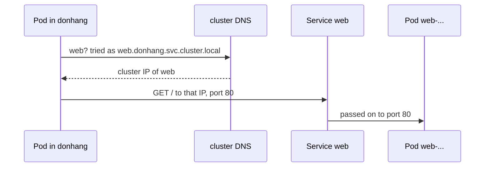

## Bạn cần biết trước

- [[k8s.l1.services]] — bạn biết Service `web` có một cluster IP giữ nguyên trong khi các Pod phía sau nó bị thay.
- [[foundation.l1.dns]] — bạn biết resolver đổi một tên thành địa chỉ IP, và mỗi máy được chỉ định phải hỏi resolver nào.

## Tình huống

Service `web` chạy được, nhưng để gọi nó, script trước hết phải đọc cluster IP bằng kubectl rồi truyền địa chỉ đó đi. Một client thật không làm thế được. Nếu bạn ghi `10.96.something` vào cấu hình của api, một Service bị xóa rồi tạo lại, hay một cluster mới, có thể nhận địa chỉ khác, và cấu hình sẽ sai. Trong Compose, `api` chưa bao giờ biết địa chỉ của `db`; nó chỉ dùng tên `db`. Pod bên trong cluster có dùng được một cái tên như `web` không, và ai trả lời khi nó hỏi?

## Khái niệm cốt lõi

- **cluster DNS** (DNS server chạy trong cluster, trả lời tên Service cho các Pod) — DNS server chạy bên trong cluster, dưới dạng các Pod trong `kube-system`, trả lời các lần Pod tra tên Service.
- `/etc/resolv.conf` — file trong mỗi container ghi resolver cần hỏi và các search domain cần thử.
- Search domain — một hậu tố mà resolver thêm vào tên ngắn rồi lần lượt thử, nhờ đó `web` có thể thành `web.donhang.svc.cluster.local`.

## Cơ chế hoạt động



Trong tình huống trên, câu trả lời là có, và chính cluster trả lời. Một cluster thường chạy DNS server riêng; trong cluster của Đơn Hàng, nó chạy dưới dạng các Pod trong `kube-system`, được gọi qua một Service tên `kube-dns`. Khi kubelet khởi động các container của một Pod, nó ghi `/etc/resolv.conf` của chúng sao cho dòng `nameserver` chứa cluster IP của Service đó. Vì vậy mọi lần tra tên trong Pod đều tới cluster DNS trước.

Mỗi Service có cluster IP, như `web`, nhận tên `<service>.<namespace>.svc.cluster.local` trong cluster này, và tên đó trỏ tới cluster IP của nó, không trỏ tới Pod. Với Service của Đơn Hàng, tên đó là `web.donhang.svc.cluster.local`. Sau đó Pod kết nối tới địa chỉ ấy ở cổng 80 của Service, và Service chuyển kết nối tới `targetPort` 80 của một Pod `web`, như ở bài trước.

Không ai phải gõ cả tên đó mỗi lần, nhờ search domain. Pod trong `donhang` nhận danh sách search `donhang.svc.cluster.local svc.cluster.local cluster.local`. Khi được hỏi tên ngắn `web`, resolver thử `web.donhang.svc.cluster.local` trước và tìm thấy. Pod trong `default` thì thử `web.default.svc.cluster.local`, tên không tồn tại. Các lần thử tiếp theo, `web.svc.cluster.local` và `web.cluster.local`, cũng không tồn tại, vì tên của Service luôn có namespace nằm giữa tên Service và `svc`; nên tên ngắn thất bại ở đó. Thêm namespace là xong: `web.donhang` thành `web.donhang.svc.cluster.local` nhờ search domain thứ hai.

Tên vẫn dùng được trong khi các Pod phía sau Service đến rồi đi, vì nó trỏ tới cluster IP, thứ không dịch chuyển. Client được cấu hình bằng `web` không bao giờ cần địa chỉ IP của Pod, giống như tên service Compose trên một mạng Docker.

## Trong hệ thống Đơn Hàng

`scripts/k8s/service-dns.sh` apply Deployment và Service `web`, rồi làm việc từ các Pod ngắn hạn. Hàm phụ `in_pod`, định nghĩa ở đầu script, chạy một lệnh shell trong một Pod `caddy:2.10.0` tạm thời ở namespace được đưa vào đầu tiên, còn `show` in lệnh ra trước khi chạy. Image này có `nslookup`, công cụ hỏi resolver một tên và in ra địa chỉ nhận được, và `wget`, công cụ gửi một HTTP `GET` tới một URL; `-O -` in trang ra thay vì lưu lại. Phần đầu xem cấu hình resolver:

```bash file=scripts/k8s/service-dns.sh tag=stage-2 lines=19-30
# lesson: k8s.l1.service-and-dns
# nameserver: the cluster's DNS server (the Service kube-dns in kube-system).
# search: tried in order after a short name. The host's own search domains,
# which kind passes on after these, are left out here.
echo "== /etc/resolv.conf of a Pod in donhang"
in_pod donhang 'cat /etc/resolv.conf' | awk '
  /^search/ { line = "search"; for (i = 2; i <= NF; i++) if ($i ~ /cluster\.local$/) line = line " " $i; print line; next }
  /^(nameserver|options)/ { print }'
echo
echo "== the cluster DNS server is the Service kube-dns"
show kubectl get service kube-dns -n kube-system
echo
```

`awk`, một công cụ lọc văn bản, in nguyên các dòng `nameserver` và `options`, còn ở dòng `search` chỉ giữ các domain kết thúc bằng `cluster.local`; nếu máy bạn có search domain riêng, chúng có thể được truyền qua kind, công cụ đã tạo cluster, và xuất hiện sau các domain này trong file thật. Phần thứ hai tra tên và dùng tên:

```bash file=scripts/k8s/service-dns.sh tag=stage-2 lines=32-45
# The full name, with a final dot so no search domain is added, resolves to
# the Service's cluster IP, not to a Pod.
echo "== nslookup web.donhang.svc.cluster.local. (from a Pod in donhang)"
answer=$(in_pod donhang 'nslookup -type=a web.donhang.svc.cluster.local.' | awk '/^Name:/ { name = $2 } /^Address: / && name { print name, $2 }')
echo "$answer"
echo "That is the cluster IP of the Service web: $([ "${answer##* }" = "$(kubectl get service web -n donhang -o jsonpath='{.spec.clusterIP}')" ] && echo yes || echo no)"
echo

echo "== wget http://web/ from a Pod in donhang"
in_pod donhang "wget -q -O - http://web/ | grep -o '<title>.*</title>'"
echo "== wget http://web.donhang/ from a Pod in default"
in_pod default "wget -q -O - http://web.donhang/ | grep -o '<title>.*</title>'"
echo "== wget http://web/ from a Pod in default"
in_pod default 'wget -q -T 5 -O - http://web/ 2>&1; true'
```

Script so địa chỉ trong câu trả lời DNS với cluster IP của Service và in `yes` khi chúng khớp. Lệnh cuối bỏ cuộc nếu server không gửi gì trong 5 giây và giữ lại thông báo lỗi, nên lỗi được in ra thay vì làm script dừng. Sau những dòng ở trên, script xóa Deployment và Service `web`. Output của nó:

```text output=true
== /etc/resolv.conf of a Pod in donhang
search donhang.svc.cluster.local svc.cluster.local cluster.local
nameserver 10.96.0.10
options ndots:5

== the cluster DNS server is the Service kube-dns
$ kubectl get service kube-dns -n kube-system
NAME       TYPE        CLUSTER-IP   EXTERNAL-IP   PORT(S)                  AGE
kube-dns   ClusterIP   10.96.0.10   <none>        53/UDP,53/TCP,9153/TCP   ...

== nslookup web.donhang.svc.cluster.local. (from a Pod in donhang)
web.donhang.svc.cluster.local ...
That is the cluster IP of the Service web: yes

== wget http://web/ from a Pod in donhang
<title>Caddy works!</title>
== wget http://web.donhang/ from a Pod in default
<title>Caddy works!</title>
== wget http://web/ from a Pod in default
wget: bad address 'web'
```

`nameserver` là `10.96.0.10`, cluster IP của `kube-dns`, trả lời ở cổng 53, cổng của DNS; các mục khác dưới `PORT(S)` không quan trọng ở đây. Danh sách search bắt đầu bằng namespace của chính Pod. Tên đầy đủ trỏ tới cluster IP của Service, bị che bằng `...`. Tên ngắn `web` chạy được từ `donhang`, `web.donhang` chạy được từ `default`, còn riêng `web` thất bại trong `default` với `bad address`. Dòng `options` thuộc về một giai đoạn sau.

## Người mới hay nghĩ rằng…

- **"Pod chỉ tìm được Service bằng tên khi cả hai cùng một namespace."** → Thực ra chỉ tên ngắn mới cần cùng namespace; từ nơi khác, thêm namespace vào. Bạn sẽ nhận ra khi `web.donhang` trả về trang của Caddy từ `default`, nơi riêng `web` cho ra `bad address`.
- **"Tên DNS của Service trỏ tới địa chỉ IP của một trong các Pod của nó."** → Thực ra nó trỏ tới cluster IP của Service, và Service chuyển kết nối đi tiếp. Bạn sẽ nhận ra khi script in `yes`: câu trả lời DNS bằng đúng cluster IP.
- **"Tên Service như `web.donhang.svc.cluster.local` cũng dùng được từ trình duyệt trên laptop của tôi."** → Thực ra chỉ Pod mới dùng cluster DNS; laptop của bạn hỏi resolver riêng, nơi chưa từng nghe tới tên đó. Bạn sẽ nhận ra khi trình duyệt trên laptop không tìm được tên ấy.

## Thử ngay (3 phút)

Khi cluster `donhang` đang chạy, trong thư mục `don-hang`, ở shell bạn dùng cho `kubectl`.

1. Chạy `scripts/k8s/service-dns.sh`. Cuối cùng nó gỡ Deployment và Service `web`.
2. Apply lại chúng: `kubectl apply -f deploy/k8s/lessons/web-deployment.yaml -f deploy/k8s/lessons/web-service.yaml`, rồi `kubectl get service web -n donhang`.
3. Từ một Pod tạm trong `default`, lấy trang bằng tên: `kubectl run dns-try --rm -i --restart=Never --quiet -n default --image=caddy:2.10.0 -- wget -O /dev/null http://web.donhang/`.
4. Dọn dẹp bằng `kubectl delete -f deploy/k8s/lessons/web-service.yaml -f deploy/k8s/lessons/web-deployment.yaml`.

Kết quả mong đợi: bước 1 khớp với output ở trên. Ở bước 3 có một dòng `Connecting to web.donhang (` theo sau là một địa chỉ và `:80)`, và địa chỉ đó chính là `CLUSTER-IP` ở bước 2. Một dòng `warning: couldn't attach` đứng trước có thể bỏ qua; nếu hoàn toàn không thấy dòng `Connecting`, chạy lại bước 3. Nếu `wget` báo `bad address`, kiểm tra xem bước 2 đã liệt kê Service `web` trong `donhang` chưa.

## Liên hệ

- [[foundation.l1.dns]] — cùng ý tưởng ở quy mô nhỏ hơn: resolver đổi tên thành địa chỉ, ở đây là resolver mà cluster chạy cho chính các Pod của nó.
- [[devops.l1.docker-networks]] — DNS của mạng Compose trả lời tên service trong lab; cluster DNS làm điều tương tự cho Service.
- [[k8s.l1.deploying-an-image-tag]] — bài tiếp theo: chạy image api thật, với cấu hình gọi `db` và `redis` theo đúng cách này.

## Tóm tắt 5 dòng

1. Pod gọi Service bằng tên, vì cluster DNS trả lời mỗi tên Service bằng cluster IP của nó.
2. `/etc/resolv.conf` của mỗi Pod ghi cluster DNS, tức Service `kube-dns` trong `kube-system`, làm resolver.
3. Mỗi Service có tên `<service>.<namespace>.svc.cluster.local`; với Đơn Hàng đó là `web.donhang.svc.cluster.local`.
4. Search domain cho `web` chạy được trong `donhang`; từ namespace khác, dùng `web.donhang`.
5. Tên trỏ tới cluster IP, nên vẫn dùng được trong khi các Pod phía sau Service thay đổi.
