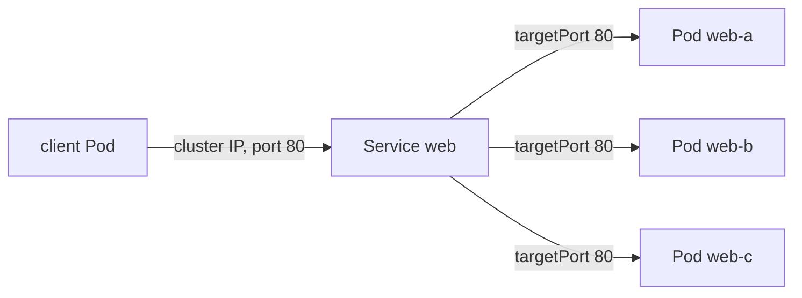

## Before you start

- [[k8s.l1.deployments]] — you know the Deployment `web` keeps three Pods labelled `app: web` running, replacing any that is deleted with a new Pod.
- [[devops.l1.docker-networks]] — you know that on the lab's Docker network each Compose service had a fixed address, so `api` always found `db` at the same place.

## The situation

The Deployment `web` runs three Caddy Pods in `donhang`, and soon the `api` Pods will run next to them. In Compose, a container that wanted `web` used one fixed address. Here, each Pod has its own IP address, and the previous lessons showed that a deleted Pod comes back as a new Pod. Say a client stored the IP address of one `web` Pod. That Pod is replaced during the night, and the stored address now points at nothing. Which address should a client inside the cluster use, so that it keeps reaching `web` however often the Pods change?

## Core concepts

- **Kubernetes Service** — a Kubernetes object that selects Pods by label and gives them one stable IP address, passing each connection on to one of those Pods.
- Cluster IP — the Service's own virtual IP address, given when the Service is created and kept for as long as it exists; no Pod has this address.
- `port` and `targetPort` — the port clients connect to on the Service, and the port on the Pod that the connection is passed to.

## How it works



In the situation above, the problem is that Pod IP addresses do not last. A replacement Pod is a new Pod with its own address, so anything that stored the old one loses its target. The Deployment keeps the number of Pods right; it does nothing about their addresses.

A Service adds the missing piece. Like a ReplicaSet, it has a label selector, here `app=web`. Unlike a ReplicaSet, it creates no Pods. It gets one virtual IP address of its own, the cluster IP, which stays the same for as long as the Service exists. A client connects to that address and the Service's `port`. Kubernetes passes the connection on to `targetPort` on one of the Pods the selector matches, and different connections are spread across those Pods.

Behind the cluster IP, Kubernetes keeps a list of the addresses of the matching Pods. That list follows the selector. When a Pod is replaced, its old address leaves the list and the new Pod's address joins it. When the Deployment scales up, more addresses join. The cluster IP itself never moves. So a client that only knows the Service never sees the Pods change.

A Service whose manifest gives no `type` is of type `ClusterIP`. Its address can be reached only from inside the cluster: from Pods, not from the browser on your laptop. Reaching the cluster from outside is a later topic.

## In the Đơn Hàng system

The Service for the `web` Pods:

```yaml file=deploy/k8s/lessons/web-service.yaml tag=stage-2 lines=1-15
# lesson: k8s.l1.services
# One stable address for every Pod labelled app: web. No type is given, so it
# is a ClusterIP Service, reachable only from inside the cluster. A connection
# to port 80 of the Service goes to port 80 (targetPort) of one of the Pods.
apiVersion: v1
kind: Service
metadata:
  name: web
  namespace: donhang
spec:
  selector:
    app: web
  ports:
    - port: 80
      targetPort: 80
```

`selector` is the same `app: web` the Deployment's Pods carry, and there is no `type` line. Caddy listens on port 80 inside each Pod, so `targetPort` is 80; the Service also offers port 80.

The script applies the Deployment `web` first, then:

```bash file=scripts/k8s/service.sh tag=stage-2 lines=22-41
# lesson: k8s.l1.services
# A Service with no type: ClusterIP. Its cluster IP is fixed when it is created.
show kubectl apply -f deploy/k8s/lessons/web-service.yaml
show kubectl get service web -n donhang
ip_before=$(cluster_ip)
pods_before=$(web_pod_ips)
echo
echo "== GET http://<cluster IP of web>:80/, from a Pod inside the cluster"
fetch_title "http://$ip_before:80/"
echo

# Replace every Pod behind the Service: new Pods, new Pod IP addresses.
show kubectl delete pods -n donhang -l app=web
kubectl wait --for=jsonpath='{.status.availableReplicas}'=3 deployment/web -n donhang --timeout=120s >/dev/null
pods_after=$(web_pod_ips)
echo "Pod IP addresses that are new: $(comm -13 <(echo "$pods_before") <(echo "$pods_after") | wc -l) of 3"
echo "The Service's cluster IP is the same as before: $([ "$(cluster_ip)" = "$ip_before" ] && echo yes || echo no)"
echo
echo "== GET http://<cluster IP of web>:80/ again"
fetch_title "http://$ip_before:80/"
```

Three helpers are defined earlier in the script. `cluster_ip` prints the Service's cluster IP and `web_pod_ips` the IP addresses of the `app=web` Pods. `fetch_title` starts a short-lived Pod inside the cluster, fetches the page at the given address with `wget` and prints only its `<title>`. The script requests the cluster IP before and after replacing all three Pods. Its output:

```text output=true
$ kubectl apply -f deploy/k8s/lessons/web-service.yaml
service/web created
$ kubectl get service web -n donhang
NAME   TYPE        CLUSTER-IP   EXTERNAL-IP   PORT(S)   AGE
web    ClusterIP   ...          <none>        80/TCP    ...

== GET http://<cluster IP of web>:80/, from a Pod inside the cluster
<title>Caddy works!</title>

$ kubectl delete pods -n donhang -l app=web
pod "web-...-..." deleted from donhang namespace
pod "web-...-..." deleted from donhang namespace
pod "web-...-..." deleted from donhang namespace
Pod IP addresses that are new: 3 of 3
The Service's cluster IP is the same as before: yes

== GET http://<cluster IP of web>:80/ again
<title>Caddy works!</title>
```

`TYPE` says `ClusterIP`, although the manifest never said so. `Caddy works!` is the title of Caddy's default page, so the request reached one of the Pods. Then all three Pods are replaced, and all three Pod addresses are new. The cluster IP is unchanged, and the same request still works. The `...` hides the cluster IP, names and ages.

## Beginners often think…

- **"A Kubernetes Service runs containers, like a service in `docker-compose.yml`."** → Actually a Service runs nothing; it is an address in front of Pods that something else runs, here the Deployment `web`. You notice this when `kubectl apply -f deploy/k8s/lessons/web-service.yaml` prints `service/web created` and no new Pod appears.
- **"Clients should look up the Pods' IP addresses and call them directly."** → Actually those addresses change every time a Pod is replaced, while the cluster IP does not. You notice this when the script reports `3 of 3` Pod addresses new after the delete.
- **"A Service's IP address changes whenever its Pods are replaced."** → Actually the cluster IP is kept for as long as the Service exists; only the list of Pod addresses behind it changes. You notice this when the script prints `yes` for the same cluster IP.

## Try it (3 minutes)

With the `donhang` cluster running, in the `don-hang` folder, in the shell you use for `kubectl`. `service.sh` leaves the Deployment and the Service `web` running; the next lesson uses them.

1. Run `scripts/k8s/service.sh`.
2. Run `kubectl describe service web -n donhang`. Note the `IP` line and the `Endpoints` line, which lists the addresses of the Pods behind the Service.
3. Run `kubectl delete pods -n donhang -l app=web`, wait about ten seconds, and run step 2 again.

Expected result: step 1 matches the output above. In step 3 the `IP` line is the same as in step 2, while the `Endpoints` line shows different addresses, each ending in `:80`. If it shows fewer than three, the new Pods are still starting; run it again.

## Connections

- [[k8s.l1.deployments]] — the Deployment keeps the number of Pods right; the Service keeps one address in front of whichever Pods exist.
- [[devops.l1.docker-networks]] — the same need as a fixed service address on a Compose network, solved by an address that no single container owns.
- [[k8s.l1.service-and-dns]] — next: reaching the Service by name instead of by its cluster IP.

## Five-line summary

1. A Service gives the Pods its selector matches one stable address, so clients stop depending on Pod IP addresses.
2. Pod IP addresses do not last: a replacement Pod gets a new one.
3. A connection to the cluster IP and `port` goes to `targetPort` on one matching Pod, spread across them.
4. The Pod addresses behind a Service follow its selector; the cluster IP stays while the Service exists.
5. A Service with no `type` is `ClusterIP`, reachable only from inside the cluster.
