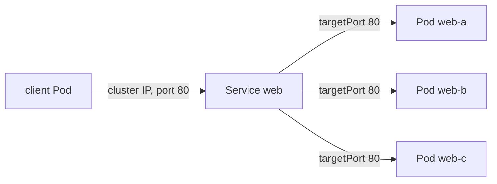

## Bạn cần biết trước

- [[k8s.l1.deployments]] — bạn biết Deployment `web` giữ ba Pod mang label `app: web` luôn chạy, và thay Pod nào bị xóa bằng một Pod mới.
- [[devops.l1.docker-networks]] — bạn biết trên mạng Docker của lab, mỗi service Compose có một địa chỉ cố định, nên `api` luôn tìm thấy `db` ở cùng một chỗ.

## Tình huống

Deployment `web` chạy ba Pod Caddy trong `donhang`, và chẳng bao lâu nữa các Pod `api` sẽ chạy cạnh chúng. Trong Compose, container nào muốn gọi `web` thì dùng một địa chỉ cố định. Ở đây, mỗi Pod có địa chỉ IP riêng, và các bài trước đã cho thấy Pod bị xóa quay lại dưới dạng một Pod mới. Giả sử một client lưu địa chỉ IP của một Pod `web`. Trong đêm Pod đó bị thay, và địa chỉ đã lưu giờ trỏ vào khoảng không. Client bên trong cluster nên dùng địa chỉ nào để luôn tới được `web`, dù Pod thay đổi thường xuyên đến đâu?

## Khái niệm cốt lõi

- **Kubernetes Service** (object Kubernetes cho các Pod khớp selector một địa chỉ IP và tên cố định, chia kết nối cho chúng) — một object Kubernetes chọn Pod theo label và cho chúng một địa chỉ IP ổn định, chuyển mỗi kết nối tới một trong các Pod đó.
- Cluster IP — địa chỉ IP ảo của riêng Service, được cấp khi Service được tạo và giữ nguyên chừng nào Service còn tồn tại; không Pod nào có địa chỉ này.
- `port` và `targetPort` — cổng mà client kết nối tới trên Service, và cổng trên Pod mà kết nối được chuyển tới.

## Cơ chế hoạt động



Trong tình huống trên, vấn đề là địa chỉ IP của Pod không bền. Pod thay thế là một Pod mới có địa chỉ riêng, nên thứ gì đã lưu địa chỉ cũ sẽ mất đích. Deployment giữ đúng số lượng Pod; nó không làm gì với địa chỉ của chúng.

Service bổ sung mảnh còn thiếu. Giống ReplicaSet, nó có một label selector, ở đây là `app=web`. Khác ReplicaSet, nó không tạo Pod nào. Nó có một địa chỉ IP ảo của riêng mình, cluster IP, giữ nguyên chừng nào Service còn tồn tại. Client kết nối tới địa chỉ đó và `port` của Service. Kubernetes chuyển kết nối tới `targetPort` trên một trong các Pod mà selector khớp, và các kết nối khác nhau được chia ra cho các Pod đó.

Phía sau cluster IP, Kubernetes giữ một danh sách địa chỉ của các Pod khớp selector. Danh sách đó đi theo selector. Khi một Pod bị thay, địa chỉ cũ rời danh sách và địa chỉ của Pod mới được thêm vào. Khi Deployment scale lên, thêm địa chỉ được đưa vào. Còn cluster IP thì không bao giờ dịch chuyển. Vì vậy client chỉ biết Service sẽ không bao giờ thấy Pod thay đổi.

Service mà manifest không ghi `type` thuộc loại `ClusterIP`. Địa chỉ của nó chỉ tới được từ bên trong cluster: từ các Pod, không phải từ trình duyệt trên laptop của bạn. Đi vào cluster từ bên ngoài là chủ đề của một bài sau.

## Trong hệ thống Đơn Hàng

Service cho các Pod `web`:

```yaml file=deploy/k8s/lessons/web-service.yaml tag=stage-2 lines=1-15
# lesson: k8s.l1.services
# One stable address for every Pod labelled app: web. No type is given, so it
# is a ClusterIP Service, reachable only from inside the cluster. A connection
# to port 80 of the Service goes to port 80 (targetPort) of one of the Pods.
apiVersion: v1
kind: Service
metadata:
  name: web
  namespace: donhang
spec:
  selector:
    app: web
  ports:
    - port: 80
      targetPort: 80
```

`selector` chính là `app: web` mà các Pod của Deployment mang, và không có dòng `type` nào. Caddy lắng nghe ở cổng 80 bên trong mỗi Pod, nên `targetPort` là 80; Service cũng mở cổng 80.

Script apply Deployment `web` trước, rồi:

```bash file=scripts/k8s/service.sh tag=stage-2 lines=22-41
# lesson: k8s.l1.services
# A Service with no type: ClusterIP. Its cluster IP is fixed when it is created.
show kubectl apply -f deploy/k8s/lessons/web-service.yaml
show kubectl get service web -n donhang
ip_before=$(cluster_ip)
pods_before=$(web_pod_ips)
echo
echo "== GET http://<cluster IP of web>:80/, from a Pod inside the cluster"
fetch_title "http://$ip_before:80/"
echo

# Replace every Pod behind the Service: new Pods, new Pod IP addresses.
show kubectl delete pods -n donhang -l app=web
kubectl wait --for=jsonpath='{.status.availableReplicas}'=3 deployment/web -n donhang --timeout=120s >/dev/null
pods_after=$(web_pod_ips)
echo "Pod IP addresses that are new: $(comm -13 <(echo "$pods_before") <(echo "$pods_after") | wc -l) of 3"
echo "The Service's cluster IP is the same as before: $([ "$(cluster_ip)" = "$ip_before" ] && echo yes || echo no)"
echo
echo "== GET http://<cluster IP of web>:80/ again"
fetch_title "http://$ip_before:80/"
```

Ba hàm phụ được định nghĩa ở đầu script. `cluster_ip` in cluster IP của Service, còn `web_pod_ips` in địa chỉ IP của các Pod `app=web`. `fetch_title` khởi động một Pod ngắn hạn bên trong cluster, lấy trang ở địa chỉ được đưa vào bằng `wget` và chỉ in phần `<title>`. Script gửi request tới cluster IP trước và sau khi thay cả ba Pod. Output của nó:

```text output=true
$ kubectl apply -f deploy/k8s/lessons/web-service.yaml
service/web created
$ kubectl get service web -n donhang
NAME   TYPE        CLUSTER-IP   EXTERNAL-IP   PORT(S)   AGE
web    ClusterIP   ...          <none>        80/TCP    ...

== GET http://<cluster IP of web>:80/, from a Pod inside the cluster
<title>Caddy works!</title>

$ kubectl delete pods -n donhang -l app=web
pod "web-...-..." deleted from donhang namespace
pod "web-...-..." deleted from donhang namespace
pod "web-...-..." deleted from donhang namespace
Pod IP addresses that are new: 3 of 3
The Service's cluster IP is the same as before: yes

== GET http://<cluster IP of web>:80/ again
<title>Caddy works!</title>
```

`TYPE` ghi `ClusterIP`, dù manifest chưa hề nói vậy. `Caddy works!` là tiêu đề trang mặc định của Caddy, nên request đã tới được một trong các Pod. Sau đó cả ba Pod bị thay, và cả ba địa chỉ Pod đều mới. Cluster IP không đổi, và cùng request đó vẫn chạy. `...` che cluster IP, tên và cột tuổi.

## Người mới hay nghĩ rằng…

- **"Kubernetes Service chạy container, giống một service trong `docker-compose.yml`."** → Thực ra Service không chạy gì cả; nó là một địa chỉ đứng trước các Pod do thứ khác chạy, ở đây là Deployment `web`. Bạn sẽ nhận ra khi `kubectl apply -f deploy/k8s/lessons/web-service.yaml` in `service/web created` và không có Pod mới nào xuất hiện.
- **"Client nên tra địa chỉ IP của các Pod rồi gọi thẳng tới chúng."** → Thực ra các địa chỉ đó đổi mỗi lần Pod bị thay, còn cluster IP thì không. Bạn sẽ nhận ra khi script báo `3 of 3` địa chỉ Pod là mới sau lệnh xóa.
- **"Địa chỉ IP của Service đổi mỗi khi Pod của nó bị thay."** → Thực ra cluster IP được giữ chừng nào Service còn tồn tại; chỉ danh sách địa chỉ Pod phía sau thay đổi. Bạn sẽ nhận ra khi script in `yes` cho cluster IP vẫn như cũ.

## Thử ngay (3 phút)

Khi cluster `donhang` đang chạy, trong thư mục `don-hang`, ở shell bạn dùng cho `kubectl`. `service.sh` để Deployment và Service `web` tiếp tục chạy; bài sau dùng chúng.

1. Chạy `scripts/k8s/service.sh`.
2. Chạy `kubectl describe service web -n donhang`. Ghi lại dòng `IP` và dòng `Endpoints`, dòng liệt kê địa chỉ của các Pod đứng sau Service.
3. Chạy `kubectl delete pods -n donhang -l app=web`, chờ khoảng mười giây, rồi chạy lại bước 2.

Kết quả mong đợi: bước 1 khớp với output ở trên. Ở bước 3 dòng `IP` giống hệt bước 2, còn dòng `Endpoints` hiện các địa chỉ khác, mỗi địa chỉ kết thúc bằng `:80`. Nếu thấy ít hơn ba, các Pod mới vẫn đang khởi động; chạy lại lần nữa.

## Liên hệ

- [[k8s.l1.deployments]] — Deployment giữ đúng số lượng Pod; Service giữ một địa chỉ đứng trước bất kỳ Pod nào đang có.
- [[devops.l1.docker-networks]] — cùng nhu cầu như địa chỉ service cố định trên mạng Compose, được giải bằng một địa chỉ không thuộc riêng container nào.
- [[k8s.l1.service-and-dns]] — bài tiếp theo: gọi Service bằng tên thay vì bằng cluster IP.

## Tóm tắt 5 dòng

1. Service cho các Pod mà selector của nó khớp một địa chỉ ổn định, nên client không còn phụ thuộc vào địa chỉ IP của Pod.
2. Địa chỉ IP của Pod không bền: Pod thay thế nhận một địa chỉ mới.
3. Kết nối tới cluster IP và `port` đi tới `targetPort` trên một Pod khớp selector, các kết nối được chia ra cho các Pod đó.
4. Địa chỉ Pod phía sau Service đi theo selector; cluster IP giữ nguyên chừng nào Service còn tồn tại.
5. Service không ghi `type` là `ClusterIP`, chỉ tới được từ bên trong cluster.
