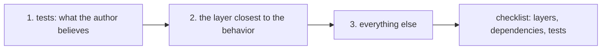

## Before you start

- [[management.l1.reviewing-for-tests]] — you know how to list a change's new behavior, match a test to each item, and ask whether each test could fail; you have seen that no test tries cancelling a `shipped` order.

## The situation

A pull request lands in your review queue: 300 lines across a dozen files. The diff opens at the first file in alphabetical order, and twenty minutes of scrolling later you reach the end. Nothing looked wrong, every test passes, and you are about to write "looks good" and approve. Then a teammate asks what the PR changes about cancelling an order, and you realize you cannot say, although you read every line. Why can you not answer?

## Core concepts

- reading order — the order you open a PR's files in; it does not have to be the order the diff shows them.
- skimming — moving through a diff line by line without asking what each part is for, so nothing is checked.
- review checklist — the questions from this module: is the code in the right layer, how does it get its dependencies, and do the tests check the new behavior.

## How it works



A diff shows files in an order that suits the tool, usually by path. That order says nothing about what the change does. A large PR reads better in an order you choose.

Start with the tests. They say what the author believes the change should do, in a form that runs. Reading them first gives you a list of intended behavior, and it shows you at once what is not on that list.

Next, read the layer closest to the behavior the PR describes. For a change to a business rule, that is the service; the controller and the repository only carry the rule in and out. With the tests' list in your head, you can check the service line by line against it: does the code do what the tests expect, and is there something it should do that no test mentions?

Then read everything else, and run the module's checklist over each part: is it in the right layer, how does it get what it needs, and is its behavior tested. The checklist is what turns a pass through the diff into a review. A 300-line PR approved after fifteen minutes with no comments more often means the reviewer skimmed it, not that there was nothing to say.

## In the Đơn Hàng system

At stage-1, cancellation lives mainly in three places: the tests, the service and the controller, plus a small `Seed` helper in the fake repository the tests use. Read them as if they were one pull request, in the order above.

First the tests, in `DonHang.Tests/Services/OrderServiceTests.cs`:

```csharp file=DonHang.Tests/Services/OrderServiceTests.cs tag=stage-1 lines=45-63
    [Fact]
    public async Task CancelOrderAsync_NewOrder_SetsStatusCancelled()
    {
        var repository = new FakeOrderRepository();
        repository.Seed(new Order { Id = 1, CustomerId = 1, PlacedAt = DateTimeOffset.UtcNow, Status = "new" });
        var service = new OrderService(repository, new FakeNotifier());

        var order = await service.CancelOrderAsync(1);

        Assert.Equal("cancelled", order.Status);
    }

    [Fact]
    public async Task CancelOrderAsync_UnknownOrder_Throws()
    {
        var service = new OrderService(new FakeOrderRepository(), new FakeNotifier());

        await Assert.ThrowsAsync<KeyNotFoundException>(() => service.CancelOrderAsync(999));
    }
```

The tests say what the author expects: a `new` order becomes `cancelled`, and an unknown order throws. The cancellation story in `docs/team/story-example.md` is about orders that are not yet paid, and its acceptance criterion 3 lists `shipped` among the statuses that get no cancel button. So the first question writes itself: what happens to an order that has already shipped? The tests do not say.

Then the service, the layer closest to the rule, in `DonHang.Domain/OrderService.cs`:

```csharp file=DonHang.Domain/OrderService.cs tag=stage-1 lines=29-38
    public async Task<Order> CancelOrderAsync(int orderId)
    {
        var order = await repository.FindAsync(orderId)
            ?? throw new KeyNotFoundException($"order {orderId} not found");

        order.Status = "cancelled";
        await repository.SaveChangesAsync();
        notifier.Send(order.Id, "order cancelled");
        return order;
    }
```

Read against the question, the gap is plain: nothing between finding the order and setting its status looks at what the status was. A `shipped` order is cancelled just like a `new` one. That is the missing check, found in the second file you opened.

Last, the controller. `OrdersController.Cancel` takes the id, calls `orderService.CancelOrderAsync(id)` and returns the order as a DTO, so it passes the layers check. Its constructor already takes `OrderService`, so cancellation needs nothing new from it, and the dependencies check has nothing to add. For the tests check, no test calls the controller. Its main work is the service call, which the service tests cover; the `[Authorize]` on it and the DTO it returns have no test, which is worth a question rather than a must-fix.

The team's review examples in `docs/team/review-comments-examples.md`, taken from a pull request that adds cancellation, open with a must-fix comment saying the same thing: a `shipped` order also gets moved to `cancelled`. The service file also has a comment just above `CancelOrderAsync` about this gap, but the reading order finds it from the code alone.

## Beginners often think…

- **"A bigger PR just needs more time spent reading top to bottom, in the order the diff shows it."** → Actually the diff's order follows file paths, not meaning; more time in that order is more skimming. You notice this when you finish a long diff and cannot say what it changes, as in the situation above.
- **"Approving quickly is a sign of trusting the author, and asking questions is a sign of not trusting them."** → Actually questions are how a reviewer checks the change, not the person; many authors expect them. You notice this in the review examples file, where a must-fix comment ends with a question to the author instead of a verdict.

## Try it (3 minutes)

Open `DonHang.Domain/OrderService.cs` and `DonHang.Tests/Services/OrderServiceTests.cs` from the repository at stage-1.

1. Read only the cancellation tests and write down every behavior they expect.
2. Read `CancelOrderAsync` and write down one thing it does that no test checks.
3. Write one review comment, marked as must-fix, suggestion or question.

Expected result: step 1 — a `new` order becomes `cancelled`; an unknown id throws `KeyNotFoundException`. Step 2 — any of: it sends a notification on cancel; it cancels a `shipped` or `paid` order; it cancels an order that is already `cancelled`. Step 3 — for example, must-fix: "`CancelOrderAsync` cancels a `shipped` order; the story is about unpaid orders. Should it refuse, and could you add a test that tries a `shipped` order?"

You found the missing check in the second file. Should you stop reading and send the comment, or finish the PR first?

<details><summary>Suggested answer</summary>

Finish it, then send all comments together. One found problem does not mean it is the only one, and one complete review is often easier for the author to work through than comments arriving one at a time. The reading order made the most important problem appear early; the checklist over the remaining files is what makes sure nothing else is missed.

</details>

## Connections

- [[management.l1.reviewing-for-layers]] — the layers check in the checklist.
- [[management.l1.reviewing-for-dependencies]] — the dependencies check in the checklist.
- [[management.l1.code-review-basics]] — how to word the comments you send.

## Five-line summary

1. A diff's file order follows paths, not meaning, so a large PR reads better in an order you choose.
2. Read tests first for the intended behavior, then the layer closest to it, then the rest.
3. The checklist of layers, dependencies and tests is what turns a pass through the diff into a review.
4. In the cancellation change, tests first and then `CancelOrderAsync` show the missing `shipped` check in the second file.
5. A large PR approved quickly with no comments more often means it was skimmed than that it was perfect.
