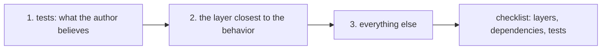

## Bạn cần biết trước

- [[management.l1.reviewing-for-tests]] — bạn biết cách liệt kê hành vi mới của một thay đổi, tìm test cho từng mục, và hỏi mỗi test có thể fail không; bạn đã thấy không test nào thử hủy một đơn `shipped`.

## Tình huống

Một pull request vào hàng chờ review của bạn: 300 dòng trên cả chục file. Diff mở ở file đầu tiên theo thứ tự bảng chữ cái, và sau hai mươi phút cuộn bạn tới cuối. Không có gì trông sai, mọi test đều qua, và bạn sắp viết "looks good" rồi duyệt. Rồi một đồng đội hỏi PR này thay đổi gì trong việc hủy đơn, và bạn nhận ra mình không trả lời được, dù đã đọc từng dòng. Vì sao bạn không trả lời được?

## Khái niệm cốt lõi

- thứ tự đọc — thứ tự bạn mở các file của một PR; nó không nhất thiết là thứ tự diff hiển thị.
- đọc lướt — đi qua diff từng dòng mà không hỏi mỗi phần để làm gì, nên chẳng có gì được kiểm.
- checklist review — các câu hỏi của module này: code có nằm đúng tầng không, nó lấy phụ thuộc thế nào, và test có kiểm hành vi mới không.

## Cơ chế hoạt động



Diff hiển thị file theo thứ tự tiện cho công cụ, thường là theo đường dẫn. Thứ tự đó không nói gì về việc thay đổi làm gì. Một PR lớn đọc dễ hơn theo thứ tự do bạn chọn.

Bắt đầu từ test. Chúng nói tác giả tin thay đổi phải làm gì, dưới dạng chạy được. Đọc chúng trước cho bạn một danh sách hành vi dự định, và cho thấy ngay điều gì không có trong danh sách đó.

Tiếp theo, đọc tầng gần nhất với hành vi mà PR mô tả. Với một thay đổi về quy tắc nghiệp vụ, đó là service; controller và repository chỉ đưa quy tắc vào và ra. Với danh sách từ test trong đầu, bạn có thể đối chiếu service từng dòng: code có làm điều test mong đợi không, và có điều gì nó phải làm mà không test nào nhắc tới không?

Rồi đọc mọi thứ còn lại, và chạy checklist của module qua từng phần: nó có nằm đúng tầng không, nó lấy thứ nó cần thế nào, và hành vi của nó có được test không. Checklist là thứ biến một lần đi qua diff thành một lần review. Một PR 300 dòng được duyệt sau mười lăm phút mà không có nhận xét nào thường là dấu hiệu người review đã đọc lướt, hơn là không có gì để nói.

## Trong hệ thống Đơn Hàng

Ở stage-1, chức năng hủy đơn nằm chủ yếu ở ba chỗ: test, service và controller, cộng thêm một helper `Seed` nhỏ trong repository giả mà test dùng. Hãy đọc chúng như thể là một pull request, theo thứ tự ở trên.

Trước hết là test, trong `DonHang.Tests/Services/OrderServiceTests.cs`:

```csharp file=DonHang.Tests/Services/OrderServiceTests.cs tag=stage-1 lines=45-63
    [Fact]
    public async Task CancelOrderAsync_NewOrder_SetsStatusCancelled()
    {
        var repository = new FakeOrderRepository();
        repository.Seed(new Order { Id = 1, CustomerId = 1, PlacedAt = DateTimeOffset.UtcNow, Status = "new" });
        var service = new OrderService(repository, new FakeNotifier());

        var order = await service.CancelOrderAsync(1);

        Assert.Equal("cancelled", order.Status);
    }

    [Fact]
    public async Task CancelOrderAsync_UnknownOrder_Throws()
    {
        var service = new OrderService(new FakeOrderRepository(), new FakeNotifier());

        await Assert.ThrowsAsync<KeyNotFoundException>(() => service.CancelOrderAsync(999));
    }
```

Test nói tác giả mong đợi gì: một đơn `new` chuyển thành `cancelled`, và một đơn không tồn tại thì ném lỗi. Story hủy đơn trong `docs/team/story-example.md` nói về những đơn chưa thanh toán, và tiêu chí chấp nhận số 3 của nó liệt kê `shipped` trong các trạng thái không hiện nút hủy. Vậy câu hỏi đầu tiên tự hiện ra: chuyện gì xảy ra với một đơn đã giao? Test không nói.

Rồi đến service, tầng gần quy tắc nhất, trong `DonHang.Domain/OrderService.cs`:

```csharp file=DonHang.Domain/OrderService.cs tag=stage-1 lines=29-38
    public async Task<Order> CancelOrderAsync(int orderId)
    {
        var order = await repository.FindAsync(orderId)
            ?? throw new KeyNotFoundException($"order {orderId} not found");

        order.Status = "cancelled";
        await repository.SaveChangesAsync();
        notifier.Send(order.Id, "order cancelled");
        return order;
    }
```

Đọc với câu hỏi đó trong đầu, lỗ hổng lộ rõ: giữa việc tìm đơn và việc đặt trạng thái, không có gì xem trạng thái trước đó là gì. Một đơn `shipped` bị hủy y như một đơn `new`. Đó là phép kiểm còn thiếu, được tìm ra ở file thứ hai bạn mở.

Cuối cùng là controller. `OrdersController.Cancel` nhận id, gọi `orderService.CancelOrderAsync(id)` và trả đơn dưới dạng DTO, nên nó qua phép kiểm tầng. Constructor của nó đã nhận sẵn `OrderService`, nên chức năng hủy đơn không cần gì mới từ nó, và phép kiểm phụ thuộc không có gì để thêm. Với phép kiểm test, không test nào gọi controller. Việc chính của nó là lời gọi service, đã được test của service phủ; `[Authorize]` trên nó và DTO nó trả về chưa có test, điều đáng một câu hỏi hơn là một nhận xét bắt buộc sửa.

Các ví dụ review của đội trong `docs/team/review-comments-examples.md`, lấy từ một pull request thêm chức năng hủy đơn, mở đầu bằng một nhận xét bắt buộc sửa nói đúng điều này: đơn `shipped` cũng bị chuyển sang `cancelled`. File service cũng có một comment ngay trên `CancelOrderAsync` về lỗ hổng này, nhưng thứ tự đọc tìm ra nó chỉ từ code.

## Người mới hay nghĩ rằng…

- **"PR lớn hơn chỉ cần thêm thời gian đọc từ trên xuống, theo thứ tự diff hiển thị."** → Thực ra thứ tự của diff theo đường dẫn file, không theo ý nghĩa; đọc lâu hơn theo thứ tự đó là lướt nhiều hơn. Bạn sẽ nhận ra khi đọc hết một diff dài mà không nói được nó thay đổi gì, như trong tình huống ở trên.
- **"Duyệt nhanh là dấu hiệu tin tác giả, còn đặt câu hỏi là dấu hiệu không tin họ."** → Thực ra câu hỏi là cách người review kiểm tra thay đổi, không phải kiểm tra con người; nhiều tác giả chờ đợi chúng. Bạn sẽ nhận ra trong file ví dụ review, nơi một nhận xét bắt buộc sửa kết thúc bằng một câu hỏi cho tác giả thay vì một phán quyết.

## Thử ngay (3 phút)

Mở `DonHang.Domain/OrderService.cs` và `DonHang.Tests/Services/OrderServiceTests.cs` trong repository ở stage-1.

1. Chỉ đọc các test hủy đơn và ghi lại mọi hành vi chúng mong đợi.
2. Đọc `CancelOrderAsync` và ghi lại một việc nó làm mà không test nào kiểm.
3. Viết một nhận xét review, đánh dấu là bắt buộc sửa, gợi ý hay câu hỏi.

Kết quả mong đợi: bước 1 — đơn `new` chuyển thành `cancelled`; id không tồn tại ném `KeyNotFoundException`. Bước 2 — một trong: nó gửi thông báo khi hủy; nó hủy đơn `shipped` hoặc `paid`; nó hủy một đơn đã `cancelled`. Bước 3 — ví dụ, bắt buộc sửa: "`CancelOrderAsync` hủy cả đơn `shipped`; story nói về đơn chưa thanh toán. Nó có nên từ chối không, và bạn thêm giúp một test thử đơn `shipped` được không?"

Bạn đã tìm ra phép kiểm còn thiếu ở file thứ hai. Bạn nên dừng đọc và gửi nhận xét ngay, hay đọc hết PR trước?

<details><summary>Gợi ý đáp án</summary>

Đọc hết, rồi gửi mọi nhận xét cùng lúc. Tìm thấy một vấn đề không có nghĩa đó là vấn đề duy nhất, và một lần review trọn vẹn thường dễ để tác giả xử lý hơn những nhận xét đến lẻ tẻ. Thứ tự đọc giúp vấn đề quan trọng nhất lộ ra sớm; checklist chạy qua các file còn lại mới bảo đảm không bỏ sót gì khác.

</details>

## Liên hệ

- [[management.l1.reviewing-for-layers]] — phép kiểm tầng trong checklist.
- [[management.l1.reviewing-for-dependencies]] — phép kiểm phụ thuộc trong checklist.
- [[management.l1.code-review-basics]] — cách viết lời cho các nhận xét bạn gửi.

## Tóm tắt 5 dòng

1. Thứ tự file của diff theo đường dẫn, không theo ý nghĩa, nên PR lớn đọc dễ hơn theo thứ tự do bạn chọn.
2. Đọc test trước để có hành vi dự định, rồi tầng gần hành vi nhất, rồi phần còn lại.
3. Checklist về tầng, phụ thuộc và test là thứ biến một lần đi qua diff thành một lần review.
4. Với thay đổi hủy đơn, đọc test trước rồi tới `CancelOrderAsync` làm lộ phép kiểm `shipped` còn thiếu ở file thứ hai.
5. Một PR lớn được duyệt nhanh mà không có nhận xét nào thường là đã bị đọc lướt, hơn là hoàn hảo.
