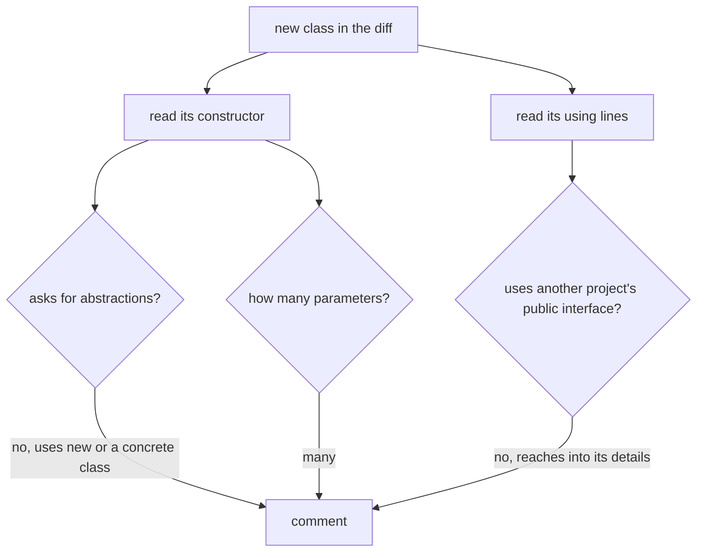

## Before you start

- [[management.l1.reviewing-for-layers]] — you know how to check, in a diff, that each new piece of code sits in the layer that owns its kind of work.
- [[design.l1.solid-dip]] — you know high-level code should depend on an abstraction such as `INotifier`, not on a concrete class, and that `OrderPlacedTightlyCoupled` breaks this by creating its own `EmailNotifier`.

## The situation

A pull request adds a class that tells a customer their order has shipped. It works, the tests pass, and the code is short. Inside the class, one field is set with `new` to a concrete email sender. Another reviewer has already approved it with "looks good", and you have the diff open and five minutes. You could read every line of the new method, or you could look first at just two places: the class's constructor, and the `using` lines at the top of the file. Why would those two places tell you so much?

## Core concepts

- constructor parameter — a value a class asks for when it is created, instead of making it itself; this is how dependency injection hands it what it needs.
- reaching for a dependency — creating or naming a concrete object directly inside a class, for example with `new`, instead of asking for it.
- public interface — the part of another project or module that is meant to be used from outside, as opposed to its internal details.

## How it works



Reviewing for dependencies means reading how a new class gets what it needs. Two places tell you most of it: the constructor, which lists what the class asks for, and the `using` lines, which list which projects and namespaces it reaches into. You do not need a tool for this; you read both by eye.

The first check is whether the class asks or reaches. A class that takes an `INotifier` as a constructor parameter can be given any notifier, including a fake one in a test. A class that creates its own concrete notifier with `new` cannot, and changing the channel means editing that class. That undoes the whole point of dependency injection, and it is worth a comment even if the code works.

The second check is how many constructor parameters there are. There is no rule that says how many is too many. But the Single Responsibility Principle (SRP) predicts that a class which needs many different things probably does many different jobs, and the constructor is where that shows first. A long parameter list is a reason to ask what the class is responsible for, not a style complaint.

The third check is where the dependencies come from. A class that uses another project through an interface that project offers stays loosely coupled to it. A class that reaches into another project's details, a concrete class meant for that project's own work, ties the two together more tightly with every such line. Catching it in review stops that coupling before other code copies the pattern.

## In the Đơn Hàng system

A sample in `samples/DonHang.Samples/Samples/Design/OrderNotifications.cs` shows the first check side by side:

```csharp file=samples/DonHang.Samples/Samples/Design/OrderNotifications.cs tag=stage-1 lines=9-23
public sealed class OrderPlacedTightlyCoupled
{
    private readonly EmailNotifier notifier = new();

    public void Handle(int orderId) => notifier.Send(orderId, "order placed");
}

// lesson: design.l1.dependency-injection-intro
// Same job, but this caller depends on INotifier — the abstraction both
// EmailNotifier and SmsNotifier already implement (Samples/Oop/NotifierBase.cs).
// Any INotifier works here, including a fake one in a test.
public sealed class OrderNotifications(INotifier notifier)
{
    public void Handle(int orderId) => notifier.Send(orderId, "order placed");
}
```

Read the two classes as if they arrived in a diff. `OrderPlacedTightlyCoupled` has no constructor parameters; its field is created with `new()` as an `EmailNotifier`, a concrete class. A reviewer would comment: this class cannot be tested without that email sender, and switching to another channel means editing it. `OrderNotifications` asks for an `INotifier` in its constructor, so whoever creates it chooses the notifier.

The service that places and cancels orders, in `DonHang.Domain/OrderService.cs`, is declared as `OrderService(IOrderRepository repository, INotifier notifier)`: two constructor parameters, both interfaces declared in `DonHang.Domain` itself. Nothing in the file names Entity Framework Core or the `DonHang.Infrastructure` project. It passes all three checks.

Now the login controller, in `DonHang.Api/Controllers/AuthController.cs`:

```csharp file=DonHang.Api/Controllers/AuthController.cs tag=stage-1 lines=1-11
using DonHang.Domain;
using DonHang.Infrastructure;
using Microsoft.AspNetCore.Mvc;
using Microsoft.EntityFrameworkCore;

namespace DonHang.Api.Controllers;

// lesson: backend.l1.validating-a-jwt
[ApiController]
[Route("api/v1/auth")]
public sealed class AuthController(DonHangDbContext db, JwtTokenService tokenService) : ControllerBase
```

The `using DonHang.Infrastructure;` line and the constructor say the same thing: `AuthController` takes `DonHangDbContext`, the concrete database class from the infrastructure project, not an interface. It also takes `JwtTokenService`, a concrete class from the API project itself. A reviewer can ask whether the controller could depend on an interface instead of the infrastructure project's database class, which is the same question the layers review asked from another side.

## Beginners often think…

- **"Counting constructor parameters is a style nitpick, not a real design concern."** → Actually the constructor is the first place a class that does too many jobs shows it, because each job needs its own things. You notice this when a class with a long parameter list has to change for several unrelated reasons, and every change risks the others.
- **"A dependency issue in new code isn't worth commenting on unless it's already causing a bug."** → Actually the cost of a hard-wired dependency shows up later, when someone needs to test the class or change what it uses, and by then other code may copy it. You notice this when writing a unit test for a class like `OrderPlacedTightlyCoupled` means sending a real email, because nothing lets you pass in a fake.

## Try it (3 minutes)

Open `DonHang.Api/Controllers/OrdersController.cs` from the repository at stage-1.

1. Write down the constructor parameters of `OrdersController`, and whether each is a concrete class or an interface.
2. Look at the `using` lines and write down which Đơn Hàng projects the controller uses.
3. Decide whether you would leave a dependency comment, and write it in one sentence if so.

Expected result: step 1 — `OrderService`, a concrete class, and `IOrderRepository`, an interface. Step 2 — `DonHang.Domain` only; there is no `using DonHang.Infrastructure;`. Step 3 — a question is reasonable, for example: "`OrderService` is a concrete class; would an interface make this controller easier to test on its own?" Either answer can be right; the point is that you looked.

A teammate says: "`OrdersController` takes a concrete `OrderService`, so it breaks the same rule as `OrderPlacedTightlyCoupled`." Is that the same problem?

<details><summary>Suggested answer</summary>

Not quite. `OrdersController` still asks for `OrderService` in its constructor, so whoever creates it chooses which object to pass; in the API, that is the DI container. `OrderPlacedTightlyCoupled` creates its own `EmailNotifier` with `new`, so nobody outside can choose. Depending on a concrete class is a smaller concern than reaching for one; the first can be worth a question, the second is worth a clear comment.

</details>

## Connections

- [[management.l1.reviewing-for-layers]] — the previous check: is the code in the right layer.
- [[management.l1.reviewing-for-tests]] — the next check: does the test actually check the new behavior.
- [[design.l1.dependency-injection-intro]] — how a class receives its dependencies instead of creating them.

## Five-line summary

1. Reviewing for dependencies reads a new class's constructor and `using` lines, by eye.
2. A class that creates its own concrete dependency with `new` cannot be given a fake, and is worth a comment.
3. Many constructor parameters suggest, by SRP, that a class does several jobs, which is worth asking about.
4. Reaching into another project's concrete details instead of an interface tightens coupling that review can stop early.
5. `OrderService` asks for two interfaces from its own project; `AuthController` takes the infrastructure project's concrete `DonHangDbContext`.
