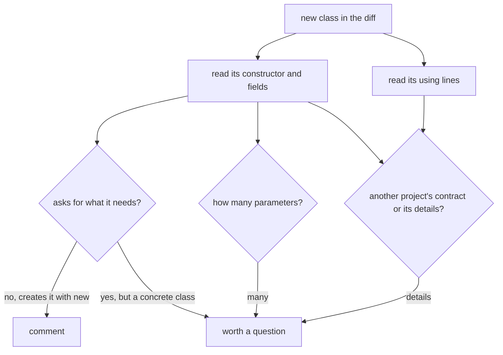

## Bạn cần biết trước

- [[management.l1.reviewing-for-layers]] — bạn biết cách kiểm tra, trong một diff, mỗi đoạn code mới có nằm trong tầng sở hữu loại việc của nó không.
- [[design.l1.solid-dip]] — bạn biết code cấp cao nên phụ thuộc vào một abstraction như `INotifier`, không phụ thuộc vào class cụ thể, và `OrderPlacedTightlyCoupled` phá điều này khi tự tạo `EmailNotifier` của nó.

## Tình huống

Một pull request thêm một class báo cho khách hàng rằng đơn của họ đã được giao. Nó chạy đúng, test qua, và code ngắn. Bên trong class, một field được gán bằng `new` với một class gửi email cụ thể. Một người review khác đã duyệt với lời "looks good", còn bạn đang mở diff và có năm phút. Bạn có thể đọc từng dòng của method mới, hoặc nhìn trước phần đầu của class: các dòng `using`, constructor và các field. Vì sao chỉ vài dòng đó lại cho bạn biết nhiều đến vậy?

## Khái niệm cốt lõi

- tham số constructor — một giá trị class yêu cầu khi được tạo ra, thay vì tự làm ra; đây là cách dependency injection đưa cho nó thứ nó cần.
- tự với lấy phụ thuộc — tự tạo, ngay trong class, một object mà class gọi để làm việc, như notifier hay repository, thay vì yêu cầu nó; dựng dữ liệu như một `Order` mới thì không tính.
- hợp đồng công khai — các type mà một project được dùng thông qua đó bởi các project khác, thường là một `interface` của C#, khác với các class cụ thể nó dùng cho việc riêng.

## Cơ chế hoạt động



Review theo phụ thuộc nghĩa là đọc cách một class mới lấy thứ nó cần, bằng mắt, từ phần đầu của class. Constructor liệt kê những gì nó yêu cầu, các field cho thấy thứ nó tự tạo, và các dòng `using` cho thấy file đưa vào namespace của những project nào khác. Các dòng `using` không phải danh sách đầy đủ: một type nằm trong chính namespace của file, hoặc trong một namespace chứa nó, không cần `using`, và một project có thể thêm dòng `using` cho mọi file cùng lúc. Vì vậy hãy đọc cả các type trong constructor.

Phép kiểm đầu tiên là class yêu cầu hay tự với lấy. Một class nhận `INotifier` qua constructor có thể được đưa bất kỳ notifier nào, kể cả một fake trong test. Một class tự tạo notifier cụ thể của nó bằng `new` thì không, và đổi kênh gửi nghĩa là phải sửa chính nó; điều đó đáng một nhận xét dù code chạy đúng. Một class yêu cầu một class cụ thể thì ở giữa: người tạo ra nó vẫn chọn được thứ truyền vào, nên thường chỉ đáng một câu hỏi.

Phép kiểm thứ hai là constructor có bao nhiêu tham số. Không quy tắc nào nói bao nhiêu là quá nhiều, nhưng Single Responsibility Principle (SRP) dự đoán rằng một class cần nhiều thứ khác nhau có lẽ đang làm nhiều việc. Danh sách dài là lý do để hỏi class chịu trách nhiệm gì, không phải lời phàn nàn về phong cách.

Phép kiểm thứ ba là mỗi phụ thuộc đến từ đâu: một interface mà project khác đưa ra cho người khác dùng, hay một class cụ thể project đó dùng cho việc riêng. Dùng hợp đồng của project khác giữ hai bên liên kết lỏng. Phụ thuộc vào chi tiết của nó buộc hai bên chặt hơn qua từng dòng như vậy, và một câu hỏi lúc review có thể chặn coupling đó trước khi code khác chép theo.

## Trong hệ thống Đơn Hàng

Một ví dụ trong `samples/DonHang.Samples/Samples/Design/OrderNotifications.cs` cho thấy phép kiểm đầu tiên, đặt cạnh nhau:

```csharp file=samples/DonHang.Samples/Samples/Design/OrderNotifications.cs tag=stage-1 lines=9-23
public sealed class OrderPlacedTightlyCoupled
{
    private readonly EmailNotifier notifier = new();

    public void Handle(int orderId) => notifier.Send(orderId, "order placed");
}

// lesson: design.l1.dependency-injection-intro
// Same job, but this caller depends on INotifier — the abstraction both
// EmailNotifier and SmsNotifier already implement (Samples/Oop/NotifierBase.cs).
// Any INotifier works here, including a fake one in a test.
public sealed class OrderNotifications(INotifier notifier)
{
    public void Handle(int orderId) => notifier.Send(orderId, "order placed");
}
```

Hãy đọc hai class như thể chúng đến trong một diff; comment ở giữa nhắc tới các notifier từ một bài trước, và ở đây chỉ `INotifier` là quan trọng. `OrderPlacedTightlyCoupled` không có tham số constructor; field của nó được tạo bằng `new()` thành một `EmailNotifier`, một class cụ thể. Người review sẽ nhận xét: class này không test được nếu không có class gửi email đó, và muốn đổi sang kênh khác thì phải sửa nó. `OrderNotifications` yêu cầu một `INotifier` qua constructor, nên người tạo ra nó chọn notifier.

Service đặt và hủy đơn, trong `DonHang.Domain/OrderService.cs`, được khai báo là `OrderService(IOrderRepository repository, INotifier notifier)`: hai tham số constructor, đều là interface khai báo ngay trong `DonHang.Domain`. Không chỗ nào trong file gọi tên một class cơ sở dữ liệu hay project `DonHang.Infrastructure`. Nó qua cả ba phép kiểm.

Giờ đến controller đăng nhập, trong `DonHang.Api/Controllers/AuthController.cs`:

```csharp file=DonHang.Api/Controllers/AuthController.cs tag=stage-1 lines=1-11
using DonHang.Domain;
using DonHang.Infrastructure;
using Microsoft.AspNetCore.Mvc;
using Microsoft.EntityFrameworkCore;

namespace DonHang.Api.Controllers;

// lesson: backend.l1.validating-a-jwt
[ApiController]
[Route("api/v1/auth")]
public sealed class AuthController(DonHangDbContext db, JwtTokenService tokenService) : ControllerBase
```

Dòng `using DonHang.Infrastructure;` và constructor nói cùng một điều: `AuthController` nhận `DonHangDbContext`, class cơ sở dữ liệu cụ thể của project infrastructure, không phải một interface. Nó còn nhận `JwtTokenService`, một class cụ thể trong chính namespace của API, nên không dòng `using` nào gọi tên nó; theo phép kiểm đầu tiên nó được truyền vào, nên nhiều nhất chỉ đáng một câu hỏi. Hai dòng `Microsoft.*` đưa vào web framework và thư viện cơ sở dữ liệu. Trong Đơn Hàng, thứ project infrastructure đưa cho tầng nghiệp vụ chủ yếu là các bản hiện thực của interface từ `DonHang.Domain`, như `IOrderRepository`; `DonHangDbContext` là class nó dùng để làm việc đó. Người review có thể hỏi controller có thể phụ thuộc vào một interface như vậy thay vì class cơ sở dữ liệu không, cũng chính là câu hỏi mà review theo tầng đã đặt ra từ phía khác.

## Người mới hay nghĩ rằng…

- **"Đếm tham số constructor chỉ là bắt bẻ phong cách, không phải mối lo thiết kế thật."** → Thực ra constructor là chỗ đầu tiên một class làm quá nhiều việc lộ ra, vì mỗi việc cần những thứ riêng. Bạn sẽ nhận ra khi một class có danh sách tham số dài phải thay đổi vì nhiều lý do không liên quan, và mỗi lần đổi lại có nguy cơ làm hỏng phần khác.
- **"Vấn đề phụ thuộc trong code mới không đáng nhận xét trừ khi nó đã gây lỗi."** → Thực ra cái giá của một phụ thuộc gắn cứng lộ ra về sau, khi ai đó cần test class hay đổi thứ nó dùng, và lúc đó code khác có thể đã chép theo. Bạn sẽ nhận ra khi viết unit test cho một class như `OrderPlacedTightlyCoupled` nghĩa là phải gửi email thật, vì không có gì cho phép bạn truyền vào một fake.

## Thử ngay (3 phút)

Mở `DonHang.Api/Controllers/OrdersController.cs` trong repository ở stage-1.

1. Ghi lại các tham số constructor của `OrdersController`, và mỗi cái là class cụ thể hay interface.
2. Xem các dòng `using` và ghi lại controller dùng những project nào của Đơn Hàng.
3. Quyết định bạn có để lại nhận xét về phụ thuộc không, và nếu có thì viết nó trong một câu.

Kết quả mong đợi: bước 1 — `OrderService`, một class cụ thể, và `IOrderRepository`, một interface. Bước 2 — chỉ `DonHang.Domain`; không có `using DonHang.Infrastructure;`, và các type trong `DonHang.Api`, namespace chứa namespace của controller, không cần `using`. Bước 3 — một câu hỏi là hợp lý, ví dụ: "`OrderService` là class cụ thể; một interface có giúp test riêng controller này dễ hơn không?" Câu trả lời nào cũng có thể đúng; điều quan trọng là bạn đã nhìn.

Một đồng đội nói: "`OrdersController` nhận một `OrderService` cụ thể, nên nó phá cùng quy tắc với `OrderPlacedTightlyCoupled`." Đó có phải cùng một vấn đề không?

<details><summary>Gợi ý đáp án</summary>

Không hẳn. `OrdersController` vẫn yêu cầu `OrderService` qua constructor, nên người tạo ra nó chọn object nào được truyền vào; trong API, web framework tạo controller và DI container cung cấp những gì constructor của nó yêu cầu. `OrderPlacedTightlyCoupled` tự tạo `EmailNotifier` bằng `new`, nên không ai bên ngoài chọn được. Phụ thuộc vào một class cụ thể được truyền vào thường là mối lo nhỏ hơn tự tạo nó, vì người gọi vẫn chọn được thứ truyền vào; cái trước có thể đáng một câu hỏi, cái sau đáng một nhận xét rõ ràng.

</details>

## Liên hệ

- [[management.l1.reviewing-for-layers]] — phép kiểm trước: code có nằm đúng tầng không.
- [[management.l1.reviewing-for-tests]] — phép kiểm tiếp theo: test có thật sự kiểm hành vi mới không.
- [[design.l1.dependency-injection-intro]] — cách một class nhận phụ thuộc thay vì tự tạo chúng.

## Tóm tắt 5 dòng

1. Review theo phụ thuộc đọc constructor và các dòng `using` của một class mới, bằng mắt.
2. Class tự tạo phụ thuộc cụ thể của nó bằng `new` thì không thể được đưa một fake, và đáng một nhận xét.
3. Nhiều tham số constructor gợi ý, theo SRP, rằng class làm nhiều việc, điều đáng để hỏi.
4. Phụ thuộc vào chi tiết cụ thể của project khác thay vì một interface làm coupling chặt hơn, điều review có thể chặn sớm.
5. `OrderService` yêu cầu hai interface từ chính project của nó; `AuthController` nhận `DonHangDbContext` cụ thể của project infrastructure.
