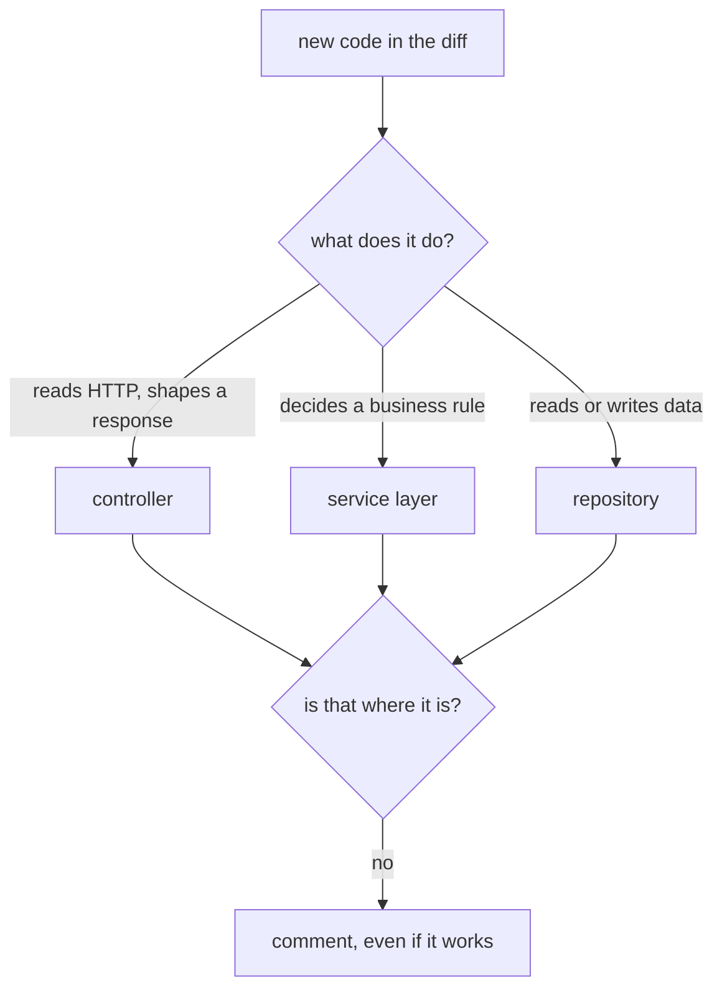

## Before you start

- [[management.l1.code-review-basics]] — you know a pull request holds a merge open so someone can read the diff, and how to write a comment about the code rather than the person.
- [[design.l1.the-controller-layer]] — you know a controller only speaks HTTP: it reads the request, calls the layer below, and shapes the result, without deciding business rules or touching the database.

## The situation

Imagine the login endpoint of Đơn Hàng arriving today as a pull request, and you are its reviewer. The tests pass, and when you run the API and sign in as one of the seeded customers with the development password, you get a token back. Then you read the diff and notice that the controller asks the database for the customer itself and checks the password right there, in the same method that answers HTTP. The author says: "It works, and it is ten lines. Why would you comment on it?" Is there anything to say about code that already works?

## Core concepts

- reviewing for layers — reading a diff to check that each new piece of code sits in the layer that owns that kind of work, not only that it works.
- layer violation — code placed in a layer that does not own its concern, such as a database query in a controller.
- placement — which layer a piece of code sits in, as opposed to what the code does when it runs.

## How it works



Reviewing for layers asks one question of every new piece of code in a diff: what kind of work does this do, and is it in the layer that owns that work? A controller reads HTTP and shapes the response. The service layer decides business rules. A repository reads and writes data. When the answer to "what does it do" and "where is it" do not match, that is a layer violation, and it is worth a comment even if every test passes.

The diagram is the whole check. Take a line of new code, name the kind of work it does, and compare that with the file it sits in. A controller that asks the database for rows, a service that reads the HTTP request to see who is signed in, or a repository method that decides whether an order may be cancelled, all fail the check. Code that works in the wrong place still fails it, because working was never the question.

The reason is the promise the layers make. Layers apply the idea behind the Single Responsibility Principle (SRP) at a larger size: each layer is meant to change for one kind of reason. HTTP details change the controller, a rule change touches the service, a query change touches the repository. Each misplaced line quietly breaks that promise for one more change. No single pull request looks harmful, but after enough of them a rule lives in three places and nobody knows which one is used.

Timing matters too. In review, moving the code is a comment and a few minutes of the author's time. After the merge, other pull requests may start to depend on the code where it is, and moving it means changing theirs as well.

## In the Đơn Hàng system

The login endpoint in `DonHang.Api/Controllers/AuthController.cs` at stage-1:

```csharp file=DonHang.Api/Controllers/AuthController.cs tag=stage-1 lines=11-24
public sealed class AuthController(DonHangDbContext db, JwtTokenService tokenService) : ControllerBase
{
    [HttpPost("login")]
    public async Task<ActionResult<LoginResponse>> Login(LoginRequest request)
    {
        var customer = await db.Customers.FirstOrDefaultAsync(c => c.Email == request.Email);
        if (customer?.PasswordHash is null || !PasswordHasher.Verify(request.Password, customer.PasswordHash))
        {
            return Unauthorized();
        }

        var token = tokenService.IssueToken(customer.Id, customer.Email);
        return Ok(new LoginResponse(token));
    }
```

Read it as a reviewer. The constructor takes `DonHangDbContext`, the database context itself, so the controller can query the database. The first line of `Login` does exactly that: it looks up the customer by email. The `if` then decides whether the password is right, using `PasswordHasher.Verify` from `DonHang.Domain`. That is two kinds of work, reading data and deciding a rule, in a class whose job is HTTP. It works, and a reviewer should still comment, for example as a question: "Could the lookup and the password check move below the controller, so the controller only reads the request and answers?"

Compare the endpoint that places an order, in `DonHang.Api/Controllers/OrdersController.cs`:

```csharp file=DonHang.Api/Controllers/OrdersController.cs tag=stage-1 lines=17-28
    [Authorize]
    [HttpPost]
    public async Task<ActionResult<OrderDto>> Create(CreateOrderRequest request)
    {
        var customerId = int.Parse(User.FindFirstValue(JwtRegisteredClaimNames.Sub)!);
        var items = request.Items
            .Select(i => new OrderItem { ProductId = i.ProductId, Quantity = i.Quantity, UnitPriceVnd = i.UnitPriceVnd })
            .ToList();

        var order = await orderService.PlaceOrderAsync(customerId, items);
        return CreatedAtAction(nameof(Get), new { id = order.Id }, ToDto(order));
    }
```

`Create` reads who the caller is and what they sent, builds the items, calls `orderService.PlaceOrderAsync`, and turns the result into a `201` response. It asks nothing of the database and decides no rule. That is the shape a reviewer is checking for.

## Beginners often think…

- **"As long as a PR's tests pass, which layer the new code ended up in doesn't matter."** → Actually tests check behavior, not placement; the login endpoint above works with its query in the controller. You notice this later, when a second way to sign in needs the same password check and it has to be copied, because it lives in one controller instead of a place both can call.
- **"Pointing out a layer violation in review is being pedantic if the code is otherwise correct."** → Actually it is one of the cheapest fixes a review can ask for: a comment now, instead of moving code that other changes already depend on. You notice this when a team that let a few misplaced lines through finds the same rule in several places and has to decide which copy is right.

## Try it (3 minutes)

Open `DonHang.Api/Controllers/ProductsController.cs` from the repository at stage-1.

1. Write down what the constructor takes.
2. For each line in `List` and `Get`, name the kind of work it does: HTTP, a business rule, or reading data.
3. Decide whether you would leave a comment, and write it in one sentence.

Expected result: step 1 — `DonHangDbContext`. Step 2 — `db.Products...` in both methods reads data; `return Ok(...)` and `return NotFound()` are HTTP; no line decides a business rule. Step 3 — yes, the queries are in the controller; for example: "Could these reads go through a repository, so the controller does not need `DonHangDbContext`?"

The author replies to your `ProductsController` comment: "These are plain reads with no rule, so a service would add nothing." Is that a good enough reason to leave the queries in the controller?

<details><summary>Suggested answer</summary>

It is a real trade-off, not a wrong answer. With no rule today, going straight to the data is a shortcut, and a team may accept it. The cost is that when a rule about reading products appears, there is no place for it below the controller until the reads are moved. A good review names that cost in the comment and lets the author and team decide, instead of approving silently or blocking the change.

</details>

## Connections

- [[management.l1.reviewing-for-dependencies]] — the next check: what a class depends on, and how it gets it.
- [[design.l1.tracing-a-request-through-layers]] — the shortcuts in Đơn Hàng where reads skip the service.
- [[design.l1.solid-srp]] — the one-reason-to-change idea that layers rely on.

## Five-line summary

1. Reviewing for layers asks, for each new piece of code, what work it does and whether its layer owns that work.
2. A database query in a controller, or a rule in a repository, is a violation worth a comment even if it works.
3. Each misplaced line breaks the one-reason-to-change promise a little, and many of them spread a rule across places.
4. In review, moving code costs a comment; after merge, other changes may already depend on where it is.
5. `AuthController.Login` queries the database and checks the password itself; `OrdersController.Create` only reads the request, calls the service and answers.
