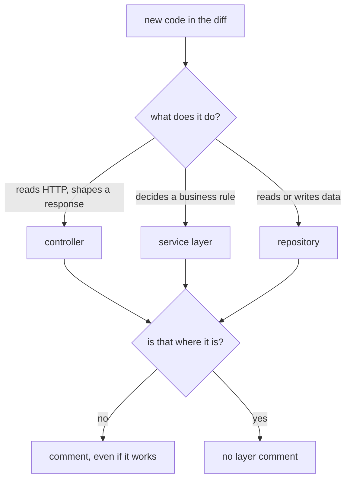

## Bạn cần biết trước

- [[management.l1.code-review-basics]] — bạn biết một pull request giữ việc merge lại đủ lâu để có người đọc diff, và biết cách viết nhận xét về code chứ không về người.
- [[design.l1.the-controller-layer]] — bạn biết controller chỉ nói HTTP: đọc request, gọi tầng bên dưới, và định dạng kết quả, không quyết định quy tắc nghiệp vụ và không chạm vào cơ sở dữ liệu.

## Tình huống

Hãy tưởng tượng endpoint đăng nhập của Đơn Hàng hôm nay mới đến dưới dạng một pull request, và bạn là người review. Test đều qua, và khi bạn chạy API rồi đăng nhập bằng một trong các khách hàng mẫu có sẵn trong cơ sở dữ liệu, dùng mật khẩu chung dành cho môi trường phát triển, bạn nhận được token. Rồi bạn đọc diff và thấy controller tự hỏi cơ sở dữ liệu để tìm khách hàng và kiểm mật khẩu ngay tại đó, trong cùng method trả lời HTTP. Tác giả nói: "Nó chạy đúng, lại chỉ mười dòng. Sao phải nhận xét?" Có gì để nói về code đã chạy đúng không?

## Khái niệm cốt lõi

- review theo tầng — đọc diff để kiểm tra mỗi đoạn code mới nằm trong tầng sở hữu loại việc đó, chứ không chỉ kiểm tra nó chạy đúng.
- vi phạm tầng — code đặt trong một tầng không sở hữu mối quan tâm của nó, ví dụ một câu truy vấn cơ sở dữ liệu trong controller.
- vị trí — đoạn code nằm ở tầng nào, khác với việc đoạn code làm gì khi chạy.

## Cơ chế hoạt động



Review theo tầng hỏi mỗi đoạn code mới trong diff một câu: nó làm loại việc gì, và nó có nằm trong tầng sở hữu loại việc đó không? Controller đọc HTTP và định dạng response. Tầng service quyết định quy tắc nghiệp vụ. Repository đọc và ghi dữ liệu. Khi câu trả lời cho "nó làm gì" và "nó nằm ở đâu" không khớp nhau, đó là vi phạm tầng, và nó đáng một nhận xét dù mọi test đều qua.

Sơ đồ chính là toàn bộ phép kiểm tra. Lấy một dòng code mới, gọi tên loại việc nó làm, rồi so với file chứa nó. Một controller hỏi cơ sở dữ liệu lấy dòng dữ liệu, một service đọc HTTP request để biết ai đang đăng nhập, hay một method của repository quyết định đơn có được hủy không, đều trượt phép kiểm tra. Code chạy đúng mà nằm sai chỗ vẫn trượt, vì chạy đúng chưa bao giờ là câu hỏi.

Lý do nằm ở lời hứa mà các tầng đưa ra. Các tầng áp dụng ý tưởng của Single Responsibility Principle (SRP) ở cỡ lớn hơn: mỗi tầng chỉ nên thay đổi vì một loại lý do. Chi tiết HTTP thay đổi thì sửa controller, quy tắc thay đổi thì chạm vào service, truy vấn thay đổi thì chạm vào repository. Mỗi dòng đặt sai chỗ lặng lẽ phá lời hứa đó thêm một lần thay đổi. Không pull request riêng lẻ nào trông có hại, nhưng sau đủ nhiều cái, một quy tắc nằm ở ba chỗ và không ai biết chỗ nào đang được dùng.

Thời điểm cũng quan trọng. Lúc review, chuyển code chỉ tốn một nhận xét và vài phút của tác giả. Sau khi merge, các pull request khác có thể bắt đầu phụ thuộc vào code ở chỗ hiện tại, và chuyển nó nghĩa là phải sửa cả những thay đổi đó.

## Trong hệ thống Đơn Hàng

Endpoint đăng nhập trong `DonHang.Api/Controllers/AuthController.cs` ở stage-1:

```csharp file=DonHang.Api/Controllers/AuthController.cs tag=stage-1 lines=11-24
public sealed class AuthController(DonHangDbContext db, JwtTokenService tokenService) : ControllerBase
{
    [HttpPost("login")]
    public async Task<ActionResult<LoginResponse>> Login(LoginRequest request)
    {
        var customer = await db.Customers.FirstOrDefaultAsync(c => c.Email == request.Email);
        if (customer?.PasswordHash is null || !PasswordHasher.Verify(request.Password, customer.PasswordHash))
        {
            return Unauthorized();
        }

        var token = tokenService.IssueToken(customer.Id, customer.Email);
        return Ok(new LoginResponse(token));
    }
```

Hãy đọc nó với vai người review. Constructor nhận `DonHangDbContext`, chính database context, nên controller có thể truy vấn cơ sở dữ liệu. Dòng đầu tiên của `Login` làm đúng điều đó: tìm khách hàng theo email. Rồi câu `if` quyết định lần đăng nhập này có được phép không.

Bản thân việc so mật khẩu do `PasswordHasher.Verify` làm, một helper trong `DonHang.Domain`, project chứa tầng nghiệp vụ, và gọi một helper thì không sao. Quy tắc là quyết định bao quanh nó: khi không có khách hàng đó, không có hash đã lưu, hoặc mật khẩu không khớp, thì từ chối đăng nhập. Quyết định đó được đưa ra trong controller. Vậy ngoài HTTP, method còn làm hai loại việc, đọc dữ liệu và quyết định quy tắc, trong một class có nhiệm vụ là HTTP. Nó chạy đúng, và người review vẫn nên nhận xét, ví dụ dưới dạng câu hỏi: "Việc tìm khách hàng và quyết định đăng nhập có thể chuyển xuống dưới controller không, để controller chỉ đọc request và trả lời?"

So với endpoint đặt đơn, trong `DonHang.Api/Controllers/OrdersController.cs`:

```csharp file=DonHang.Api/Controllers/OrdersController.cs tag=stage-1 lines=17-28
    [Authorize]
    [HttpPost]
    public async Task<ActionResult<OrderDto>> Create(CreateOrderRequest request)
    {
        var customerId = int.Parse(User.FindFirstValue(JwtRegisteredClaimNames.Sub)!);
        var items = request.Items
            .Select(i => new OrderItem { ProductId = i.ProductId, Quantity = i.Quantity, UnitPriceVnd = i.UnitPriceVnd })
            .ToList();

        var order = await orderService.PlaceOrderAsync(customerId, items);
        return CreatedAtAction(nameof(Get), new { id = order.Id }, ToDto(order));
    }
```

`Create` đọc người gọi là ai và họ gửi gì, dựng danh sách món, gọi `orderService.PlaceOrderAsync`, rồi biến kết quả thành response `201`. Nó không hỏi cơ sở dữ liệu điều gì và không quyết định quy tắc nào. Đó là hình dạng mà người review đang tìm.

## Người mới hay nghĩ rằng…

- **"Miễn test của PR qua, code mới nằm ở tầng nào không quan trọng."** → Thực ra test kiểm hành vi, không kiểm vị trí; endpoint đăng nhập ở trên chạy đúng dù câu truy vấn nằm trong controller. Bạn sẽ nhận ra về sau, khi một lối đăng nhập thứ hai cần đúng phép kiểm mật khẩu đó và phải chép lại, vì nó nằm trong một controller thay vì ở chỗ cả hai cùng gọi được.
- **"Chỉ ra vi phạm tầng lúc review là bắt bẻ nếu code vốn đúng."** → Thực ra đó là một trong những chỗ sửa rẻ nhất mà review có thể yêu cầu: một nhận xét bây giờ, thay vì chuyển code mà các thay đổi khác đã phụ thuộc vào. Bạn sẽ nhận ra khi một đội từng để lọt vài dòng đặt sai chỗ phát hiện cùng một quy tắc nằm ở nhiều nơi và phải quyết định bản nào đúng.

## Thử ngay (3 phút)

Mở `DonHang.Api/Controllers/ProductsController.cs` trong repository ở stage-1.

1. Ghi lại constructor nhận những gì.
2. Với mỗi dòng trong `List` và `Get`, gọi tên loại việc nó làm: HTTP, quy tắc nghiệp vụ, hay đọc dữ liệu.
3. Quyết định bạn có để lại nhận xét không, và viết nó trong một câu.

Kết quả mong đợi: bước 1 — `DonHangDbContext`. Bước 2 — `db.Products...` ở cả hai method là đọc dữ liệu; `return Ok(...)` và `if (product is null) return NotFound();` là HTTP, vì chúng chỉ biến "tìm thấy" hay "không tìm thấy" thành một status code; không dòng nào quyết định điều gì được phép, nên không dòng nào là quy tắc nghiệp vụ. Bước 3 — có, các câu truy vấn nằm trong controller; ví dụ: "Những lần đọc này có thể đi qua một repository không, để controller không cần `DonHangDbContext`?"

Tác giả trả lời nhận xét của bạn về `ProductsController`: "Đây chỉ là đọc dữ liệu đơn giản, không có quy tắc, nên thêm repository và service chẳng được gì." Đó có phải lý do đủ tốt để để các câu truy vấn trong controller không?

<details><summary>Gợi ý đáp án</summary>

Đó là một đánh đổi thật, không phải câu trả lời sai. Khi hôm nay chưa có quy tắc, đi thẳng tới dữ liệu là một lối tắt, và một đội có thể chấp nhận nó. Cái giá là khi xuất hiện một quy tắc về việc đọc sản phẩm, sẽ không có chỗ cho nó bên dưới controller cho tới khi các lần đọc được chuyển đi. Một review tốt nêu rõ cái giá đó trong nhận xét và để tác giả cùng đội quyết định, thay vì lặng lẽ duyệt hay chặn thay đổi.

</details>

## Liên hệ

- [[management.l1.reviewing-for-dependencies]] — phép kiểm tiếp theo: một class phụ thuộc vào gì, và lấy nó bằng cách nào.
- [[design.l1.tracing-a-request-through-layers]] — các lối tắt trong Đơn Hàng nơi việc đọc bỏ qua service.
- [[design.l1.solid-srp]] — ý tưởng một lý do để thay đổi mà các tầng dựa vào.

## Tóm tắt 5 dòng

1. Review theo tầng hỏi, với mỗi đoạn code mới, nó làm việc gì và tầng chứa nó có sở hữu việc đó không.
2. Câu truy vấn cơ sở dữ liệu trong controller, hay quy tắc trong repository, là vi phạm đáng nhận xét dù code chạy đúng.
3. Mỗi dòng đặt sai chỗ phá một chút lời hứa một lý do để thay đổi, và nhiều dòng như vậy rải một quy tắc ra nhiều nơi.
4. Lúc review, chuyển code tốn một nhận xét; sau khi merge, các thay đổi khác có thể đã phụ thuộc vào chỗ nó đang nằm.
5. `AuthController.Login` tự truy vấn cơ sở dữ liệu và tự quyết định đăng nhập có được phép không; `OrdersController.Create` chỉ đọc request, gọi service và trả lời.
