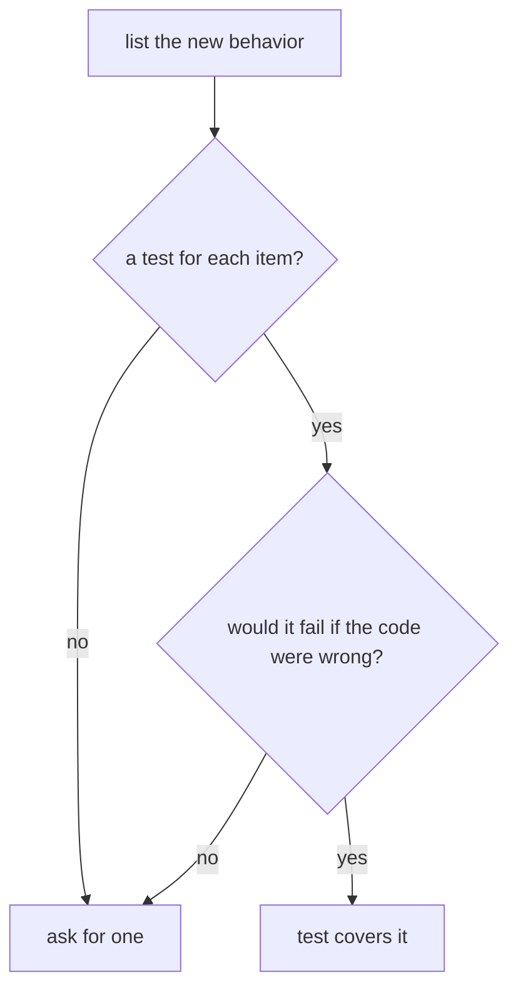

## Before you start

- [[management.l1.reviewing-for-dependencies]] — you know how to read a new class's constructor and `using` lines to see what it depends on and how it gets it.
- [[design.l1.what-makes-a-good-unit-test]] — you know a good unit test is fast, checks one behavior, and gives the same result every time; `OrderServiceTests` uses fresh fakes in every test.

## The situation

A pull request adds order cancellation to Đơn Hàng: a new `CancelOrderAsync` method in `OrderService`, and two new tests in `OrderServiceTests`. The build succeeds and every test passes. The description says "cancellation added, with tests". A reviewer who counts files sees a test file among the changed files and is satisfied. But the story this work belongs to says a customer can cancel an order that has not been paid yet, and some orders have already shipped. Do passing tests tell you that a shipped order cannot be cancelled?

## Core concepts

- new behavior — what a change makes the code do that it did not do before, including what it should refuse to do.
- a test that cannot fail — a test that would still pass if the new code were wrong in the way that matters, so it checks nothing about that.
- fail first — a test written for a missing check or a fixed bug should fail against the old code and pass against the new one.

## How it works



Reviewing for tests starts from the change, not from the test file. First list what the new code does: what it returns, what it changes, what it sends, and what it should refuse. Then, for each item, find the test that checks it. A test file in the diff, the list of changed lines, only tells you that some test changed. It does not tell you which behavior is covered.

For each test you find, ask one question: if the new code were wrong in the way that matters, would this test fail? A test that seeds a fake with an order already marked cancelled and then asserts it is cancelled passes even if the service never changes the status. It is checking a status the fake already held, not one the code under review set. Tests like that are worth asking about before the merge, not after a bug report.

When the change adds a missing check or fixes a bug, the test for it has one more duty: it should fail against the old code and pass against the new one. If it passes against both, it may be passing for a reason that has nothing to do with the fix. A reviewer can ask the author whether they saw it fail first.

Asking for a missing test is not optional polish. A missing test means the next change can break that behavior without any test failing.

## In the Đơn Hàng system

`CancelOrderAsync` in `DonHang.Domain/OrderService.cs` at stage-1:

```csharp file=DonHang.Domain/OrderService.cs tag=stage-1 lines=29-38
    public async Task<Order> CancelOrderAsync(int orderId)
    {
        var order = await repository.FindAsync(orderId)
            ?? throw new KeyNotFoundException($"order {orderId} not found");

        order.Status = "cancelled";
        await repository.SaveChangesAsync();
        notifier.Send(order.Id, "order cancelled");
        return order;
    }
```

List the behavior: it looks the order up and throws `KeyNotFoundException` when there is none; it sets `Status` to `"cancelled"`; it saves; it sends a notification. It never looks at the order's current status, so an order that is `shipped` is cancelled just like a `new` one. The same goes for a `paid` order, although the story is only about orders that are not yet paid.

The cancellation tests in `DonHang.Tests/Services/OrderServiceTests.cs`:

```csharp file=DonHang.Tests/Services/OrderServiceTests.cs tag=stage-1 lines=45-67
    [Fact]
    public async Task CancelOrderAsync_NewOrder_SetsStatusCancelled()
    {
        var repository = new FakeOrderRepository();
        repository.Seed(new Order { Id = 1, CustomerId = 1, PlacedAt = DateTimeOffset.UtcNow, Status = "new" });
        var service = new OrderService(repository, new FakeNotifier());

        var order = await service.CancelOrderAsync(1);

        Assert.Equal("cancelled", order.Status);
    }

    [Fact]
    public async Task CancelOrderAsync_UnknownOrder_Throws()
    {
        var service = new OrderService(new FakeOrderRepository(), new FakeNotifier());

        await Assert.ThrowsAsync<KeyNotFoundException>(() => service.CancelOrderAsync(999));
    }

    // lesson: management.l1.reviewing-for-tests
    // No test here cancels a `shipped` order. The suite is green, `CancelOrderAsync`
    // still lets it through — the gap the reading-a-300-line-pr lesson is about.
```

Match them to the list. `CancelOrderAsync_NewOrder_SetsStatusCancelled` checks the status change for a `new` order. `CancelOrderAsync_UnknownOrder_Throws` checks the missing order. No test checks that a notification is sent on cancel, and no test tries a `shipped` order. The first test also cannot fail on the most important point: if the method cancelled every order whatever its status, it would still pass. The comment at the end of the file, which points to a later lesson in this module, says the same thing: all the tests pass, and a `shipped` order still gets through.

That does not make the first test wrong; it checks what its name says. The gap is a missing test, so the fix is to add one for a `shipped` order, not to change this one.

A reviewer's comment could be a question: "The story is about unpaid orders; should a `shipped` order be refused here? If so, could you add a test that tries one? It should fail against this version first." That test is what turns the gap into a failing test the next time someone breaks it.

## Beginners often think…

- **"A PR that touches a test file has adequate test coverage for what it changed."** → Actually a changed test file says nothing about which behavior is checked, so it does not show that each new behavior has a test checking it; only matching tests to the new behavior does. You notice this in `OrderServiceTests`, where two cancellation tests pass and a `shipped` order can still be cancelled.
- **"Asking an author to add a test is optional feedback, less important than catching an actual bug."** → Actually a missing test is how a bug can get in later unnoticed, because no test fails when the behavior breaks. You notice this when a later change breaks cancellation and every test still passes, because no test ever checked that part.

## Try it (3 minutes)

Open `docs/team/story-example.md` and `DonHang.Tests/Services/OrderServiceTests.cs` from the repository at stage-1.

1. Read acceptance criteria 3, 4 and 5 of the cancellation story.
2. For each, look for a test in `OrderServiceTests` that checks it.
3. Read the team's Definition of Done in the story file and write down which line these results break.

Expected result: step 1 — 3: no cancel button for `paid`, `shipped` or `cancelled` orders; 4: cancelling someone else's order returns 403 and changes nothing; 5: cancelling twice returns 409 on the second try. Step 2 — none of the three has a test in `OrderServiceTests`; 3 is about the button and 4 and 5 about the API's answer, but none of them has a service test that would catch the same rule either. Step 3 — `Có test tự động cho mọi tiêu chí chấp nhận ở trên`: every acceptance criterion should have an automated test.

The author answers your question about `shipped` orders: "I added a status check to `CancelOrderAsync` and a test, `CancelOrderAsync_ShippedOrder_IsRefused`, and it passes." What should you ask next?

<details><summary>Suggested answer</summary>

Whether it failed before the check was added. Against the version of `CancelOrderAsync` shown above, which never reads the status, a correct test for a `shipped` order has to fail. If the new test passed against that version too, it is not checking the refusal; for example, it might seed an order that is not really `shipped`, or assert something the fake already returns.

</details>

## Connections

- [[management.l1.reviewing-for-dependencies]] — the previous check: what a class depends on, and how.
- [[management.l1.reading-a-300-line-pr]] — all three checks together on a larger pull request.
- [[design.l1.testing-with-a-fake-repository]] — how `OrderServiceTests` uses a fake repository.

## Five-line summary

1. Reviewing for tests starts from the new behavior and looks for a test for each item, not just a changed test file.
2. A test that would still pass if the code were wrong in the way that matters checks nothing about that.
3. A test for a new check or a fixed bug should fail against the old code and pass against the new one.
4. `CancelOrderAsync` cancels any order it finds; its two tests cover a `new` order and a missing one, not a `shipped` one.
5. Asking for a missing test before the merge means the gap can be caught by a failing test, not by a bug report.
