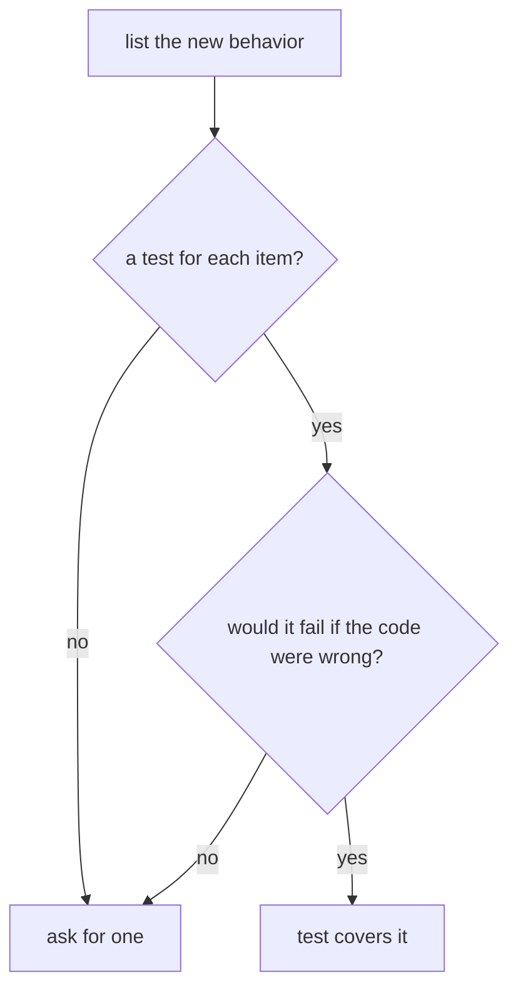

## Bạn cần biết trước

- [[management.l1.reviewing-for-dependencies]] — bạn biết cách đọc constructor và các dòng `using` của một class mới để thấy nó phụ thuộc vào gì và lấy thứ đó ra sao.
- [[design.l1.what-makes-a-good-unit-test]] — bạn biết một unit test tốt chạy nhanh, kiểm một hành vi, và cho cùng kết quả mọi lần; `OrderServiceTests` dùng fake mới trong mỗi test.

## Tình huống

Một pull request thêm chức năng hủy đơn vào Đơn Hàng: method mới `CancelOrderAsync` trong `OrderService`, và hai test mới trong `OrderServiceTests`. Build thành công và mọi test đều qua. Phần mô tả ghi "đã thêm hủy đơn, có test". Một người review chỉ đếm file thấy có file test trong số file thay đổi và thấy yên tâm. Nhưng story của phần việc này nói khách hàng được hủy đơn chưa thanh toán, và có những đơn đã được giao. Test qua hết có cho bạn biết một đơn đã giao không thể bị hủy không?

## Khái niệm cốt lõi

- hành vi mới — điều mà thay đổi khiến code làm được mà trước đó chưa làm, kể cả điều nó phải từ chối làm.
- test không thể fail — một test vẫn qua dù code mới sai đúng ở chỗ quan trọng, nên nó không kiểm gì về chỗ đó.
- fail trước — test viết cho một phép kiểm còn thiếu hay một lỗi đã sửa phải fail với code cũ và qua với code mới.

## Cơ chế hoạt động



Review theo test bắt đầu từ thay đổi, không bắt đầu từ file test. Trước hết liệt kê code mới làm gì: nó trả về gì, thay đổi gì, gửi gì, và phải từ chối điều gì. Rồi với mỗi mục, tìm test kiểm mục đó. Một file test trong diff, danh sách các dòng đã đổi, chỉ cho bạn biết có test nào đó thay đổi. Nó không cho biết hành vi nào được phủ.

Với mỗi test tìm được, hãy hỏi một câu: nếu code mới sai đúng ở chỗ quan trọng, test này có fail không? Một test nạp sẵn vào fake một đơn đã đánh dấu hủy rồi khẳng định nó đã hủy sẽ qua kể cả khi service không bao giờ đổi trạng thái. Nó đang kiểm một trạng thái fake đã giữ sẵn, không phải trạng thái do code đang review đặt ra. Những test như vậy đáng hỏi trước khi merge, không phải sau một bug report.

Khi thay đổi thêm một phép kiểm còn thiếu hay sửa một lỗi, test cho nó có thêm một nhiệm vụ: phải fail với code cũ và qua với code mới. Nếu nó qua với cả hai, có thể nó đang qua vì một lý do chẳng liên quan gì tới bản sửa. Người review có thể hỏi tác giả đã thấy nó fail trước chưa.

Yêu cầu thêm test còn thiếu không phải chuyện đánh bóng tùy chọn. Thiếu test nghĩa là thay đổi tiếp theo có thể làm hỏng hành vi đó mà không test nào fail.

## Trong hệ thống Đơn Hàng

`CancelOrderAsync` trong `DonHang.Domain/OrderService.cs` ở stage-1:

```csharp file=DonHang.Domain/OrderService.cs tag=stage-1 lines=29-38
    public async Task<Order> CancelOrderAsync(int orderId)
    {
        var order = await repository.FindAsync(orderId)
            ?? throw new KeyNotFoundException($"order {orderId} not found");

        order.Status = "cancelled";
        await repository.SaveChangesAsync();
        notifier.Send(order.Id, "order cancelled");
        return order;
    }
```

Liệt kê hành vi: nó tìm đơn và ném `KeyNotFoundException` khi không có; nó đặt `Status` thành `"cancelled"`; nó lưu; nó gửi một thông báo. Nó không hề xem trạng thái hiện tại của đơn, nên một đơn `shipped` bị hủy y như một đơn `new`. Đơn `paid` cũng vậy, dù story chỉ nói về những đơn chưa thanh toán.

Các test hủy đơn trong `DonHang.Tests/Services/OrderServiceTests.cs`:

```csharp file=DonHang.Tests/Services/OrderServiceTests.cs tag=stage-1 lines=45-67
    [Fact]
    public async Task CancelOrderAsync_NewOrder_SetsStatusCancelled()
    {
        var repository = new FakeOrderRepository();
        repository.Seed(new Order { Id = 1, CustomerId = 1, PlacedAt = DateTimeOffset.UtcNow, Status = "new" });
        var service = new OrderService(repository, new FakeNotifier());

        var order = await service.CancelOrderAsync(1);

        Assert.Equal("cancelled", order.Status);
    }

    [Fact]
    public async Task CancelOrderAsync_UnknownOrder_Throws()
    {
        var service = new OrderService(new FakeOrderRepository(), new FakeNotifier());

        await Assert.ThrowsAsync<KeyNotFoundException>(() => service.CancelOrderAsync(999));
    }

    // lesson: management.l1.reviewing-for-tests
    // No test here cancels a `shipped` order. The suite is green, `CancelOrderAsync`
    // still lets it through — the gap the reading-a-300-line-pr lesson is about.
```

Đối chiếu chúng với danh sách. `CancelOrderAsync_NewOrder_SetsStatusCancelled` kiểm việc đổi trạng thái của một đơn `new`. `CancelOrderAsync_UnknownOrder_Throws` kiểm trường hợp không có đơn. Không test nào kiểm việc gửi thông báo khi hủy, và không test nào thử một đơn `shipped`. Test đầu tiên cũng không thể fail ở điểm quan trọng nhất: nếu method hủy mọi đơn bất kể trạng thái, nó vẫn qua. Comment ở cuối file, trỏ tới một bài sau trong module này, nói đúng điều đó: mọi test đều qua, mà đơn `shipped` vẫn lọt qua.

Điều đó không khiến test đầu tiên sai; nó kiểm đúng điều tên nó nói. Lỗ hổng là một test còn thiếu, nên cách sửa là thêm một test cho đơn `shipped`, không phải sửa test này.

Nhận xét của người review có thể là một câu hỏi: "Story nói về đơn chưa thanh toán; đơn `shipped` có nên bị từ chối ở đây không? Nếu có, bạn thêm giúp một test thử đơn đó được không? Nó phải fail với phiên bản này trước đã." Chính test đó biến lỗ hổng thành một test fail vào lần tới có người làm hỏng nó.

## Người mới hay nghĩ rằng…

- **"PR có chạm vào file test thì đã được test đủ cho những gì nó thay đổi."** → Thực ra một file test bị đổi không nói gì về hành vi nào được kiểm, nên nó không cho thấy mỗi hành vi mới đều có một test kiểm; chỉ việc đối chiếu test với hành vi mới mới cho thấy điều đó. Bạn sẽ nhận ra ở `OrderServiceTests`, nơi hai test hủy đơn đều qua mà đơn `shipped` vẫn hủy được.
- **"Yêu cầu tác giả thêm test chỉ là góp ý tùy chọn, kém quan trọng hơn bắt được một lỗi thật."** → Thực ra thiếu test là cách một lỗi có thể lọt vào về sau mà không ai hay, vì không test nào fail khi hành vi bị hỏng. Bạn sẽ nhận ra khi một thay đổi sau làm hỏng chức năng hủy đơn mà mọi test vẫn qua, vì chưa từng có test nào kiểm phần đó.

## Thử ngay (3 phút)

Mở `docs/team/story-example.md` và `DonHang.Tests/Services/OrderServiceTests.cs` trong repository ở stage-1.

1. Đọc tiêu chí chấp nhận 3, 4 và 5 của story hủy đơn.
2. Với mỗi tiêu chí, tìm một test trong `OrderServiceTests` kiểm nó.
3. Đọc Definition of Done của đội trong file story và ghi lại kết quả trên phạm vào dòng nào.

Kết quả mong đợi: bước 1 — 3: không hiện nút hủy cho đơn `paid`, `shipped` hoặc `cancelled`; 4: hủy đơn của người khác trả về 403 và không đổi gì; 5: hủy hai lần thì lần thứ hai trả về 409. Bước 2 — không tiêu chí nào trong ba cái có test trong `OrderServiceTests`; 3 nói về nút bấm còn 4 và 5 nói về câu trả lời của API, nhưng cũng không cái nào có test ở service bắt được cùng quy tắc đó. Bước 3 — `Có test tự động cho mọi tiêu chí chấp nhận ở trên`: mọi tiêu chí chấp nhận phải có test tự động.

Tác giả trả lời câu hỏi của bạn về đơn `shipped`: "Mình đã thêm phép kiểm trạng thái vào `CancelOrderAsync` và một test, `CancelOrderAsync_ShippedOrder_IsRefused`, và nó qua." Bạn nên hỏi gì tiếp theo?

<details><summary>Gợi ý đáp án</summary>

Nó có fail trước khi thêm phép kiểm không. Với phiên bản `CancelOrderAsync` ở trên, vốn không hề đọc trạng thái, một test đúng cho đơn `shipped` bắt buộc phải fail. Nếu test mới cũng qua với phiên bản đó, nó không kiểm việc từ chối; ví dụ, nó có thể nạp một đơn không thật sự là `shipped`, hoặc khẳng định một điều fake vốn đã trả về.

</details>

## Liên hệ

- [[management.l1.reviewing-for-dependencies]] — phép kiểm trước: một class phụ thuộc vào gì, và thế nào.
- [[management.l1.reading-a-300-line-pr]] — cả ba phép kiểm cùng lúc trên một pull request lớn hơn.
- [[design.l1.testing-with-a-fake-repository]] — cách `OrderServiceTests` dùng một repository giả.

## Tóm tắt 5 dòng

1. Review theo test bắt đầu từ hành vi mới và tìm một test cho từng mục, không chỉ nhìn có file test bị đổi.
2. Một test vẫn qua dù code sai đúng ở chỗ quan trọng thì không kiểm gì về chỗ đó.
3. Test cho một phép kiểm mới hay một lỗi đã sửa phải fail với code cũ và qua với code mới.
4. `CancelOrderAsync` hủy mọi đơn nó tìm thấy; hai test của nó phủ đơn `new` và đơn không tồn tại, không phủ đơn `shipped`.
5. Yêu cầu thêm test còn thiếu trước khi merge nghĩa là lỗ hổng có thể bị một test fail bắt được, không phải một bug report.
