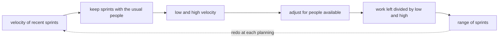

## Before you start

- [[management.l2.velocity]] — you know velocity is the total points of the items that met the Definition of Done in one sprint, and that Sprint 14's velocity is 9.

## The situation

At Sprint 15 planning, the product owner, who decides the order of the work the team builds, asks: when can customers ask for a refund themselves? The work left adds up to 30 points: 28 of refund work and 2 carried over from Sprint 14. Someone divides 30 by Sprint 14's velocity of 9, gets about 3.3, and suggests announcing "end of Sprint 18". Another developer points out that one of the four developers will spend the next sprints on the payment gateway, the outside service that sends the refund money, work the team has never done. What answer to "when" can the team give that is still true a month from now?

## Core concepts

- forecast — the team's current best answer to "when will this be done", made from its past velocity and the work left, and expected to change.
- range of sprints — a forecast given as "from X to Y sprints", found by dividing the work left by a high and a low velocity.
- people available — how many of the team's usual people can work on this in the next sprint, after leave and other duties.

## How it works



Velocity varies from sprint to sprint, so start from several recent sprints, not the last one.

In the situation above, dividing by Sprint 14's 9 alone hides that the team has also finished 8 and 11 in other sprints with the usual people (recorded in the file shown next). So take the lowest and the highest of those sprints. A sprint with fewer people than usual is left out: its velocity is lower for a reason you already know, not because the team works slower.

Next, look ahead. When fewer people are available in the next sprint, for leave or other work, the team takes in less than its usual velocity, instead of expecting the others to cover the gap. To take in is to plan work into the sprint. Scale the low and the high down roughly by the share of the team that is still available. The 2020 Scrum Guide points the same way: the more the Developers know about their past performance, their upcoming capacity and their Definition of Done, the more confident their Sprint forecast. Upcoming capacity means how much they can work in the coming sprint.

Then divide the work left by the adjusted high for the shortest likely time, and by the adjusted low for the longest. Round up, because work that spills into a sprint takes that sprint. The result is a range of sprints: a more honest answer to "when" than one date, because it shows how much the team's own history varies.

Finally, a forecast is redone at every sprint planning, with the newest velocity and the points left; that is the dashed arrow. A forecast kept unchanged for months stops being a forecast, and people start treating it as a promise nobody decided to make.

## In the Đơn Hàng system

`docs/team/velocity-history.md` records the last five sprints:

```markdown file=docs/team/velocity-history.md tag=stage-2 lines=9-20
| Sprint | Điểm đã nhận | Velocity | Ghi chú |
|---|---|---|---|
| 10 | 10 | 8 | Một việc 2 điểm chưa có test nên chưa xong, chuyển Sprint 11 |
| 11 | 11 | 11 | |
| 12 | 7 | 6 | Thiếu người: hai lập trình viên nghỉ phép một tuần, đội nhận ít hơn thường lệ; một việc 1 điểm chuyển Sprint 13 |
| 13 | 10 | 10 | |
| 14 | 11 | 9 | Việc "Ngừng gửi thông báo cho đơn đã hủy" (2 điểm) chưa xong, chuyển Sprint 15 |

Velocity đổi từ sprint này sang sprint khác, nên đội không dự báo bằng một
sprint duy nhất. Bốn sprint đủ người (10, 11, 13, 14) nằm trong khoảng 8 đến 11
điểm. Sprint 12 thiếu người nên không dùng làm mức thấp nhất cho một sprint đủ
người; nó cho thấy velocity giảm khi thiếu người.
```

Velocity moves between 8 and 11 in the four sprints with the usual people. Sprint 12 had two developers on leave for a week; the team took in fewer points, 7, and finished 6. The paragraph under the table says the team does not use Sprint 12 as the low end for a sprint with the usual people; it shows what fewer people does to velocity.

The forecast part of the file, written at Sprint 15 planning, first sets out the 30 points left: 28 points of refund work and the 2 points carried over from Sprint 14. A small table works two cases: all four developers, or three. With all four, 8 to 11 points a sprint gives 3 to 4 sprints. The rest of the file says which case the team uses:

```markdown file=docs/team/velocity-history.md tag=stage-2 lines=32-43
Từ Sprint 15, một trong bốn lập trình viên làm phần việc đội chưa từng làm (tích
hợp API hoàn tiền của cổng thanh toán, đối soát với kế toán) và không nhận việc
tính bằng điểm. Ba người còn lại làm được khoảng ba phần tư mức thường lệ, nên
đội nhận 6 đến 8 điểm mỗi sprint thay vì 8 đến 11. Trường hợp này là trường hợp
đội dùng.

Câu trả lời cho "bao giờ xong": từ 4 đến 5 sprint, tức 8 đến 10 tuần tính từ
đầu Sprint 15. Không có một ngày duy nhất.

Dự báo được làm lại ở mỗi sprint planning, với velocity của sprint vừa xong và
số điểm còn lại. Một dự báo giữ nguyên từ Sprint 15 tới cuối sẽ dần thành một
lời hứa mà không ai quyết định hứa.
```

From Sprint 15, one of the four developers works on the payment gateway and takes no work estimated in story points, so adds nothing to velocity. The other three do about three quarters of the usual amount: 8 × ¾ = 6 and 11 × ¾ ≈ 8, so the team takes in 6 to 8 points instead of 8 to 11. Then 30 / 8 = 3.75 rounds up to 4, and 30 / 6 = 5: from 4 to 5 sprints, which is 8 to 10 weeks from the start of Sprint 15, since a sprint here lasts two weeks. The last paragraph is the loop from the diagram: the forecast is redone at each sprint planning.

## Beginners often think…

- **"Our average velocity times the number of sprints left gives the exact release date."** → Actually multiplying or dividing by the average hides how much velocity varies, and the result looks more certain than the history behind it. The team's four usual sprints average 9.5, which gives 30 / 9.5 ≈ 3.2 sprints, yet the same history allows anything from 3 to 4. You notice this when a date computed to the day is missed by a whole sprint.
- **"If someone is on leave, the rest of the team should still hit the usual velocity."** → Actually fewer people finish fewer points, and Sprint 12 shows it: two developers away for a week, velocity 6. You notice this when a short-staffed sprint was planned at the full number and ends with several items carried over.
- **"Once we give a forecast, changing it later means we planned badly."** → Actually a forecast is meant to be redone at every planning with the newest velocity and the work left. You notice this when an old forecast nobody updated is quoted back as a promise.

## Try it (3 minutes)

Open `docs/team/velocity-history.md` from the repository.

1. Suppose that at Sprint 16 planning, 24 points are left and the team still takes in 6 to 8 points a sprint. Divide 24 by 8 and by 6, rounding up.
2. Write the forecast as a range of sprints, counted from the start of Sprint 16.

Expected result: 24 / 8 = 3 and 24 / 6 = 4, so from 3 to 4 sprints from the start of Sprint 16, which is 6 to 8 weeks.

Now suppose one of the three developers on point-sized work will be on leave for the whole of Sprint 17. What should the team do with that forecast, and what should it not do?

<details><summary>Suggested answer</summary>

Redo it at Sprint 17 planning: take in fewer points for that sprint, because fewer people are available, and let the range move if it has to. It should not keep the old range and expect the two remaining developers to make up the difference. If the range moves, the people waiting for the refund flow should hear it from the team.

</details>

## Connections

- [[management.l2.velocity]] — prerequisite: the one-sprint number this lesson turns into a range.
- [[management.l1.estimates-are-not-commitments]] — the same idea one level up: a forecast, like an estimate, is not a promise.
- [[management.l2.three-point-estimation]] — the other half of the refund plan: how the team sizes the work it has no velocity for.
- [[management.l2.stakeholder-communication]] — how this range is told to people outside the team.

## Five-line summary

1. Forecast "when" with a range of sprints from several recent velocities, not one number from one sprint.
2. Divide the work left by the lowest and the highest velocity of recent sprints with the usual people, rounding up.
3. When fewer people are available, take in less than the usual velocity instead of expecting the same number.
4. The 30 points left, 28 of refund work and 2 carried over, at 6 to 8 a sprint, give 4 to 5 sprints.
5. Redo the forecast at every sprint planning; an old forecast kept unchanged quietly becomes a promise.
