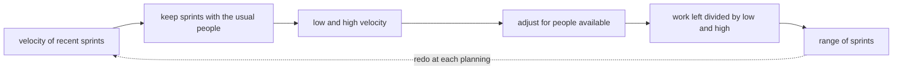

## Bạn cần biết trước

- [[management.l2.velocity]] — bạn biết velocity là tổng điểm của những việc đạt Definition of Done trong một sprint, và velocity của Sprint 14 là 9.

## Tình huống

Ở Sprint 15 planning, product owner, người quyết định thứ tự những việc đội sẽ làm, hỏi: bao giờ khách tự yêu cầu hoàn tiền được? Phần việc còn lại cộng lại là 30 điểm: 28 điểm việc hoàn tiền và 2 điểm chuyển từ Sprint 14. Có người lấy 30 chia cho velocity 9 của Sprint 14, ra khoảng 3,3, và đề nghị báo "cuối Sprint 18". Một lập trình viên khác nhắc rằng một trong bốn lập trình viên sẽ dành các sprint tới cho cổng thanh toán, dịch vụ bên ngoài chuyển tiền hoàn cho khách, một việc đội chưa làm bao giờ. Đội có thể trả lời "bao giờ" thế nào để một tháng sau câu trả lời vẫn còn đúng?

## Khái niệm cốt lõi

- dự báo — câu trả lời tốt nhất hiện tại của đội cho "bao giờ xong", dựa trên velocity đã qua và phần việc còn lại, và được chờ đợi là sẽ thay đổi.
- khoảng sprint — dự báo nói dưới dạng "từ X đến Y sprint", tìm ra bằng cách chia phần việc còn lại cho một velocity cao và một velocity thấp.
- số người có mặt — bao nhiêu người trong số người thường lệ của đội làm được việc này ở sprint tới, sau khi trừ nghỉ phép và việc khác.

## Cơ chế hoạt động



Velocity thay đổi từ sprint này sang sprint khác, nên hãy bắt đầu từ vài sprint gần đây, không phải chỉ sprint cuối.

Trong tình huống trên, chỉ chia cho con số 9 của Sprint 14 sẽ che mất rằng đội cũng từng làm xong 8 và 11 ở những sprint đủ người khác (ghi trong file ở mục sau). Vì vậy hãy lấy mức thấp nhất và cao nhất của các sprint đó. Sprint thiếu người được để ra ngoài: velocity của nó thấp hơn vì một lý do bạn đã biết, không phải vì đội làm chậm đi.

Tiếp theo, nhìn về phía trước. Khi sprint tới có ít người hơn, do nghỉ phép hay bận việc khác, đội nhận ít hơn velocity thường lệ, thay vì trông chờ những người còn lại bù phần thiếu. Nhận ở đây là đưa việc vào kế hoạch của sprint. Hạ mức thấp và mức cao xuống đại khái theo tỉ lệ người trong đội vẫn còn làm được. Scrum Guide 2020 cũng theo hướng đó: Developers càng biết về kết quả đã qua, năng lực sắp tới và Definition of Done của mình thì Sprint forecast càng đáng tin. Năng lực sắp tới là lượng việc họ làm được trong sprint sắp đến.

Sau đó chia phần việc còn lại cho mức cao đã điều chỉnh để có thời gian ngắn nhất có thể, và cho mức thấp đã điều chỉnh để có thời gian dài nhất. Làm tròn lên, vì phần việc tràn sang một sprint sẽ chiếm luôn sprint đó. Kết quả là một khoảng sprint: câu trả lời trung thực hơn một ngày duy nhất cho câu hỏi "bao giờ", vì nó cho thấy lịch sử của chính đội dao động bao nhiêu.

Cuối cùng, dự báo được làm lại ở mỗi sprint planning, với velocity mới nhất và số điểm còn lại. Đó là mũi tên nét đứt. Một dự báo giữ nguyên nhiều tháng thì không còn là dự báo nữa, và mọi người bắt đầu coi nó là lời hứa mà không ai quyết định hứa.

## Trong hệ thống Đơn Hàng

`docs/team/velocity-history.md` ghi lại năm sprint gần nhất:

```markdown file=docs/team/velocity-history.md tag=stage-2 lines=9-20
| Sprint | Điểm đã nhận | Velocity | Ghi chú |
|---|---|---|---|
| 10 | 10 | 8 | Một việc 2 điểm chưa có test nên chưa xong, chuyển Sprint 11 |
| 11 | 11 | 11 | |
| 12 | 7 | 6 | Thiếu người: hai lập trình viên nghỉ phép một tuần, đội nhận ít hơn thường lệ; một việc 1 điểm chuyển Sprint 13 |
| 13 | 10 | 10 | |
| 14 | 11 | 9 | Việc "Ngừng gửi thông báo cho đơn đã hủy" (2 điểm) chưa xong, chuyển Sprint 15 |

Velocity đổi từ sprint này sang sprint khác, nên đội không dự báo bằng một
sprint duy nhất. Bốn sprint đủ người (10, 11, 13, 14) nằm trong khoảng 8 đến 11
điểm. Sprint 12 thiếu người nên không dùng làm mức thấp nhất cho một sprint đủ
người; nó cho thấy velocity giảm khi thiếu người.
```

Ở bốn sprint đủ người, velocity dao động từ 8 đến 11. Sprint 12 có hai lập trình viên nghỉ phép một tuần, nên đội nhận ít điểm hơn, 7 điểm, và làm xong 6. Đoạn dưới bảng nói đội không dùng Sprint 12 làm mức thấp nhất cho một sprint đủ người, vì nó cho thấy thiếu người thì velocity ra sao.

Phần dự báo của file, lập ở Sprint 15 planning, trước hết nêu 30 điểm còn lại: 28 điểm việc hoàn tiền và 2 điểm chuyển từ Sprint 14. Một bảng nhỏ tính hai trường hợp: cả bốn lập trình viên, hoặc ba người. Với cả bốn, 8 đến 11 điểm mỗi sprint cho ra 3 đến 4 sprint. Phần còn lại của file nói đội dùng trường hợp nào:

```markdown file=docs/team/velocity-history.md tag=stage-2 lines=32-43
Từ Sprint 15, một trong bốn lập trình viên làm phần việc đội chưa từng làm (tích
hợp API hoàn tiền của cổng thanh toán, đối soát với kế toán) và không nhận việc
tính bằng điểm. Ba người còn lại làm được khoảng ba phần tư mức thường lệ, nên
đội nhận 6 đến 8 điểm mỗi sprint thay vì 8 đến 11. Trường hợp này là trường hợp
đội dùng.

Câu trả lời cho "bao giờ xong": từ 4 đến 5 sprint, tức 8 đến 10 tuần tính từ
đầu Sprint 15. Không có một ngày duy nhất.

Dự báo được làm lại ở mỗi sprint planning, với velocity của sprint vừa xong và
số điểm còn lại. Một dự báo giữ nguyên từ Sprint 15 tới cuối sẽ dần thành một
lời hứa mà không ai quyết định hứa.
```

Từ Sprint 15, một trong bốn lập trình viên làm phần cổng thanh toán và không nhận việc ước lượng bằng story point, nên không góp gì vào velocity. Ba người còn lại làm được khoảng ba phần tư mức thường lệ: 8 × ¾ = 6 và 11 × ¾ ≈ 8, nên đội nhận 6 đến 8 điểm thay vì 8 đến 11. Khi đó 30 / 8 = 3,75 làm tròn lên thành 4, và 30 / 6 = 5: từ 4 đến 5 sprint, tức 8 đến 10 tuần tính từ đầu Sprint 15, vì mỗi sprint ở đây dài hai tuần. Đoạn cuối chính là vòng lặp trong sơ đồ: dự báo được làm lại ở mỗi sprint planning.

## Người mới hay nghĩ rằng…

- **"Lấy velocity trung bình nhân với số sprint còn lại là ra đúng ngày phát hành."** → Thực ra nhân hay chia với trung bình đều che mất velocity dao động bao nhiêu, và kết quả trông chắc chắn hơn lịch sử đằng sau nó. Bốn sprint đủ người của đội có trung bình 9,5, cho ra 30 / 9,5 ≈ 3,2 sprint, trong khi cùng lịch sử đó cho phép bất cứ đâu từ 3 đến 4. Bạn sẽ nhận ra khi một ngày được tính chính xác tới từng hôm bị trễ cả một sprint.
- **"Nếu có người nghỉ phép, những người còn lại vẫn phải đạt velocity thường lệ."** → Thực ra ít người thì xong ít điểm hơn, và Sprint 12 cho thấy điều đó: hai lập trình viên vắng một tuần, velocity 6. Bạn sẽ nhận ra khi một sprint thiếu người được lên kế hoạch với con số đủ người và kết thúc với nhiều việc phải chuyển sang sprint sau.
- **"Đã đưa dự báo rồi mà sau đó đổi thì nghĩa là mình lập kế hoạch kém."** → Thực ra dự báo vốn được làm lại ở mỗi planning với velocity mới nhất và phần việc còn lại. Bạn sẽ nhận ra khi một dự báo cũ không ai cập nhật bị nhắc lại như một lời hứa.

## Thử ngay (3 phút)

Mở `docs/team/velocity-history.md` trong repository.

1. Giả sử ở Sprint 16 planning còn 24 điểm và đội vẫn nhận 6 đến 8 điểm mỗi sprint. Chia 24 cho 8 và cho 6, làm tròn lên.
2. Viết dự báo thành một khoảng sprint, tính từ đầu Sprint 16.

Kết quả mong đợi: 24 / 8 = 3 và 24 / 6 = 4, nên từ 3 đến 4 sprint tính từ đầu Sprint 16, tức 6 đến 8 tuần.

Giờ giả sử một trong ba lập trình viên làm việc tính bằng điểm sẽ nghỉ phép cả Sprint 17. Đội nên làm gì với dự báo đó, và không nên làm gì?

<details><summary>Gợi ý đáp án</summary>

Làm lại dự báo ở Sprint 17 planning: nhận ít điểm hơn cho sprint đó, vì ít người hơn, và để khoảng dịch chuyển nếu cần. Đội không nên giữ khoảng cũ rồi trông chờ hai lập trình viên còn lại bù phần chênh lệch. Nếu khoảng dịch chuyển, những người đang chờ luồng hoàn tiền nên được nghe điều đó từ chính đội.

</details>

## Liên hệ

- [[management.l2.velocity]] — bài cần trước: con số của một sprint mà bài này biến thành một khoảng.
- [[management.l1.estimates-are-not-commitments]] — cùng một ý ở tầng cao hơn: dự báo, giống ước lượng, không phải lời hứa.
- [[management.l2.three-point-estimation]] — nửa còn lại của kế hoạch hoàn tiền: đội định cỡ phần việc không có velocity để dựa vào như thế nào.
- [[management.l2.stakeholder-communication]] — khoảng này được báo cho người ngoài đội ra sao.

## Tóm tắt 5 dòng

1. Dự báo "bao giờ" bằng một khoảng sprint từ velocity của vài sprint gần đây, không phải một con số từ một sprint.
2. Chia phần việc còn lại cho velocity thấp nhất và cao nhất của các sprint đủ người gần đây, làm tròn lên.
3. Khi có ít người hơn, nhận ít hơn velocity thường lệ thay vì trông chờ con số cũ.
4. 30 điểm còn lại, gồm 28 điểm hoàn tiền và 2 điểm chuyển sang, với 6 đến 8 điểm mỗi sprint, cho ra 4 đến 5 sprint.
5. Làm lại dự báo ở mỗi sprint planning, vì một dự báo cũ giữ nguyên sẽ lặng lẽ thành lời hứa.
