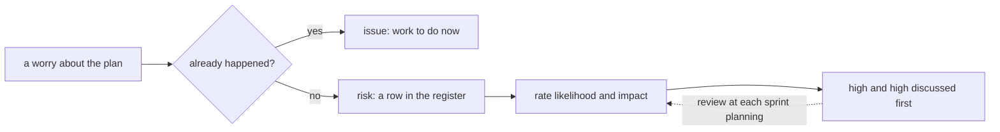

## Before you start

- [[management.l2.scope-change]] — you know the refund flow was kept out of Sprint 14 and planned as a later piece of work, and that adding work means giving something else up.

## The situation

At Sprint 15 planning the refund plan is ready: a range of sprints, three-point estimates, a buffer. Then the worries start: the developer doing the integration says the payment gateway's refund API might not behave the way its documentation says. Someone else wonders whether accounting will agree on how refunds are checked. A third person says it is pointless to list worries: "We'll deal with problems when they come." Another wants to add the notification item carried over from Sprint 14 to the list of worries, and by next week nobody will remember who said what. How does a team keep track of what could break its plan, without drowning in worries?

## Core concepts

- risk — for a plan, something that has not happened yet and may not happen, but would hurt the plan if it did.
- issue — a problem that has already happened; it is work to fix now, not a risk.
- likelihood and impact — how probable a risk is, and how much it would hurt if it happened, each rated on a short scale such as low, medium, high.
- **risk register** — a plan's list of risks, each with its likelihood, its impact, the person who watches it and what the team will do about it.

## How it works



Start by sorting each worry with one question: has it already happened? If it has, it is an issue. The notification item carried over from Sprint 14 is one: it did not finish, and it is now work for Sprint 15. A register of things that might happen is the wrong place for it.

If it has not happened, it is a risk, and it becomes a row in the risk register. In the situation above, the gateway behaving differently from its documentation, and accounting not agreeing in time, are both risks: they may never happen, but either would hurt the plan.

Each row gets two ratings. Likelihood is how probable the risk is; impact is how much it would hurt. A scale of low, medium and high is enough. The ratings are not precise measurements; they are a way to decide where to look first. A risk that is both likely and costly deserves the team's time this week. A risk that is unlikely and cheap may need nothing more than its row.

A register also names who watches each risk and what the team will do about it. Those two columns are the next lesson's subject; here, notice only that they are part of the row.

Finally, the register is reviewed on a regular rhythm, such as each sprint planning: ratings change as the team learns, new risks appear, and past ones leave. The dashed arrow is that loop. A list written once at the start and never opened again protects nothing.

## In the Đơn Hàng system

`docs/team/risk-register-example.md` is the register for the refund plan. Its opening lines define a risk as something that has not happened and may not, but would hurt the plan if it did, and rate likelihood and impact on three levels: `thấp`, `trung bình`, `cao` (low, medium, high). The table:

```markdown file=docs/team/risk-register-example.md tag=stage-2 lines=9-16
| Số | Rủi ro | Khả năng | Ảnh hưởng | Cách xử lý | Người theo dõi | Dấu hiệu |
|---|---|---|---|---|---|---|
| R1 | API hoàn tiền của cổng thanh toán chạy khác tài liệu của họ | Cao | Cao | Giảm: thử môi trường test của cổng thanh toán trong tuần đầu Sprint 15, trước khi viết job gửi yêu cầu | Lập trình viên làm tích hợp | Hết tuần đầu chưa hoàn tiền thử thành công lần nào |
| R2 | Cổng thanh toán không nhận idempotency key, nên gửi lại có thể hoàn tiền hai lần | Trung bình | Cao | Giảm: hỏi bên cung cấp cổng trong tuần đầu; nếu không có, job hỏi trạng thái hoàn tiền trước mỗi lần gửi lại | Lập trình viên làm tích hợp | Tài liệu và môi trường test không nhắc tới idempotency key |
| R3 | Hoàn một phần số tiền làm việc đối soát phức tạp hơn nhiều | Cao | Cao | Tránh: đưa hoàn một phần ra ngoài phạm vi đợt này (xem `refund-requirements.md`) | Product owner | Một bên liên quan đòi hoàn một phần trước khi đợt này xong |
| R4 | Cổng từ chối hoàn tiền vì lý do phần mềm không tự xử lý được, như thẻ đã đóng | Trung bình | Trung bình | Chuyển: chăm sóc khách hàng xử lý tay các yêu cầu bị từ chối, vì họ liên lạc được với khách và đang làm việc này hằng ngày | Trưởng nhóm chăm sóc khách hàng | Số yêu cầu bị từ chối mỗi tuần tăng |
| R5 | Kế toán chưa chốt cách đối soát trước Sprint 16 | Trung bình | Cao | Giảm: hẹn một buổi 30 phút với kế toán trong Sprint 15, mang theo bản nháp danh sách hoàn tiền | Product owner | Hết Sprint 15 chưa có mẫu danh sách được kế toán đồng ý |
| R6 | Email báo kết quả hoàn tiền đến muộn vài phút khi máy chủ email chậm | Trung bình | Thấp | Chấp nhận: khách vẫn thấy trạng thái hoàn tiền trong ứng dụng; làm email nhanh hơn tốn công hơn thiệt hại nó gây ra | Tester | Khách phàn nàn vì không nhận được email |
```

Six risks, R1 to R6, each with seven columns: number, risk, likelihood (`Khả năng`), impact (`Ảnh hưởng`), response (`Cách xử lý`), who watches it (`Người theo dõi`) and its warning sign (`Dấu hiệu`). R1 is the developer's worry from the situation: the gateway's refund API behaving differently from its documentation, rated high and high. R5 is the accounting worry: medium likelihood, high impact. R6, a result email arriving a few minutes late, is medium and low.

The section under the table says how the team uses it:

```markdown file=docs/team/risk-register-example.md tag=stage-2 lines=20-29
- Sổ được xem lại ở mỗi sprint planning: chấm lại khả năng và ảnh hưởng, thêm rủi
  ro mới, bỏ rủi ro đã qua.
- Đội bàn trước những rủi ro vừa có khả năng cao vừa có ảnh hưởng cao (R1, R3),
  không chia đều thời gian cho mọi dòng.
- Mỗi rủi ro có đúng một người theo dõi dấu hiệu của nó. Khi dấu hiệu xuất hiện,
  người đó báo ngay ở daily, không đợi sprint planning.
- Rủi ro đã xảy ra thì rời sổ và thành việc cần làm.

Không ghi vào sổ: việc "Ngừng gửi thông báo cho đơn đã hủy" chuyển từ Sprint 14.
Chuyện đó đã xảy ra; nó là việc cần làm trong Sprint 15, không phải rủi ro.
```

The register is reviewed at each sprint planning: ratings are redone, new risks added, past ones removed. The team discusses R1 and R3 first, the two rated high and high, instead of splitting its time evenly. A risk that happens leaves the register and becomes work. And the last two lines settle the question from the situation: the notification item carried over from Sprint 14 already happened, so it is work for Sprint 15, not a risk. The third bullet, one watcher per risk, belongs to the next lesson.

## Beginners often think…

- **"Writing risks down is pessimism; a good team just deals with problems when they come."** → Actually a risk written down early can be watched for its warning sign while it is still cheap to act on. You notice this when a problem "nobody saw coming" turns out to be something one person worried about aloud weeks earlier.
- **"Every risk on the list needs the same amount of attention."** → Actually the ratings exist so the team can spend its attention on the few risks that are both likely and costly, such as R1 and R3, and little on one like R6. You notice this when a risk review spends as long on a late email as on the gateway integration.
- **"A delay we already have is a risk we should add to the register."** → Actually something that has already happened is an issue: work to fix now, as the register's last lines say of the carried-over notification item. You notice this when a register fills up with current problems and nobody can find the real risks among them.

## Try it (3 minutes)

Open `docs/team/risk-register-example.md`.

1. List the risks rated high for both likelihood and impact.
2. Find the risk with the lowest impact.
3. Sort these two new worries at Sprint 16 planning: "the gateway's test environment was down for two days last week", and "the gateway may change its refund API before the refund flow is released to customers".

Expected result: step 1 — R1 and R3. Step 2 — R6, low impact. Step 3 — the first already happened, so it is an issue: work or a delay to deal with now. If the outage suggests it could happen again, that repeat is a separate risk with its own row; the outage itself is not a risk. The second has not happened, so it is a new risk, a row with its own likelihood and impact.

In the first week of Sprint 15, the first trial refund against the gateway worked. What should happen to R1 at the next sprint planning?

<details><summary>Suggested answer</summary>

Its likelihood should be rated again, probably lower: the trial refund worked, so the gateway behaved as documented at least once. The row stays until the team is sure the risk has passed; then it leaves the register. Reviewing the ratings at each planning is exactly what keeps R1 from taking attention it no longer needs.

</details>

## Connections

- [[management.l2.scope-change]] — prerequisite: the refund work whose plan this register protects.
- [[management.l2.schedule-buffer]] — the buffer absorbs the uncertainty the estimates already show; the register names specific things that could go wrong.
- [[management.l2.risk-responses]] — the next step: the response and the watcher in each row.

## Five-line summary

1. A risk has not happened and may not, but would hurt the plan; something that already happened is an issue to fix.
2. A risk register lists each risk with its likelihood, impact, the person who watches it and the team's response.
3. Rating likelihood and impact, even as low, medium or high, points attention at the risks both likely and costly.
4. The refund register has six risks; the team discusses R1 and R3, both high and high, first.
5. The register is reviewed at each sprint planning; a list written once and never opened again protects nothing.
