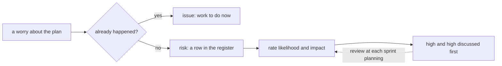

## Bạn cần biết trước

- [[management.l2.scope-change]] — bạn biết luồng hoàn tiền đã được để ngoài Sprint 14 và lên kế hoạch thành một phần việc sau, và thêm việc thì phải đổi lại một thứ khác.

## Tình huống

Ở Sprint 15 planning, kế hoạch hoàn tiền đã xong: một khoảng sprint, các ước lượng ba điểm, một dòng dự phòng. Rồi các nỗi lo bắt đầu: lập trình viên làm phần tích hợp nói API hoàn tiền của cổng thanh toán có thể không chạy đúng như tài liệu của nó. Một người khác băn khoăn liệu kế toán có đồng ý cách đối soát hoàn tiền không. Người thứ ba bảo liệt kê nỗi lo chẳng để làm gì: "Có vấn đề thì xử lý khi nó tới." Một người nữa muốn thêm việc thông báo chuyển từ Sprint 14 vào danh sách nỗi lo, và tới tuần sau thì chẳng ai nhớ ai đã nói gì. Một đội theo dõi những gì có thể làm hỏng kế hoạch của mình thế nào, mà không bị chìm trong lo lắng?

## Khái niệm cốt lõi

- rủi ro — với một kế hoạch, điều chưa xảy ra và có thể không xảy ra, nhưng sẽ làm hại kế hoạch nếu xảy ra.
- vấn đề — điều đã xảy ra rồi, là việc phải xử lý ngay, không phải rủi ro.
- khả năng và ảnh hưởng — rủi ro dễ xảy ra đến đâu, và nếu xảy ra thì gây hại bao nhiêu, mỗi thứ chấm theo một thang ngắn như thấp, trung bình, cao.
- **sổ rủi ro** (risk register) — danh sách rủi ro của một kế hoạch, mỗi dòng có khả năng, ảnh hưởng, người theo dõi và điều đội sẽ làm với nó.

## Cơ chế hoạt động



Hãy bắt đầu bằng cách phân loại mỗi nỗi lo bằng một câu hỏi: nó đã xảy ra chưa? Nếu rồi, đó là vấn đề. Việc thông báo chuyển từ Sprint 14 là một ví dụ: nó không xong, và giờ là việc của Sprint 15. Một sổ ghi những điều có thể xảy ra không phải chỗ dành cho nó.

Nếu chưa xảy ra, đó là rủi ro, và nó thành một dòng trong sổ rủi ro. Trong tình huống trên, cổng thanh toán chạy khác tài liệu, và kế toán không đồng ý kịp, đều là rủi ro: chúng có thể không bao giờ xảy ra, nhưng chuyện nào xảy ra cũng làm hại kế hoạch.

Mỗi dòng có hai mức chấm. Khả năng là rủi ro dễ xảy ra đến đâu, ảnh hưởng là nó gây hại bao nhiêu. Thang thấp, trung bình, cao là đủ. Các mức chấm không phải số đo chính xác, mà là cách quyết định nhìn vào đâu trước. Rủi ro vừa dễ xảy ra vừa tốn kém đáng để đội dành thời gian ngay tuần này. Rủi ro khó xảy ra và rẻ có khi chỉ cần một dòng của nó.

Sổ cũng ghi ai theo dõi từng rủi ro và đội sẽ làm gì với nó. Hai cột đó là chủ đề của bài sau. Ở đây, bạn chỉ cần thấy chúng là một phần của dòng.

Cuối cùng, sổ được xem lại theo nhịp đều đặn, như mỗi sprint planning: mức chấm đổi khi đội biết thêm, rủi ro mới xuất hiện, rủi ro đã qua thì rời đi. Mũi tên nét đứt chính là vòng lặp đó. Một danh sách viết một lần lúc đầu rồi không bao giờ mở lại thì chẳng bảo vệ được gì.

## Trong hệ thống Đơn Hàng

`docs/team/risk-register-example.md` là sổ rủi ro của kế hoạch hoàn tiền. Mấy dòng mở đầu định nghĩa rủi ro là điều chưa xảy ra và có thể không xảy ra, nhưng sẽ làm hại kế hoạch nếu xảy ra, và chấm khả năng cùng ảnh hưởng theo ba mức: `thấp`, `trung bình`, `cao`. Bảng:

```markdown file=docs/team/risk-register-example.md tag=stage-2 lines=9-16
| Số | Rủi ro | Khả năng | Ảnh hưởng | Cách xử lý | Người theo dõi | Dấu hiệu |
|---|---|---|---|---|---|---|
| R1 | API hoàn tiền của cổng thanh toán chạy khác tài liệu của họ | Cao | Cao | Giảm: thử môi trường test của cổng thanh toán trong tuần đầu Sprint 15, trước khi viết job gửi yêu cầu | Lập trình viên làm tích hợp | Hết tuần đầu chưa hoàn tiền thử thành công lần nào |
| R2 | Cổng thanh toán không nhận idempotency key, nên gửi lại có thể hoàn tiền hai lần | Trung bình | Cao | Giảm: hỏi bên cung cấp cổng trong tuần đầu; nếu không có, job hỏi trạng thái hoàn tiền trước mỗi lần gửi lại | Lập trình viên làm tích hợp | Tài liệu và môi trường test không nhắc tới idempotency key |
| R3 | Hoàn một phần số tiền làm việc đối soát phức tạp hơn nhiều | Cao | Cao | Tránh: đưa hoàn một phần ra ngoài phạm vi đợt này (xem `refund-requirements.md`) | Product owner | Một bên liên quan đòi hoàn một phần trước khi đợt này xong |
| R4 | Cổng từ chối hoàn tiền vì lý do phần mềm không tự xử lý được, như thẻ đã đóng | Trung bình | Trung bình | Chuyển: chăm sóc khách hàng xử lý tay các yêu cầu bị từ chối, vì họ liên lạc được với khách và đang làm việc này hằng ngày | Trưởng nhóm chăm sóc khách hàng | Số yêu cầu bị từ chối mỗi tuần tăng |
| R5 | Kế toán chưa chốt cách đối soát trước Sprint 16 | Trung bình | Cao | Giảm: hẹn một buổi 30 phút với kế toán trong Sprint 15, mang theo bản nháp danh sách hoàn tiền | Product owner | Hết Sprint 15 chưa có mẫu danh sách được kế toán đồng ý |
| R6 | Email báo kết quả hoàn tiền đến muộn vài phút khi máy chủ email chậm | Trung bình | Thấp | Chấp nhận: khách vẫn thấy trạng thái hoàn tiền trong ứng dụng; làm email nhanh hơn tốn công hơn thiệt hại nó gây ra | Tester | Khách phàn nàn vì không nhận được email |
```

Sáu rủi ro, R1 tới R6, mỗi dòng bảy cột: số, rủi ro, khả năng (`Khả năng`), ảnh hưởng (`Ảnh hưởng`), cách xử lý (`Cách xử lý`), người theo dõi (`Người theo dõi`) và dấu hiệu (`Dấu hiệu`). R1 là nỗi lo của lập trình viên trong tình huống: API hoàn tiền của cổng chạy khác tài liệu, chấm cao và cao. R5 là nỗi lo về kế toán: khả năng trung bình, ảnh hưởng cao. R6, email báo kết quả đến muộn vài phút, là trung bình và thấp.

Phần dưới bảng nói đội dùng sổ thế nào:

```markdown file=docs/team/risk-register-example.md tag=stage-2 lines=20-29
- Sổ được xem lại ở mỗi sprint planning: chấm lại khả năng và ảnh hưởng, thêm rủi
  ro mới, bỏ rủi ro đã qua.
- Đội bàn trước những rủi ro vừa có khả năng cao vừa có ảnh hưởng cao (R1, R3),
  không chia đều thời gian cho mọi dòng.
- Mỗi rủi ro có đúng một người theo dõi dấu hiệu của nó. Khi dấu hiệu xuất hiện,
  người đó báo ngay ở daily, không đợi sprint planning.
- Rủi ro đã xảy ra thì rời sổ và thành việc cần làm.

Không ghi vào sổ: việc "Ngừng gửi thông báo cho đơn đã hủy" chuyển từ Sprint 14.
Chuyện đó đã xảy ra; nó là việc cần làm trong Sprint 15, không phải rủi ro.
```

Sổ được xem lại ở mỗi sprint planning: chấm lại các mức, thêm rủi ro mới, bỏ rủi ro đã qua. Đội bàn R1 và R3 trước, hai rủi ro chấm cao và cao, thay vì chia đều thời gian. Rủi ro đã xảy ra thì rời sổ và thành việc cần làm. Và hai dòng cuối trả lời câu hỏi trong tình huống: việc thông báo chuyển từ Sprint 14 đã xảy ra, nên nó là việc của Sprint 15, không phải rủi ro. Gạch đầu dòng thứ ba, mỗi rủi ro một người theo dõi, thuộc về bài sau.

## Người mới hay nghĩ rằng…

- **"Ghi rủi ro ra là bi quan, đội giỏi thì có vấn đề cứ xử lý khi nó tới."** → Thực ra một rủi ro được ghi ra sớm có thể được theo dõi dấu hiệu khi xử lý còn rẻ. Bạn sẽ nhận ra khi một vấn đề "không ai lường trước" hóa ra là điều một người đã lo ra miệng từ mấy tuần trước.
- **"Rủi ro nào trong danh sách cũng cần được chú ý như nhau."** → Thực ra các mức chấm có để đội dồn sự chú ý vào số ít rủi ro vừa dễ xảy ra vừa tốn kém, như R1 và R3, và ít cho những rủi ro như R6. Bạn sẽ nhận ra khi một buổi xem lại rủi ro dành cho một email đến muộn lâu ngang việc tích hợp cổng thanh toán.
- **"Một việc đang trễ sẵn là rủi ro nên thêm vào sổ."** → Thực ra điều đã xảy ra là vấn đề, việc phải xử lý ngay, như mấy dòng cuối của sổ nói về việc thông báo chuyển sprint. Bạn sẽ nhận ra khi một sổ đầy những vấn đề hiện tại và không ai tìm ra rủi ro thật giữa chúng.

## Thử ngay (3 phút)

Mở `docs/team/risk-register-example.md`.

1. Liệt kê những rủi ro được chấm cao ở cả khả năng lẫn ảnh hưởng.
2. Tìm rủi ro có ảnh hưởng thấp nhất.
3. Phân loại hai nỗi lo mới ở Sprint 16 planning: "môi trường test của cổng thanh toán đã sập hai ngày tuần trước", và "cổng thanh toán có thể đổi API hoàn tiền trước khi luồng hoàn tiền được mở cho khách".

Kết quả mong đợi: bước 1 là R1 và R3. Bước 2 là R6, ảnh hưởng thấp. Bước 3: cái đầu đã xảy ra, nên là vấn đề, một việc hay một sự chậm trễ cần xử lý ngay. Nếu sự cố đó cho thấy nó có thể lặp lại, thì việc lặp lại là một rủi ro riêng với dòng của nó, còn bản thân sự cố thì không phải rủi ro. Cái thứ hai chưa xảy ra, nên là một rủi ro mới, một dòng có khả năng và ảnh hưởng của riêng nó.

Trong tuần đầu Sprint 15, lần hoàn tiền thử đầu tiên với cổng thanh toán đã thành công. Ở sprint planning kế tiếp, R1 nên được xử lý thế nào?

<details><summary>Gợi ý đáp án</summary>

Khả năng của nó nên được chấm lại, nhiều khả năng thấp hơn: lần hoàn tiền thử đã thành công, nên cổng thanh toán đã chạy đúng tài liệu ít nhất một lần. Dòng đó ở lại cho tới khi đội chắc rủi ro đã qua, rồi mới rời sổ. Chấm lại ở mỗi lần planning chính là điều giúp R1 không chiếm sự chú ý nó không còn cần nữa.

</details>

## Liên hệ

- [[management.l2.scope-change]] — bài cần trước: phần việc hoàn tiền mà sổ này bảo vệ kế hoạch của nó.
- [[management.l2.schedule-buffer]] — thời gian dự phòng hấp thụ độ bất định mà ước lượng đã cho thấy, còn sổ rủi ro gọi tên những điều cụ thể có thể hỏng.
- [[management.l2.risk-responses]] — bước tiếp theo: cách xử lý và người theo dõi ở mỗi dòng.

## Tóm tắt 5 dòng

1. Rủi ro là điều chưa xảy ra và có thể không xảy ra, nhưng làm hại kế hoạch, còn điều đã xảy ra là vấn đề cần xử lý.
2. Sổ rủi ro liệt kê từng rủi ro kèm khả năng, ảnh hưởng, người theo dõi và cách đội xử lý.
3. Chấm khả năng và ảnh hưởng, dù chỉ thấp, trung bình, cao, giúp dồn sự chú ý vào rủi ro vừa dễ xảy ra vừa tốn kém.
4. Sổ hoàn tiền có sáu rủi ro, và đội bàn R1 và R3, cùng cao và cao, trước.
5. Sổ được xem lại ở mỗi sprint planning, vì danh sách viết một lần rồi không mở lại thì chẳng bảo vệ được gì.
