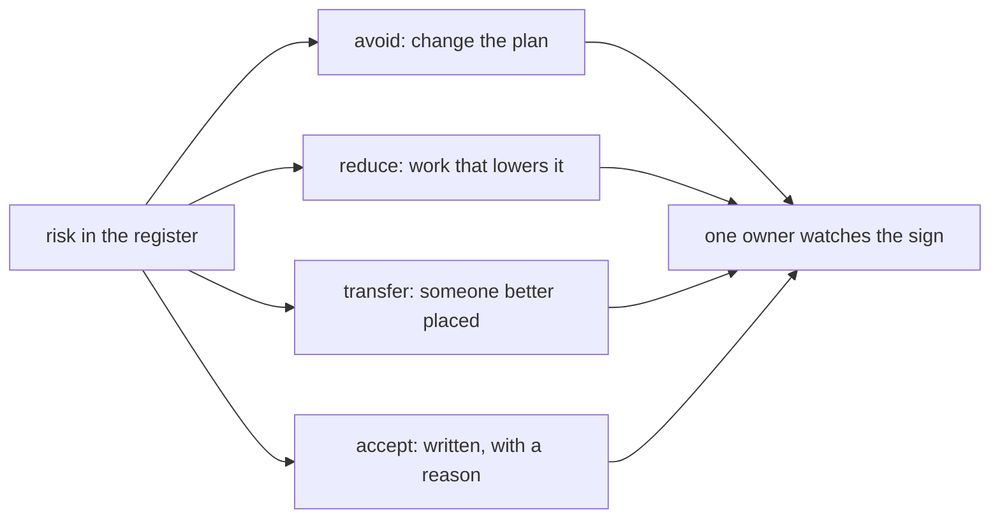

## Before you start

- [[management.l2.risk-register]] — you know the refund register lists six risks, R1 to R6, rated for likelihood and impact, and that the team discusses R1 and R3 first.

## The situation

The refund register has its six rows and its ratings, but two columns are still empty. For R1, the gateway's refund API behaving differently from its documentation, someone proposes the response "be careful with the gateway" and the owner "everyone". For R6, a result email arriving a few minutes late, another developer wants a faster email system "so we have no risks left". The team lead offers to own all six rows. By the end of the meeting the register looks complete, but nobody has anything new to do on Monday. What makes a response to a risk real?

## Core concepts

- response — what the team will do about a risk; four common kinds are avoid, reduce, transfer and accept.
- avoid — change the plan so the risk can no longer happen.
- reduce — do work that makes the risk less likely, or less costly if it happens.
- transfer — hand the risk to someone better placed to carry it.
- accept — decide, in writing and with a reason, not to work on lowering a risk, and keep watching it.
- owner — the one person who watches a risk's warning sign and speaks up when it appears.

## How it works



Each risk in the register gets one of four common responses. Avoiding it changes the plan so the risk cannot happen. Reducing it is work that makes it less likely, or less costly if it happens. Transferring it hands it to someone better placed to carry it, for example because they already do this kind of work. Accepting it means doing no work to lower it: the team watches it, and at most agrees what it will do if it happens.

Accepting is not ignoring. It is a valid choice when reducing a risk would cost more than the risk would hurt. What makes it a response is that the decision is written down with its reason, so the next review can check whether the reason still holds. A risk nobody mentions has been ignored; a risk with "accept, because…" in its row has been decided.

Whatever the response, the row needs one owner. The owner watches for the warning sign and speaks up when it appears, without waiting for the next planning. One person, because a risk everyone owns is a risk nobody checks: each person assumes someone else is looking. The owner does not have to be the team lead. It should be the person best placed to see the sign early.

Finally, a response is concrete work, with a when. "Be careful with the gateway" asks nothing of anyone, so nothing changes. The gateway's test environment is a place to try refund calls before real ones. "Try the gateway's test environment in the first week, before writing the job that sends refund requests" is a task someone can start on Monday, and a week later everyone can tell whether it happened.

## In the Đơn Hàng system

The completed register in `docs/team/risk-register-example.md`:

```markdown file=docs/team/risk-register-example.md tag=stage-2 lines=9-16
| Số | Rủi ro | Khả năng | Ảnh hưởng | Cách xử lý | Người theo dõi | Dấu hiệu |
|---|---|---|---|---|---|---|
| R1 | API hoàn tiền của cổng thanh toán chạy khác tài liệu của họ | Cao | Cao | Giảm: thử môi trường test của cổng thanh toán trong tuần đầu Sprint 15, trước khi viết job gửi yêu cầu | Lập trình viên làm tích hợp | Hết tuần đầu chưa hoàn tiền thử thành công lần nào |
| R2 | Cổng thanh toán không nhận idempotency key, nên gửi lại có thể hoàn tiền hai lần | Trung bình | Cao | Giảm: hỏi bên cung cấp cổng trong tuần đầu; nếu không có, job hỏi trạng thái hoàn tiền trước mỗi lần gửi lại | Lập trình viên làm tích hợp | Tài liệu và môi trường test không nhắc tới idempotency key |
| R3 | Hoàn một phần số tiền làm việc đối soát phức tạp hơn nhiều | Cao | Cao | Tránh: đưa hoàn một phần ra ngoài phạm vi đợt này (xem `refund-requirements.md`) | Product owner | Một bên liên quan đòi hoàn một phần trước khi đợt này xong |
| R4 | Cổng từ chối hoàn tiền vì lý do phần mềm không tự xử lý được, như thẻ đã đóng | Trung bình | Trung bình | Chuyển: chăm sóc khách hàng xử lý tay các yêu cầu bị từ chối, vì họ liên lạc được với khách và đang làm việc này hằng ngày | Trưởng nhóm chăm sóc khách hàng | Số yêu cầu bị từ chối mỗi tuần tăng |
| R5 | Kế toán chưa chốt cách đối soát trước Sprint 16 | Trung bình | Cao | Giảm: hẹn một buổi 30 phút với kế toán trong Sprint 15, mang theo bản nháp danh sách hoàn tiền | Product owner | Hết Sprint 15 chưa có mẫu danh sách được kế toán đồng ý |
| R6 | Email báo kết quả hoàn tiền đến muộn vài phút khi máy chủ email chậm | Trung bình | Thấp | Chấp nhận: khách vẫn thấy trạng thái hoàn tiền trong ứng dụng; làm email nhanh hơn tốn công hơn thiệt hại nó gây ra | Tester | Khách phàn nàn vì không nhận được email |
```

Read the `Cách xử lý` (response) column by its first word. `Giảm` is reduce: R1, R2 and R5. R1's response is the concrete one from above: try the gateway's test environment in the first week of Sprint 15, before writing the job. `Tránh` is avoid: R3, partial refunds, is removed by taking partial refunds out of scope. `Chuyển` is transfer: R4, refunds the gateway refuses, goes to customer care, because they can reach customers and already do this work every day. `Chấp nhận` is accept: R6, a late email, with its reason written in the row: customers still see the refund status in the app, and making email faster costs more than the harm.

The `Người theo dõi` (owner) column names roles, not one lead: the developer doing the integration for R1 and R2, the product owner for R3 and R5, the head of customer care for R4, the tester for R6. Each row also has its warning sign, `Dấu hiệu`. Even the accepted R6 has an owner and a sign: customers complaining about missing emails.

The section under the table states the owner's job:

```markdown file=docs/team/risk-register-example.md tag=stage-2 lines=24-25
- Mỗi rủi ro có đúng một người theo dõi dấu hiệu của nó. Khi dấu hiệu xuất hiện,
  người đó báo ngay ở daily, không đợi sprint planning.
```

Each risk has exactly one person watching its warning sign. When the sign appears, that person reports it straight away at the daily meeting (the team's short meeting each day), without waiting for sprint planning.

## Beginners often think…

- **"Accepting a risk means we just ignore it."** → Actually an accepted risk keeps its row, its written reason, an owner and a warning sign; R6 is accepted and the tester still watches for complaints. You notice this when a risk nobody wrote down happens and everyone says "we knew about that".
- **"The team lead is the owner of every risk."** → Actually the owner is the person best placed to see the warning sign early: in the refund register, a developer, the product owner, the head of customer care and the tester. You notice this when one person owns every row and the signs are noticed late, by whoever happens to be closest.
- **"'Be careful with X' counts as a response to a risk."** → Actually a response is work someone can start and others can check, like trying the test environment in the first week. You notice this when a week passes, the risk is exactly as likely as before, and nobody can say what was done about it.

## Try it (3 minutes)

Open `docs/team/risk-register-example.md`.

1. For each of R1 to R6, write down the kind of response (reduce, avoid, transfer, accept) and its owner.
2. A teammate wrote this response for a new risk: "be careful not to send the same refund twice". Rewrite it as concrete work, using the register's R2 row as a model.

Expected result: step 1 — R1 reduce, integration developer; R2 reduce, integration developer; R3 avoid, product owner; R4 transfer, head of customer care; R5 reduce, product owner; R6 accept, tester. Step 2 — something like R2's: ask the gateway's provider in the first week whether it accepts an idempotency key, and if not, have the job ask for the refund's status before each resend.

Why does R4 go to customer care rather than stay with the developers?

<details><summary>Suggested answer</summary>

Because the register says customer care can reach the customer and already handles such cases every day. A refused refund, for example to a closed card, needs someone to contact the customer and sort it out by hand, which the software cannot do. Customer care is better placed to carry that risk than a developer, which is exactly what transferring a risk means.

</details>

## Connections

- [[management.l2.risk-register]] — prerequisite: the register whose last two columns this lesson fills.
- [[management.l2.scope-change]] — avoiding R3 is a scope decision: partial refunds are taken out of this round.
- [[management.l2.stakeholder-communication]] — the next step: telling customer care, accounting and others what the plan needs from them.

## Five-line summary

1. Four common responses to a risk are avoid, reduce, transfer to someone better placed, and accept.
2. Accepting is valid when reducing would cost more than the harm, provided the decision and its reason are written down.
3. Each risk has one owner who watches its warning sign and reports it at once; a risk everyone owns goes unchecked.
4. A response is concrete work with a when, like trying the gateway's test environment in the first week, not "be careful".
5. In the refund register, R1, R2 and R5 are reduced, R3 avoided, R4 transferred to customer care and R6 accepted.
