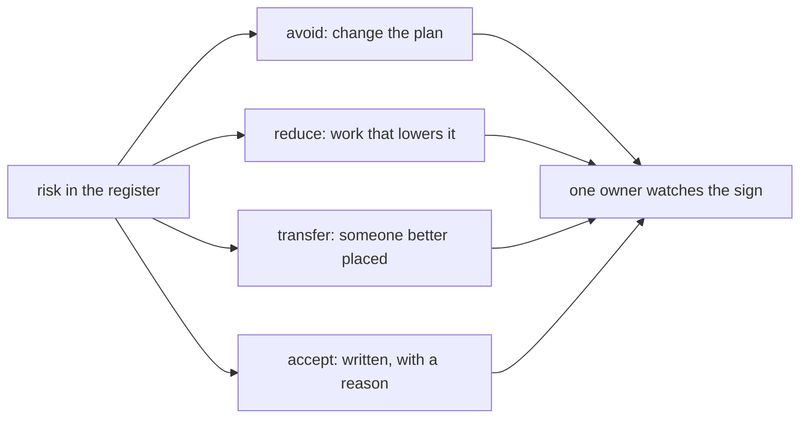

## Bạn cần biết trước

- [[management.l2.risk-register]] — bạn biết sổ hoàn tiền có sáu rủi ro, R1 tới R6, được chấm khả năng và ảnh hưởng, và đội bàn R1 và R3 trước.

## Tình huống

Sổ rủi ro hoàn tiền đã có sáu dòng và các mức chấm, nhưng còn hai cột trống. Với R1, API hoàn tiền của cổng thanh toán chạy khác tài liệu, có người đề xuất cách xử lý "cẩn thận với cổng thanh toán" và người theo dõi là "mọi người". Với R6, email báo kết quả đến muộn vài phút, một lập trình viên khác muốn làm hệ thống email nhanh hơn "cho hết rủi ro". Trưởng nhóm xung phong phụ trách cả sáu dòng. Cuối buổi họp, sổ trông đã đầy đủ, nhưng tới thứ Hai chẳng ai có thêm việc gì để làm. Điều gì khiến cách xử lý một rủi ro là thật?

## Khái niệm cốt lõi

- cách xử lý — điều đội sẽ làm với một rủi ro, và bốn kiểu phổ biến là tránh, giảm, chuyển và chấp nhận.
- tránh — đổi kế hoạch để rủi ro không còn xảy ra được.
- giảm — làm việc để rủi ro ít khả năng xảy ra hơn, hoặc ít tốn kém hơn nếu xảy ra.
- chuyển — giao rủi ro cho người phù hợp hơn để gánh nó.
- chấp nhận — quyết định, bằng văn bản và kèm lý do, không làm việc gì để hạ rủi ro, và tiếp tục theo dõi nó.
- người theo dõi — đúng một người để mắt tới dấu hiệu của rủi ro và lên tiếng khi dấu hiệu xuất hiện.

## Cơ chế hoạt động



Mỗi rủi ro trong sổ nhận một trong bốn cách xử lý phổ biến. Tránh là đổi kế hoạch để rủi ro không thể xảy ra. Giảm là làm việc để nó ít khả năng xảy ra hơn, hoặc ít tốn kém hơn nếu xảy ra. Chuyển là giao nó cho người phù hợp hơn để gánh, chẳng hạn vì họ vốn đang làm loại việc này. Chấp nhận là không làm việc gì để hạ rủi ro: đội theo dõi nó, và cùng lắm thống nhất sẽ làm gì nếu nó xảy ra.

Chấp nhận không phải phớt lờ. Đó là lựa chọn hợp lệ khi giảm rủi ro tốn hơn thiệt hại mà rủi ro gây ra. Điều biến nó thành cách xử lý thật là quyết định được ghi ra kèm lý do, để lần xem lại sau kiểm được lý do đó còn đúng không. Một rủi ro không ai nhắc tới là bị phớt lờ. Một rủi ro có "chấp nhận, vì…" trong dòng của nó là đã được quyết.

Dù xử lý thế nào, mỗi dòng cần một người theo dõi. Người đó để mắt tới dấu hiệu và lên tiếng khi nó xuất hiện, không chờ lần planning sau. Một người thôi, vì rủi ro ai cũng phụ trách là rủi ro không ai kiểm: mỗi người đều nghĩ người khác đang nhìn. Người theo dõi không nhất thiết là trưởng nhóm. Đó nên là người ở vị trí thấy dấu hiệu sớm nhất.

Cuối cùng, cách xử lý là việc cụ thể, có thời điểm. "Cẩn thận với cổng thanh toán" không đòi ai làm gì, nên chẳng có gì thay đổi. Môi trường test của cổng thanh toán là nơi thử các lời gọi hoàn tiền trước khi gọi thật. "Thử môi trường test của cổng thanh toán trong tuần đầu, trước khi viết job gửi yêu cầu hoàn tiền" là việc một người có thể bắt đầu từ thứ Hai, và một tuần sau ai cũng biết nó đã làm hay chưa.

## Trong hệ thống Đơn Hàng

Sổ đã điền đủ trong `docs/team/risk-register-example.md`:

```markdown file=docs/team/risk-register-example.md tag=stage-2 lines=9-16
| Số | Rủi ro | Khả năng | Ảnh hưởng | Cách xử lý | Người theo dõi | Dấu hiệu |
|---|---|---|---|---|---|---|
| R1 | API hoàn tiền của cổng thanh toán chạy khác tài liệu của họ | Cao | Cao | Giảm: thử môi trường test của cổng thanh toán trong tuần đầu Sprint 15, trước khi viết job gửi yêu cầu | Lập trình viên làm tích hợp | Hết tuần đầu chưa hoàn tiền thử thành công lần nào |
| R2 | Cổng thanh toán không nhận idempotency key, nên gửi lại có thể hoàn tiền hai lần | Trung bình | Cao | Giảm: hỏi bên cung cấp cổng trong tuần đầu; nếu không có, job hỏi trạng thái hoàn tiền trước mỗi lần gửi lại | Lập trình viên làm tích hợp | Tài liệu và môi trường test không nhắc tới idempotency key |
| R3 | Hoàn một phần số tiền làm việc đối soát phức tạp hơn nhiều | Cao | Cao | Tránh: đưa hoàn một phần ra ngoài phạm vi đợt này (xem `refund-requirements.md`) | Product owner | Một bên liên quan đòi hoàn một phần trước khi đợt này xong |
| R4 | Cổng từ chối hoàn tiền vì lý do phần mềm không tự xử lý được, như thẻ đã đóng | Trung bình | Trung bình | Chuyển: chăm sóc khách hàng xử lý tay các yêu cầu bị từ chối, vì họ liên lạc được với khách và đang làm việc này hằng ngày | Trưởng nhóm chăm sóc khách hàng | Số yêu cầu bị từ chối mỗi tuần tăng |
| R5 | Kế toán chưa chốt cách đối soát trước Sprint 16 | Trung bình | Cao | Giảm: hẹn một buổi 30 phút với kế toán trong Sprint 15, mang theo bản nháp danh sách hoàn tiền | Product owner | Hết Sprint 15 chưa có mẫu danh sách được kế toán đồng ý |
| R6 | Email báo kết quả hoàn tiền đến muộn vài phút khi máy chủ email chậm | Trung bình | Thấp | Chấp nhận: khách vẫn thấy trạng thái hoàn tiền trong ứng dụng; làm email nhanh hơn tốn công hơn thiệt hại nó gây ra | Tester | Khách phàn nàn vì không nhận được email |
```

Đọc cột `Cách xử lý` theo chữ đầu tiên. `Giảm` là giảm: R1, R2 và R5. Cách xử lý của R1 chính là việc cụ thể ở trên: thử môi trường test của cổng thanh toán trong tuần đầu Sprint 15, trước khi viết job. `Tránh` là tránh: R3, hoàn một phần, được loại bỏ bằng cách đưa hoàn một phần ra ngoài phạm vi. `Chuyển` là chuyển: R4, các yêu cầu bị cổng từ chối, được giao cho chăm sóc khách hàng, vì họ liên lạc được với khách và ngày nào cũng làm việc này. `Chấp nhận` là chấp nhận: R6, email đến muộn, có lý do ghi ngay trong dòng: khách vẫn thấy trạng thái hoàn tiền trong ứng dụng, và làm email nhanh hơn tốn công hơn thiệt hại nó gây ra.

Cột `Người theo dõi` ghi vai trò, không dồn cho một trưởng nhóm: lập trình viên làm tích hợp cho R1 và R2, product owner cho R3 và R5, trưởng nhóm chăm sóc khách hàng cho R4, tester cho R6. Mỗi dòng còn có dấu hiệu của nó, cột `Dấu hiệu`. Ngay cả R6 đã được chấp nhận cũng có người theo dõi và dấu hiệu: khách phàn nàn vì không nhận được email.

Phần dưới bảng nói rõ việc của người theo dõi:

```markdown file=docs/team/risk-register-example.md tag=stage-2 lines=24-25
- Mỗi rủi ro có đúng một người theo dõi dấu hiệu của nó. Khi dấu hiệu xuất hiện,
  người đó báo ngay ở daily, không đợi sprint planning.
```

Mỗi rủi ro có đúng một người theo dõi dấu hiệu của nó. Khi dấu hiệu xuất hiện, người đó báo ngay ở buổi daily (buổi họp ngắn hằng ngày của đội), không chờ sprint planning.

## Người mới hay nghĩ rằng…

- **"Chấp nhận rủi ro nghĩa là cứ lờ nó đi."** → Thực ra rủi ro được chấp nhận vẫn giữ dòng của nó, lý do đã ghi, người theo dõi và dấu hiệu. R6 được chấp nhận mà tester vẫn để mắt tới lời phàn nàn. Bạn sẽ nhận ra khi một rủi ro không ai ghi lại xảy ra và ai cũng bảo "biết chuyện đó rồi mà".
- **"Trưởng nhóm là người theo dõi mọi rủi ro."** → Thực ra người theo dõi là người ở vị trí thấy dấu hiệu sớm nhất: trong sổ hoàn tiền là một lập trình viên, product owner, trưởng nhóm chăm sóc khách hàng và tester. Bạn sẽ nhận ra khi một người phụ trách mọi dòng và các dấu hiệu bị phát hiện muộn, bởi ai tình cờ đứng gần nhất.
- **"'Cẩn thận với X' cũng tính là cách xử lý rủi ro."** → Thực ra cách xử lý là việc có người bắt đầu được và người khác kiểm được, như thử môi trường test trong tuần đầu. Bạn sẽ nhận ra khi một tuần trôi qua, rủi ro vẫn y như cũ, và không ai nói được đã làm gì với nó.

## Thử ngay (3 phút)

Mở `docs/team/risk-register-example.md`.

1. Với từng rủi ro R1 tới R6, ghi ra kiểu xử lý (giảm, tránh, chuyển, chấp nhận) và người theo dõi.
2. Một đồng đội viết cách xử lý này cho một rủi ro mới: "cẩn thận đừng gửi cùng một yêu cầu hoàn tiền hai lần". Viết lại thành việc cụ thể, lấy dòng R2 của sổ làm mẫu.

Kết quả mong đợi: bước 1 là R1 giảm (lập trình viên làm tích hợp), R2 giảm (lập trình viên làm tích hợp), R3 tránh (product owner), R4 chuyển (trưởng nhóm chăm sóc khách hàng), R5 giảm (product owner), R6 chấp nhận (tester). Bước 2 là một việc như của R2: hỏi bên cung cấp cổng ngay tuần đầu xem họ có nhận idempotency key không, và nếu không, cho job hỏi trạng thái hoàn tiền trước mỗi lần gửi lại.

Vì sao R4 được giao cho chăm sóc khách hàng chứ không để lại cho lập trình viên?

<details><summary>Gợi ý đáp án</summary>

Vì sổ ghi chăm sóc khách hàng liên lạc được với khách và ngày nào cũng xử lý những trường hợp như vậy. Một yêu cầu hoàn tiền bị từ chối, chẳng hạn vì thẻ đã đóng, cần người liên lạc với khách và xử lý tay, điều phần mềm không làm được. Chăm sóc khách hàng ở vị trí gánh rủi ro đó tốt hơn một lập trình viên, và đó chính là ý nghĩa của chuyển rủi ro.

</details>

## Liên hệ

- [[management.l2.risk-register]] — bài cần trước: sổ rủi ro có hai cột cuối mà bài này điền vào.
- [[management.l2.scope-change]] — tránh R3 là một quyết định phạm vi: hoàn một phần được đưa ra khỏi đợt này.
- [[management.l2.stakeholder-communication]] — bước tiếp theo: báo cho chăm sóc khách hàng, kế toán và những bên khác kế hoạch cần gì từ họ.

## Tóm tắt 5 dòng

1. Bốn cách xử lý rủi ro phổ biến là tránh, giảm, chuyển cho người phù hợp hơn, và chấp nhận.
2. Chấp nhận là hợp lệ khi giảm rủi ro tốn hơn thiệt hại, miễn quyết định và lý do được ghi ra.
3. Mỗi rủi ro có một người theo dõi dấu hiệu và báo ngay, vì rủi ro ai cũng phụ trách thì không ai kiểm.
4. Cách xử lý là việc cụ thể có thời điểm, như thử môi trường test của cổng trong tuần đầu, không phải "cẩn thận".
5. Trong sổ hoàn tiền, R1, R2 và R5 được giảm, R3 được tránh, R4 chuyển cho chăm sóc khách hàng và R6 được chấp nhận.
