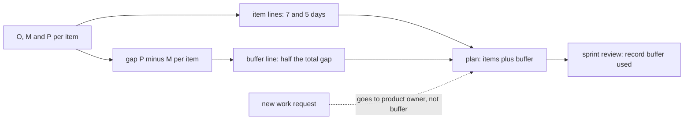

## Before you start

- [[management.l2.three-point-estimation]] — you know the refund plan gives the gateway integration 4, 6 and 14 days and the accounting check 2, 4 and 12, and that (O + 4M + P) / 6 turns them into 7 and 5.

## The situation

The refund plan now has 12 days for the two items the team has never done. The developer doing them is uneasy: P for the integration is 14, and 7 feels tight. The easy move is to write 9 instead of 7 and 6 instead of 5, and say nothing. A teammate suggests adding two quiet days to every refund task, "just in case". The product owner has a different worry: if every number has some slack hidden in it, how will anyone know how much slack is left when things start to slip? Where should the extra time for uncertainty go?

## Core concepts

- **schedule buffer** — time added to a plan on purpose to absorb the uncertainty the estimates already show, written as its own line; the buffer, for short.
- padding — extra time hidden inside a task's own estimate, which nobody else can see.
- buffer used — how much of the buffer the work has consumed so far, written down at a regular point such as each sprint review.

## How it works



A three-point estimate already tells you how uncertain each item is. The question is where the plan keeps room for that. There are two places.

The first is inside each task, as in the situation above: 9 instead of 7, two quiet days on every task. That padding is invisible, and it tends to get used by the task it sits in: people plan their work to the time they were given. When one task really does run late, the slack hidden in the other tasks rarely reaches it: nobody can see it, and it has usually been used up already.

The second is one shared line below the items: the schedule buffer. The items keep their honest estimates, and the buffer sits apart where everyone can see it. Its size comes from the estimates. In the refund plan, it is half the total gap from the most likely to the pessimistic values. Measuring from M, not O, makes the buffer room for running later than the most likely value; finishing early needs no room. The item with the widest gap adds most; in the refund plan both gaps happen to be 8, so each adds 4 days.

When an item runs over, it takes days from that one line, and at each sprint review the team writes down how much is used. "3 of 8 days used" halfway through tells everyone far more than padded numbers. If most of the buffer is gone while most of the work is still ahead, talk to the product owner about the plan then.

The dashed arrow shows what the buffer is not for. A new request is new work, not uncertainty in the planned work. It goes to the product owner to change the plan.

## In the Đơn Hàng system

`docs/team/refund-plan-example.md` shows the buffer as its own row, under the two three-point items:

```markdown file=docs/team/refund-plan-example.md tag=stage-2 lines=32-38
| Việc | O | M | P | (O + 4M + P) / 6 |
|---|---|---|---|---|
| Tích hợp API hoàn tiền của cổng thanh toán | 4 | 6 | 14 | 7 |
| Đối soát hoàn tiền với kế toán | 2 | 4 | 12 | 5 |
| Cộng hai việc | | | | 12 |
| Buffer: một nửa tổng (P − M) = ((14 − 6) + (12 − 4)) / 2 | | | | 8 |
| Tổng phần ước lượng ba điểm | | | | 20 |
```

The two items keep their numbers, 7 and 5, adding up to 12. The buffer row computes half of the total gap between P and M: ((14 − 6) + (12 − 4)) / 2 = (8 + 8) / 2 = 8 days. The last row, `Tổng phần ước lượng ba điểm`, is the total for the three-point part: 12 + 8 = 20 days. Half the gap is the rule this plan uses, not a law; what matters is that the size follows the uncertainty the estimates show.

A paragraph further down says how the team treats that row:

```markdown file=docs/team/refund-plan-example.md tag=stage-2 lines=45-49
Buffer là một dòng riêng, không chia nhỏ vào từng việc. Nó tính từ khoảng cách
giữa bi quan và khả dĩ nhất, nên việc nào càng bất định thì góp vào buffer càng
nhiều. Mỗi sprint review, đội ghi đã dùng bao nhiêu ngày buffer. Buffer chỉ
dành cho độ bất định của hai việc trên; việc mới xin thêm không lấy từ buffer mà
đưa về product owner để đổi lại kế hoạch.
```

Four decisions are in these five lines. The buffer is one separate row, not split into the items. It is sized from the gap between pessimistic and most likely, so a more uncertain item would add more. At each sprint review the team records how many buffer days are used. And the buffer is only for the uncertainty of those two items: a new request does not come out of it, but goes to the product owner to change the plan. The file's last line, not in the blocks above, is the counter: `Buffer đã dùng: 0 / 8 ngày`, updated at each sprint review.

## Beginners often think…

- **"Adding a buffer means the team doesn't trust its own estimates."** → Actually the buffer is built from the estimates: it is sized from the gaps between P and M the team itself wrote down. You notice this when the buffer shrinks as soon as the team learns something and lowers a pessimistic value.
- **"It's safer to add a little extra time to each of my tasks than to show one buffer."** → Actually hidden extra time tends to get used by the task it is in, and it rarely reaches the task that really runs late. You notice this when every task "just fits" its padded estimate, yet the plan as a whole still slips.
- **"If there is buffer left, we can use it to fit in the extra feature someone asked for."** → Actually the buffer is for the uncertainty of the planned work; a new feature is new work and changes the plan. You notice this when the buffer is spent on extras and then the integration runs late with nothing left to absorb it.

## Try it (3 minutes)

Open `docs/team/refund-plan-example.md` and find the buffer row.

1. Suppose the team makes a first trial refund call to the gateway, finds it simpler than feared, and lowers the integration's P from 14 to 8. Its (O + 4M + P) / 6 becomes 6. Compute the new buffer with the file's rule.
2. Compute the new total of the three-point part.

Expected result: buffer = ((8 − 6) + (12 − 4)) / 2 = (2 + 8) / 2 = 5 days; total = 6 + 5 + 5 = 16 days.

Now back to the original plan. In Sprint 16 the integration takes 3 days more than its 7, and the product owner is asked for a small extra screen for customer care. What changes in the plan?

<details><summary>Suggested answer</summary>

The 3 extra days come out of the buffer, so the counter becomes `3 / 8` at the next sprint review, and the total of 20 days does not move yet. The extra screen does not come out of the remaining 5 buffer days: it is new work, so it goes to the product owner, who decides what to change in the plan to make room for it.

</details>

## Connections

- [[management.l2.three-point-estimation]] — prerequisite: the gaps between pessimistic and most likely that size the buffer.
- [[management.l2.scope-change]] — the other side of the dashed arrow: what happens when new work is asked for.
- [[management.l2.risk-register]] — for named things that could go wrong, a different tool from time held for general uncertainty.
- [[management.l1.estimates-are-not-commitments]] — the same honesty: estimates stay what they are, and the room for error is shown, not hidden.

## Five-line summary

1. A schedule buffer is time added on purpose for the uncertainty the estimates show, kept as one visible line.
2. Padding hidden in each task tends to get used by that task and rarely reaches the task that really runs late.
3. The refund plan sizes its buffer as half the total gap from M to P: 8 days.
4. The team records the buffer used at each sprint review, so everyone sees how much room is left.
5. The buffer is not room for new work; a new request goes to the product owner to change the plan.
