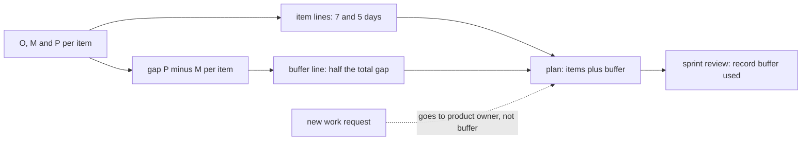

## Bạn cần biết trước

- [[management.l2.three-point-estimation]] — bạn biết kế hoạch hoàn tiền cho việc tích hợp cổng thanh toán 4, 6 và 14 ngày, việc đối soát 2, 4 và 12 ngày, và (O + 4M + P) / 6 biến chúng thành 7 và 5.

## Tình huống

Kế hoạch hoàn tiền giờ có 12 ngày cho hai việc đội chưa từng làm. Lập trình viên phụ trách thấy không yên: P của việc tích hợp là 14, còn 7 thì có vẻ sát quá. Cách dễ nhất là ghi 9 thay cho 7, 6 thay cho 5, và không nói gì. Một đồng đội đề nghị lặng lẽ cộng thêm hai ngày vào mọi việc hoàn tiền, "cho chắc". Product owner lại lo chuyện khác: nếu con số nào cũng giấu sẵn một ít dư, khi mọi thứ bắt đầu trễ thì ai biết còn dư bao nhiêu? Thời gian thêm cho độ bất định nên nằm ở đâu?

## Khái niệm cốt lõi

- **thời gian dự phòng** (schedule buffer) — thời gian cố ý thêm vào kế hoạch để hấp thụ độ bất định mà các ước lượng đã cho thấy, ghi thành một dòng riêng, gọi tắt là buffer như trong file của đội.
- phần độn — thời gian thêm giấu trong chính ước lượng của một việc, người khác không thấy được.
- phần dự phòng đã dùng — lượng thời gian dự phòng công việc đã tiêu tới lúc này, được ghi lại ở một mốc đều đặn như mỗi sprint review.

## Cơ chế hoạt động



Ước lượng ba điểm đã cho bạn biết mỗi việc bất định đến đâu. Câu hỏi là kế hoạch giữ chỗ cho điều đó ở đâu. Có hai chỗ.

Chỗ thứ nhất là bên trong từng việc, như trong tình huống trên: 9 thay cho 7, hai ngày lặng lẽ trên mỗi việc. Phần độn đó vô hình, và nó thường bị chính việc chứa nó dùng hết: người ta làm việc khớp với thời gian mình được cho. Khi một việc thật sự trễ, phần dư giấu trong các việc khác hiếm khi tới được nó: không ai thấy phần dư đó, và thường nó đã bị dùng hết rồi.

Chỗ thứ hai là một dòng chung bên dưới các việc: thời gian dự phòng. Các việc giữ ước lượng trung thực của mình, còn phần dự phòng nằm riêng, ai cũng thấy. Độ lớn của nó lấy từ chính các ước lượng. Trong kế hoạch hoàn tiền, nó bằng một nửa tổng khoảng cách từ giá trị khả dĩ nhất tới giá trị bi quan. Đo từ M chứ không từ O khiến phần dự phòng là chỗ cho việc chạy trễ hơn giá trị khả dĩ nhất, vì xong sớm thì không cần chỗ. Việc có khoảng cách rộng nhất góp nhiều nhất. Trong kế hoạch hoàn tiền, hai khoảng cách tình cờ đều là 8, nên mỗi việc góp 4 ngày.

Khi một việc vượt ước lượng, nó lấy ngày từ đúng một dòng đó, và ở mỗi sprint review đội ghi lại đã dùng bao nhiêu. Dòng "đã dùng 3 trong 8 ngày" ở giữa chặng cho mọi người biết nhiều hơn hẳn các con số đã độn. Nếu phần lớn thời gian dự phòng đã hết trong khi phần lớn công việc còn ở phía trước, hãy bàn với product owner về kế hoạch ngay lúc đó.

Mũi tên nét đứt cho thấy thời gian dự phòng không dùng cho việc gì. Một yêu cầu mới là việc mới, không phải độ bất định của phần việc đã lên kế hoạch. Nó đi tới product owner để đổi kế hoạch.

## Trong hệ thống Đơn Hàng

`docs/team/refund-plan-example.md` đặt thời gian dự phòng thành một dòng riêng, dưới hai việc ước lượng ba điểm:

```markdown file=docs/team/refund-plan-example.md tag=stage-2 lines=32-38
| Việc | O | M | P | (O + 4M + P) / 6 |
|---|---|---|---|---|
| Tích hợp API hoàn tiền của cổng thanh toán | 4 | 6 | 14 | 7 |
| Đối soát hoàn tiền với kế toán | 2 | 4 | 12 | 5 |
| Cộng hai việc | | | | 12 |
| Buffer: một nửa tổng (P − M) = ((14 − 6) + (12 − 4)) / 2 | | | | 8 |
| Tổng phần ước lượng ba điểm | | | | 20 |
```

Hai việc giữ nguyên con số của mình, 7 và 5, cộng lại 12. Dòng buffer tính một nửa tổng khoảng cách giữa P và M: ((14 − 6) + (12 − 4)) / 2 = (8 + 8) / 2 = 8 ngày. Dòng cuối, `Tổng phần ước lượng ba điểm`, là tổng của phần ước lượng ba điểm: 12 + 8 = 20 ngày. Lấy một nửa khoảng cách là quy tắc kế hoạch này dùng, không phải một định luật. Điều quan trọng là độ lớn đi theo độ bất định mà các ước lượng cho thấy.

Một đoạn phía dưới nói đội đối xử với dòng đó thế nào:

```markdown file=docs/team/refund-plan-example.md tag=stage-2 lines=45-49
Buffer là một dòng riêng, không chia nhỏ vào từng việc. Nó tính từ khoảng cách
giữa bi quan và khả dĩ nhất, nên việc nào càng bất định thì góp vào buffer càng
nhiều. Mỗi sprint review, đội ghi đã dùng bao nhiêu ngày buffer. Buffer chỉ
dành cho độ bất định của hai việc trên; việc mới xin thêm không lấy từ buffer mà
đưa về product owner để đổi lại kế hoạch.
```

Năm dòng này chứa bốn quyết định. Thời gian dự phòng là một dòng riêng, không chia vào từng việc. Nó được tính từ khoảng cách giữa bi quan và khả dĩ nhất, nên một việc bất định hơn sẽ góp nhiều hơn. Ở mỗi sprint review, đội ghi đã dùng bao nhiêu ngày dự phòng. Và thời gian dự phòng chỉ dành cho độ bất định của hai việc đó: yêu cầu mới không lấy từ nó, mà đưa về product owner để đổi kế hoạch. Dòng cuối của file, không nằm trong hai khối trên, là dòng đếm: `Buffer đã dùng: 0 / 8 ngày`, cập nhật ở mỗi sprint review.

## Người mới hay nghĩ rằng…

- **"Thêm thời gian dự phòng nghĩa là đội không tin ước lượng của chính mình."** → Thực ra thời gian dự phòng được dựng từ chính các ước lượng: nó tính từ khoảng cách giữa P và M mà đội tự ghi ra. Bạn sẽ nhận ra khi thời gian dự phòng co lại ngay khi đội biết thêm điều gì đó và hạ một giá trị bi quan.
- **"Cộng thêm một ít thời gian vào từng việc của mình thì an toàn hơn là đưa ra một dòng dự phòng."** → Thực ra thời gian thêm giấu trong việc thường bị chính việc đó dùng hết, và hiếm khi tới được việc thật sự bị trễ. Bạn sẽ nhận ra khi việc nào cũng "vừa khít" ước lượng đã độn, mà cả kế hoạch vẫn trễ.
- **"Còn thời gian dự phòng thì mình dùng nó để nhét thêm tính năng ai đó vừa xin."** → Thực ra thời gian dự phòng dành cho độ bất định của phần việc đã lên kế hoạch, còn tính năng mới là việc mới và làm đổi kế hoạch. Bạn sẽ nhận ra khi phần dự phòng bị tiêu vào việc thêm, rồi việc tích hợp trễ mà không còn gì để đỡ.

## Thử ngay (3 phút)

Mở `docs/team/refund-plan-example.md` và tìm dòng buffer.

1. Giả sử đội gọi thử một lần hoàn tiền tới cổng thanh toán, thấy đơn giản hơn lo ngại, và hạ P của việc tích hợp từ 14 xuống 8. (O + 4M + P) / 6 của nó thành 6. Tính thời gian dự phòng mới theo quy tắc của file.
2. Tính tổng mới của phần ước lượng ba điểm.

Kết quả mong đợi: dự phòng = ((8 − 6) + (12 − 4)) / 2 = (2 + 8) / 2 = 5 ngày, tổng = 6 + 5 + 5 = 16 ngày.

Giờ quay lại kế hoạch ban đầu. Ở Sprint 16, việc tích hợp mất hơn 7 ngày của nó 3 ngày, và product owner được xin thêm một màn hình nhỏ cho chăm sóc khách hàng. Kế hoạch đổi gì?

<details><summary>Gợi ý đáp án</summary>

3 ngày thêm lấy từ thời gian dự phòng, nên dòng đếm thành `3 / 8` ở sprint review kế tiếp, và tổng 20 ngày chưa dịch. Màn hình thêm không lấy từ 5 ngày dự phòng còn lại: đó là việc mới, nên nó đi tới product owner, người quyết định đổi gì trong kế hoạch để có chỗ cho nó.

</details>

## Liên hệ

- [[management.l2.three-point-estimation]] — bài cần trước: khoảng cách giữa bi quan và khả dĩ nhất dùng để tính thời gian dự phòng.
- [[management.l2.scope-change]] — phía bên kia của mũi tên nét đứt: chuyện gì xảy ra khi có người xin thêm việc.
- [[management.l2.risk-register]] — dành cho những điều cụ thể có thể hỏng, một công cụ khác với thời gian giữ cho độ bất định chung.
- [[management.l1.estimates-are-not-commitments]] — cùng một sự trung thực: ước lượng giữ đúng bản chất của nó, và chỗ cho sai lệch được đưa ra, không giấu đi.

## Tóm tắt 5 dòng

1. Thời gian dự phòng là thời gian cố ý thêm cho độ bất định mà ước lượng cho thấy, giữ thành một dòng ai cũng thấy.
2. Phần độn giấu trong từng việc thường bị chính việc đó dùng hết và hiếm khi tới được việc thật sự bị trễ.
3. Kế hoạch hoàn tiền tính thời gian dự phòng bằng một nửa tổng khoảng cách từ M tới P: 8 ngày.
4. Đội ghi phần dự phòng đã dùng ở mỗi sprint review, để mọi người thấy còn bao nhiêu chỗ.
5. Thời gian dự phòng không phải chỗ cho việc mới, vì yêu cầu mới đi tới product owner để đổi kế hoạch.
